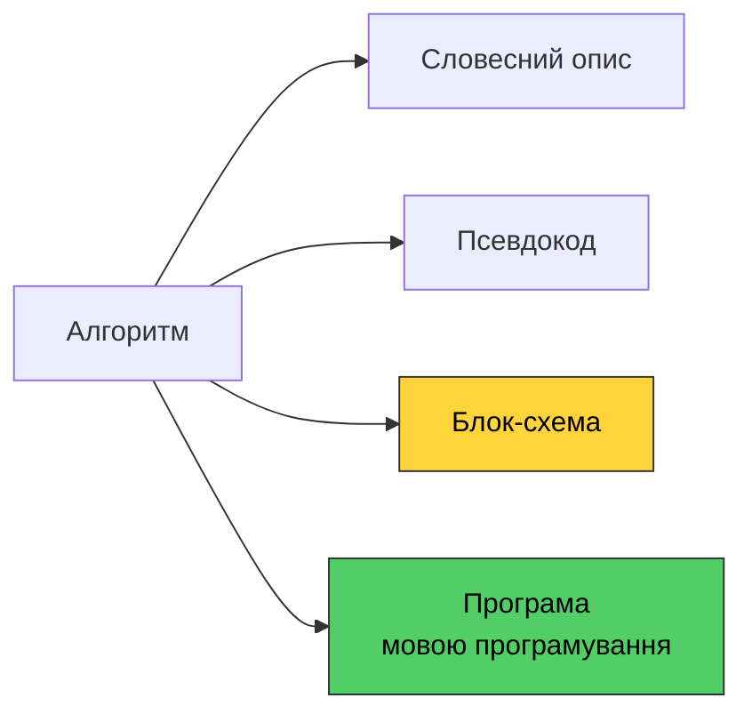
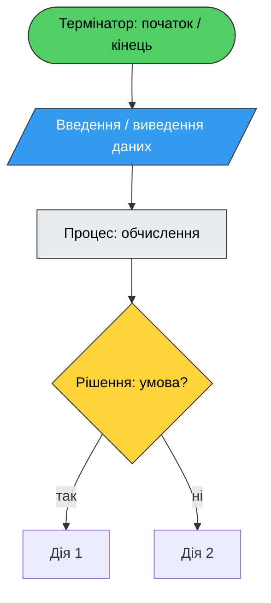
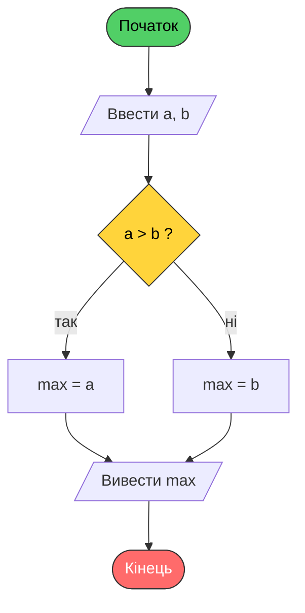
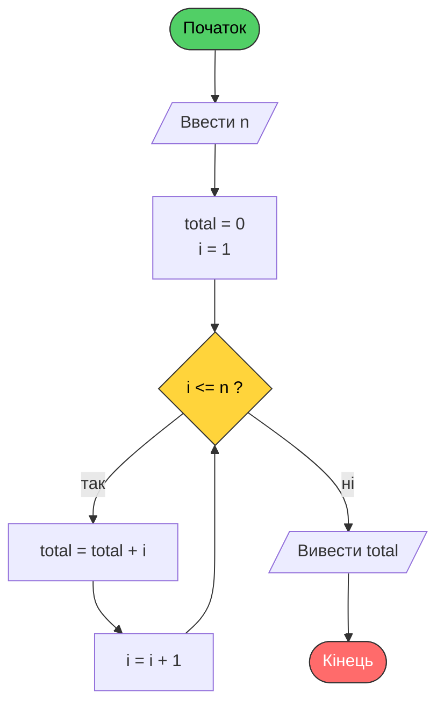
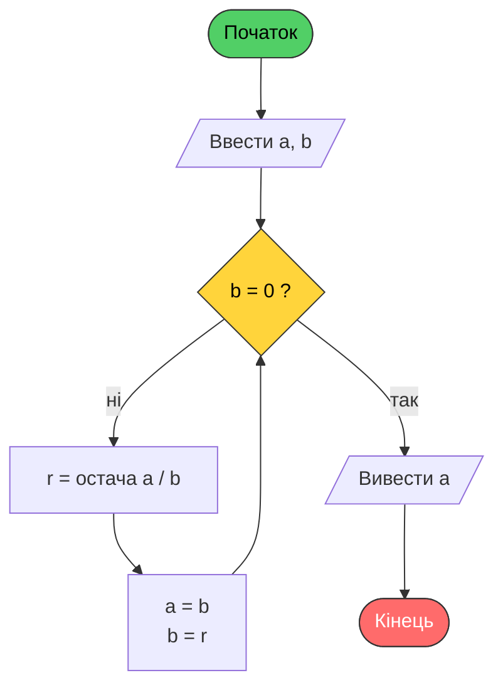
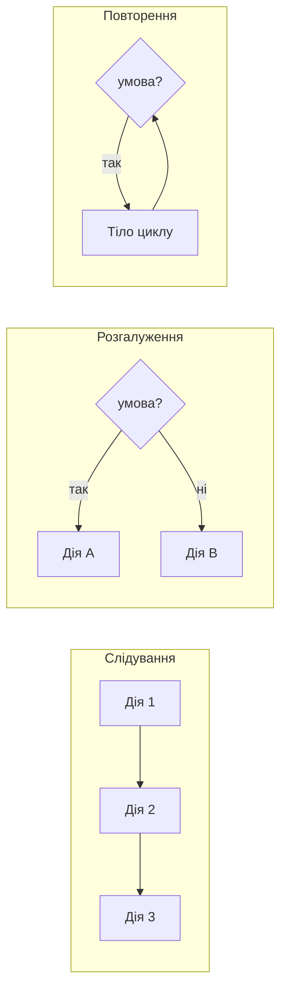
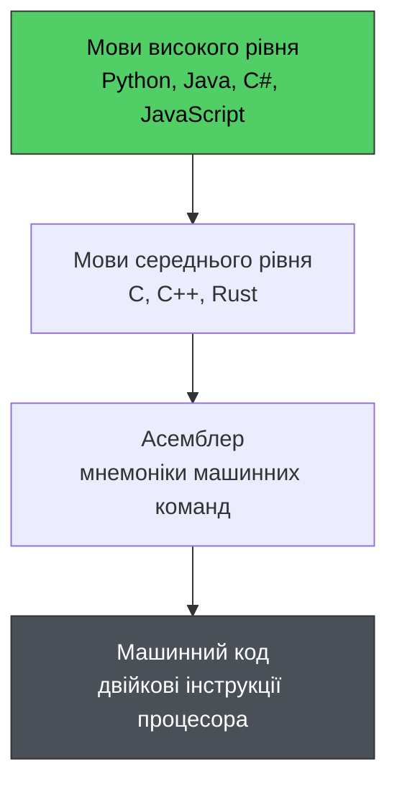
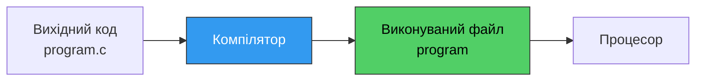
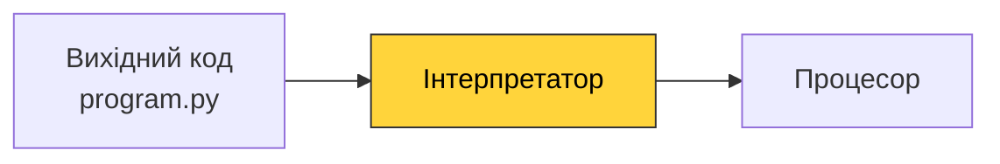
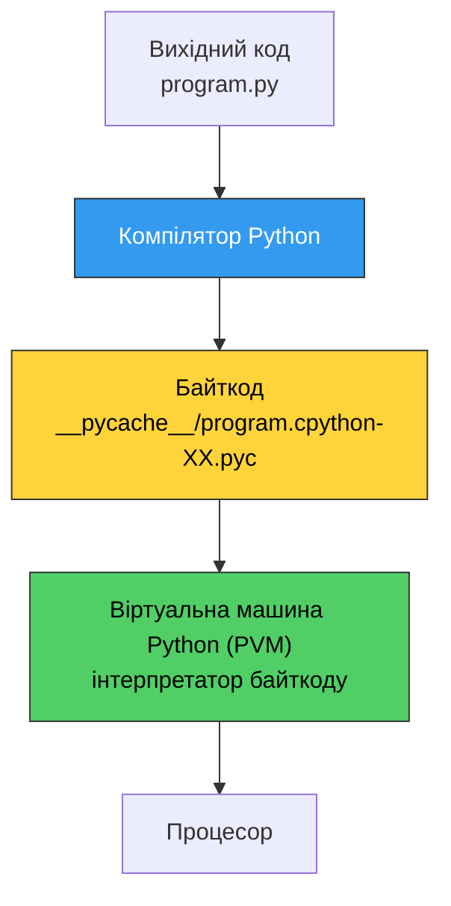

# 1. (Л) Вступ. Предмет і завдання курсу. Алгоритм, блок-схеми, програма, компіляція, інтерпретація

## Зміст лекції

1. Предмет і завдання курсу
2. Що таке алгоритм
3. Властивості алгоритму
4. Способи запису алгоритмів
5. Блок-схеми алгоритмів
6. Базові алгоритмічні структури
7. Програма та мова програмування
8. Компіляція та інтерпретація
9. Як виконується програма на Python
10. Перша програма

## Предмет і завдання курсу

Курс присвячений **основам програмування** на прикладі мови Python.

Головна мета курсу — не «вивчити Python», а навчитися **мислити алгоритмічно**: розкладати задачу на послідовність простих кроків, які може виконати комп'ютер. Мова програмування — це лише інструмент запису цих кроків.

**Завдання курсу:**

- навчитися формулювати алгоритм розв'язання задачі та записувати його у вигляді блок-схеми;
- освоїти базовий синтаксис Python: змінні, типи даних, розгалуження, цикли, функції;
- навчитися працювати з колекціями даних (списки, кортежі, множини, словники);
- навчитися читати та писати файли, обробляти помилки;
- познайомитися з основами об'єктно-орієнтованого програмування;
- сформувати навичку самостійно шукати відповіді в документації.

**Чому саме Python?**

- простий і читабельний синтаксис — увага зосереджена на алгоритмі, а не на боротьбі з мовою;
- величезна стандартна бібліотека та екосистема пакетів;
- одна з найпоширеніших мов у веб-розробці, аналізі даних, автоматизації, машинному навчанні;
- кросплатформність — той самий код працює на Linux, macOS та інших системах.

## Що таке алгоритм

**Алгоритм** — це скінченна впорядкована послідовність чітко визначених дій, виконання яких приводить до розв'язання поставленої задачі за скінченний час.

Алгоритми оточують нас щодня, навіть поза комп'ютерами:

- рецепт приготування страви;
- інструкція зі складання меблів;
- правила переходу дороги на світлофорі;
- алгоритм ділення стовпчиком, який ви вивчали в школі.

**Приклад побутового алгоритму — «Приготувати чай»:**

1. Налити воду в чайник.
2. Увімкнути чайник.
3. Чекати, доки вода закипить.
4. Покласти пакетик чаю в чашку.
5. Налити окріп у чашку.
6. Чекати 3 хвилини.
7. Вийняти пакетик.

Зверніть увагу: кроки впорядковані, кожен зрозумілий виконавцю, їх скінченна кількість, і в результаті ми отримуємо чай.

### Виконавець алгоритму

Алгоритм завжди пишеться **для конкретного виконавця**. Виконавець має свою *систему команд* — набір дій, які він розуміє.

Для людини команда «посолити за смаком» зрозуміла. Для комп'ютера — ні: він не має поняття «за смаком». Комп'ютер розуміє лише точні, однозначні команди: додати, порівняти, перемістити значення, перейти до іншої команди.

!!! info "Головна складність програмування"
    Комп'ютер робить не те, що ви хотіли, а те, що ви написали. Уся неоднозначність, яку в побутовій мові людина «добудовує» сама, у програмі має бути описана явно.

## Властивості алгоритму

| Властивість | Пояснення | Приклад порушення |
|---|---|---|
| **Дискретність** | Алгоритм складається з окремих завершених кроків | «Розв'яжи задачу» — це не крок, а вся задача |
| **Визначеність (детермінованість)** | Кожен крок трактується однозначно; при тих самих вхідних даних результат однаковий | «Додай трохи цукру» — скільки саме? |
| **Скінченність (результативність)** | Алгоритм завершується за скінченну кількість кроків і дає результат | «Ділити 1 на 3, доки не поділиться націло» — не завершиться ніколи |
| **Масовість** | Алгоритм застосовний до цілого класу однотипних задач, а не до одного набору даних | Алгоритм, що вміє додавати лише 2 і 2 |
| **Зрозумілість** | Усі команди належать до системи команд виконавця | «Проінтегруй функцію» для калькулятора, що вміє лише +, −, ×, ÷ |

### Приклад: алгоритм Евкліда

Класичний алгоритм пошуку найбільшого спільного дільника (НСД) двох натуральних чисел:

1. Якщо `b` дорівнює 0 — відповідь `a`, завершити.
2. Обчислити остачу `r` від ділення `a` на `b`.
3. Присвоїти `a` значення `b`, а `b` — значення `r`.
4. Повернутися до кроку 1.

Перевіримо властивості: кроки дискретні й однозначні, алгоритм завершується (остача щоразу зменшується), працює для будь-яких натуральних чисел — тобто має масовість.

## Способи запису алгоритмів

Один і той самий алгоритм можна записати різними способами.



**1. Словесний опис** — звичайною мовою, як приклад із чаєм вище. Зрозумілий людині, але громіздкий і схильний до двозначності.

**2. Псевдокод** — напівформальний запис, схожий на програму, але без прив'язки до синтаксису конкретної мови:

```text
ПОЧАТОК
    ввести a, b
    ЯКЩО a > b ТО
        вивести a
    ІНАКШЕ
        вивести b
    КІНЕЦЬ ЯКЩО
КІНЕЦЬ
```

**3. Блок-схема** — графічне зображення алгоритму. Наочно показує структуру та порядок виконання.

**4. Програма** — запис алгоритму мовою програмування, придатний для виконання комп'ютером.

## Блок-схеми алгоритмів

**Блок-схема** — графічне подання алгоритму, де кожна дія зображується геометричною фігурою певної форми, а порядок виконання — стрілками. Форми блоків стандартизовані (ISO 5807, ДСТУ ISO 5807).

### Основні блоки

| Блок | Форма | Призначення |
|---|---|---|
| Термінатор | Овал / заокруглений прямокутник | Початок або кінець алгоритму |
| Процес | Прямокутник | Обчислення, присвоєння значення |
| Введення/виведення | Паралелограм | Отримання вхідних даних, виведення результату |
| Рішення | Ромб | Перевірка умови, розгалуження |
| Підпрограма | Прямокутник з подвійними бічними лініями | Виклик іншого алгоритму (функції) |
| З'єднувач | Коло | Розрив і продовження лінії на схемі |
| Лінія потоку | Стрілка | Порядок виконання блоків |



### Правила побудови блок-схем

- Схема має рівно **один** блок «початок» і **щонайменше один** блок «кінець».
- Кожен блок, окрім термінаторів, має один вхід; блок «рішення» має один вхід і **два** виходи (`так` / `ні`).
- Лінії потоку не перетинаються без потреби; стандартний напрямок — згори вниз і зліва направо.
- Гілки розгалуження обов'язково підписуються.
- Текст усередині блоку — короткий і однозначний.

### Приклад 1: найбільше з двох чисел



Той самий алгоритм мовою Python:

```python
a = int(input("a = "))
b = int(input("b = "))

if a > b:
    biggest = a
else:
    biggest = b

print("max =", biggest)
```

### Приклад 2: сума чисел від 1 до N



```python
n = int(input("n = "))

total = 0
i = 1
while i <= n:
    total = total + i
    i = i + 1

print("total =", total)
```

### Приклад 3: алгоритм Евкліда



```python
a = int(input("a = "))
b = int(input("b = "))

while b != 0:
    r = a % b  # остача від ділення
    a = b
    b = r

print("gcd =", a)
```

## Базові алгоритмічні структури

Доведено (теорема Бома — Якопіні), що **будь-який** алгоритм можна побудувати з трьох базових структур.



| Структура | Суть | Конструкція Python |
|---|---|---|
| **Слідування** | Дії виконуються послідовно, одна за одною | Рядки коду підряд |
| **Розгалуження** | Виконується одна з гілок залежно від умови | `if` / `elif` / `else` |
| **Повторення (цикл)** | Дія повторюється, доки виконується умова | `while`, `for` |

Саме тому в програмуванні немає потреби в операторі безумовного переходу (`goto`) — трьох структур достатньо, а код із ними залишається читабельним.

## Програма та мова програмування

**Програма** — це алгоритм, записаний мовою програмування, тобто у формі, придатній для виконання комп'ютером.

**Мова програмування** — формальна мова з чітко визначеними правилами:

- **синтаксис** — правила запису конструкцій (де ставити двокрапку, дужки, відступи);
- **семантика** — значення цих конструкцій (що саме робить `while`).

Порушення синтаксису робить програму невиконуваною — комп'ютер просто не зрозуміє запис. Порушення семантики («написав не те, що мав на увазі») дає програму, яка працює, але неправильно. Перше знаходить комп'ютер, друге — доводиться шукати вам.

### Рівні мов програмування



Процесор виконує лише **машинний код** — послідовність двійкових інструкцій. Людині писати такий код украй незручно, тому програму пишуть мовою високого рівня, а спеціальна програма перетворює її на машинний код. Способів такого перетворення два: **компіляція** та **інтерпретація**.

## Компіляція та інтерпретація

### Компіляція

**Компілятор** — програма, яка повністю перекладає вихідний код у машинний код цільової платформи, створюючи виконуваний файл. Після цього програму можна запускати скільки завгодно разів без компілятора.



Приклади компільованих мов: C, C++, Rust, Go.

### Інтерпретація

**Інтерпретатор** — програма, яка читає вихідний код і виконує його **покроково**, конструкція за конструкцією, не створюючи окремого виконуваного файлу. Щоб запустити програму, інтерпретатор потрібен щоразу.



Приклади інтерпретованих мов: Python, JavaScript, Ruby, PHP.

### Порівняння

| Критерій | Компіляція | Інтерпретація |
|---|---|---|
| Коли перекладається код | Один раз, до запуску | Під час кожного запуску |
| Швидкість виконання | Висока | Нижча (накладні витрати інтерпретатора) |
| Виявлення помилок синтаксису | До запуску, у всьому файлі | Під час виконання, коли дійшло до рядка |
| Кросплатформність | Потрібна окрема збірка для кожної платформи | Той самий код працює всюди, де є інтерпретатор |
| Швидкість розробки | Нижча (цикл «змінив — зібрав — запустив») | Вища (змінив — запустив) |
| Потреба в інструменті у користувача | Ні, достатньо готового файлу | Так, потрібен інтерпретатор |

!!! info "Це не властивість мови"
    Строго кажучи, компільованою чи інтерпретованою є не мова, а її **реалізація**. Існують інтерпретатори C і компілятори Python. Просто для кожної мови історично склалася найпоширеніша реалізація.

## Як виконується програма на Python

Python поєднує обидва підходи. Стандартна реалізація (**CPython**) спочатку **компілює** вихідний код у проміжне подання — **байткод**, а потім **інтерпретує** цей байткод на віртуальній машині Python (PVM).



**Навіщо байткод?** Це компроміс: розбір тексту програми (найповільніша частина) виконується один раз, а результат кешується в каталозі `__pycache__`. При наступному запуску, якщо файл не змінювався, Python одразу бере готовий байткод.

Байткод не залежить від операційної системи — залежить лише віртуальна машина. Саме тому один і той самий `.py` файл працює на різних платформах.

??? note "Подивитися байткод (додатково)"
    Стандартний модуль `dis` показує, у які інструкції перетворюється код:

    ```python
    import dis


    def add(a, b):
        return a + b


    dis.dis(add)
    ```

    У виведенні ви побачите інструкції віртуальної машини: завантажити значення `a`, завантажити `b`, виконати додавання, повернути результат. Це і є той рівень, на якому «мислить» PVM.

### Реалізації Python

| Реалізація | Особливість |
|---|---|
| **CPython** | Еталонна реалізація мовою C, саме її ви завантажуєте з python.org |
| PyPy | Використовує JIT-компіляцію, часто працює значно швидше |
| Jython | Компілює в байткод Java, працює на JVM |
| MicroPython | Полегшена версія для мікроконтролерів |

У цьому курсі ми працюємо з **CPython** — коли говоримо «Python», маємо на увазі саме його.

## Перша програма

Створіть файл `hello.py` з таким вмістом:

```python
print("Hello, world!")
```

Запуск у терміналі:

```bash
python3 hello.py
```

Виведення:

```text
Hello, world!
```

Тут `print` — вбудована функція виведення тексту, а рядок у лапках — її аргумент. Компілятор Python перетворив цей рядок на байткод, а віртуальна машина його виконала.

Трохи змістовніший приклад — програма, що реалізує наш перший алгоритм (найбільше з двох чисел):

```python
# Program: find the largest of two numbers
a = int(input("a = "))
b = int(input("b = "))

if a > b:
    biggest = a
else:
    biggest = b

print("The largest number is", biggest)
```

Приклад роботи:

```text
a = 12
b = 47
The largest number is 47
```

Функція `input()` зчитує рядок з клавіатури, а `int()` перетворює цей рядок на ціле число. Детально ми розберемо їх на наступних заняттях.

!!! tip "Головна порада курсу"
    Не переходьте до написання коду, доки не сформулювали алгоритм. Спочатку — кроки на папері або блок-схема, потім — код. Це виглядає повільніше, але економить години налагодження.

## Корисні посилання

- [Офіційний сайт Python](https://www.python.org/)
- [Документація Python](https://docs.python.org/3/)
- [The Python Tutorial](https://docs.python.org/3/tutorial/)
- [Модуль dis — дизасемблер байткоду](https://docs.python.org/3/library/dis.html)
- [ISO 5807 — символи блок-схем](https://www.iso.org/standard/11955.html)

## Домашнє завдання

1. Встановити Python 3 та переконатися, що команда `python3 --version` виводить версію.
2. Створити та запустити файл `hello.py` з програмою виведення тексту.
3. Скласти блок-схему алгоритму для однієї з задач:
    - визначити, чи є введене число парним;
    - обчислити добуток чисел від 1 до N (факторіал);
    - визначити найменше з трьох введених чисел.
4. Прочитати розділ [An Informal Introduction to Python](https://docs.python.org/3/tutorial/introduction.html).
