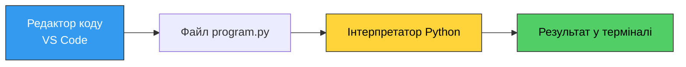
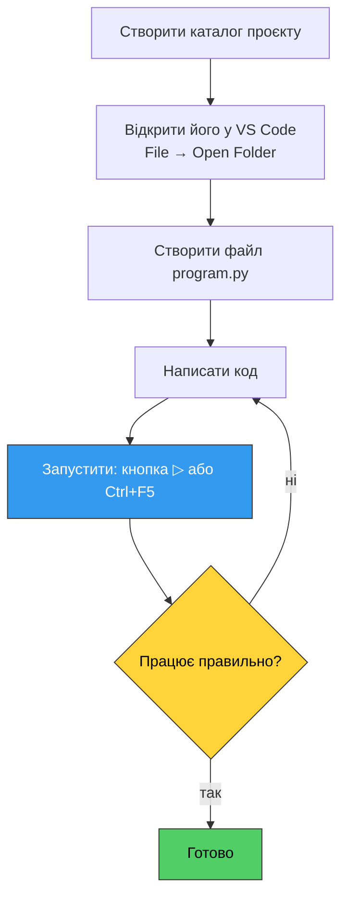
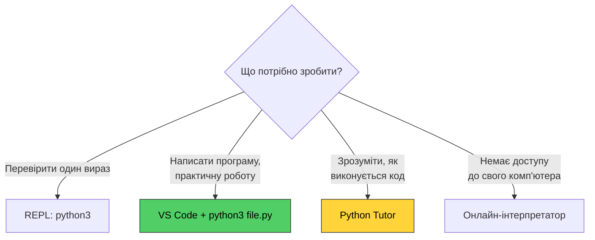

# 2. (Л) Огляд інструментів програмування (Python, VS Code, онлайн інтерпретатори)

## Зміст лекції

1. Що потрібно для написання програм
2. Встановлення Python
3. Інтерактивний режим (REPL)
4. Запуск програм із файлу
5. Редактор коду та IDE
6. Visual Studio Code
7. Налагодження (debugging) у VS Code
8. Онлайн-інтерпретатори Python
9. Що використовувати і коли

## Що потрібно для написання програм

Мінімальний набір інструментів програміста складається з трьох частин:



| Інструмент | Призначення |
|---|---|
| **Інтерпретатор Python** | Виконує вашу програму. Без нього код — просто текст |
| **Редактор коду** | Місце, де ви пишете програму: підсвічування синтаксису, автодоповнення, підказки |
| **Термінал** | Запуск програм, встановлення пакетів, робота з системою |

Файл із програмою на Python — це **звичайний текстовий файл** з розширенням `.py`. Його можна створити навіть у «Блокноті», просто працювати буде значно незручніше.

## Встановлення Python

### Linux

У більшості дистрибутивів Python 3 уже встановлений. Перевірте:

```bash
python3 --version
```

Якщо потрібно встановити (Debian / Ubuntu):

```bash
sudo apt update
sudo apt install python3 python3-pip python3-venv
```

Fedora:

```bash
sudo dnf install python3 python3-pip
```

Arch Linux:

```bash
sudo pacman -S python python-pip
```

### macOS

Системний Python може бути застарілим, тому встановлюють свіжу версію через [Homebrew](https://brew.sh/):

```bash
brew install python3
```

Альтернатива — завантажити інсталятор з [python.org/downloads](https://www.python.org/downloads/).

### Перевірка встановлення

```bash
python3 --version
```

Виведення має бути приблизно таким:

```text
Python 3.13.2
```

!!! warning "python чи python3?"
    У багатьох системах команда `python` або відсутня, або вказує на давно застарілий Python 2. Завжди використовуйте **`python3`** — тоді ви точно запускаєте третю версію.

### pip — менеджер пакетів

`pip` встановлює додаткові бібліотеки з репозиторію [PyPI](https://pypi.org/):

```bash
python3 -m pip --version
```

У першому семестрі ми працюємо переважно зі **стандартною бібліотекою**, тому pip знадобиться рідко. Але корисно знати, що він є.

## Інтерактивний режим (REPL)

Запустіть Python без аргументів:

```bash
python3
```

Ви потрапите в **REPL** (Read — Eval — Print — Loop): інтерпретатор читає рядок, обчислює його, друкує результат і чекає наступного.

```text
Python 3.13.2 (main, Feb  5 2025, 08:05:21)
Type "help", "copyright", "credits" or "license" for more information.
>>> 2 + 2
4
>>> 10 / 4
2.5
>>> name = "Alice"
>>> len(name)
5
>>> print("Hello,", name)
Hello, Alice
>>>
```

Вийти з REPL: команда `exit()` або комбінація `Ctrl+D`.

!!! tip "Для чого REPL"
    REPL — це «чернетка» програміста. Швидко перевірити, що робить незнайома функція, порахувати вираз, подивитися тип значення. Але повноцінні програми в REPL не пишуть: після виходу все написане зникає.

## Запуск програм із файлу

Створіть файл `hello.py`:

```python
print("Hello, world!")
print("2 + 2 =", 2 + 2)
```

Запустіть його з того каталогу, де він лежить:

```bash
python3 hello.py
```

```text
Hello, world!
2 + 2 = 4
```

!!! danger "Найпоширеніша помилка початківця"
    ```text
    python3: can't open file 'hello.py': [Errno 2] No such file or directory
    ```
    Це означає, що ви запускаєте команду **не з того каталогу**, де лежить файл. Перевірте поточний каталог командою `pwd`, перегляньте його вміст командою `ls` і перейдіть куди треба за допомогою `cd`.

### Мінімум команд терміналу

| Команда | Дія |
|---|---|
| `pwd` | Показати поточний каталог |
| `ls` | Перелічити файли в каталозі |
| `cd my_folder` | Перейти в каталог `my_folder` |
| `cd ..` | Піднятися на рівень вище |
| `mkdir my_folder` | Створити каталог |
| `python3 file.py` | Запустити програму |

## Редактор коду та IDE

**Редактор коду** — текстовий редактор із підтримкою мов програмування: підсвічування синтаксису, автодоповнення, пошук по проєкту.

**IDE (Integrated Development Environment)** — інтегроване середовище розробки: редактор плюс налагоджувач, система збірки, керування залежностями, інтеграція з git тощо.

| Інструмент | Тип | Особливості |
|---|---|---|
| **VS Code** | Редактор із розширеннями | Безкоштовний, легкий, розширення перетворюють його на IDE |
| PyCharm | IDE | Потужний, але важчий; Community-версія безкоштовна |
| Vim / Neovim | Редактор | Дуже швидкий, високий поріг входу |
| Sublime Text | Редактор | Швидкий, платний |
| Блокнот / gedit | Текстовий редактор | Працює, але без жодної допомоги програмісту |

У цьому курсі ми використовуємо **VS Code** — він безкоштовний, кросплатформний і його достатньо для всіх завдань семестру.

## Visual Studio Code

### Встановлення

Завантажте з [code.visualstudio.com](https://code.visualstudio.com/) або встановіть із пакетного менеджера:

```bash
# Debian / Ubuntu (після додавання репозиторію Microsoft)
sudo apt install code

# Arch Linux (AUR)
yay -S visual-studio-code-bin

# macOS
brew install --cask visual-studio-code
```

### Розширення Python

Одразу після встановлення відкрийте панель розширень (`Ctrl+Shift+X`) і встановіть розширення **Python** від Microsoft. Разом із ним встановиться **Pylance**.

Що дають ці розширення:

- підсвічування синтаксису та автодоповнення;
- підказки про помилки ще до запуску програми;
- кнопка запуску файлу;
- вбудований налагоджувач;
- автоформатування коду.

### Вибір інтерпретатора

VS Code має знати, яким саме Python запускати ваш код. Натисніть `Ctrl+Shift+P`, введіть `Python: Select Interpreter` і виберіть встановлений Python 3.

Поточний інтерпретатор завжди видно в рядку стану внизу вікна.

### Робочий процес



!!! warning "Відкривайте каталог, а не окремий файл"
    `File → Open Folder` замість `Open File`. VS Code вважає відкритий каталог коренем проєкту: від нього рахуються відносні шляхи до файлів, там працює пошук по проєкту та термінал.

### Корисні комбінації клавіш

| Комбінація | Дія |
|---|---|
| `Ctrl+S` | Зберегти файл |
| `Ctrl+F5` | Запустити програму без налагодження |
| `F5` | Запустити з налагодженням |
| `F9` | Поставити / зняти точку зупинки |
| ``Ctrl+` `` | Відкрити / закрити вбудований термінал |
| `Ctrl+Shift+P` | Палітра команд (доступ до всіх дій) |
| `Ctrl+/` | Закоментувати / розкоментувати рядок |
| `Ctrl+Space` | Викликати автодоповнення |
| `F2` | Перейменувати змінну або функцію всюди в проєкті |
| `Shift+Alt+F` | Відформатувати документ |

### Вбудований термінал

``Ctrl+` `` відкриває термінал прямо у вікні редактора, причому в каталозі проєкту. Там можна запускати програми вручну:

```bash
python3 hello.py
```

Це те саме, що й окремий термінал, просто зручніше — не треба перемикатися між вікнами.

## Налагодження (debugging) у VS Code

**Налагоджувач (debugger)** дозволяє зупинити програму в потрібному місці та подивитися, які значення насправді мають змінні. Це головний інструмент пошуку помилок — значно ефективніший за розстановку `print()` по всьому коду.

**Точка зупинки (breakpoint)** — позначка на рядку коду; дійшовши до неї, програма призупиняється.

Порядок роботи:

1. Клацніть ліворуч від номера рядка (або натисніть `F9`) — з'явиться червона крапка.
2. Запустіть налагодження клавішею `F5`.
3. Програма зупиниться на цьому рядку. У панелі **Variables** зліва видно всі змінні та їхні поточні значення.
4. Керуйте виконанням кнопками панелі налагодження.

| Клавіша | Дія |
|---|---|
| `F5` | Continue — продовжити до наступної точки зупинки |
| `F10` | Step Over — виконати рядок цілком |
| `F11` | Step Into — зайти всередину функції |
| `Shift+F11` | Step Out — вийти з поточної функції |
| `Shift+F5` | Зупинити налагодження |

Спробуйте на цій програмі: поставте точку зупинки на рядку з `if` і подивіться значення `a` та `b` перед порівнянням.

```python
# Program: find the largest of two numbers
a = int(input("a = "))
b = int(input("b = "))

if a > b:
    biggest = a
else:
    biggest = b

print("The largest number is", biggest)
```

!!! tip "Налагоджувач і алгоритм"
    Покрокове виконання показує **реальний шлях** програми через блок-схему: які гілки спрацювали, скільки разів виконався цикл. Це найкращий спосіб зрозуміти, чому програма робить не те, що ви очікували.

## Онлайн-інтерпретатори Python

Онлайн-інтерпретатор — це сайт, на якому можна написати й запустити код без встановлення чогось на комп'ютер. Код виконується на сервері, результат повертається у вікно браузера.

| Сервіс | Адреса | Особливості |
|---|---|---|
| **Python Shell** | [python.org/shell](https://www.python.org/shell/) | Офіційний REPL у браузері, без реєстрації |
| **Python Tutor** | [pythontutor.com](https://pythontutor.com/) | Покрокова **візуалізація** виконання: змінні, пам'ять, виклики функцій |
| **Programiz** | [programiz.com/python-programming/online-compiler](https://www.programiz.com/python-programming/online-compiler/) | Простий редактор із підтримкою `input()` |
| **Replit** | [replit.com](https://replit.com/) | Повноцінне середовище з файлами; потрібна реєстрація |
| **Google Colab** | [colab.research.google.com](https://colab.research.google.com/) | Ноутбуки Jupyter, потрібен акаунт Google |

### Python Tutor — окрема рекомендація

[pythontutor.com](https://pythontutor.com/) виконує програму **по кроках** і малює стан пам'яті: які змінні існують, які значення в них лежать, на якому рядку зараз виконання.

Візьміть приклад із першої лекції та прогляньте його крок за кроком — ви буквально побачите, як працює цикл:

```python
n = 5

total = 0
i = 1
while i <= n:
    total = total + i
    i = i + 1

print("total =", total)
```

Це найкращий інструмент, щоб зрозуміти зв'язок «блок-схема → код → виконання».

### Обмеження онлайн-сервісів

- немає доступу до файлової системи вашого комп'ютера — робота з файлами обмежена або неможлива;
- немає повноцінного налагоджувача з точками зупинки;
- сторонні бібліотеки або недоступні, або обмежені набором, який передбачив сервіс;
- обмеження на час виконання та обсяг пам'яті;
- код зберігається на чужому сервері, а вкладка легко закривається разом із роботою.

!!! warning "Практичні роботи виконуються локально"
    Онлайн-інтерпретатори — інструмент для швидкої перевірки ідеї або для роботи з чужого комп'ютера. Практичні роботи курсу виконуються **локально**: потрібні скріншоти запуску, робота з файлами та власна структура проєкту.

## Що використовувати і коли



**Основний інструмент курсу — VS Code з локально встановленим Python 3.** Решта — допоміжні засоби.

## Корисні посилання

- [Завантажити Python](https://www.python.org/downloads/)
- [Завантажити VS Code](https://code.visualstudio.com/)
- [Python у VS Code — офіційна документація](https://code.visualstudio.com/docs/languages/python)
- [Налагодження Python у VS Code](https://code.visualstudio.com/docs/python/debugging)
- [Python Tutor — візуалізація виконання коду](https://pythontutor.com/)
- [Офіційний Python Shell у браузері](https://www.python.org/shell/)

## Домашнє завдання

1. Встановити Python 3 і переконатися, що `python3 --version` виводить версію.
2. Встановити VS Code та розширення **Python** від Microsoft, вибрати інтерпретатор.
3. Створити каталог `python-course`, відкрити його у VS Code, створити файл `hello.py` і запустити його.
4. У REPL обчислити кілька виразів: `17 // 5`, `17 % 5`, `2 ** 10`. Пояснити результати.
5. Поставити точку зупинки в програмі пошуку найбільшого з двох чисел і пройти її по кроках у налагоджувачі, спостерігаючи за панеллю **Variables**.
6. Відкрити [pythontutor.com](https://pythontutor.com/), вставити програму обчислення суми від 1 до N та переглянути її покрокове виконання.
