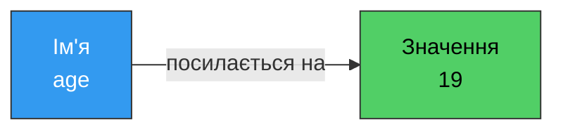
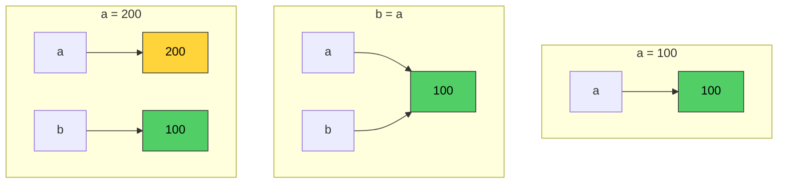
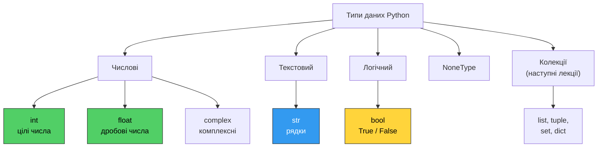
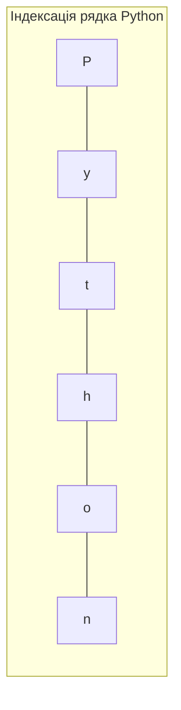
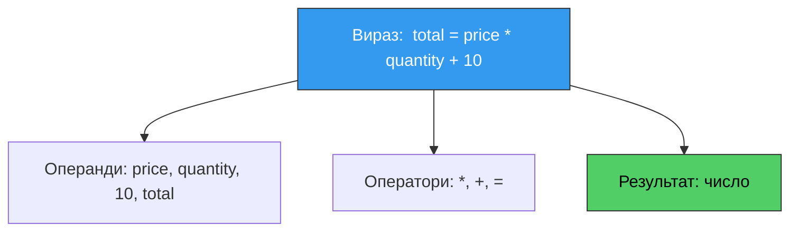

# 4. (Л) Змінні та типи даних. Вирази та оператори

## Зміст лекції

1. Що таке змінна
2. Іменування змінних
3. Присвоєння та модель пам'яті Python
4. Основні типи даних
5. Числа: `int` та `float`
6. Рядки: `str`
7. Логічний тип: `bool`
8. Тип `NoneType`
9. Визначення та перетворення типів
10. Введення даних з клавіатури
11. Вирази та оператори
12. Пріоритет операцій
13. Форматування виведення (f-рядки)
14. Типові помилки

## Що таке змінна

Будь-яка програма працює з даними: числами, текстом, результатами обчислень. Ці дані потрібно десь зберігати, щоб потім до них звертатися.

**Змінна** — це іменоване посилання на значення в пам'яті комп'ютера. Простіше кажучи, це «підписана коробка», у якій лежить якесь значення, а підпис — це ім'я, за яким ми до цього значення звертаємося.

```python
age = 19
```

Цей рядок читається так: «створити значення `19` у пам'яті та зв'язати з ним ім'я `age`».



Далі ім'я `age` можна використовувати замість самого значення:

```python
age = 19

print(age)          # 19
print(age + 1)      # 20
print(age * 2)      # 38
```

Значення змінної можна **змінити** — звідси й назва:

```python
counter = 0
print(counter)      # 0

counter = 5
print(counter)      # 5

counter = counter + 1   # взяти поточне значення, додати 1, записати назад
print(counter)      # 6
```

!!! info "Знак `=` — це не рівність"
    У математиці `x = x + 1` — хибне твердження. У Python `=` — це **оператор присвоєння**: «обчислити те, що праворуч, і зв'язати результат з іменем ліворуч». Порівняння на рівність записується подвійним знаком: `==`.

## Іменування змінних

### Правила (обов'язкові)

Порушення цих правил — синтаксична помилка, програма не запуститься.

- ім'я складається з латинських літер, цифр і символу підкреслення `_`;
- ім'я **не може починатися з цифри**;
- ім'я не може збігатися з ключовим словом мови (`if`, `for`, `class`, `def`, `import`, …);
- регістр має значення: `age`, `Age` та `AGE` — три різні змінні.

```python
# правильно
name = "Ivan"
user_age = 19
_temp = 3.14
x2 = 100

# помилки
# 2x = 5          -> SyntaxError: ім'я починається з цифри
# user-age = 19   -> SyntaxError: дефіс — це оператор віднімання
# class = "PZ-11" -> SyntaxError: class — ключове слово
```

Повний список ключових слів можна побачити так:

```python
import keyword

print(keyword.kwlist)
```

### Домовленості (стиль PEP 8)

Це не вимоги інтерпретатора, а загальноприйнятий стиль, якого дотримується вся спільнота Python.

| Правило | Приклад |
|---|---|
| Змінні — малими літерами, слова через `_` (*snake_case*) | `student_name`, `total_price` |
| Константи — великими літерами | `MAX_SPEED = 120`, `PI = 3.14159` |
| Ім'я має описувати зміст, а не тип | `age`, а не `int_value` |
| Уникати однолітерних імен, окрім лічильників | `i`, `j` — у циклах; решта — осмислені |
| Не використовувати кирилицю в іменах | `price`, а не `ціна` |

!!! tip "Ім'я змінної — це коментар, який неможливо забути оновити"
    Порівняйте: `a = b * c` та `total = price * quantity`. Другий варіант не потребує пояснень.

## Присвоєння та модель пам'яті Python

### Кілька форм присвоєння

```python
# звичайне присвоєння
x = 10

# одночасне присвоєння кільком змінним
a, b, c = 1, 2, 3
print(a, b, c)      # 1 2 3

# те саме значення кільком змінним
x = y = z = 0
print(x, y, z)      # 0 0 0

# обмін значеннями (у Python — без тимчасової змінної)
a, b = 1, 2
a, b = b, a
print(a, b)         # 2 1
```

### Складені оператори присвоєння

```python
count = 10

count += 5      # count = count + 5   -> 15
count -= 3      # count = count - 3   -> 12
count *= 2      # count = count * 2   -> 24
count //= 5     # count = count // 5  -> 4
count **= 2     # count = count ** 2  -> 16

print(count)    # 16
```

### Як Python зберігає значення

У Python змінна **не є коробкою зі значенням усередині**. Змінна — це *ярлик*, прикріплений до об'єкта в пам'яті. Присвоєння не копіює значення, а лише перевішує ярлик.



```python
a = 100
b = a       # b посилається на той самий об'єкт 100

a = 200     # a тепер посилається на новий об'єкт 200

print(a)    # 200
print(b)    # 100 — значення b не змінилося
```

Побачити «адресу» об'єкта можна вбудованою функцією `id()`:

```python
a = 100
b = a

print(id(a) == id(b))   # True — це один і той самий об'єкт

a = 200

print(id(a) == id(b))   # False — тепер об'єкти різні
```

!!! info "Чому це важливо"
    Для чисел і рядків різниця непомітна: їх не можна змінити «на місці» (вони *незмінні*, immutable). Але коли ми дійдемо до списків, ця модель пояснить поведінку, яка інакше здається магією.

## Основні типи даних

**Тип даних** визначає, які значення може приймати змінна та які операції з нею дозволені. Додати два числа можна, а «поділити текст на дату» — ні.



| Тип | Призначення | Приклади значень |
|---|---|---|
| `int` | Цілі числа | `0`, `42`, `-7`, `1000000` |
| `float` | Дробові числа | `3.14`, `-0.5`, `2.0`, `1e-3` |
| `str` | Текст | `"Hello"`, `'Python'`, `""` |
| `bool` | Істина / хиба | `True`, `False` |
| `NoneType` | Відсутність значення | `None` |
| `complex` | Комплексні числа | `2 + 3j` |

### Динамічна типізація

```python
value = 42
print(type(value))      # <class 'int'>

value = "forty two"
print(type(value))      # <class 'str'>

value = 3.14
print(type(value))      # <class 'float'>
```

У мовах зі *статичною* типізацією (C, Java) тип змінної оголошується заздалегідь і не змінюється. Динамічна типізація зручніша, але помилку типу виявляє лише під час виконання.

## Числа: `int` та `float`

### Цілі числа (`int`)

Цілі числа в Python мають **необмежену точність** — розмір обмежений лише пам'яттю комп'ютера.

```python
big = 2 ** 100
print(big)      # 1267650600228229401496703205376
```

Для читабельності великих чисел можна вживати підкреслення — воно ігнорується:

```python
population = 1_400_000_000
print(population)       # 1400000000
```

### Дробові числа (`float`)

Дробова частина відокремлюється **крапкою**, а не комою. Підтримується експоненційний запис:

```python
pi = 3.14159
temperature = -12.5
electron_mass = 9.1e-31     # 9.1 * 10^-31
distance = 1.5e8            # 150000000.0

print(electron_mass)        # 9.1e-31
print(distance)             # 150000000.0
```

!!! warning "Точність float"
    Дробові числа зберігаються у двійковій системі за стандартом IEEE 754, тому частина десяткових дробів подається наближено:

    ```python
    print(0.1 + 0.2)            # 0.30000000000000004
    print(0.1 + 0.2 == 0.3)     # False
    ```

    Це не помилка Python — так поводяться всі мови. Порівнювати дробові числа слід із допуском:

    ```python
    a = 0.1 + 0.2
    b = 0.3

    print(abs(a - b) < 1e-9)    # True
    ```

    Для грошових розрахунків використовують модуль `decimal`.

### Арифметичні оператори

| Оператор | Дія | Приклад | Результат |
|---|---|---|---|
| `+` | Додавання | `7 + 3` | `10` |
| `-` | Віднімання | `7 - 3` | `4` |
| `*` | Множення | `7 * 3` | `21` |
| `/` | Ділення (завжди `float`) | `7 / 3` | `2.3333333333333335` |
| `//` | Цілочисельне ділення | `7 // 3` | `2` |
| `%` | Остача від ділення | `7 % 3` | `1` |
| `**` | Піднесення до степеня | `7 ** 3` | `343` |

```python
a = 17
b = 5

print(a + b)        # 22
print(a - b)        # 12
print(a * b)        # 85
print(a / b)        # 3.4
print(a // b)       # 3
print(a % b)        # 2
print(a ** b)       # 1419857
```

!!! info "Навіщо потрібні `//` та `%`"
    Ця пара розкладає число на «скільки цілих разів помістилося» та «що залишилося». Класичні застосування:

    ```python
    total_seconds = 3725

    hours = total_seconds // 3600           # 1
    minutes = total_seconds % 3600 // 60    # 2
    seconds = total_seconds % 60            # 5

    print(hours, "h", minutes, "min", seconds, "s")
    ```

    Виведення: `1 h 2 min 5 s`

    Перевірка на парність: число парне, якщо `n % 2 == 0`.

Для від'ємних чисел `//` округлює **вниз** (до меншого числа), а не «до нуля»:

```python
print(7 // 2)       # 3
print(-7 // 2)      # -4  (не -3!)
print(-7 % 2)       # 1
```

### Корисні вбудовані функції для чисел

```python
print(abs(-5))          # 5      — модуль числа
print(round(3.7))       # 4      — округлення
print(round(3.14159, 2))# 3.14   — до 2 знаків після коми
print(min(4, 9, 1))     # 1
print(max(4, 9, 1))     # 9
print(pow(2, 10))       # 1024   — те саме, що 2 ** 10
```

## Рядки: `str`

**Рядок** — послідовність символів. Записується в одинарних або подвійних лапках — різниці між ними немає.

```python
name = "Ivan"
city = 'Kyiv'
empty = ""
```

Вибір лапок зручний, коли всередині тексту вже є лапки:

```python
quote = "It's a great day"
title = 'He said "hello" and left'

print(quote)
print(title)
```

### Багаторядкові рядки

```python
text = """This is line one
This is line two
This is line three"""

print(text)
```

### Операції з рядками

```python
first = "Hello"
second = "World"

# конкатенація (склеювання)
greeting = first + ", " + second + "!"
print(greeting)             # Hello, World!

# повторення
line = "-" * 20
print(line)                 # --------------------

# довжина
print(len(greeting))        # 13

# доступ до символу за індексом (нумерація з 0)
print(greeting[0])          # H
print(greeting[-1])         # !  (останній символ)
```



| Символ | `P` | `y` | `t` | `h` | `o` | `n` |
|---|---|---|---|---|---|---|
| Індекс зліва | 0 | 1 | 2 | 3 | 4 | 5 |
| Індекс справа | -6 | -5 | -4 | -3 | -2 | -1 |

### Екранування символів

```python
print("Line one\nLine two")     # \n — перехід на новий рядок
print("Name:\tIvan")            # \t — табуляція
print("Quote: \"text\"")        # \" — лапка всередині рядка
print("Path: C:\\temp")         # \\ — сам символ зворотної скісної риски
```

## Логічний тип: `bool`

Тип `bool` має лише два значення: `True` та `False` (обов'язково з великої літери).

```python
is_student = True
has_debt = False

print(type(is_student))     # <class 'bool'>
```

### Оператори порівняння

Результат будь-якого порівняння — значення типу `bool`.

| Оператор | Значення | Приклад | Результат |
|---|---|---|---|
| `==` | Дорівнює | `5 == 5` | `True` |
| `!=` | Не дорівнює | `5 != 3` | `True` |
| `>` | Більше | `5 > 3` | `True` |
| `<` | Менше | `5 < 3` | `False` |
| `>=` | Більше або дорівнює | `5 >= 5` | `True` |
| `<=` | Менше або дорівнює | `4 <= 3` | `False` |

```python
age = 19

print(age >= 18)            # True
print(age == 20)            # False
print(age != 20)            # True

# порівнювати можна й рядки — за алфавітом (кодами символів)
print("apple" < "banana")   # True
print("Zebra" < "apple")    # True — великі літери мають менші коди
```

Python дозволяє **ланцюжки порівнянь**, як у математиці:

```python
score = 75

print(0 <= score <= 100)    # True
print(60 < score < 90)      # True
```

### Логічні оператори

| Оператор | Дія | Результат `True`, коли |
|---|---|---|
| `and` | Логічне «і» | обидва операнди істинні |
| `or` | Логічне «або» | хоча б один операнд істинний |
| `not` | Заперечення | операнд хибний |

```python
age = 20
has_ticket = True

print(age >= 18 and has_ticket)     # True
print(age >= 65 or has_ticket)      # True
print(not has_ticket)               # False

# комбінування
is_weekend = False
is_holiday = True

print(is_weekend or is_holiday)             # True
print(not (is_weekend or is_holiday))       # False
```

Таблиця істинності:

| `a` | `b` | `a and b` | `a or b` | `not a` |
|---|---|---|---|---|
| `True` | `True` | `True` | `True` | `False` |
| `True` | `False` | `False` | `True` | `False` |
| `False` | `True` | `False` | `True` | `True` |
| `False` | `False` | `False` | `False` | `True` |

## Тип `NoneType`

`None` — спеціальне значення, що позначає **відсутність значення**. Це не нуль і не порожній рядок.

```python
result = None

print(result)               # None
print(type(result))         # <class 'NoneType'>
print(result is None)       # True — правильна перевірка
```

`None` використовують, коли значення ще не обчислене або функція нічого не повертає:

```python
# функція print() нічого не повертає
value = print("text")
print(value)                # None
```

!!! tip "Перевіряйте `None` через `is`"
    Пишіть `if value is None:`, а не `if value == None:`. Оператор `is` порівнює *об'єкти*, а `==` — *значення*; для `None` коректним вважається саме `is`.

## Визначення та перетворення типів

### Дізнатися тип

```python
print(type(42))             # <class 'int'>
print(type(3.14))           # <class 'float'>
print(type("text"))         # <class 'str'>
print(type(True))           # <class 'bool'>
print(type(None))           # <class 'NoneType'>

# перевірка на конкретний тип
value = 42
print(isinstance(value, int))   # True
```

### Явне перетворення (приведення типів)

```python
# у ціле число
print(int("42"))            # 42
print(int(3.99))            # 3   — дробова частина відкидається, не округлюється!
print(int(-3.99))           # -3
print(int(True))            # 1

# у дробове
print(float("3.14"))        # 3.14
print(float(7))             # 7.0

# у рядок
print(str(42))              # "42"
print(str(3.14))            # "3.14"
print(str(True))            # "True"

# у логічне
print(bool(1))              # True
print(bool(""))             # False
```

!!! danger "Не всяке перетворення можливе"
    ```python
    # int("hello")     -> ValueError: invalid literal for int() with base 10: 'hello'
    # int("3.14")      -> ValueError: рядок містить крапку
    # float("3,14")    -> ValueError: кома замість крапки
    ```

    Для рядка з дробовим числом потрібне подвійне перетворення:

    ```python
    print(int(float("3.14")))   # 3
    ```

### Неявне перетворення

Якщо в одному виразі зустрічаються `int` і `float`, Python автоматично розширює тип до «ширшого»:

```python
result = 2 + 3.0
print(result)               # 5.0
print(type(result))         # <class 'float'>
```

А от між числом і рядком автоматичного перетворення **немає**:

```python
# print("Age: " + 19)   -> TypeError: can only concatenate str (not "int") to str

print("Age: " + str(19))    # Age: 19
print("Age:", 19)           # Age: 19 — print розділяє аргументи пробілом
```

## Введення даних з клавіатури

Функція `input()` зчитує рядок з клавіатури і **завжди повертає `str`**, навіть якщо користувач ввів число.

```python
name = input("Enter your name: ")
print("Hello,", name)
```

```text
Enter your name: Ivan
Hello, Ivan
```

Щоб працювати з числом, результат треба перетворити:

```python
# Program: calculate the area of a rectangle
width = float(input("Width: "))
height = float(input("Height: "))

area = width * height
perimeter = 2 * (width + height)

print("Area:", area)
print("Perimeter:", perimeter)
```

```text
Width: 3.5
Height: 2
Area: 7.0
Perimeter: 11.0
```

!!! danger "Класична помилка новачка"
    ```python
    a = input("a = ")
    b = input("b = ")
    print(a + b)
    ```

    Введіть `2` та `3` — програма виведе `23`, а не `5`. Обидва значення є рядками, і `+` для рядків означає склеювання. Правильно:

    ```python
    a = int(input("a = "))
    b = int(input("b = "))
    print(a + b)        # 5
    ```

Приклад повної програми:

```python
# Program: convert temperature from Celsius to Fahrenheit and Kelvin
celsius = float(input("Temperature in Celsius: "))

fahrenheit = celsius * 9 / 5 + 32
kelvin = celsius + 273.15

print("Fahrenheit:", round(fahrenheit, 2))
print("Kelvin:", round(kelvin, 2))
```

```text
Temperature in Celsius: 25
Fahrenheit: 77.0
Kelvin: 298.15
```

## Вирази та оператори

**Вираз** — конструкція, що обчислюється та дає значення. **Оператор** — символ дії всередині виразу. **Операнд** — те, над чим виконується дія.



Виразами є все, що має значення: `2 + 2`, `x > 5`, `"a" * 3`, `input()`, навіть просто `42`.

### Групи операторів

| Група | Оператори |
|---|---|
| Арифметичні | `+`, `-`, `*`, `/`, `//`, `%`, `**` |
| Присвоєння | `=`, `+=`, `-=`, `*=`, `/=`, `//=`, `%=`, `**=` |
| Порівняння | `==`, `!=`, `>`, `<`, `>=`, `<=` |
| Логічні | `and`, `or`, `not` |
| Ідентичності | `is`, `is not` |
| Належності | `in`, `not in` |

```python
# оператори належності
text = "Python Programming"

print("Python" in text)         # True
print("Java" not in text)       # True
```

## Пріоритет операцій

Коли у виразі кілька операторів, порядок обчислення визначається пріоритетом — від вищого до нижчого.

| Пріоритет | Оператори | Опис |
|---|---|---|
| 1 (найвищий) | `()` | Дужки |
| 2 | `**` | Степінь |
| 3 | `+x`, `-x` | Унарний плюс/мінус |
| 4 | `*`, `/`, `//`, `%` | Множення та ділення |
| 5 | `+`, `-` | Додавання та віднімання |
| 6 | `==`, `!=`, `>`, `<`, `>=`, `<=`, `in`, `is` | Порівняння |
| 7 | `not` | Логічне заперечення |
| 8 | `and` | Логічне «і» |
| 9 (найнижчий) | `or` | Логічне «або» |

```python
print(2 + 3 * 4)        # 14, а не 20 — множення першe
print((2 + 3) * 4)      # 20

print(2 ** 3 ** 2)      # 512 — степінь обчислюється справа наліво: 2 ** (3 ** 2)
print((2 ** 3) ** 2)    # 64

print(10 - 4 - 3)       # 3 — віднімання зліва направо: (10 - 4) - 3

print(True or False and False)      # True — and має вищий пріоритет
print((True or False) and False)    # False
```

!!! tip "Дужки безкоштовні"
    Навіть коли пріоритет очевидний, дужки роблять намір явним. `(a * b) + c` читається швидше, ніж `a * b + c`, і не залишає місця для сумніву.

### Скорочене обчислення логічних виразів

Python обчислює `and` та `or` **зліва направо і зупиняється, щойно результат стає відомим**:

```python
age = 15
has_permit = False

# якщо перша умова хибна, друга навіть не перевіряється
print(age >= 18 and has_permit)     # False
```

Це не просто оптимізація: така поведінка дозволяє захищати вирази від помилок.

```python
divisor = 0

# друга частина не обчислюється -> ділення на нуль не станеться
print(divisor != 0 and 100 / divisor > 5)   # False
```

## Форматування виведення (f-рядки)

### Функція `print()`

```python
name = "Ivan"
age = 19

print("Name:", name, "Age:", age)       # аргументи розділяються пробілом
print("a", "b", "c", sep="-")           # a-b-c
print("no newline at the end", end="")
print(" <- continued here")
```

### f-рядки — сучасний спосіб

Літера `f` перед лапками дозволяє вставляти вирази прямо в текст, усередині фігурних дужок.

```python
name = "Ivan"
age = 19
height = 1.8234

print(f"My name is {name} and I am {age} years old")
print(f"Next year I will be {age + 1}")
print(f"Height: {height:.2f} m")            # 2 знаки після коми
print(f"Letters in the name: {len(name)}")
```

```text
My name is Ivan and I am 19 years old
Next year I will be 20
Height: 1.82 m
Letters in the name: 4
```

Корисні специфікатори формату:

```python
value = 1234.56789

print(f"{value:.2f}")       # 1234.57      — два знаки після коми
print(f"{value:10.2f}")     #    1234.57   — ширина поля 10 символів
print(f"{value:,.2f}")      # 1,234.57     — роздільник тисяч
print(f"{42:05d}")          # 00042        — доповнення нулями
print(f"{0.856:.1%}")       # 85.6%        — відсотки

# вирівнювання
print(f"|{'left':<10}|")    # |left      |
print(f"|{'center':^10}|")  # |  center  |
print(f"|{'right':>10}|")   # |     right|
```

Режим налагодження (`=` після виразу) друкує і вираз, і його значення:

```python
x = 7
y = 3

print(f"{x + y = }")        # x + y = 10
```

### Повний приклад

```python
# Program: student report card
name = input("Student name: ")
group = input("Group: ")
score1 = float(input("Score 1: "))
score2 = float(input("Score 2: "))
score3 = float(input("Score 3: "))

total = score1 + score2 + score3
average = total / 3
passed = average >= 60

print()
print("=" * 34)
print(f"|{'STUDENT REPORT':^32}|")
print("=" * 34)
print(f"| Name:    {name:<21} |")
print(f"| Group:   {group:<21} |")
print(f"| Total:   {total:<21.1f} |")
print(f"| Average: {average:<21.2f} |")
print(f"| Passed:  {str(passed):<21} |")
print("=" * 34)
```

```text
Student name: Ivan Petrenko
Group: PZ-11
Score 1: 85
Score 2: 72
Score 3: 90

==================================
|         STUDENT REPORT         |
==================================
| Name:    Ivan Petrenko         |
| Group:   PZ-11                 |
| Total:   247.0                 |
| Average: 82.33                 |
| Passed:  True                  |
==================================
```

## Типові помилки

| Помилка | Причина | Виправлення |
|---|---|---|
| `NameError: name 'x' is not defined` | Змінна використана до присвоєння або помилка в імені | Перевірити написання та порядок рядків |
| `TypeError: can only concatenate str ... to str` | Складання рядка з числом | `str(number)` або `print(a, b)` |
| `TypeError: unsupported operand type(s)` | Операція між несумісними типами | Привести типи явно |
| `ValueError: invalid literal for int()` | `int("abc")` — рядок не є числом | Перевірити введені дані |
| `ZeroDivisionError: division by zero` | Ділення на нуль | Перевірити дільник перед діленням |
| `SyntaxError: invalid syntax` | Порушення правил запису | Перевірити дужки, лапки, двокрапки |
| `IndentationError` | Неправильний відступ | Вирівняти відступи (4 пробіли) |

```python
# 1. рядок замість числа
value = input("Number: ")
# print(value * 2)      -> для "5" дасть "55"
print(int(value) * 2)   # 10

# 2. плутанина = та ==
x = 5
# if x = 5:             -> SyntaxError
print(x == 5)           # True

# 3. int() відкидає, а не округлює
print(int(9.99))        # 9
print(round(9.99))      # 10

# 4. хибне порівняння float
print(0.1 + 0.2 == 0.3)                 # False
print(abs(0.1 + 0.2 - 0.3) < 1e-9)      # True
```

## Підсумок

- **Змінна** — ім'я, що посилається на значення в пам'яті; присвоєння `=` перевішує це ім'я на новий об'єкт.
- Імена — латиницею, у стилі `snake_case`, осмислені.
- Основні типи: `int`, `float`, `str`, `bool`, `NoneType`. Тип належить значенню, а не змінній.
- `input()` завжди повертає **рядок** — для обчислень потрібне перетворення `int()` або `float()`.
- Дробові числа зберігаються наближено; порівнювати їх на точну рівність не можна.
- Порядок обчислення визначає таблиця пріоритетів; дужки роблять намір явним.
- f-рядки — основний спосіб форматованого виведення.

## Корисні посилання

- [Вбудовані типи — документація Python](https://docs.python.org/3/library/stdtypes.html)
- [Методи рядків](https://docs.python.org/3/library/stdtypes.html#string-methods)
- [f-рядки: специфікація формату](https://docs.python.org/3/library/string.html#format-specification-mini-language)
- [PEP 8 — стиль коду Python](https://peps.python.org/pep-0008/)
- [Чому 0.1 + 0.2 != 0.3](https://docs.python.org/3/tutorial/floatingpoint.html)
- [Вбудовані функції](https://docs.python.org/3/library/functions.html)

## Домашнє завдання

Розібратися, чому числа з комою поводяться «дивно».

Відкрийте інтерактивний конвертер [IEEE 754 Floating Point Converter](https://www.h-schmidt.net/FloatConverter/IEEE754.html). Він показує, як число розкладається на **знак**, **порядок (exponent)** і **мантису (mantissa)**, і яке значення насправді зберігається в пам'яті.

1. Введіть у поле десяткового значення число `0.1`. Конвертер покаже, яке значення насправді зберігається у змінній, — це буде не `0.1`, а приблизно `0.100000001490116...`. Запишіть це значення та поясніть, звідки береться різниця.
2. Зробіть те саме для `0.2`, `0.5`, `0.25` і `3.14`. Визначте, які з цих чисел зберігаються **точно**, а які — наближено. Сформулюйте правило: за якої умови десятковий дріб подається у двійковій системі без похибки?
3. Подивіться на подання числа `0.1`: скільки бітів відведено під мантису та порядок? Поясніть, чому кількість бітів скінченна, а двійковий запис `0.1` — нескінченний періодичний.
4. Перевірте в Python:

    ```python
    print(0.1)
    print(f"{0.1:.20f}")
    print(0.1 + 0.2)
    print(0.1 + 0.2 == 0.3)
    ```

    Поясніть, чому `print(0.1)` виводить рівно `0.1`, хоча збережене значення інше.


!!! warning "Конвертер показує 32 біти, Python використовує 64"
    Сайт демонструє **single precision** (`float`, 32 біти). Тип `float` у Python — це **double precision** (64 біти): 1 біт знака, 11 бітів порядку, 52 біти мантиси. Принцип однаковий, точність вища — саме тому Python виводить `0.30000000000000004`, а не `0.3000000119...`. У звіті вкажіть цю різницю.

