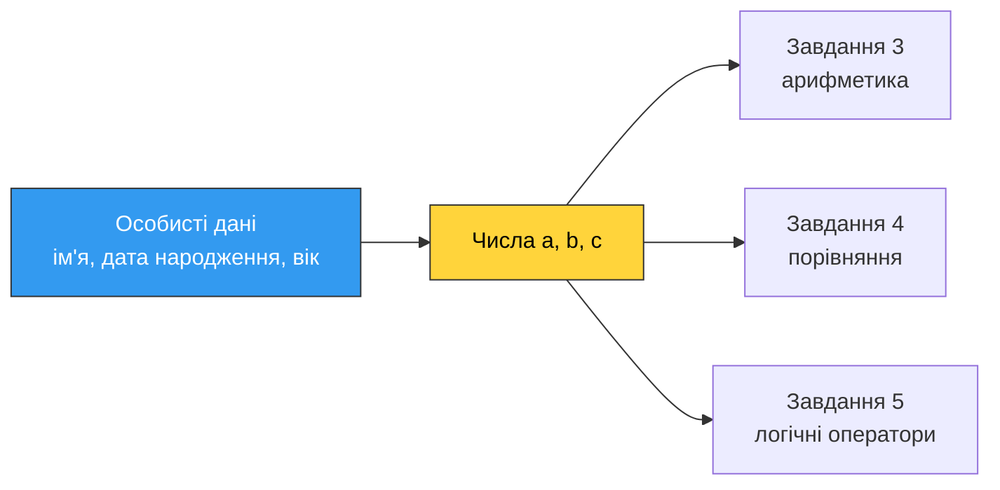

# 5. (П2) Змінні, типи даних та вирази

## Мета роботи

Навчитися створювати змінні, визначати та перетворювати типи даних, виконувати арифметичні дії, будувати логічні вирази й використовувати логічні оператори. Усі завдання виконуються **на власних даних**.

!!! danger "Персоналізація обов'язкова"
    Кожна програма має працювати з вашими справжніми даними: ім'ям, прізвищем, групою, датою народження, віком. Роботи з абстрактними `x = 5`, `y = 10` або з даними іншого студента не приймаються.

## Підготовка

1. Створіть каталог для роботи та перейдіть у нього:

    ```bash
    mkdir -p ~/python-course/practice05
    cd ~/python-course/practice05
    ```

2. Відкрийте каталог у редакторі (`code .`).
3. Кожне завдання виконуйте в **окремому файлі**: `task1.py`, `task2.py`, … , `task6.py`.
4. Кожен файл починайте коментарем із номером завдання, своїм прізвищем і групою.

### Ваші персональні числа

Перш ніж почати, випишіть три числа — вони знадобляться в завданнях 3, 4 і 5.

| Позначення | Звідки береться |
|---|---|
| `a` | день вашого народження (число від 1 до 31) |
| `b` | місяць вашого народження (число від 1 до 12) |
| `c` | кількість літер у вашому прізвищі латиницею |



!!! warning "Вимоги до оформлення коду"
    - Імена змінних — осмислені, латиницею, у стилі `snake_case` (винятки: `a`, `b`, `c` в завданні 4).
    - Кирилиця допускається **лише в коментарях**. Увесь текст у лапках — латиницею.
    - Для виведення використовуйте f-рядки.

## Хід роботи

### Завдання 1. Змінні

Файл `task1.py`.

1. Створіть **чотири** змінні різних типів, що описують саме вас:

    - ціле число (`int`) — наприклад, рік народження або день народження;
    - число з плаваючою комою (`float`) — наприклад, ваш зріст у метрах;
    - рядок (`str`) — ваше повне ім'я або назва групи;
    - логічне значення (`bool`) — відповідь на питання про вас: чи отримуєте стипендію, чи маєте водійські права тощо.

2. Виведіть кожну змінну на екран разом із її типом. Для визначення типу використайте функцію `type()`. Кожен рядок виведення має містити ім'я змінної, її значення і тип.

3. Після цього **змініть тип** двох змінних: змінній, що містила число, присвойте рядок, а логічній змінній — число з плаваючою комою. Виведіть їхні значення та типи ще раз — до зміни й після.

4. Спробуйте додати одиницю до змінної, яка раніше була числом, а тепер містить рядок. Подивіться, що станеться.

**У звіті опишіть (3–4 речення):**

- чи виникла помилка під час зміни типу змінної та чому;
- що саме змінилося після присвоєння: значення, тип чи ім'я змінної;
- чому додавання одиниці більше не працює, і що натомість робить оператор `+` для рядків;
- як це пов'язано з поняттям динамічної типізації.

### Завдання 2. Типи даних і перетворення

Файл `task2.py`.

1. Створіть по одній змінній для кожного простого типу, узявши значення зі своїх даних:

    - ціле число — день народження;
    - число з плаваючою комою — зріст;
    - рядок — рік народження, записаний **у лапках**;
    - логічне значення — будь-яке твердження про вас.

2. Виведіть значення та тип кожної змінної.

### Завдання 3. Числа та арифметичні операції

Файл `task3.py`.

1. Напишіть програму, яка запитує в користувача **два числа**. Обидва значення зчитуйте функцією `input()` і не забудьте перетворити їх на числа.

2. Програма має вивести:

    - суму, різницю, добуток і частку двох чисел;
    - цілу частину від ділення та остачу від ділення;
    - результат піднесення першого числа до степеня другого.

3. Кожен результат виводьте повним рядком: спочатку сам вираз із підставленими числами, потім знак рівності та відповідь.

### Завдання 4. Прості логічні вирази

Файл `task4.py`.

1. Створіть три числові змінні з іменами `a`, `b` і `c` та присвойте їм ваші персональні числа з таблиці на початку роботи. Кількість літер у прізвищі обчисліть у програмі, а не рахуйте вручну.

2. Складіть **шість** логічних виразів із операторами `>`, `<`, `>=`, `<=`, `==`, `!=`, використовуючи лише ці три змінні:

    - три вирази, що дають `True`;
    - три вирази, що дають `False`.

    Кожен оператор має зустрітися хоча б один раз. Один із виразів зробіть ланцюжком порівнянь (наприклад, перевірка, що місяць потрапляє в допустимий діапазон).

3. **Збережіть результат кожного виразу в окрему змінну** з осмисленим іменем, а вже потім виводьте. Разом зі значенням виводьте тип результату, отриманий через `type()`.

**У звіті наведіть таблицю** з усіма шістьма виразами: сам вираз, ваші значення `a`, `b`, `c`, очікуваний результат і результат, який вивела програма.

### Завдання 5. Логічні оператори

Файл `task5.py`. Завдання складається з двох частин.

**Частина 1. Додатне і парне число**

1. Створіть змінну з числом — візьміть свій день народження.
2. Окремими змінними обчисліть дві умови: чи є число додатним і чи є воно парним. Парність перевіряється остачею від ділення на 2.
3. За допомогою оператора `and` обчисліть, чи виконуються обидві умови одночасно. Виведіть усі три результати.
4. Повторіть перевірку для другого числа — добутку дня і місяця вашого народження. Порівняйте результати двох перевірок і поясніть різницю.

### Завдання 6. Перевірка віку (з введенням даних)

Файл `task6.py`.

1. Напишіть програму, яка запитує ім'я користувача та його вік. Вік має бути **цілим числом**.
2. Програма перевіряє та виводить:

    - чи потрапляє вік у діапазон від 18 до 60 **включно** — використайте ланцюжок порівнянь;
    - чи є вік парним числом;
    - чи виконуються обидві умови одночасно (`and`);
    - чи виконується хоча б одна з умов (`or`);

3. Додатково виведіть, скільки років залишилося до 60.
4. Усі результати виводьте зрозумілими рядками, а не просто `True` і `False` без пояснення.
5. Запустіть програму **чотири рази** — зі своїм віком і зі значеннями `17`, `60`, `61`.

**Питання:** чому запис `18 <= age <= 60` включає обидві межі, як записати цю саму умову через `and`, і що станеться, якщо користувач введе вік із крапкою (наприклад, `19.5`)?

## Що здати

1. Файли `task1.py` … `task6.py` з **власними** даними.
2. Знімки екрана з виводом програм завдань.
3. Звіт із відповідями на питання та заповненими таблицями до завдань 1, 2, 3, 4, 5 і 6.

