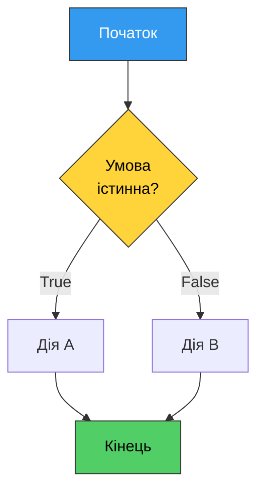
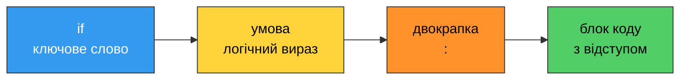
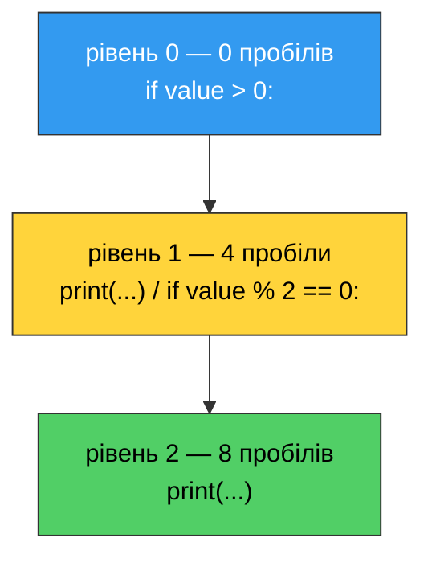
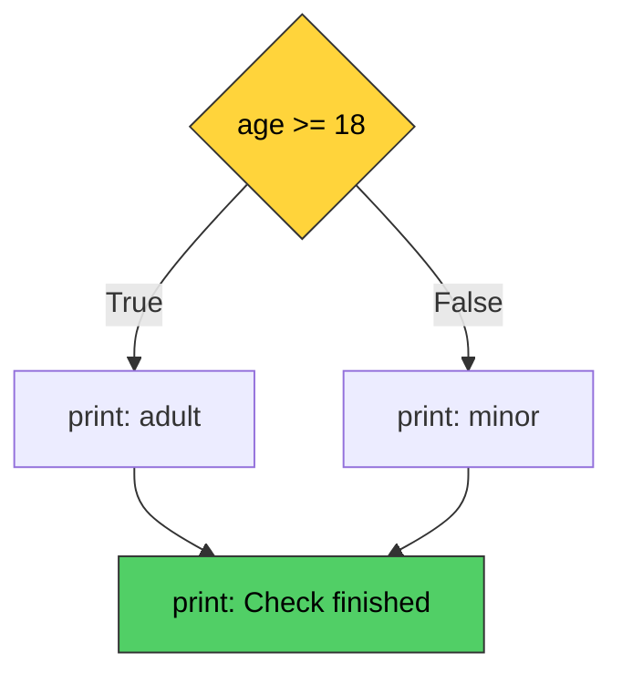
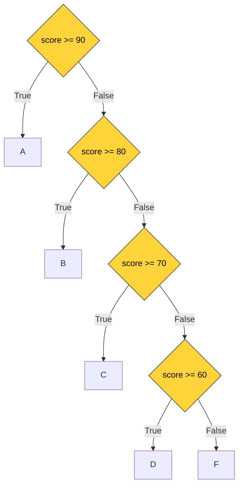

# 6. (Л) Умовні оператори: `if`, `elif`, `else`

## Зміст лекції

1. Навіщо програмі розгалуження
2. Умова як логічний вираз
3. Оператор `if`
4. Правило відступів у Python
5. `if` … `else`
6. `if` … `elif` … `else`
7. Вкладені умови
8. Складені умови: `and`, `or`, `not`
9. Істинність значень: що вважається `True`
10. Умовний вираз (тернарний оператор)
11. Оператор `match` … `case`
12. Типові помилки

## Навіщо програмі розгалуження

Усі програми з попередніх занять виконувалися **лінійно**: рядок за рядком, згори вниз, без винятків. Але реальні задачі так не працюють. «Якщо оцінка не менша за 60 — залік складено, інакше — ні». «Якщо файл існує — прочитати його, інакше — створити». Програма має **вибирати** шлях залежно від даних.

Конструкція, яка робить такий вибір, називається **умовним оператором** (розгалуженням).



## Умова як логічний вираз

**Умова** — це будь-який вираз, значення якого Python може розглянути як `True` або `False`. Найчастіше це порівняння:

```python
age = 19

print(age > 18)         # True
print(age == 18)        # False
print(age != 18)        # True
```

Оператори порівняння вже знайомі з минулої лекції:

| Оператор | Значення | Приклад | Результат |
|---|---|---|---|
| `==` | дорівнює | `5 == 5` | `True` |
| `!=` | не дорівнює | `5 != 3` | `True` |
| `>` | більше | `5 > 3` | `True` |
| `<` | менше | `5 < 3` | `False` |
| `>=` | більше або дорівнює | `5 >= 5` | `True` |
| `<=` | менше або дорівнює | `3 <= 5` | `True` |

!!! danger "`=` та `==` — різні речі"
    `=` присвоює значення, `==` порівнює. Плутанина між ними — найчастіша помилка новачків:

    ```python
    x = 5
    # if x = 5:      -> SyntaxError: invalid syntax
    # if x == 5:     -> правильно
    ```

## Оператор `if`

Найпростіша форма розгалуження: виконати блок коду, **якщо** умова істинна.

```python
temperature = 30

if temperature > 25:
    print("It is hot outside")

print("End of program")
```

```text
It is hot outside
End of program
```

Синтаксис складається з чотирьох обов'язкових частин:



Якщо умова хибна, блок просто пропускається — і виконання йде далі:

```python
temperature = 15

if temperature > 25:
    print("It is hot outside")      # не виконається

print("End of program")
```

```text
End of program
```

Блок може містити скільки завгодно рядків — важливо лише, щоб усі вони мали **однаковий відступ**:

```python
score = 85

if score >= 60:
    print("Test passed")
    print(f"Your score: {score}")
    print("Congratulations!")

print("Goodbye")
```

```text
Test passed
Your score: 85
Congratulations!
Goodbye
```

## Правило відступів у Python

Це найважливіша частина сьогоднішньої лекції. У більшості мов (C, Java, JavaScript) блок коду обмежують фігурні дужки `{ }`, а відступи потрібні лише людині — компілятору байдуже. **У Python відступ є частиною синтаксису.** Саме він визначає, що входить у блок, а що ні.

### Що таке блок

**Блок** — це група рядків з однаковим відступом, що виконуються як одне ціле. Блок починається після рядка з двокрапкою і триває доти, доки відступ зберігається.

```python
x = 10

if x > 5:
    print("A")          # у блоці if
    print("B")          # у блоці if
print("C")              # поза блоком — виконається завжди
```

```text
A
B
C
```

Порівняйте з тим самим кодом, де `x` менше:

```python
x = 1

if x > 5:
    print("A")          # не виконається
    print("B")          # не виконається
print("C")              # виконається
```

```text
C
```

### Правила

1. **Стандартний відступ — 4 пробіли.** Так рекомендує PEP 8, і так робить весь світ Python.
2. **Відступ обов'язковий.** Після рядка з двокрапкою наступний рядок мусить мати більший відступ, інакше — помилка.
3. **Усередині одного блоку відступ однаковий.** Не можна один рядок зсунути на 4 пробіли, а наступний — на 6.
4. **Не змішуйте пробіли й табуляції.** Обирайте пробіли; редактор налаштуйте так, щоб клавіша `Tab` вставляла 4 пробіли.
5. **Вкладеність збільшує відступ ще на 4 пробіли** — кожен новий рівень зсувається праворуч.

```python
value = 12

if value > 0:                       # рівень 0
    print("Positive")               # рівень 1 (4 пробіли)
    if value % 2 == 0:              # рівень 1
        print("And even")           # рівень 2 (8 пробілів)
print("Done")                       # рівень 0
```

```text
Positive
And even
Done
```



### Помилки відступів

**`IndentationError: expected an indented block`** — після двокрапки немає відступу:

```python
# x = 5
# if x > 0:
# print("Positive")     -> IndentationError: expected an indented block
```

**`IndentationError: unexpected indent`** — відступ там, де його не мало бути:

```python
# x = 5
#     print(x)          -> IndentationError: unexpected indent
```

**`IndentationError: unindent does not match any outer indentation level`** — рядки одного блоку мають різні відступи:

```python
# if x > 0:
#     print("A")
#   print("B")          -> відступ 2 не збігається ні з 0, ні з 4
```

**`TabError: inconsistent use of tabs and spaces in indentation`** — у файлі змішані табуляції та пробіли. Найпідступніша з помилок: на екрані код виглядає рівним, бо табуляція візуально дорівнює кільком пробілам, але для Python це різні символи.

!!! tip "Налаштуйте редактор один раз"
    У VS Code: у рядку стану внизу натисніть на `Spaces: 4` → **Convert Indentation to Spaces**. Увімкніть `View → Render Whitespace`, щоб бачити пробіли й табуляції. Після цього про `TabError` можна забути.

!!! info "Порожній блок: `pass`"
    Блок не може бути порожнім. Якщо тіло ще не написане, поставте `pass` — оператор, що не робить нічого:

    ```python
    x = 5

    if x > 0:
        pass            # TODO: implement later

    print("OK")
    ```

## `if` … `else`

`else` задає блок, що виконується, **коли умова хибна**. Виконається рівно одна з двох гілок — ніколи обидві й ніколи жодна.

```python
# Program: check if a person is an adult
age = int(input("Your age: "))

if age >= 18:
    print("You are an adult")
else:
    print("You are a minor")

print("Check finished")
```

```text
Your age: 15
You are a minor
Check finished
```

Зверніть увагу: `else` записується **на тому самому рівні**, що й `if`, має двокрапку і власний блок з відступом. Жодної умови після `else` не пишуть.



Класичний приклад — перевірка парності:

```python
# Program: check whether a number is even or odd
number = int(input("Enter an integer: "))

if number % 2 == 0:
    print(f"{number} is even")
else:
    print(f"{number} is odd")
```

```text
Enter an integer: 7
7 is odd
```

## `if` … `elif` … `else`

Коли варіантів більше двох, використовують `elif` (скорочення від *else if*). Гілок `elif` може бути скільки завгодно, `else` — не більше однієї, і вона завжди остання.

```python
# Program: convert a score into a letter grade
score = int(input("Score (0-100): "))

if score >= 90:
    grade = "A"
elif score >= 80:
    grade = "B"
elif score >= 70:
    grade = "C"
elif score >= 60:
    grade = "D"
else:
    grade = "F"

print(f"Score: {score}, grade: {grade}")
```

```text
Score (0-100): 84
Score: 84, grade: B
```

### Умови перевіряються згори вниз

Python перевіряє гілки **по черзі** й зупиняється на першій істинній. Решта не перевіряються взагалі.



Саме тому в прикладі з оцінками не потрібно писати `elif 80 <= score < 90`. Якщо виконання дійшло до другої гілки, це вже означає, що `score < 90`.

!!! danger "Порядок гілок має значення"
    ```python
    score = 95

    # НЕПРАВИЛЬНО: перша ж умова істинна для будь-якої оцінки >= 60
    if score >= 60:
        grade = "D"
    elif score >= 90:
        grade = "A"         # ніколи не виконається

    print(grade)            # D — хоча оцінка 95
    ```

    Умови мають іти від найвужчої до найширшої (тут — від найбільшого порога до найменшого).

### `elif` не те саме, що кілька `if`

```python
number = 12

# Варіант 1: elif — виконається ОДНА гілка
if number > 10:
    print("Greater than 10")
elif number > 5:
    print("Greater than 5")
```

```text
Greater than 10
```

```python
number = 12

# Варіант 2: окремі if — виконаються ОБИДВА блоки
if number > 10:
    print("Greater than 10")
if number > 5:
    print("Greater than 5")
```

```text
Greater than 10
Greater than 5
```

Обидва варіанти правильні синтаксично, але роблять різні речі. Використовуйте `elif`, коли варіанти **взаємовиключні**, і окремі `if` — коли перевірки **незалежні**.

## Вкладені умови

Усередині блоку `if` може бути ще один `if`. Кожен рівень вкладеності — плюс 4 пробіли відступу.

```python
# Program: check access to a driving simulator
age = int(input("Age: "))
has_license = input("Do you have a license (yes/no)? ") == "yes"

if age >= 18:
    if has_license:
        print("Access granted")
    else:
        print("Access denied: license required")
else:
    print("Access denied: you are too young")
```

```text
Age: 20
Do you have a license (yes/no)? no
Access denied: license required
```

Вкладеність зручна, але швидко робить код нечитабельним. Часто той самий результат дає складена умова:

```python
age = 20
has_license = True

# замість вкладених if
if age >= 18 and has_license:
    print("Access granted")
else:
    print("Access denied")
```

```text
Access granted
```

!!! tip "Правило трьох рівнів"
    Якщо вкладеність перевищує три рівні, код майже завжди можна спростити: об'єднати умови через `and`, поміняти гілки місцями або винести перевірку в окрему функцію (про функції — далі в курсі).

## Складені умови: `and`, `or`, `not`

| Оператор | Результат `True`, коли… | Приклад |
|---|---|---|
| `and` | істинні **обидві** умови | `age >= 18 and age <= 60` |
| `or` | істинна **хоча б одна** умова | `day == 6 or day == 7` |
| `not` | умова **хибна** | `not is_holiday` |

```python
# Program: decide whether the university library is open
hour = int(input("Hour (0-23): "))
is_weekend = input("Is it a weekend (yes/no)? ") == "yes"

if is_weekend and hour >= 10 and hour < 16:
    print("Library is open (weekend hours)")
elif not is_weekend and 8 <= hour < 20:
    print("Library is open")
else:
    print("Library is closed")
```

```text
Hour (0-23): 18
Is it a weekend (yes/no)? no
Library is open
```

### Ланцюжки порівнянь

Python дозволяє записувати подвійні нерівності так само, як у математиці:

```python
age = 25

print(18 <= age <= 60)                  # True
print(age >= 18 and age <= 60)          # True — те саме, довше
```

### Скорочене обчислення

`and` та `or` зупиняються, щойно результат стає відомим. Це дозволяє захищати небезпечні операції:

```python
text = input("Enter a word: ")

# якщо рядок порожній, друга частина не обчислюється
if len(text) > 0 and text[0] == "a":
    print("The word starts with 'a'")
else:
    print("No match")
```

```text
Enter a word: apple
The word starts with 'a'
```

### Оператор належності `in`

Замість довгого ланцюжка `or` зручно перевіряти входження:

```python
day = input("Day (Mon/Tue/Wed/Thu/Fri/Sat/Sun): ")

# замість day == "Sat" or day == "Sun"
if day in ("Sat", "Sun"):
    print("Weekend")
else:
    print("Working day")
```

```text
Day (Mon/Tue/Wed/Thu/Fri/Sat/Sun): Sat
Weekend
```

## Істинність значень: що вважається `True`

В умові `if` може стояти не лише порівняння, а будь-яке значення. Python перетворює його на `bool` за простим правилом: **«порожнє» і нуль — хибні, решта — істинні**.

| Хибні значення (falsy) | Істинні значення (truthy) |
|---|---|
| `False` | `True` |
| `0`, `0.0` | будь-яке інше число |
| `""` (порожній рядок) | будь-який непорожній рядок |
| `None` | будь-який об'єкт |
| `[]`, `()`, `{}` (порожні колекції) | непорожні колекції |

```python
name = input("Your name: ")

if name:                        # те саме, що: if name != ""
    print(f"Hello, {name}!")
else:
    print("You entered nothing")
```

```text
Your name:
You entered nothing
```


!!! tip "Як писати умови з `bool`"
    ```python
    is_student = True

    if is_student:              # добре
        print("Student")

    if is_student == True:      # надлишково
        print("Student")
    ```

## Умовний вираз (тернарний оператор)

Коли обидві гілки лише присвоюють значення одній змінній, конструкцію можна записати одним рядком:

```python
age = 20

status = "adult" if age >= 18 else "minor"
print(status)
```

```text
adult
```

Читається зліва направо: «`adult`, якщо `age >= 18`, інакше `minor`». Це те саме, що:

```python
age = 20

if age >= 18:
    status = "adult"
else:
    status = "minor"

print(status)
```

Умовний вираз можна вставляти прямо в f-рядок:

```python
count = 1

print(f"You have {count} message{'s' if count != 1 else ''}")
```

```text
You have 1 message
```

!!! tip "Коли використовувати"
    Тернарний оператор доречний для коротких простих виборів. Якщо в нього доводиться вкладати ще один тернарний оператор — пишіть звичайний `if`.

## Оператор `match` … `case`

Починаючи з Python 3.10 є конструкція `match`, зручна для порівняння одного значення з набором варіантів.

```python
# Program: describe a traffic light color
color = input("Traffic light color (red/yellow/green): ")

match color:
    case "red":
        print("Stop")
    case "yellow":
        print("Get ready")
    case "green":
        print("Go")
    case _:
        print("Unknown color")
```

```text
Traffic light color (red/yellow/green): green
Go
```

`case _` — це «все інше», аналог `else`. Той самий код через `elif` виглядав би так:

```python
color = "green"

if color == "red":
    print("Stop")
elif color == "yellow":
    print("Get ready")
elif color == "green":
    print("Go")
else:
    print("Unknown color")
```

```text
Go
```

Кілька значень в одній гілці розділяються символом `|`:

```python
day = "Sat"

match day:
    case "Sat" | "Sun":
        print("Weekend")
    case _:
        print("Working day")
```

```text
Weekend
```

!!! info "Що використовувати в курсі"
    `match` зручний, коли перевіряється **одне значення на рівність** кільком варіантам. Для діапазонів (`score >= 90`) і складених умов потрібен `if` / `elif`. У практичних роботах основною конструкцією залишається `if`.

## Повний приклад

```python
# Program: simple calculator with input validation
first = float(input("First number: "))
operation = input("Operation (+, -, *, /): ")
second = float(input("Second number: "))

if operation == "+":
    result = first + second
elif operation == "-":
    result = first - second
elif operation == "*":
    result = first * second
elif operation == "/":
    if second == 0:
        result = None
        print("Error: division by zero")
    else:
        result = first / second
else:
    result = None
    print(f"Error: unknown operation '{operation}'")

if result is not None:
    print(f"{first} {operation} {second} = {result:.4f}")
```

```text
First number: 12
Operation (+, -, *, /): /
Second number: 5
12.0 / 5.0 = 2.4000
```

```text
First number: 12
Operation (+, -, *, /): /
Second number: 0
Error: division by zero
```

## Типові помилки

| Помилка | Причина | Виправлення |
|---|---|---|
| `SyntaxError: expected ':'` | Забута двокрапка після умови | `if x > 0:` |
| `IndentationError: expected an indented block` | Після двокрапки немає відступу | Зсунути тіло на 4 пробіли |
| `IndentationError: unexpected indent` | Зайвий відступ | Вирівняти рядок по блоку |
| `TabError` | Змішані табуляції та пробіли | Перевести файл на пробіли |
| `SyntaxError: invalid syntax` (біля `=`) | `if x = 5` замість `if x == 5` | Подвійний знак `==` |
| `SyntaxError` біля `else` | `else` з умовою: `else x > 5:` | `elif x > 5:` |
| `NameError` після `if` | Змінна створена лише в одній гілці | Присвоїти значення до `if` |
| Логічна помилка (немає винятку) | Неправильний порядок `elif` | Від найвужчої умови до найширшої |

```python
# 1. змінна існує не в усіх гілках
score = 40

grade = "F"                 # значення за замовчуванням
if score >= 60:
    grade = "D"
print(grade)                # F, а не NameError

# 2. порівняння рядка з числом
value = input("Number: ")
# if value > 10:            -> TypeError: '>' not supported between 'str' and 'int'
if int(value) > 10:
    print("Big")
else:
    print("Small")
```

```text
F
Number: 42
Big
```

!!! danger "Умова, істинна завжди"
    ```python
    age = 15

    # НЕПРАВИЛЬНО: непорожній рядок завжди істинний
    if "age >= 18":
        print("Adult")     # виконається завжди!

    # правильно
    if age >= 18:
        print("Adult")
    ```

## Підсумок

- Умовний оператор дозволяє програмі **обирати** шлях виконання залежно від даних.
- Синтаксис: ключове слово, умова, **двокрапка**, блок з **відступом**.
- У Python відступ — частина синтаксису, а не оформлення. Стандарт — **4 пробіли**, табуляції не змішувати з пробілами.
- `if` виконує блок за істинної умови; `else` — за хибної; `elif` додає проміжні варіанти.
- Гілки перевіряються згори вниз, виконується **перша** істинна; порядок умов має значення.
- Кілька `if` поспіль і `if`/`elif` — різні конструкції: перша може виконати кілька блоків, друга — рівно один.
- Складені умови будуються операторами `and`, `or`, `not`; для перевірки на кілька значень зручний `in`.
- Порожні значення (`0`, `""`, `None`, порожні колекції) хибні, решта — істинні.
- Короткий вибір значення записують умовним виразом: `a if condition else b`.
- `match` … `case` зручний для порівняння одного значення з набором варіантів.

## Корисні посилання

- [Оператор `if` — документація Python](https://docs.python.org/3/tutorial/controlflow.html#if-statements)
- [`match` … `case`: підручник](https://docs.python.org/3/tutorial/controlflow.html#match-statements)
- [PEP 8 — відступи та оформлення коду](https://peps.python.org/pep-0008/#indentation)
- [PEP 20 — The Zen of Python](https://peps.python.org/pep-0020/)
- [Логічні операції — документація](https://docs.python.org/3/library/stdtypes.html#boolean-operations-and-or-not)
- [Перевірка істинності значень](https://docs.python.org/3/library/stdtypes.html#truth-value-testing)

## Домашнє завдання

Дослідіть, як Python «бачить» відступи, і навчіться читати повідомлення про помилки.

1. Створіть файл `indent_test.py` і послідовно відтворіть **три** різні помилки відступів: `expected an indented block`, `unexpected indent` і `unindent does not match any outer indentation level`. Для кожної збережіть знімок екрана з повним текстом помилки та поясніть одним реченням, що саме не сподобалося інтерпретатору.

2. Відтворіть `TabError`: у блоці `if` один рядок зсуньте табуляцією, інший — чотирма пробілами. Увімкніть у редакторі показ пробільних символів і поясніть, чому на екрані код виглядає правильним, а Python його відхиляє.

3. Напишіть програму, яка за введеним цілим числом визначає, у який діапазон воно потрапляє: менше `0`, від `0` до `9`, від `10` до `99`, `100` і більше. Спочатку розв'яжіть задачу через `if` / `elif` / `else`, потім — через вкладені `if` без `elif`. Порівняйте обидва варіанти за кількістю рядків і читабельністю; у звіті вкажіть, який варіант ви обрали б для реального коду і чому.

4. Візьміть приклад з оцінками з розділу «Порядок гілок має значення», запустіть **обидві** версії (правильну й неправильну) з оцінкою `95` і поясніть, чому неправильна версія не викликає жодної помилки, хоча дає хибний результат. Сформулюйте, чим логічна помилка небезпечніша за синтаксичну.
