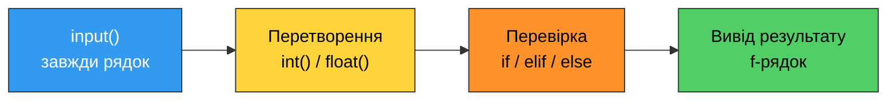

# 7. (П3) Умовні оператори та введення даних з консолі

## Мета роботи

Навчитися писати програми, які **отримують дані від користувача через консоль**, перевіряють їх і приймають рішення за допомогою умовних операторів `if`, `elif`, `else`. Окрема увага — перетворенню типів після `input()`, перевірці коректності введених даних та правилу відступів.

!!! danger "Персоналізація обов'язкова"
    Усі значення, які ви вводите під час тестових запусків, — **ваші справжні дані**: ім'я, група, дата народження, вік, кількість літер у прізвищі. Запуски з абстрактними `5`, `10`, `100` замість власних чисел не приймаються, як і роботи з даними іншого студента.

### Ваші персональні дані

Перш ніж почати, випишіть ці значення — вони знадобляться в тестових запусках усіх завдань.

| Позначення | Звідки береться | Завдання |
|---|---|---|
| `name` | ваше повне ім'я латиницею | 1, 6 |
| `group` | ваша група | 6 |
| `age` | ваш повний вік | 1 |
| `d`, `m`, `y` | день, місяць і рік вашого народження | 2, 5 |
| `a` | день вашого народження (1–31) | 3, 7 |
| `b` | місяць вашого народження (1–12) | 3, 7 |
| `c` | кількість літер у вашому прізвищі латиницею | 3, 7 |
| `score` | бал, який ви очікуєте отримати за цю роботу | 4 |
| `missed` | скільки занять ви пропустили цього семестру | 4 |



!!! warning "Вимоги до оформлення коду"
    - Відступ у блоках — рівно **4 пробіли**, табуляції не використовувати.
    - Імена змінних — осмислені, латиницею, у стилі `snake_case`.
    - Кирилиця допускається **лише в коментарях**. Увесь текст у лапках — латиницею.
    - Кожне запрошення до введення має пояснювати, що саме ввести й у якому форматі: `"Enter your age (integer): "`.
    - Для виведення використовуйте f-рядки.
    - **Перший рядок виводу кожної програми** — ваше ім'я та група, наприклад `print("Ivan Petrenko, PZ-11")`. Саме за ним на знімку екрана видно, що роботу виконали ви.

### Що варто пам'ятати про `input()`

| Пастка | Наслідок | Як обійти |
|---|---|---|
| `input()` повертає **рядок** | `"5" + "3"` дасть `"53"`, а не `8` | `int(input(...))` або `float(input(...))` |
| Порівняння рядка з числом | `TypeError: '>' not supported between 'str' and 'int'` | Перетворити тип **до** порівняння |
| Зайві пробіли при введенні | `" yes" != "yes"` | `input(...).strip()` |
| Різний регістр | `"Yes" != "yes"` | `input(...).strip().lower()` |
| `int("3.5")` | `ValueError` | Читати як `float()`, за потреби `int(float(...))` |
| Порожній ввід | `int("")` → `ValueError` | Перевірити `if not text:` до перетворення |

## Хід роботи

### Завдання 1. Знайомство з користувачем

Файл `task1.py`.

1. Програма запитує **ім'я** користувача, потім його **вік** (ціле число).
2. Якщо ім'я введено порожнім (користувач просто натиснув `Enter`), програма виводить повідомлення про це й далі використовує підпис `Anonymous`. Перевірку робіть через істинність рядка, а не через порівняння з `""`.
3. За віком програма визначає й виводить одну з категорій:

    | Вік | Категорія |
    |---|---|
    | менше 0 | некоректне значення |
    | 0–6 | `child` |
    | 7–17 | `schoolchild` |
    | 18–64 | `adult` |
    | 65 і більше | `senior` |

4. Наприкінці програма вітається з користувачем на ім'я та повідомляє його категорію одним рядком.

### Завдання 2. Аналіз введеного числа

Файл `task2.py`.

1. Програма запитує в користувача **одне ціле число**.
2. Виводить, чи число **додатне**, **від'ємне** чи **дорівнює нулю**.
3. Для ненульового числа додатково виводить, **парне** воно чи непарне.

Приклад роботи програми:

```text
Enter an integer: -42
The number is negative
The number is even
The number is two-digit
```

### Завдання 3. Калькулятор з вибором операції

Файл `task3.py`.

1. Програма послідовно запитує: **перше число**, **знак операції**, **друге число**. Числа читайте як `float`.
2. За допомогою `if` / `elif` / `else` програма виконує одну з операцій: `+`, `-`, `*`, `/`, `//`, `%`, `**`.
3. Якщо введено невідомий знак — програма повідомляє про це й не виконує обчислень.
4. Перед діленням (`/`, `//`, `%`) програма **обов'язково перевіряє дільник на нуль** і виводить зрозуміле повідомлення замість того, щоб аварійно завершитися.
5. Результат виводиться повним рядком: вираз, знак рівності, відповідь із чотирма знаками після коми.

### Завдання 4. Оцінка за 100-бальною шкалою

Файл `task4.py`.

1. Програма запитує **бал** (ціле число) і **кількість пропущених занять**.
2. Спочатку перевіряє коректність балу: якщо він менший за `0` або більший за `100`, програма повідомляє про помилку і більше нічого не рахує.
3. Для коректного балу визначає буквену оцінку:

    | Бал | Оцінка | ECTS |
    |---|---|---|
    | 90–100 | `A` | відмінно |
    | 82–89 | `B` | добре |
    | 74–81 | `C` | добре |
    | 64–73 | `D` | задовільно |
    | 60–63 | `E` | задовільно |
    | 0–59 | `F` | незадовільно |

4. Додатково: якщо пропущено **більше 30%** занять (усього занять — 16), програма виводить попередження про недопуск, незалежно від балу.
5. Наприкінці одним рядком виводить: бал, буквену оцінку і чи складено залік (`passed` / `failed`).

### Завдання 5. Перевірка коректності дати

Файл `task5.py`.

1. Програма запитує три числа: **день**, **місяць**, **рік**. Перший тестовий запуск — **ваша власна дата народження** `d`, `m`, `y`.
2. Програма перевіряє коректність дати за такими правилами:

    - місяць має бути в межах `1`–`12`;
    - рік має бути додатним;
    - кількість днів залежить від місяця: у січні, березні, травні, липні, серпні, жовтні та грудні — 31; у квітні, червні, вересні й листопаді — 30; у лютому — 28 або 29;
    - лютий має 29 днів, якщо рік **високосний**: ділиться на 4, але не на 100, або ділиться на 400.

3. Програма виводить `Date is valid` або `Date is invalid` із **поясненням, що саме не так**.

Exmaple:
```text
Day: 29
Month: 2
Year: 2023
Date is invalid: month 2 has only 28 days
```

