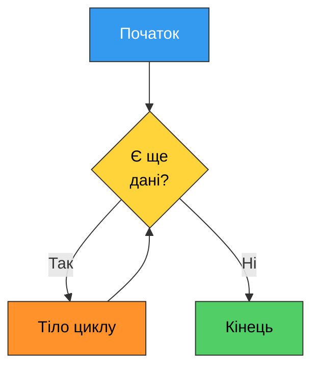
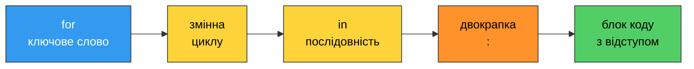
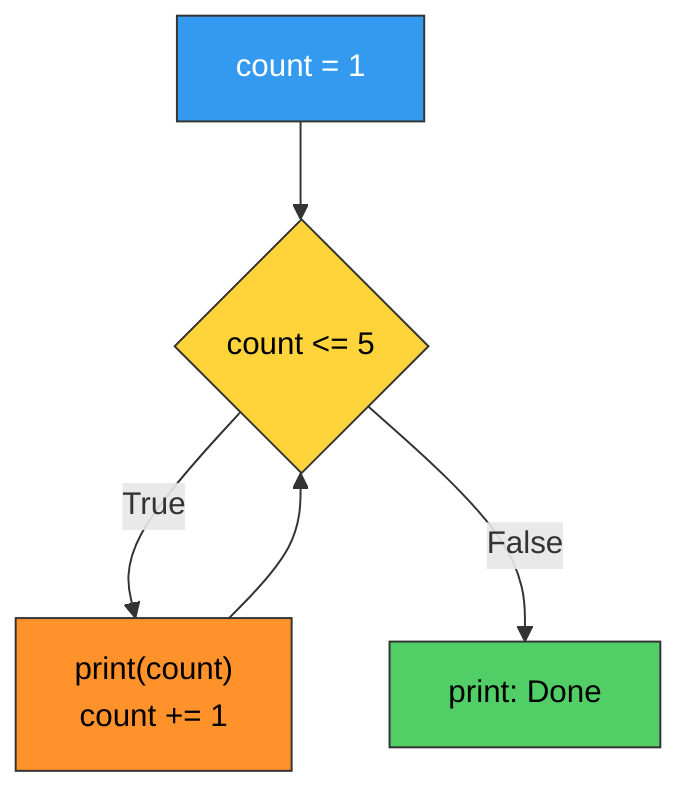
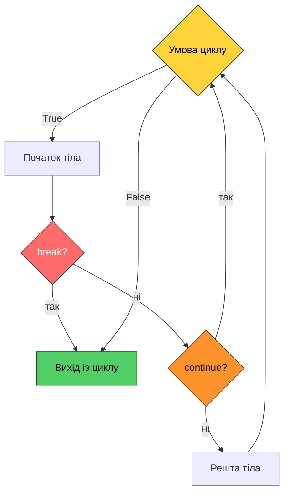
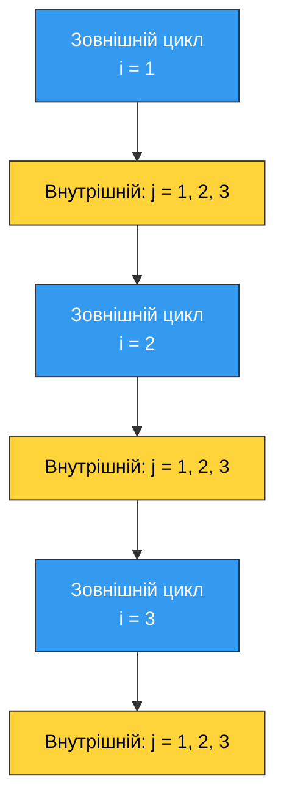

# 8. (Л) Цикли `for` і `while` та їх застосування

## Зміст лекції

1. Навіщо потрібні цикли
2. Два види циклів у Python
3. Цикл `for` та функція `range()`
4. Перебір рядків і колекцій
5. Цикл `while`
6. Лічильники та накопичувачі
7. `break`, `continue` та порожній оператор `pass`
8. Гілка `else` у циклі
9. Вкладені цикли
10. Корисні супутники циклів: `enumerate`, агрегатні функції
11. Типові застосування циклів
12. Типові помилки

## Навіщо потрібні цикли

Уявіть, що треба вивести числа від 1 до 5. Із тим, що ми вже знаємо, вихід один:

```python
print(1)
print(2)
print(3)
print(4)
print(5)
```

```text
1
2
3
4
5
```

А якщо до 1000? А якщо кількість чисел стане відома лише під час роботи програми — користувач введе її з клавіатури? Копіювати рядки неможливо в принципі.

**Цикл** — це конструкція, яка виконує один і той самий блок коду **багато разів**. Один прохід циклу називають **ітерацією**.

```python
for number in range(1, 6):
    print(number)
```

```text
1
2
3
4
5
```

П'ять рядків перетворилися на два — і, що важливіше, замінивши `6` на `1001`, ми отримаємо тисячу рядків без жодного зайвого символу коду.



## Два види циклів у Python

| Цикл | Коли використовувати | Ключове питання |
|---|---|---|
| `for` | кількість повторень **відома заздалегідь** або треба перебрати всі елементи послідовності | «для кожного елемента…» |
| `while` | повторювати, **поки виконується умова**; кількість повторень наперед невідома | «поки істинно…» |

Класичний приклад різниці: вивести 10 чисел — це `for` (рівно 10 разів). Запитувати пароль, доки користувач не введе правильний, — це `while` (може знадобитися і одна спроба, і сорок).

!!! info "Будь-який `for` можна переписати через `while`"
    І навпаки — майже завжди. Але правильно обраний цикл робить код коротшим і зрозумілішим, тому вибір не формальний, а змістовний.

## Цикл `for` та функція `range()`

### Синтаксис



Цикл `for` перебирає елементи послідовності **по одному** і на кожній ітерації записує черговий елемент у змінну циклу.

```python
for letter in "code":
    print(letter)
```

```text
c
o
d
e
```

Тут `letter` послідовно набуває значень `"c"`, `"o"`, `"d"`, `"e"`. Змінну циклу оголошувати заздалегідь не потрібно — Python створює її сам.

### Функція `range()`

Найчастіше `for` використовують разом із `range()` — вона породжує послідовність цілих чисел. Має три форми:

| Виклик | Що дає | Приклад значень |
|---|---|---|
| `range(stop)` | від `0` до `stop - 1` | `range(5)` → 0 1 2 3 4 |
| `range(start, stop)` | від `start` до `stop - 1` | `range(2, 6)` → 2 3 4 5 |
| `range(start, stop, step)` | з кроком `step` | `range(0, 10, 3)` → 0 3 6 9 |

```python
# Program: demonstrate the three forms of range()
print("range(5):")
for i in range(5):
    print(i, end=" ")
print()

print("range(2, 6):")
for i in range(2, 6):
    print(i, end=" ")
print()

print("range(0, 10, 3):")
for i in range(0, 10, 3):
    print(i, end=" ")
print()
```

```text
range(5):
0 1 2 3 4 
range(2, 6):
2 3 4 5 
range(0, 10, 3):
0 3 6 9 
```

!!! tip "Параметр `end` у `print()`"
    За замовчуванням `print()` завершує вивід переходом на новий рядок. `end=" "` замінює цей перехід пробілом — так значення друкуються в один рядок. Порожній `print()` після циклу переводить курсор на новий рядок.

!!! danger "Права межа не входить у діапазон"
    `range(1, 10)` — це числа від 1 до **9**, а не до 10. Це найчастіша помилка новачків (її називають *off-by-one*, «помилка на одиницю»). Щоб отримати числа від 1 до 10 включно, пишіть `range(1, 11)`.

### Зворотний відлік

Крок може бути від'ємним — тоді `start` більший за `stop`:

```python
for i in range(10, 0, -1):
    print(i, end=" ")
print()
print("Launch")
```

```text
10 9 8 7 6 5 4 3 2 1 
Launch
```

### Коли змінна циклу не потрібна

Якщо всередині тіла значення лічильника не використовується, за домовленістю пишуть підкреслення `_`:

```python
for _ in range(3):
    print("Python")
```

```text
Python
Python
Python
```

### Кількість ітерацій

Кількість повторень `for` фіксується **на початку** циклу. Змінити її, присвоївши щось змінній циклу всередині тіла, неможливо:

```python
for i in range(5):
    i = 100             # впливає лише на поточну ітерацію
    print(i, end=" ")
print()
```

```text
100 100 100 100 100 
```

Цикл усе одно виконався рівно 5 разів: на кожній ітерації `range` підставляє в `i` наступне своє значення, затираючи те, що ми туди записали.

## Перебір рядків і колекцій

Цикл `for` працює з будь-яким **ітерованим** об'єктом. Поки що нам знайомі рядки; крім них, у Python є списки та кортежі — докладно про них буде далі в курсі, але перебирати їх можна вже зараз.

```python
# Program: iterate over a string, a tuple and a list
word = "Python"
for character in word:
    print(character, end="-")
print()

for day in ("Mon", "Tue", "Wed"):
    print(day)

grades = [90, 84, 77]
for grade in grades:
    print(f"Grade: {grade}")
```

```text
P-y-t-h-o-n-
Mon
Tue
Wed
Grade: 90
Grade: 84
Grade: 77
```

Рядок можна перебирати і за індексами — через `range(len(...))`. Цей спосіб потрібен, коли важлива саме позиція символу:

```python
word = "Python"

for index in range(len(word)):
    print(f"{index}: {word[index]}")
```

```text
0: P
1: y
2: t
3: h
4: o
5: n
```

!!! tip "Що обрати"
    Якщо потрібні лише значення — перебирайте безпосередньо (`for c in word`). `range(len(...))` беріть тільки тоді, коли справді потрібен індекс. Прямий перебір читабельніший і не дає помилитися з межами.

## Цикл `while`

`while` повторює блок доти, доки умова істинна. Умова перевіряється **перед** кожною ітерацією.

```python
count = 1

while count <= 5:
    print(count)
    count += 1

print("Done")
```

```text
1
2
3
4
5
Done
```



Кожен коректний `while` складається з трьох частин. Забути будь-яку з них — типова помилка:

1. **Ініціалізація** — змінна умови існує ще до циклу (`count = 1`).
2. **Умова** — логічний вираз у заголовку (`count <= 5`).
3. **Зміна** — у тілі щось наближає умову до хибності (`count += 1`).

### Нескінченний цикл

Якщо третій пункт випав, цикл не завершиться ніколи:

```python
# УВАГА: нескінченний цикл — не запускайте без потреби
# count = 1
# while count <= 5:
#     print(count)      # count не змінюється -> умова істинна завжди
```

!!! danger "Як зупинити програму, що зациклилася"
    У терміналі натисніть **Ctrl + C**. Це перерве виконання й покаже `KeyboardInterrupt`. Якщо цикл ще й друкує в консоль, вивід може «залити» екран — це нормально, Ctrl + C все одно спрацює.

### Коли `while` природніший за `for`

Головний випадок — **перевірка введення користувача**. Скільки разів людина помилиться, наперед не знає ніхто:

```python
# Program: keep asking until the user enters a positive number
number = int(input("Enter a positive number: "))

while number <= 0:
    print("Error: the number must be greater than zero")
    number = int(input("Enter a positive number: "))

print(f"Accepted: {number}")
```

```text
Enter a positive number: -4
Error: the number must be greater than zero
Enter a positive number: 0
Error: the number must be greater than zero
Enter a positive number: 12
Accepted: 12
```

Другий випадок — коли кінець роботи визначається самими даними, а не лічильником:

```python
# Program: reverse the digits of a positive integer
number = int(input("Enter a positive integer: "))
reversed_number = 0

while number > 0:
    digit = number % 10             # остання цифра
    reversed_number = reversed_number * 10 + digit
    number = number // 10           # відкидаємо останню цифру

print(f"Reversed: {reversed_number}")
```

```text
Enter a positive integer: 2071
Reversed: 1702
```

### `while True` і навмисна нескінченність

Іноді умову виходу зручніше перевіряти в середині тіла. Тоді пишуть завідомо істинну умову й виходять оператором `break`:

```python
# Program: sum numbers until the user types "stop"
total = 0

while True:
    line = input("Number (or 'stop'): ")
    if line == "stop":
        break
    total += int(line)

print(f"Total: {total}")
```

```text
Number (or 'stop'): 10
Number (or 'stop'): 25
Number (or 'stop'): stop
Total: 35
```

Такий цикл нескінченний лише формально: вихід із нього гарантує `break`. Головне — переконатися, що умова `break` колись стане істинною.

## Лічильники та накопичувачі

Більшість практичних задач із циклами зводяться до одного з двох шаблонів.

**Накопичувач (акумулятор)** — змінна, що збирає результат за всі ітерації. Її обов'язково ініціалізують **до** циклу: сума — нулем, добуток — одиницею.

```python
# Program: sum of numbers from 1 to n and factorial of n
n = int(input("Enter n: "))

total = 0                   # нейтральний елемент для додавання
product = 1                 # нейтральний елемент для множення

for i in range(1, n + 1):
    total += i
    product *= i

print(f"Sum 1..{n} = {total}")
print(f"Factorial {n}! = {product}")
```

```text
Enter n: 5
Sum 1..5 = 15
Factorial 5! = 120
```

!!! danger "Ініціалізація всередині циклу"
    ```python
    # НЕПРАВИЛЬНО: total обнуляється на кожній ітерації
    for i in range(1, 6):
        total = 0
        total += i
    print(total)            # 5, а не 15
    ```

**Лічильник** — змінна, що рахує, скільки разів сталася подія:

```python
# Program: count vowels in a word
word = input("Enter a word: ").lower()
vowels = 0

for character in word:
    if character in "aeiou":
        vowels += 1

print(f"Vowels: {vowels}")
```

```text
Enter a word: Programming
Vowels: 3
```

**Пошук мінімуму й максимуму** — окремий випадок накопичувача. Початкове значення беруть із перших даних, а не «зі стелі»:

```python
# Program: find the largest of n numbers entered from the keyboard
count = int(input("How many numbers? "))

largest = int(input("Number 1: "))
for i in range(2, count + 1):
    value = int(input(f"Number {i}: "))
    if value > largest:
        largest = value

print(f"Largest: {largest}")
```

```text
How many numbers? 3
Number 1: 14
Number 2: 87
Number 3: 5
Largest: 87
```

## `break`, `continue` та порожній оператор `pass`

| Оператор | Дія |
|---|---|
| `break` | негайно завершує **весь** цикл |
| `continue` | пропускає решту тіла й переходить до **наступної** ітерації |
| `pass` | не робить нічого; заповнювач для порожнього блоку |



### `break`

```python
# Program: find the first number divisible by 7 in a range
for number in range(20, 40):
    if number % 7 == 0:
        print(f"Found: {number}")
        break
    print(f"Checked: {number}")
```

```text
Checked: 20
Found: 21
```

Цикл зупинився на 21 — решта чисел до 39 не перевірялися взагалі. Це головна цінність `break`: не робити зайвої роботи.

### `continue`

```python
# Program: print odd numbers only
for number in range(1, 11):
    if number % 2 == 0:
        continue                # парні пропускаємо
    print(number, end=" ")
print()
```

```text
1 3 5 7 9 
```

!!! warning "`continue` у `while` — пастка"
    Якщо `continue` стоїть **перед** зміною лічильника, ця зміна ніколи не виконається і цикл зависне:

    ```python
    # НЕПРАВИЛЬНО: при i == 3 лічильник більше не зростає
    # i = 0
    # while i < 10:
    #     if i == 3:
    #         continue
    #     i += 1
    ```

    У `for` такої проблеми немає — там лічильник змінює сам `range`.

## Гілка `else` у циклі

У Python цикл може мати блок `else`. Він виконується, **якщо цикл завершився природно** — без жодного `break`.

```python
# Program: check whether a number is prime
number = int(input("Enter an integer greater than 1: "))

for divisor in range(2, number):
    if number % divisor == 0:
        print(f"{number} is not prime: divisible by {divisor}")
        break
else:
    print(f"{number} is prime")
```

```text
Enter an integer greater than 1: 17
17 is prime
```

```text
Enter an integer greater than 1: 21
21 is not prime: divisible by 3
```

Читати `else` тут варто як «якщо нічого не знайшли». Конструкція зустрічається нечасто, але саме в задачах пошуку економить додаткову змінну-прапорець:

```python
# те саме через прапорець — довше
number = 21
found = False

for divisor in range(2, number):
    if number % divisor == 0:
        found = True
        break

if found:
    print(f"{number} is not prime")
else:
    print(f"{number} is prime")
```

```text
21 is not prime
```

## Вкладені цикли

Тіло циклу може містити інший цикл. Внутрішній цикл повністю відпрацьовує на **кожній** ітерації зовнішнього.

```python
# Program: multiplication table 1..3
for i in range(1, 4):
    for j in range(1, 4):
        print(f"{i} x {j} = {i * j}", end="   ")
    print()
```

```text
1 x 1 = 1   1 x 2 = 2   1 x 3 = 3   
2 x 1 = 2   2 x 2 = 4   2 x 3 = 6   
3 x 1 = 3   3 x 2 = 6   3 x 3 = 9   
```



Загальна кількість виконань тіла внутрішнього циклу — добуток кількостей ітерацій. Три на три — дев'ять рядків виводу.

Другий класичний приклад — фігури з символів, де довжина рядка залежить від його номера:

```python
# Program: print a triangle of stars
height = int(input("Height: "))

for row in range(1, height + 1):
    for _ in range(row):
        print("*", end="")
    print()
```

```text
Height: 4
*
**
***
****
```

!!! tip "`break` виходить лише з одного циклу"
    `break` у внутрішньому циклі завершує **тільки** внутрішній цикл; зовнішній продовжує роботу. Щоб перервати обидва, потрібен прапорець або окрема функція (про функції — далі в курсі).

!!! warning "Слідкуйте за кількістю ітерацій"
    Вкладеність множить роботу. Два цикли по 1000 ітерацій — це вже мільйон виконань тіла. Для навчальних задач це не проблема, але звичку оцінювати обсяг роботи варто виробити одразу.

## Корисні супутники циклів

### `enumerate()` — індекс і значення разом

```python
word = "Sky"

for index, character in enumerate(word):
    print(f"{index}: {character}")
```

```text
0: S
1: k
2: y
```

Другим аргументом можна задати початок нумерації — зручно для списків, які показують людині:

```python
for number, day in enumerate(("Mon", "Tue", "Wed"), 1):
    print(f"{number}. {day}")
```

```text
1. Mon
2. Tue
3. Wed
```

### Готові агрегатні функції

Частину типових циклів Python уже містить у вигляді вбудованих функцій:

```python
grades = [90, 84, 77, 95]

print(sum(grades))
print(max(grades))
print(min(grades))
print(len(grades))
print(sum(grades) / len(grades))
```

```text
346
95
77
4
86.5
```

!!! info "Навчитися писати цикл усе одно треба"
    У практичних роботах суму й максимум часто просять обчислити **вручну** — саме щоб відпрацювати накопичувач. У реальному коді, звісно, беруть `sum()` і `max()`.

## Типові застосування циклів

### 1. Повторюваний запит із перевіркою

```python
# Program: ask for a grade until a valid value is entered
while True:
    value = input("Grade (0-100): ")
    if not value.isdigit():
        print("Error: digits only")
        continue
    grade = int(value)
    if 0 <= grade <= 100:
        break
    print("Error: the value must be between 0 and 100")

print(f"Grade accepted: {grade}")
```

```text
Grade (0-100): abc
Error: digits only
Grade (0-100): 145
Error: the value must be between 0 and 100
Grade (0-100): 87
Grade accepted: 87
```

### 2. Меню програми

```python
# Program: simple text menu
while True:
    print("1 - Say hello")
    print("2 - Show a square")
    print("0 - Exit")
    choice = input("Your choice: ")

    if choice == "1":
        name = input("Your name: ")
        print(f"Hello, {name}!")
    elif choice == "2":
        number = int(input("Number: "))
        print(f"{number} ** 2 = {number ** 2}")
    elif choice == "0":
        print("Bye")
        break
    else:
        print("Unknown choice, try again")
```

```text
1 - Say hello
2 - Show a square
0 - Exit
Your choice: 2
Number: 9
9 ** 2 = 81
1 - Say hello
2 - Show a square
0 - Exit
Your choice: 0
Bye
```

### 3. Обробка тексту символ за символом

```python
# Program: count digits, letters and other characters in a line
line = input("Enter a line: ")

digits = 0
letters = 0
others = 0

for character in line:
    if character.isdigit():
        digits += 1
    elif character.isalpha():
        letters += 1
    else:
        others += 1

print(f"Digits: {digits}")
print(f"Letters: {letters}")
print(f"Other characters: {others}")
```

```text
Enter a line: Room 402, floor 4
Digits: 4
Letters: 9
Other characters: 4
```

### 4. Математичні обчислення з накопиченням

```python
# Program: sum of digits of an integer
number = abs(int(input("Enter an integer: ")))
digit_sum = 0

while number > 0:
    digit_sum += number % 10
    number //= 10

print(f"Sum of digits: {digit_sum}")
```

```text
Enter an integer: 2071
Sum of digits: 10
```

## Типові помилки

| Помилка | Причина | Виправлення |
|---|---|---|
| Програма «зависла» | у `while` нічого не змінює умову | додати зміну лічильника в тілі |
| `TypeError: 'int' object is not iterable` | `for i in 10:` замість `for i in range(10):` | обгорнути число в `range()` |
| Не той діапазон | забули, що `range(1, 10)` не містить 10 | `range(1, 11)` |
| `NameError` після циклу | змінна створена лише в тілі, а цикл не виконався жодного разу | ініціалізувати змінну до циклу |
| Сума завжди дорівнює останньому числу | накопичувач обнуляється всередині циклу | винести `total = 0` до циклу |
| `SyntaxError: 'break' outside loop` | `break` поза циклом | прибрати або перенести в цикл |
| `IndentationError` | тіло циклу без відступу | зсунути тіло на 4 пробіли |
| Виконалася лише перша ітерація | зайвий `break` у тілі | прибрати `break` або перенести під `if` |

```python
# 1. цикл може не виконатися жодного разу
total = 0                       # ініціалізація до циклу — обов'язкова
for i in range(0):              # порожній діапазон
    total += i
print(total)

# 2. число не є послідовністю
# for i in 5:                   -> TypeError: 'int' object is not iterable
for i in range(5):
    pass

# 3. змінна циклу «живе» і після циклу
for i in range(3):
    pass
print(i)                        # 2 — останнє значення
```

```text
0
2
```

!!! danger "Порівняння дробових чисел в умові `while`"
    ```python
    x = 0.0
    # while x != 1.0:           -> може не завершитися ніколи
    #     x += 0.1

    while x < 1.0:              # правильно: нерівність, а не рівність
        x += 0.1

    print(round(x, 2))
    ```

    ```text
    1.1
    ```

    Число `0.1` не має точного представлення у двійковій системі, тому сума десяти таких доданків не дорівнює рівно `1.0` — вона трохи менша, і цикл робить ще одну, одинадцяту ітерацію. Саме тому умову виходу з циклу ніколи не будують на точній рівності дробових чисел: з `!=` цей цикл не завершився б узагалі, а з `<` — завершується, але результат треба округлювати.

## Підсумок

- **Цикл** повторює блок коду; один прохід називається **ітерацією**.
- `for` перебирає елементи послідовності — використовуйте його, коли кількість повторень відома або треба обійти всі елементи.
- `range(stop)`, `range(start, stop)`, `range(start, stop, step)` породжують цілі числа; **права межа не входить** у діапазон.
- `while` повторює блок, поки істинна умова. Кожен `while` потребує трьох речей: ініціалізації, умови й зміни змінної в тілі.
- Нескінченний цикл зупиняється комбінацією **Ctrl + C**; `while True` разом із `break` — легальний і поширений прийом.
- Накопичувач (`total = 0`, `product = 1`) та лічильник ініціалізують **до** циклу.
- `break` перериває весь цикл, `continue` — лише поточну ітерацію; у `while` `continue` легко створює зациклення.
- Блок `else` у циклі виконується, якщо не було `break` — зручно в задачах пошуку.
- Вкладені цикли: внутрішній повністю відпрацьовує на кожній ітерації зовнішнього, кількість виконань перемножується.

## Корисні посилання

- [Цикли `for` — документація Python](https://docs.python.org/3/tutorial/controlflow.html#for-statements)
- [Функція `range()`](https://docs.python.org/3/library/stdtypes.html#range)
- [`break`, `continue` та `else` у циклах](https://docs.python.org/3/tutorial/controlflow.html#break-and-continue-statements-and-else-clauses-on-loops)
- [Оператор `while` — довідник мови](https://docs.python.org/3/reference/compound_stmts.html#the-while-statement)
- [`enumerate()`](https://docs.python.org/3/library/functions.html#enumerate) та [`zip()`](https://docs.python.org/3/library/functions.html#zip)
- [PEP 8 — оформлення коду](https://peps.python.org/pep-0008/)

## Домашнє завдання

Мета — навчитися свідомо обирати вид циклу й бачити межі його роботи.

1. Створіть файл `loops_range.py` і дослідним шляхом заповніть таблицю: для викликів `range(5)`, `range(1, 5)`, `range(5, 1)`, `range(5, 1, -1)`, `range(0, 10, 4)` і `range(10, 0)` випишіть, які числа виводить цикл і **скільки** ітерацій відбулося. Двома реченнями поясніть, чому два з цих викликів не дають жодної ітерації.

2. Напишіть програму, яка виводить числа від 1 до 10, **двома способами**: через `for` і через `while`. Порівняйте обидві версії за кількістю рядків і за кількістю місць, де можна помилитися. У звіті вкажіть, який варіант ви обрали б для цієї задачі та чому.

3. Навмисно створіть нескінченний цикл `while`, запустіть його, зупиніть комбінацією **Ctrl + C** і збережіть знімок екрана з повідомленням `KeyboardInterrupt`. Поясніть одним реченням, якої саме з трьох обов'язкових частин `while` бракувало вашому циклу.

4. Візьміть приклад із розділу «Ініціалізація всередині циклу», запустіть **обидві** версії (з `total = 0` до циклу і всередині нього) та поясніть, чому неправильна версія не викликає жодної помилки, але дає результат `5` замість `15`. Сформулюйте загальне правило про місце ініціалізації накопичувача.

5. Напишіть програму, яка запитує ваш рік народження і виводить усі роки від вашого народження до поточного, у яких ви святкували день народження в **парному** віці. Використайте `range()` з кроком і перевірте результат на власних даних.
