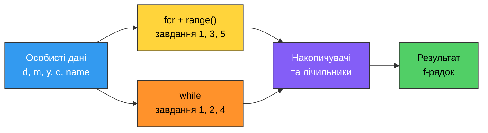

# 9. (П4) Розв'язування задач із використанням циклів

## Мета роботи

Навчитися розв'язувати задачі за допомогою циклів `for` і `while`: перебирати діапазони чисел і символи рядка, накопичувати суми й добутки, рахувати кількість подій, керувати ходом циклу через `break` та повторювати запит даних, доки користувач не введе коректне значення.

## Ваші персональні дані

Перш ніж почати, випишіть ці значення — вони знадобляться в усіх завданнях.

| Позначення | Звідки береться | Завдання |
|---|---|---|
| `name` | ваше ім'я латиницею | 3 |
| `surname` | ваше прізвище латиницею | 3 |
| `group` | ваша група | усі |
| `d` | день вашого народження (1–31) | 1, 2, 5 |
| `m` | місяць вашого народження (1–12) | 2 |
| `y` | рік вашого народження | 2 |
| `c` | кількість літер у вашому прізвищі латиницею | 1, 5 |



## Хід роботи

### Завдання 1. Числовий ряд від дня народження

Файл `task1.py`.

1. Задайте в програмі змінні `d` і `c` своїми персональними значеннями.
2. Циклом `for` із `range()` виведіть **в один рядок** усі числа від `d` до `31` включно. Одночасно порахуйте:

    - скільки чисел вивелося (лічильник);
    - їхню суму;
    - їхній добуток.

3. Виведіть кількість, суму, добуток і середнє арифметичне (з двома знаками після коми).
4. Тим самим циклом окремо порахуйте, скільки серед цих чисел **парних**, а скільки непарних.
5. Напишіть **другу версію** цієї самої програми через `while` (у тому ж файлі, після коментаря `# while version`) і переконайтеся, що обидві дають однаковий результат.
6. Останнім блоком виведіть зворотний відлік від `c` до `1` — циклом `for` із від'ємним кроком.

Приклад роботи програми:

```text
Ivan Petrenko, PZ-11
Numbers from 14 to 31: 14 15 16 17 18 19 20 21 22 23 24 25 26 27 28 29 30 31
Count: 18
Sum: 405
Product: 1320509264105545113600000
Average: 22.50
Even: 9, odd: 9
Countdown: 8 7 6 5 4 3 2 1
```

### Завдання 2. Цифри вашої дати народження

Файл `task2.py`.

1. Програма запитує в користувача **одне ціле число**. Перший тестовий запуск — ваша дата народження у форматі `ddmmyyyy` (наприклад, для 14 липня 2007 року це `14072007`).
2. Циклом `while` (без перетворення числа в рядок) знайдіть:

    - кількість цифр у числі;
    - суму цифр;
    - найбільшу та найменшу цифру;
    - число, записане у зворотному порядку.

    Підказка: остача від ділення на `10` дає останню цифру, ділення націло на `10` прибирає її.

3. Виведіть результати окремими рядками.
4. Передбачте випадок, коли користувач вводить `0` або від'ємне число: програма не повинна зациклюватися.

Приклад роботи програми:

```text
Ivan Petrenko, PZ-11
Enter an integer: 14072007
Digits: 8
Sum of digits: 21
Max digit: 7, min digit: 0
Reversed: 70027041
```

### Завдання 3. Ваше ім'я символ за символом

Файл `task3.py`.

1. Задайте змінні `name` і `surname` своїми даними латиницею.
2. Циклом `for` пройдіть по рядку `name + surname` і порахуйте:

    - голосні (`a`, `e`, `i`, `o`, `u`, `y`) — перевірку робіть без урахування регістру;
    - приголосні.

3. Виведіть обидва лічильники й перевірте, що їхня сума дорівнює довжині рядка.

Приклад роботи програми:

```text
Ivan Petrenko
Vowels: 5, consonants: 7
Total letters: 12
```

### Завдання 4. Повторюваний запит із перевіркою

Файл `task4.py`.

1. Програма циклом `while` просить ввести **бал за 100-бальною шкалою**, доки не буде введено коректне значення — ціле число від `0` до `100`.
2. Для некоректного значення програма пояснює, що саме не так (менше нуля, більше ста), і запитує ще раз. Для виходу з циклу використайте `while True` разом із `break`.
3. Порахуйте, скільки спроб знадобилося, і виведіть це число.
4. Після успішного введення програма виводить буквену оцінку (`A`–`F`) за шкалою з практичної роботи 7.

Приклад роботи програми:

```text
Ivan Petrenko, PZ-11
Enter your score (0-100): 120
Score is too big, maximum is 100
Enter your score (0-100): -5
Score cannot be negative
Enter your score (0-100): 87
Accepted after 3 attempts
Grade: B
```

### Завдання 5. Дільники та прості числа

Файл `task5.py`.

1. Обчисліть число `n = d * c` зі своїх персональних даних.
2. Циклом знайдіть і виведіть **усі дільники** числа `n`, порахуйте їх кількість та їхню суму.
3. За допомогою циклу з `break` і гілки `else` при циклі визначте, чи є `n` **простим числом**. Виведіть зрозумілу відповідь.
4. Виведіть **усі прості числа** в діапазоні від `2` до `n`. Кількість знайдених чисел також виведіть.

Приклад роботи програми:

```text
Ivan Petrenko, PZ-11
n = 14 * 8 = 112
Divisors: 1 2 4 7 8 14 16 28 56 112
Divisors count: 10, sum: 248
112 is not prime
Primes up to 112: 2 3 5 7 11 ... 109
Primes count: 29
```
