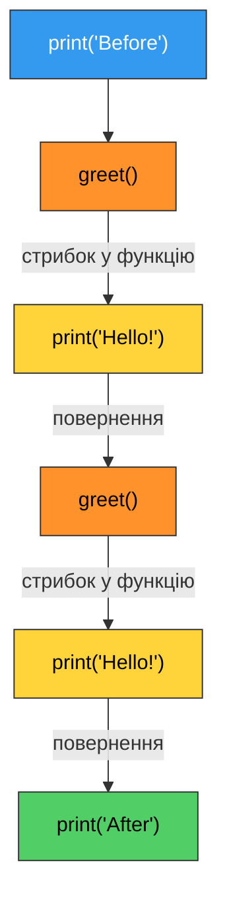
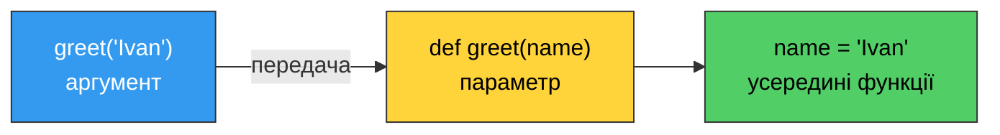
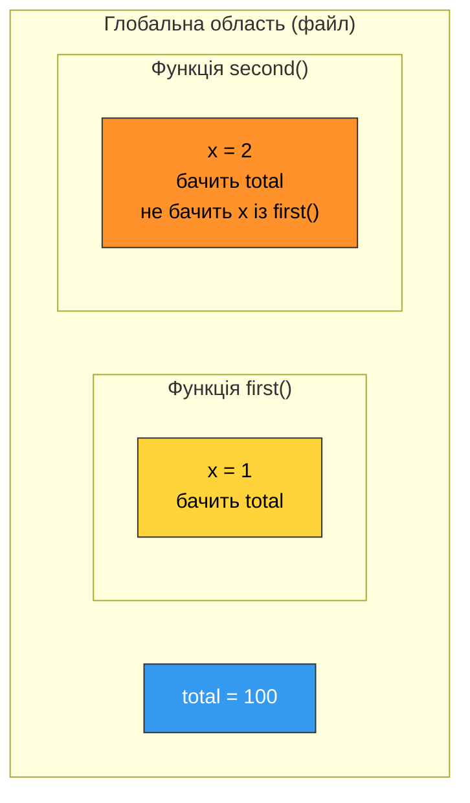
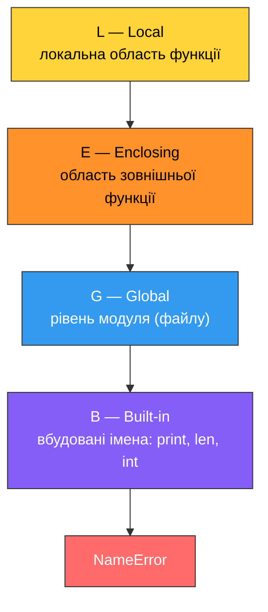

# 10. (Л) Функції. Параметри та область видимості змінних

## Зміст лекції

1. Навіщо потрібні функції
2. Оголошення функції: `def`
3. Виклик функції та порядок виконання
4. Параметри й аргументи
5. Оператор `return`
6. Позиційні та іменовані аргументи
7. Значення параметрів за замовчуванням
8. Довільна кількість аргументів: `*args` і `**kwargs`
9. Область видимості змінних
10. Правило LEGB
11. Оператори `global` і `nonlocal`
12. Що саме передається у функцію
13. Документування функції: docstring та анотації типів
14. Типові помилки

## Навіщо потрібні функції

Ми вже користувалися функціями з першого заняття: `print()`, `input()`, `len()`, `int()`, `range()`, `sum()`. Кожна з них — готовий шматок коду, який хтось написав раніше, а ми викликаємо його на ім'я, не знаючи, як він влаштований усередині.

Тепер настав час писати такі шматки самостійно.

Погляньмо на програму, яка обчислює середній бал для трьох студентів:

```python
# Program: average grade without functions
total = 90 + 84 + 77
average = total / 3
print(f"Ivan: {round(average, 2)}")

total = 65 + 71 + 80
average = total / 3
print(f"Olena: {round(average, 2)}")

total = 95 + 91 + 88
average = total / 3
print(f"Petro: {round(average, 2)}")
```

```text
Ivan: 83.67
Olena: 72.0
Petro: 91.33
```

Три однакові блоки, які відрізняються лише числами. Якщо завтра виявиться, що середнє треба рахувати інакше (наприклад, відкидати найгіршу оцінку), доведеться правити код у **трьох** місцях — і десь обов'язково забути.

Та сама програма з функцією:

```python
# Program: average grade with a function
def average_of_three(a, b, c):
    return (a + b + c) / 3


print(f"Ivan: {round(average_of_three(90, 84, 77), 2)}")
print(f"Olena: {round(average_of_three(65, 71, 80), 2)}")
print(f"Petro: {round(average_of_three(95, 91, 88), 2)}")
```

```text
Ivan: 83.67
Olena: 72.0
Petro: 91.33
```

Логіка обчислення тепер описана **один раз**. Змінити формулу — означає змінити один рядок.

**Функція** — це іменований блок коду, який виконує одну закінчену задачу, може приймати вхідні дані й повертати результат.

Навіщо вони потрібні:

| Причина | Пояснення |
|---|---|
| **Повторне використання** | написали один раз — викликаєте скільки завгодно |
| **Читабельність** | `average_of_three(90, 84, 77)` зрозуміліше за три рядки арифметики |
| **Ізоляція** | помилка шукається всередині однієї функції, а не по всій програмі |
| **Декомпозиція** | велика задача розбивається на маленькі, кожна з яких вирішується окремо |
| **Тестованість** | функцію можна перевірити окремо від решти програми |

!!! info "Принцип DRY"
    **DRY** — Don't Repeat Yourself («не повторюйся»). Якщо ви скопіювали блок коду вдруге — майже завжди це сигнал, що там має бути функція.

## Оголошення функції: `def`

```python
def greet():
    print("Hello!")
    print("Welcome to the course")
```

Розберемо синтаксис по частинах:

```text
def  greet ( )  :
 |     |    |   |
 |     |    |   +-- двокрапка — обов'язкова
 |     |    +------ дужки: тут будуть параметри (зараз їх немає)
 |     +----------- ім'я функції
 +----------------- ключове слово
```

Далі йде **тіло функції** — блок із відступом у 4 пробіли, точно як у циклах та умовах.

Правила імен ті самі, що й для змінних: латиниця, цифри, підкреслення; не починається з цифри; не збігається з ключовим словом. За PEP 8 ім'я функції пишуть у стилі `snake_case` і роблять його **дієсловом або дією**: `calculate_area`, `read_grades`, `is_valid` — бо функція щось *робить*.

!!! warning "Оголошення ще не виконує код"
    Рядок `def greet():` лише **створює** функцію й записує її під іменем `greet`. Жодного `Hello!` на екрані не з'явиться, доки функцію не викличуть.

## Виклик функції та порядок виконання

Виклик — це ім'я функції з дужками:

```python
def greet():
    print("Hello!")


print("Before")
greet()
greet()
print("After")
```

```text
Before
Hello!
Hello!
After
```

Дужки обов'язкові. Без них ви отримаєте не результат, а саму функцію як об'єкт:

```python
def greet():
    print("Hello!")


print(greet)                    # без дужок — об'єкт функції
greet()                         # з дужками — виклик
```

```text
<function greet at 0x7f3a2c1b4e50>
Hello!
```

Коли інтерпретатор доходить до виклику, він **перестрибує** у тіло функції, виконує його, а потім повертається точно в те місце, звідки стрибнув:



!!! danger "Функцію треба оголосити до виклику"
    ```python
    # НЕПРАВИЛЬНО: на момент виклику імені greet ще не існує
    # greet()
    # def greet():
    #     print("Hello!")
    # -> NameError: name 'greet' is not defined
    ```

    Тому всі `def` традиційно розміщують **угорі файлу**, а основний код програми — під ними.

## Параметри й аргументи

Функція стає по-справжньому корисною, коли працює не з фіксованими даними, а з тими, що їй передали.

```python
def greet(name):
    print(f"Hello, {name}!")


greet("Ivan")
greet("Olena")
```

```text
Hello, Ivan!
Hello, Olena!
```

Два терміни, які часто плутають:

| Термін | Що це | Де живе |
|---|---|---|
| **Параметр** | ім'я в дужках при оголошенні (`name`) | у рядку `def` |
| **Аргумент** | конкретне значення при виклику (`"Ivan"`) | у рядку виклику |

Параметр — це порожня коробка з підписом; аргумент — те, що в неї кладуть у момент виклику.



Параметрів може бути скільки завгодно — вони перелічуються через кому:

```python
def describe_student(name, group, grade):
    print(f"{name} ({group}) -> {grade}")


describe_student("Ivan", "PZ-11", 87)
describe_student("Olena", "PZ-12", 93)
```

```text
Ivan (PZ-11) -> 87
Olena (PZ-12) -> 93
```

Порядок аргументів має значення: перший аргумент потрапляє в перший параметр, другий — у другий і так далі. Такі аргументи називають **позиційними**.

```python
def divide(a, b):
    print(f"{a} / {b} = {a / b}")


divide(10, 2)
divide(2, 10)                   # інший порядок — інший результат
```

```text
10 / 2 = 5.0
2 / 10 = 0.2
```

Кількість аргументів має збігатися з кількістю параметрів:

```python
def describe_student(name, group, grade):
    print(f"{name} ({group}) -> {grade}")


# describe_student("Ivan")
# -> TypeError: describe_student() missing 2 required positional arguments: 'group' and 'grade'

# describe_student("Ivan", "PZ-11", 87, 5)
# -> TypeError: describe_student() takes 3 positional arguments but 4 were given

describe_student("Ivan", "PZ-11", 87)
```

```text
Ivan (PZ-11) -> 87
```

## Оператор `return`

Функція `greet()` друкує текст, але нічого не **віддає** назад. Її результат не можна ні зберегти у змінну, ні використати в обчисленні. За повернення значення відповідає оператор `return`.

```python
def square(number):
    return number ** 2


result = square(7)
print(result)
print(square(3) + square(4))    # результат одразу в обчисленні
```

```text
49
25
```

`return` робить дві речі одночасно:

1. **Віддає значення** в місце виклику.
2. **Негайно завершує** функцію — усе, що написано нижче, не виконується.

```python
def check_grade(grade):
    if grade >= 60:
        return "Passed"
    return "Failed"                 # else не потрібен: перший return уже вийшов би


print(check_grade(75))
print(check_grade(42))
```

```text
Passed
Failed
```

### `print` проти `return`

Це найпоширеніша плутанина початківців.

```python
def add_and_print(a, b):
    print(a + b)                # показує на екрані, віддає None


def add_and_return(a, b):
    return a + b                # нічого не показує, віддає число


x = add_and_print(2, 3)
y = add_and_return(2, 3)

print(f"x = {x}")
print(f"y = {y}")
print(add_and_return(2, 3) * 10)
# print(add_and_print(2, 3) * 10)   -> TypeError: unsupported operand type(s)
```

```text
5
x = None
y = 5
50
```

| | `print()` | `return` |
|---|---|---|
| Для кого | для людини, що дивиться на екран | для програми, що рахує далі |
| Що залишає у змінній | `None` | саме значення |
| Чи завершує функцію | ні | так |

!!! tip "Правило поділу обов'язків"
    Хай функція **рахує** і повертає результат, а друкує його вже той, хто викликав. Таку функцію легко перевикористати: результат можна вивести, зберегти у файл або передати в іншу функцію.

### Функція без `return`

Якщо `return` немає (або він написаний без значення), функція повертає спеціальне значення `None` — «нічого».

```python
def show_line():
    print("-" * 20)


value = show_line()
print(value)
print(type(value))
```

```text
--------------------
None
<class 'NoneType'>
```

Функції, які нічого не повертають, а лише виконують дію (друк, запис у файл), іноді називають **процедурами**.

### Повернення кількох значень

`return` може віддати кілька значень через кому — технічно це один кортеж, який зручно одразу «розпакувати» у кілька змінних:

```python
def min_max_avg(a, b, c):
    return min(a, b, c), max(a, b, c), (a + b + c) / 3


lowest, highest, average = min_max_avg(90, 84, 77)
print(f"Min: {lowest}, max: {highest}, avg: {round(average, 2)}")

everything = min_max_avg(90, 84, 77)
print(everything)
```

```text
Min: 77, max: 90, avg: 83.67
(77, 90, 83.66666666666667)
```

### Кілька `return` та ранній вихід

Часто зручно відсіяти «погані» випадки на початку функції й вийти одразу:

```python
def safe_divide(a, b):
    if b == 0:
        return None                 # ранній вихід: ділити далі немає сенсу
    return a / b


print(safe_divide(10, 2))
print(safe_divide(10, 0))
```

```text
5.0
None
```

!!! warning "Код після `return` недосяжний"
    ```python
    def broken(x):
        return x * 2
        print("This line never runs")   # ніколи не виконається
    ```

    Помилки не буде, але й рядка ви не побачите — типове джерело «чому не працює?».

## Позиційні та іменовані аргументи

Аргументи можна передавати не за порядком, а **за іменем параметра**. Такі аргументи називають **іменованими** (keyword arguments).

```python
def describe_student(name, group, grade):
    print(f"{name} ({group}) -> {grade}")


describe_student("Ivan", "PZ-11", 87)                        # позиційні
describe_student(name="Ivan", group="PZ-11", grade=87)       # іменовані
describe_student(grade=87, name="Ivan", group="PZ-11")       # порядок неважливий
describe_student("Ivan", grade=87, group="PZ-11")            # змішано
```

```text
Ivan (PZ-11) -> 87
Ivan (PZ-11) -> 87
Ivan (PZ-11) -> 87
Ivan (PZ-11) -> 87
```

Іменовані аргументи роблять виклик самодокументованим. Порівняйте:

```text
create_window(800, 600, True, False)
create_window(width=800, height=600, resizable=True, fullscreen=False)
```

Друга форма зрозуміла без документації.

!!! danger "Позиційні йдуть перед іменованими"
    ```python
    # describe_student(name="Ivan", "PZ-11", 87)
    # -> SyntaxError: positional argument follows keyword argument
    ```

    Щойно ви вказали ім'я хоч для одного аргументу, всі наступні теж мають бути іменованими.

## Значення параметрів за замовчуванням

Параметру можна задати значення, яке використовується, якщо аргумент не передали:

```python
def greet(name, greeting="Hello"):
    print(f"{greeting}, {name}!")


greet("Ivan")
greet("Olena", "Good morning")
greet("Petro", greeting="Hi")
```

```text
Hello, Ivan!
Good morning, Olena!
Hi, Petro!
```

Це дозволяє мати одну функцію замість кількох схожих. Приклад із заокругленням:

```python
def average_of_three(a, b, c, digits=2):
    return round((a + b + c) / 3, digits)


print(average_of_three(90, 84, 77))
print(average_of_three(90, 84, 77, 0))
print(average_of_three(90, 84, 77, digits=4))
```

```text
83.67
84.0
83.6667
```

!!! danger "Параметри зі значенням — тільки після звичайних"
    ```python
    # def greet(greeting="Hello", name):
    # -> SyntaxError: parameter without a default follows parameter with a default
    ```

    Інакше Python не зміг би зрозуміти, куди подіти перший позиційний аргумент.

### Пастка: змінюваний об'єкт як значення за замовчуванням

Значення за замовчуванням обчислюється **один раз** — у момент оголошення функції, а не при кожному виклику. Для чисел і рядків це непомітно, а для списку — джерело дуже неочевидної помилки:

```python
# НЕПРАВИЛЬНО: список створюється один раз і живе між викликами
def add_grade_bad(grade, grades=[]):
    grades.append(grade)
    return grades


print(add_grade_bad(90))
print(add_grade_bad(84))
print(add_grade_bad(77))
```

```text
[90]
[90, 84]
[90, 84, 77]
```

Кожен виклик дописує до **того самого** списку. Правильний спосіб — використати `None` як позначку «нічого не передали»:

```python
# ПРАВИЛЬНО: новий список створюється на кожному виклику
def add_grade(grade, grades=None):
    if grades is None:
        grades = []
    grades.append(grade)
    return grades


print(add_grade(90))
print(add_grade(84))
print(add_grade(77))
```

```text
[90]
[84]
[77]
```

!!! tip "Просте правило"
    Значенням за замовчуванням може бути число, рядок, `True`/`False`, `None`, кортеж. Список чи словник — ніколи.

## Довільна кількість аргументів: `*args` і `**kwargs`

Іноді наперед невідомо, скільки значень передадуть. Саме так працює `print()`, який приймає будь-яку кількість аргументів.

Зірочка перед іменем параметра збирає всі зайві позиційні аргументи в кортеж:

```python
def total(*numbers):
    result = 0
    for number in numbers:
        result += number
    return result


print(total(1, 2, 3))
print(total(10, 20, 30, 40, 50))
print(total())
```

```text
6
150
0
```

Дві зірочки збирають усі зайві іменовані аргументи у словник (словники докладно розглядатимемо далі в курсі):

```python
def show_settings(**options):
    for key, value in options.items():
        print(f"{key} = {value}")


show_settings(width=800, height=600, title="Report")
```

```text
width = 800
height = 600
title = Report
```

Усе разом, у канонічному порядку:

```python
def build_report(title, *lines, author="unknown", **extra):
    print(f"Title: {title}")
    print(f"Author: {author}")
    for line in lines:
        print(f"  - {line}")
    for key, value in extra.items():
        print(f"[{key}: {value}]")


build_report("Lab 5", "Task 1 done", "Task 2 done", author="Ivan", group="PZ-11")
```

```text
Title: Lab 5
Author: Ivan
  - Task 1 done
  - Task 2 done
[group: PZ-11]
```

!!! info "Імена `args` і `kwargs` — лише традиція"
    Працює саме зірочка, а не ім'я: `*values` чи `*numbers` цілком коректні. Але `*args` / `**kwargs` настільки поширені, що їх варто впізнавати з першого погляду.

## Область видимості змінних

Тепер — друга велика тема заняття. Розгляньмо приклад:

```python
def show():
    message = "inside"
    print(message)


show()
# print(message)
# -> NameError: name 'message' is not defined
```

```text
inside
```

Змінна `message` існує **лише всередині** функції. Коли функція завершується, вона зникає.

**Область видимості (scope)** — це частина програми, у якій ім'я змінної доступне.

| Область | Де створюється | Хто бачить |
|---|---|---|
| **Локальна** | усередині функції | тільки ця функція |
| **Глобальна** | на верхньому рівні модуля | уся програма, включно з функціями (на читання) |



### Локальні змінні незалежні

Дві функції можуть мати змінні з однаковим іменем — вони ніяк не пов'язані:

```python
def first():
    value = 1
    print(f"first: {value}")


def second():
    value = 999
    print(f"second: {value}")


first()
second()
first()
```

```text
first: 1
second: 999
first: 1
```

Параметри — теж локальні змінні. Тому функція не може «зіпсувати» змінні того, хто її викликав:

```python
def increase(number):
    number += 100               # змінюється лише локальна копія імені
    print(f"inside: {number}")


value = 5
increase(value)
print(f"outside: {value}")
```

```text
inside: 105
outside: 5
```

### Читання глобальної змінної

Функція **бачить** глобальні змінні й може їх читати:

```python
TAX_RATE = 0.18                 # константа: за PEP 8 великими літерами


def net_salary(gross):
    return gross - gross * TAX_RATE


print(net_salary(20000))
print(net_salary(15000))
```

```text
16400.0
12300.0
```

### Спроба змінити глобальну змінну

А от **записати** в глобальну змінну просто так не вийде — присвоєння всередині функції створює **нову локальну** змінну:

```python
counter = 0


def increment():
    counter = 10                # це НОВА локальна змінна, глобальна не змінилась
    print(f"inside: {counter}")


increment()
print(f"outside: {counter}")
```

```text
inside: 10
outside: 0
```

Ще підступніший випадок — коли ви читаєте змінну **перед** присвоєнням у тій самій функції:

```python
counter = 0


def increment():
    # counter += 1
    # -> UnboundLocalError: cannot access local variable 'counter'
    #    where it is not associated with a value
    pass


increment()
print(counter)
```

```text
0
```

Причина: Python перед виконанням функції переглядає її тіло. Побачивши присвоєння `counter = ...` (а `+=` — це теж присвоєння), він вирішує, що `counter` — локальна змінна **на всю функцію**. У момент виконання `counter += 1` намагається прочитати локальну змінну, якій ще нічого не присвоїли.

## Правило LEGB

Коли Python зустрічає ім'я, він шукає його в чотирьох областях **у суворому порядку**:



Пошук зупиняється на першому збігу. Демонстрація всіх чотирьох рівнів:

```python
value = "global"


def outer():
    value = "enclosing"

    def inner():
        value = "local"
        print(value)            # L

    inner()
    print(value)                # E (для inner) / L (для outer)


outer()
print(value)                    # G
print(len("abcd"))              # B: len — вбудоване ім'я
```

```text
local
enclosing
global
4
```

!!! danger "Не перекривайте вбудовані імена"
    ```python
    # НЕПРАВИЛЬНО
    # list = [1, 2, 3]
    # sum = 100
    # print(sum([1, 2]))        -> TypeError: 'int' object is not callable
    ```

    Ваше ім'я знаходиться раніше за вбудоване (G перед B), і функція `sum` стає недоступною. Найчастіші жертви: `list`, `sum`, `max`, `min`, `str`, `type`, `input`, `id`.

## Оператори `global` і `nonlocal`

Якщо змінити глобальну змінну всередині функції все ж потрібно, це треба оголосити явно:

```python
counter = 0


def increment():
    global counter              # працюємо саме з глобальною змінною
    counter += 1


increment()
increment()
increment()
print(counter)
```

```text
3
```

`nonlocal` робить те саме для змінної **зовнішньої функції** (рівень E):

```python
def make_counter():
    count = 0

    def step():
        nonlocal count          # не локальна і не глобальна — з make_counter
        count += 1
        return count

    step()
    step()
    return step()


print(make_counter())
```

```text
3
```

!!! warning "`global` — крайній засіб"
    Функція, що змінює глобальні змінні, залежить від усієї програми: щоб зрозуміти її поведінку, треба тримати в голові весь файл. Це прямо суперечить ідеї ізоляції.

    Майже завжди правильніша альтернатива — передати значення параметром і повернути результат через `return`:

    ```python
    counter = 0


    def increment(value):
        return value + 1


    counter = increment(counter)
    counter = increment(counter)
    print(counter)
    ```

    ```text
    2
    ```

## Що саме передається у функцію

Ми бачили, що зміна числа всередині функції не впливає на зовнішню змінну. Але зі списком поведінка інша:

```python
def add_item(items):
    items.append("new")         # змінюємо сам об'єкт


grades = ["a", "b"]
add_item(grades)
print(grades)
```

```text
['a', 'b', 'new']
```

Річ у тім, що у функцію передається **посилання на об'єкт**, а не його копія. Далі все залежить від того, чи можна цей об'єкт змінити:

| Тип | Змінюваний? | Наслідок |
|---|---|---|
| `int`, `float`, `str`, `bool`, `tuple` | ні | функція не може вплинути на зовнішню змінну |
| `list`, `dict`, `set` | так | зміна всередині функції видима ззовні |

Ключова різниця — між **зміною об'єкта** і **присвоєнням нового**:

```python
def mutate(items):
    items.append("x")           # змінює той самий список


def rebind(items):
    items = ["completely", "new"]   # прив'язує локальне ім'я до іншого списку
    items.append("x")


data = ["a"]
mutate(data)
print(data)

data = ["a"]
rebind(data)
print(data)
```

```text
['a', 'x']
['a']
```

!!! tip "Як не потрапити в пастку"
    Якщо функція має щось порахувати — не змінюйте вхідні дані, а поверніть новий результат. Якщо функція таки змінює аргумент, назвіть її так, щоб це було очевидно: `add_item`, `sort_grades`, `clear_cache`.

## Документування функції: docstring та анотації типів

**Docstring** — рядок одразу під `def`, який пояснює, що робить функція. Він доступний програмно й показується у підказках редактора:

```python
def average_of_three(a, b, c):
    """Return the arithmetic mean of three numbers."""
    return (a + b + c) / 3


print(average_of_three(1, 2, 3))
print(average_of_three.__doc__)
help(average_of_three)
```

```text
2.0
Return the arithmetic mean of three numbers.
Help on function average_of_three in module __main__:

average_of_three(a, b, c)
    Return the arithmetic mean of three numbers.
```

Для складнішої функції docstring роблять багаторядковим:

```python
def net_salary(gross, tax_rate=0.18):
    """Calculate salary after tax.

    Args:
        gross: salary before tax.
        tax_rate: tax rate as a fraction, 0.18 by default.

    Returns:
        Salary after tax as a float.
    """
    return gross - gross * tax_rate


print(net_salary(20000))
```

```text
16400.0
```

**Анотації типів** підказують, які типи очікуються. Python їх не перевіряє під час виконання — це підказка для людини та редактора:

```python
def repeat(text: str, times: int = 2) -> str:
    """Return text repeated the given number of times."""
    return text * times


print(repeat("ab"))
print(repeat("ab", 3))
print(repeat.__annotations__)
```

```text
abab
ababab
{'text': <class 'str'>, 'times': <class 'int'>, 'return': <class 'str'>}
```

## Приклад: програма з функцій

Складімо все разом — типова структура невеликої програми:

```python
# Program: grade report built from small functions
def read_grade(prompt):
    """Ask the user for a grade until a valid value is entered."""
    while True:
        value = input(prompt)
        if not value.isdigit():
            print("Error: digits only")
            continue
        grade = int(value)
        if 0 <= grade <= 100:
            return grade
        print("Error: the value must be between 0 and 100")


def to_letter(grade):
    """Convert a numeric grade into a letter grade."""
    if grade >= 90:
        return "A"
    if grade >= 80:
        return "B"
    if grade >= 70:
        return "C"
    if grade >= 60:
        return "D"
    return "F"


def report(name, grades):
    """Print a short report for one student."""
    average = sum(grades) / len(grades)
    print(f"Student: {name}")
    print(f"Grades: {grades}")
    print(f"Average: {average:.2f} ({to_letter(average)})")
    print(f"Best: {max(grades)}, worst: {min(grades)}")


def main():
    """Entry point of the program."""
    name = input("Your name: ")
    grades = []
    for i in range(1, 4):
        grades.append(read_grade(f"Grade {i} (0-100): "))
    report(name, grades)


main()
```

```text
Your name: Ivan
Grade 1 (0-100): 90
Grade 2 (0-100): abc
Error: digits only
Grade 2 (0-100): 84
Grade 3 (0-100): 77
Student: Ivan
Grades: [90, 84, 77]
Average: 83.67 (B)
Best: 90, worst: 77
```

Зверніть увагу на розподіл ролей: `read_grade` тільки читає, `to_letter` тільки перетворює, `report` тільки друкує, `main` керує послідовністю. Кожну з них можна замінити або перевірити окремо.

!!! info "Скільки коду має бути у функції"
    Орієнтир — функція вміщується на екран (до 20–30 рядків) і має **одну** зрозумілу відповідальність. Якщо в описі функції з'являється «і» («читає дані **і** рахує середнє **і** друкує»), її варто розділити.

## Типові помилки

| Помилка | Причина | Виправлення |
|---|---|---|
| `NameError: name 'f' is not defined` | виклик до оголошення або друкарська помилка в імені | перенести `def` вище |
| `TypeError: ... missing 1 required positional argument` | передали менше аргументів, ніж параметрів | передати всі обов'язкові аргументи |
| `TypeError: ... takes 2 positional arguments but 3 were given` | передали більше аргументів | звірити виклик з оголошенням |
| Функція «нічого не повертає» | замість `return` написано `print` | замінити на `return` |
| `TypeError: 'NoneType' object is not ...` | використали результат функції без `return` | додати `return` |
| `UnboundLocalError` | присвоєння всередині функції зробило глобальну змінну локальною | передати параметром або оголосити `global` |
| `SyntaxError: positional argument follows keyword argument` | позиційний аргумент після іменованого | переставити аргументи |
| `SyntaxError: parameter without a default follows...` | параметр без значення після параметра зі значенням | перенести параметри зі значеннями в кінець |
| `TypeError: 'int' object is not callable` | ім'я змінної перекрило вбудовану функцію | перейменувати змінну |
| Список «сам собою» росте між викликами | змінюваний об'єкт як значення за замовчуванням | використати `None` і створювати список у тілі |

```python
# 1. дужки обов'язкові при виклику
def hello():
    return "Hi"


print(hello)                    # об'єкт функції
print(hello())                  # результат

# 2. функція без return повертає None
def show(x):
    print(x)


print(show(5) is None)

# 3. локальна змінна не видима ззовні
def compute():
    inner_result = 42
    return inner_result


print(compute())
# print(inner_result)           -> NameError
```

```text
<function hello at 0x7f3a2c1b4e50>
Hi
5
True
42
```

!!! warning "Дві порожні лінії між функціями"
    PEP 8 вимагає відділяти визначення функцій верхнього рівня **двома** порожніми рядками. Це не впливає на роботу програми, але формально перевіряється лінтерами й помітно покращує читабельність.

## Підсумок

- **Функція** — іменований блок коду з однією зрозумілою відповідальністю; оголошується через `def`, викликається іменем з дужками.
- Оголошення лише створює функцію; код виконується тільки під час **виклику**, і функцію треба оголосити раніше за виклик.
- **Параметр** — ім'я в оголошенні, **аргумент** — значення при виклику. Позиційні аргументи зіставляються за порядком, іменовані — за іменем.
- `return` віддає значення і **негайно завершує** функцію; без нього функція повертає `None`.
- `print` показує значення людині, `return` віддає його програмі — це різні речі.
- Параметрам можна задавати значення за замовчуванням; вони мають стояти після звичайних параметрів і **ніколи** не бути списком чи словником.
- `*args` збирає зайві позиційні аргументи в кортеж, `**kwargs` — іменовані у словник.
- Змінні, створені у функції, **локальні**: вони зникають після виходу і не видимі ззовні.
- Пошук імені йде за правилом **LEGB**: Local → Enclosing → Global → Built-in.
- Читати глобальну змінну функція може, а записувати — лише з `global` (для рівня E — `nonlocal`); і те, і те краще замінити параметрами та `return`.
- Незмінювані об'єкти (числа, рядки, кортежі) функція змінити не може; змінювані (списки, словники) — може, і це видно ззовні.
- Docstring і анотації типів роблять функцію зрозумілою без читання її тіла.

## Корисні посилання

- [Визначення функцій — підручник Python](https://docs.python.org/3/tutorial/controlflow.html#defining-functions)
- [Детальніше про аргументи функцій](https://docs.python.org/3/tutorial/controlflow.html#more-on-defining-functions)
- [Області видимості та простори імен](https://docs.python.org/3/tutorial/classes.html#python-scopes-and-namespaces)
- [Оператори `global` і `nonlocal`](https://docs.python.org/3/reference/simple_stmts.html#the-global-statement)
- [PEP 257 — угоди щодо docstring](https://peps.python.org/pep-0257/)
- [PEP 8 — оформлення коду](https://peps.python.org/pep-0008/)

## Домашнє завдання

Мета — навчитися виділяти повторюваний код у функції та свідомо розрізняти локальні й глобальні змінні.

1. Створіть файл `functions_basics.py`. Напишіть функцію `personal_info()` **без параметрів**, яка друкує ваше ім'я, прізвище, групу та рік народження. Викличте її тричі. Поясніть одним реченням, чому рядок `def` виконується один раз, а вивід з'являється тричі.

2. Перепишіть функцію із завдання 1 у вигляді `personal_info(name, surname, group, year)` з параметрами та викличте її: (а) лише позиційними аргументами, (б) лише іменованими, (в) змішано. Додайте параметру `group` значення за замовчуванням і покажіть виклик, у якому групу не передають.

3. Напишіть **дві** функції: `print_age(year)`, яка друкує ваш вік, і `get_age(year)`, яка його повертає. Використайте результат `get_age` в обчисленні (наприклад, `get_age(2007) * 12` — вік у місяцях) і спробуйте зробити те саме з `print_age`. Запишіть, яку саме помилку ви отримали, і поясніть чому.

4. Візьміть будь-яку свою програму з практичної роботи 4 (цикли) і розбийте її щонайменше на три функції так, щоб кожна відповідала за одну дію (введення, обчислення, вивід), а `main()` лише керувала їхнім викликом. У звіті порівняйте обидві версії за читабельністю.

5. Дослідіть область видимості на власному прикладі. Створіть глобальну змінну `birth_year` зі своїм роком народження і функцію, яка намагається виконати `birth_year += 1`. Запустіть, збережіть текст помилки, потім виправте її **двома різними способами**: через `global` і через параметр із `return`. Поясніть у двох реченнях, чому другий спосіб кращий.

6. Напишіть функцію `count_letters(text, letter)`, яка повертає кількість входжень символу `letter` у рядок `text` (без урахування регістру). Перевірте її на своєму прізвищі латиницею: порахуйте, скільки в ньому кожної з голосних `a`, `e`, `i`, `o`, `u`. Другим параметром задайте значення за замовчуванням `"a"`.
