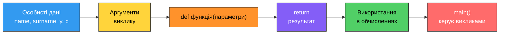

# 11. (П5) Написання та використання функцій у Python

## Мета роботи

Навчитися оголошувати власні функції через `def`, передавати їм дані параметрами, повертати результат оператором `return`, користуватися значеннями за замовчуванням та іменованими аргументами й розбивати програму на функції з окремою `main()`.

!!! danger "Персоналізація обов'язкова"
    Кожна функція має працювати з **вашими справжніми даними**: ім'ям, прізвищем, групою, роком народження, кількістю літер у прізвищі. Роботи з абстрактними `x = 5`, `text = "abc"` або з даними іншого студента не приймаються.

## Підготовка

Кожне завдання виконуйте в **окремому файлі**: `task1.py`, `task2.py`, `task3.py`, `task4.py`.

### Ваші персональні дані

Перш ніж почати, випишіть ці значення — вони знадобляться в усіх завданнях.

| Позначення | Звідки береться | Завдання |
|---|---|---|
| `name` | ваше ім'я латиницею | 1, 3, 4 |
| `surname` | ваше прізвище латиницею | 1, 3 |
| `group` | ваша група | 1, 4 |
| `y` | рік вашого народження | 1, 2 |
| `c` | кількість літер у вашому прізвищі латиницею | 3 |
| `n` | кількість літер у вашому імені латиницею (мінімум 3) | 4 |
| оцінки | ваші реальні бали за `n` предметів | 4 |



## Хід роботи

### Завдання 1. Візитка: від функції без параметрів до функції з параметрами

Файл `task1.py`.

1. Напишіть функцію `print_card()` **без параметрів**, яка друкує ваше ім'я, прізвище, групу та рік народження. Викличте її **тричі**.
2. Нижче напишіть другу функцію `print_card_args(name, surname, group, year)` — ті самі дані, але передані параметрами. Викличте її **трьома** способами:

    - лише позиційними аргументами;
    - лише іменованими аргументами (у довільному порядку);
    - змішано: перші два позиційно, решта — за іменами.

3. Задайте параметру `group` **значення за замовчуванням** (вашу групу) і покажіть виклик, у якому групу не передають. Пам'ятайте: параметри зі значеннями за замовчуванням стоять **після** звичайних.
4. Спробуйте викликати `print_card_args("Ivan")` і запишіть **точний текст помилки**.
5. Спробуйте написати виклик `print_card_args(name="Ivan", "Petrenko")` і запишіть, на якому етапі (запуск чи виконання) виникає помилка.

Приклад роботи програми:

```text
Ivan Petrenko, PZ-11
--- no parameters, call 1 ---
Name: Ivan Petrenko
Group: PZ-11
Birth year: 2007
--- no parameters, call 2 ---
Name: Ivan Petrenko
Group: PZ-11
Birth year: 2007
--- no parameters, call 3 ---
Name: Ivan Petrenko
Group: PZ-11
Birth year: 2007
--- positional arguments ---
Ivan Petrenko, PZ-11, 2007
--- keyword arguments ---
Ivan Petrenko, PZ-11, 2007
--- default group ---
Ivan Petrenko, PZ-11, 2007
```

### Завдання 2. `print` проти `return`

Файл `task2.py`.

1. Напишіть **дві** функції, які працюють з вашим роком народження `y`:

    - `print_age(year)` — друкує вік і **нічого не повертає**;
    - `get_age(year, current_year=2026)` — вік **повертає**.

2. Викличте обидві. Виведіть `print(print_age(y))` і поясніть, звідки в результаті взялося `None`.
3. Використайте результат `get_age` в обчисленнях: виведіть свій вік у **місяцях** і в **тижнях**.
4. Скориставшись параметром `current_year`, обчисліть, скільки вам буде років у 2030.
5. Спробуйте зробити те саме з `print_age`: напишіть `print_age(y) * 12`. Запишіть **точний текст помилки** й поясніть її одним реченням.
6. Додайте до `get_age` перевірку на початку: якщо `year` більший за `current_year` або від'ємний — функція **одразу** повертає `-1` (ранній вихід через `return`). Перевірте це на значенні `3000`.
7. Після `return` у `get_age` допишіть рядок `print("after return")` і поясніть, чому він не виконується.

Приклад роботи програми:

```text
Ivan Petrenko, PZ-11
Age: 19
print_age returned: None
Age from get_age: 19
Age in months: 228
Age in weeks: 988
Age in 2030: 23
Invalid year 3000 gives: -1
```

### Завдання 3. Бібліотека функцій для вашого прізвища

Файл `task3.py`.

Усі функції в цьому завданні мають **анотації типів**.

1. `get_initials(name: str, surname: str) -> str` — повертає ініціали у вигляді `I.P.`.
2. `count_letters(text: str, letter: str = "a") -> int` — повертає кількість входжень символу `letter` у `text` **без урахування регістру**. Другий параметр має значення за замовчуванням `"a"`.
3. `count_vowels(text: str) -> int` — повертає кількість голосних (`a`, `e`, `i`, `o`, `u`, `y`).
4. `reverse_text(text: str) -> str` — повертає рядок у зворотному порядку (циклом, без зрізів).
5. У основній частині програми:

    - виведіть своє повне ім'я та ініціали;
    - виведіть довжину прізвища `c`, кількість голосних і приголосних (приголосні порахуйте **через** дві попередні функції, не пишучи третій цикл);
    - у циклі по рядку `"aeiou"` виведіть, скільки разів кожна голосна трапляється у вашому прізвищі — використайте `count_letters` з іменованим аргументом;
    - покажіть виклик `count_letters(surname)` **без** другого аргументу;
    - виведіть перевернуте прізвище;
    - додайте до `count_letters` docstring і виведіть його через `count_letters.__doc__`, а анотації — через `count_letters.__annotations__`.

Приклад роботи програми:

```text
Ivan Petrenko, PZ-11
Initials: I.P.
Letters in surname: 8
Vowels: 3, consonants: 5
a: 0
e: 2
i: 0
o: 1
u: 0
Default letter 'a': 0
Reversed surname: oknorteP
Docstring: Return how many times letter occurs in text.
Annotations: {'text': <class 'str'>, 'letter': <class 'str'>, 'return': <class 'int'>}
```

### Завдання 4. Розбиття програми на функції

Файл `task4.py`.

Візьміть звіт про власні оцінки й побудуйте програму **виключно** з функцій: жодного коду верхнього рівня, крім визначень і одного виклику `main()`.

1. `read_grade(prompt)` — циклом `while True` запитує оцінку, доки не введено ціле число від `0` до `100`; повертає її. Некоректне введення пояснює користувачеві та запитує ще раз.
2. `to_letter(grade)` — повертає буквену оцінку (`A`–`F`) за шкалою з практичної роботи 3. Використайте **кілька `return`** замість `elif`.
3. `average(grades)` — повертає середнє арифметичне списку оцінок.
4. `count_above(grades, limit)` — повертає, скільки оцінок **більші** за `limit`.
5. `print_report(name, group, grades)` — друкує звіт: список оцінок, середнє з двома знаками після коми та буквену оцінку, найкращий і найгірший бали, кількість оцінок вище середнього. Усередині викликає `average`, `to_letter` і `count_above`.
6. `main()` — задає ваше ім'я та групу, у циклі читає `n` оцінок (`n` — кількість літер у вашому імені, мінімум 3) і викликає `print_report`.
7. Останній рядок файлу — `main()`.

Вимоги: кожна функція має **одну** відповідальність (читає **або** рахує **або** друкує) і власний docstring.

**Питання:** порівняйте цю програму з аналогічною програмою без функцій із практичної роботи 4 — які три конкретні переваги ви бачите?

Приклад роботи програми:

```text
Ivan Petrenko, PZ-11
Grade 1 (0-100): 90
Grade 2 (0-100): abc
Error: digits only
Grade 2 (0-100): 84
Grade 3 (0-100): 120
Error: the value must be between 0 and 100
Grade 3 (0-100): 77
Grade 4 (0-100): 95
--- Report ---
Student: Ivan Petrenko, group PZ-11
Grades: 90 84 77 95
Average: 86.50 -> B
Best: 95, worst: 77
Above average: 2
```

## Що здати

1. Файли `task1.py` … `task4.py` з **власними** даними.
2. Знімки екрана з виводом кожної програми (перший рядок виводу — ваше ім'я та група).
3. Звіт із точними текстами помилок із завдань 1 і 2 та відповіддю на питання до завдання 4.
