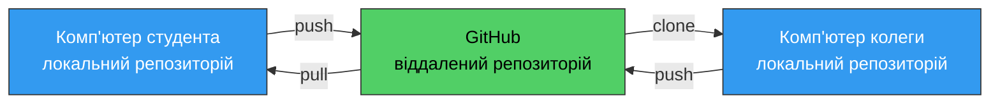
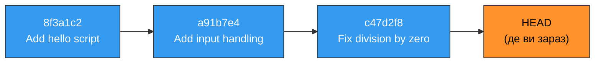
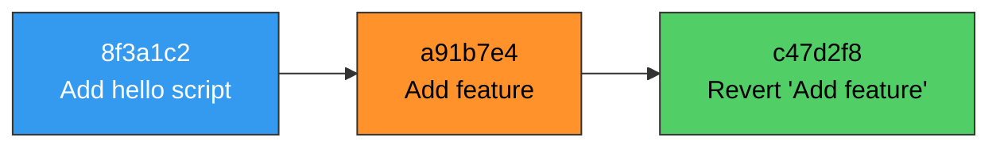
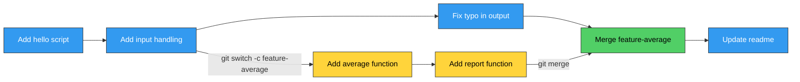
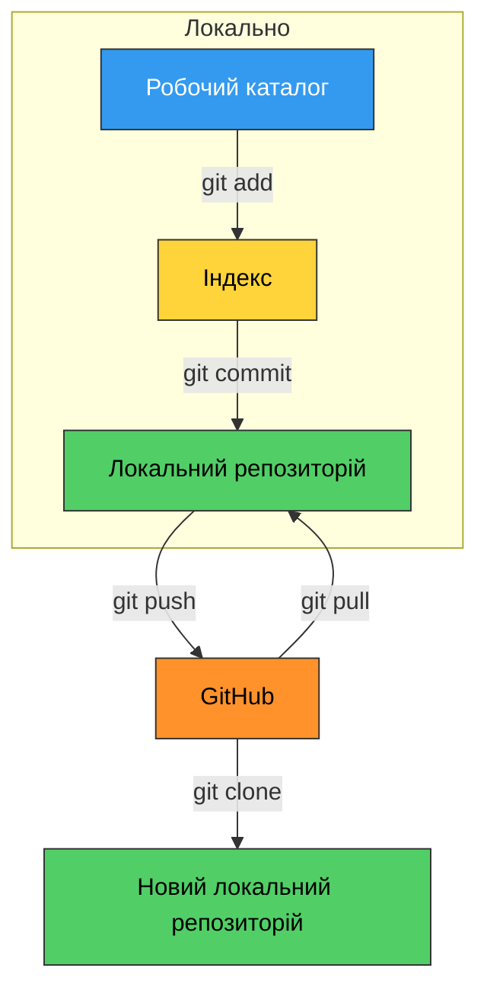
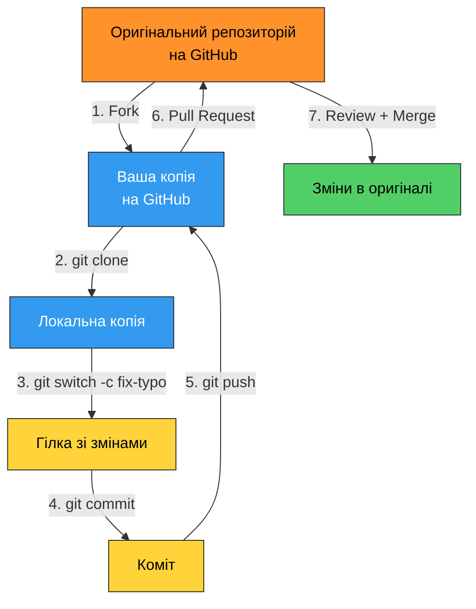

# 12. (Л) Основи роботи з Git та GitHub. Система контролю версій, репозиторії, коміти, запит на злиття, віддалена співпраця

## Зміст лекції

1. Навіщо потрібен контроль версій
2. Що таке система контролю версій
3. Встановлення та початкове налаштування Git
4. Репозиторій: `git init`
5. Три зони та стани файлу
6. Перший коміт
7. Перегляд історії: `status`, `log`, `diff`
8. Ігнорування файлів: `.gitignore`
9. Скасування змін
10. Гілки
11. Злиття гілок і конфлікти
12. GitHub: віддалений репозиторій
13. Автентифікація: SSH-ключ
14. `push`, `pull`, `clone`
15. Fork і запит на злиття (Pull Request)
16. Типовий процес віддаленої співпраці
17. Типові помилки

## Навіщо потрібен контроль версій

Уявіть звичну ситуацію: ви пишете практичну роботу і хочете спробувати інший підхід, але боїтеся зламати те, що вже працює. Найпростіше рішення — скопіювати файл. За тиждень каталог виглядає так:

```text
practice5.py
practice5_new.py
practice5_new_fixed.py
practice5_final.py
practice5_final_v2.py
practice5_final_FINAL.py
```

Наступного дня ви вже не пам'ятаєте, у якому з файлів робочий варіант, чим `_fixed` відрізняється від `_v2` і що саме ви змінювали. А якщо над проєктом працюють двоє — вони ще й надсилають один одному архіви поштою й вручну зводять правки докупи.

Проблеми, які тут виникають:

| Проблема | Прояв |
|---|---|
| **Втрата історії** | неможливо дізнатися, яким код був тиждень тому |
| **Немає пояснень** | незрозуміло, навіщо була зроблена та чи інша зміна |
| **Неможливо відкотитися** | зламали робочий код — і назад дороги немає |
| **Конфлікти при співпраці** | двоє правлять один файл, чиясь робота зникає |
| **Немає резервної копії** | зламався диск — зник увесь проєкт |

**Система контролю версій** розв'язує всі ці проблеми одразу: вона зберігає повну історію проєкту, дозволяє повернутися до будь-якого стану, показує, хто і що змінив, і дає кільком людям працювати над одним кодом без хаосу.

!!! info "Це не лише про код"
    Ту саму ідею використовують для документації, конфігурацій, наукових статей і навіть законів. Наприклад, цей курс — теж репозиторій на GitHub, і кожне виправлення в тексті лекції зафіксоване як окрема зміна.

## Що таке система контролю версій

**Система контролю версій (VCS, Version Control System)** — це програма, яка зберігає послідовні стани файлів проєкту та інформацію про те, хто, коли і навіщо їх змінив.

**Git** — найпоширеніша сьогодні система контролю версій. Її створив у 2005 році Лінус Торвальдс для розробки ядра Linux.

Ключові властивості Git:

- **Розподілена** — у кожного учасника є повна копія історії проєкту, а не лише остання версія. Працювати можна навіть без інтернету.
- **Швидка** — майже всі операції виконуються локально, без звернення до сервера.
- **Знімками, а не різницями** — Git зберігає стан усього проєкту на момент кожної фіксації.

Одразу розмежуємо два поняття, які часто плутають:

| Git | GitHub |
|---|---|
| Програма, що працює на вашому комп'ютері | Вебсервіс для зберігання Git-репозиторіїв |
| Безкоштовна, з відкритим кодом | Комерційний сервіс (з безкоштовним тарифом) |
| Працює без інтернету | Потрібен інтернет |
| Створена Лінусом Торвальдсом | Компанія, яка належить Microsoft |



## Встановлення та початкове налаштування Git

Ці два кроки роблять один раз, тому не переказуємо їх у лекції — офіційні інструкції завжди актуальніші:

| Крок | Де читати |
|---|---|
| Встановлення Git | [Pro Git: Інсталяція Git](https://git-scm.com/book/uk/v2/%d0%92%d1%81%d1%82%d1%83%d0%bf-%d0%86%d0%bd%d1%81%d1%82%d0%b0%d0%bb%d1%8f%d1%86%d1%96%d1%8f-Git) · [сторінка завантаження](https://git-scm.com/downloads) |
| Ім'я, пошта та інші налаштування | [Pro Git: Початкове налаштування Git](https://git-scm.com/book/uk/v2/%d0%92%d1%81%d1%82%d1%83%d0%bf-%d0%9f%d0%be%d1%87%d0%b0%d1%82%d0%ba%d0%be%d0%b2%d0%b5-%d0%bd%d0%b0%d0%bb%d0%b0%d1%88%d1%82%d1%83%d0%b2%d0%b0%d0%bd%d0%bd%d1%8f-Git) · [документація `git config`](https://git-scm.com/docs/git-config) |
| Обліковий запис GitHub | [GitHub Docs: Creating an account](https://docs.github.com/en/get-started/start-your-journey/creating-an-account-on-github) |

Перед тим як рухатися далі, переконайтеся, що виконано три речі:

```bash
git --version                   # Git встановлений
git config user.name            # ім'я вказане
git config user.email           # пошта вказана
```

```text
git version 2.43.0
Ivan Petrenko
ivan.petrenko@example.com
```

!!! danger "Без імені та пошти коміт не зробити"
    Git підписує кожну зміну автором, тому доки `user.name` і `user.email` не задані, `git commit` завершиться помилкою `Author identity unknown`. Вкажіть **ту саму** адресу, з якою зареєстрований ваш акаунт на GitHub, — інакше ваші коміти на сайті не будуть пов'язані з вашим профілем.

## Репозиторій: `git init`

**Репозиторій** — це каталог проєкту разом з усією історією його змін. Ваші файли лежать там, де й лежали, а всі службові дані Git тримає окремо — у прихованому підкаталозі `.git`.

Створимо проєкт і перетворимо його на репозиторій:

```bash
mkdir python-practice
cd python-practice
git init
```

```text
Initialized empty Git repository in /home/ivan/python-practice/.git/
```

Перевіримо, що з'явилося:

```bash
ls -a
```

```text
.  ..  .git
```

`.git` — це **службовий каталог**, у якому Git зберігає все, що потрібно йому для роботи:

| Що там лежить | Для чого |
|---|---|
| об'єкти (`objects/`) | збережені версії файлів та самі коміти |
| посилання (`refs/`) | гілки й теґи — вказівники на коміти |
| `HEAD` | у якій гілці ви зараз перебуваєте |
| `index` | вміст індексу — підготовка до наступного коміту |
| `config` | налаштування саме цього репозиторію |

Заглядати туди й тим паче правити щось вручну не потрібно — з усім цим ви працюєте через команди `git`. Важливо лише розуміти дві речі:

- **історія існує лише завдяки цьому каталогу**: видалите `.git` — файли залишаться, але всі коміти, гілки й налаштування зникнуть, і тека знову стане звичайною;
- `.git` лежить **усередині** каталогу проєкту, тому копіювання або переміщення теки проєкту переносить репозиторій разом з історією.

!!! danger "Ніколи не створюйте репозиторій у домашньому каталозі"
    Команда `git init`, виконана в `~` або `/`, змусить Git відстежувати геть усі ваші файли. Завжди спочатку створюйте окремий каталог проєкту й переходьте в нього командою `cd`.

## Стани файлів

- **untracked** — Git бачить файл, але не стежить за ним (новий файл);
- **modified** — файл відстежується й змінений порівняно з останнім комітом;
- **staged** — зміни додані до індексу й чекають на коміт;
- **committed** — зміни збережені в історії.

!!! info "Навіщо потрібен індекс"
    Індекс дозволяє зафіксувати **не все підряд**, а лише пов'язані між собою зміни. Ви виправили помилку в одному файлі й додали нову функцію в іншому — можна зробити два окремі коміти з різними поясненнями, замість одного незрозумілого «зробив усе».

## Перший коміт

Створимо файл програми:

```bash
echo 'print("Hello, Git!")' > hello.py
```

Подивимося, що каже Git:

```bash
git status
```

```text
On branch main

No commits yet

Untracked files:
  (use "git add <file>..." to include in what will be committed)
        hello.py

nothing added to commit but untracked files present (use "git add" to track)
```

Git помітив новий файл, але поки не стежить за ним. Додамо його до індексу:

```bash
git add hello.py
git status
```

```text
On branch main

No commits yet

Changes to be committed:
  (use "git rm --cached <file>..." to unstage)
        new file:   hello.py
```

Тепер фіксуємо зміни — робимо **коміт**:

```bash
git commit -m "Add hello script"
```

```text
[main (root-commit) 8f3a1c2] Add hello script
 1 file changed, 1 insertion(+)
 create mode 100644 hello.py
```

**Коміт** — це збережений знімок стану проєкту разом із метаданими. Кожен коміт містить:

| Складова | Приклад |
|---|---|
| **Хеш** (унікальний ідентифікатор) | `8f3a1c2d4e5f6a7b8c9d0e1f2a3b4c5d6e7f8a9b` |
| **Автор і дата** | `Ivan Petrenko <ivan.petrenko@example.com>, 2026-09-03` |
| **Повідомлення** | `Add hello script` |
| **Посилання на попередній коміт** | хеш батьківського коміту |
| **Знімок файлів** | стан усього проєкту на цей момент |

Коміти утворюють ланцюжок, де кожен знає свого попередника:



**HEAD** — це вказівник на коміт, у якому ви зараз перебуваєте. Зазвичай це останній коміт поточної гілки.

### Як писати повідомлення до коміту

Повідомлення пишуть **англійською**, у наказовому способі, теперішньому часі — воно відповідає на питання «що зробить цей коміт, якщо його застосувати».

| Погано | Добре |
|---|---|
| `fix` | `Fix crash on empty input` |
| `changes` | `Add average grade calculation` |
| `asdf` | `Remove unused variables` |
| `зробив практичну` | `Add practice 5 solution` |
| `Added new function and fixed bug and updated readme` | три окремі коміти |

Правила, яких дотримуються майже всюди:

- перший рядок — до 50 символів, без крапки в кінці;
- один коміт — одна логічно завершена зміна;
- якщо потрібні подробиці, після порожнього рядка додають детальний опис.

!!! warning "Коміт «на всяк випадок» наприкінці дня"
    Коміт `Work in progress` за понеділок нікому не допоможе через місяць. Фіксуйте зміни тоді, коли завершили окремий шматок роботи, і описуйте його по суті.

### Скорочення

Якщо всі змінені файли треба додати одразу:

```bash
git add .
```

Крапка означає «поточний каталог з усім вмістом». Для вже відстежуваних файлів можна поєднати `add` і `commit`:

```bash
git commit -am "Update output format"
```

!!! danger "`git add .` вимагає уваги"
    Ця команда додає **все**, зокрема випадково створені файли, тимчасові дані та паролі. Завжди спочатку виконуйте `git status` і дивіться, що саме потрапить у коміт.

## Перегляд історії: `status`, `log`, `diff`

### `git status` — що відбувається зараз

Найчастіше вживана команда. Виконуйте її перед кожним `add` і `commit`.

```bash
git status
```

```text
On branch main
Changes not staged for commit:
  (use "git add <file>..." to update what will be committed)
  (use "git restore <file>..." to discard changes in working directory)
        modified:   hello.py

Untracked files:
        notes.txt

no changes added to commit (use "git add" and/or "git commit -a")
```

### `git log` — історія комітів

```bash
git log
```

```text
commit c47d2f8b9a0e1f2d3c4b5a6978899aabbccddeef (HEAD -> main)
Author: Ivan Petrenko <ivan.petrenko@example.com>
Date:   Wed Sep 3 10:41:12 2026 +0300

    Fix division by zero

commit a91b7e4c5d6f7089a1b2c3d4e5f60718293a4b5c
Author: Ivan Petrenko <ivan.petrenko@example.com>
Date:   Wed Sep 3 10:22:05 2026 +0300

    Add input handling
```

Компактний вигляд, який використовують найчастіше:

```bash
git log --oneline --graph --all
```

```text
* c47d2f8 (HEAD -> main) Fix division by zero
* a91b7e4 Add input handling
* 8f3a1c2 Add hello script
```

!!! info "Вихід із перегляду"
    Якщо історія довга, Git відкриває її в програмі-переглядачі. Гортати — стрілками, вийти — клавіша **q**.

### `git diff` — що саме змінилося

```bash
git diff
```

```text
diff --git a/hello.py b/hello.py
index 3b18e51..b6fc4c6 100644
--- a/hello.py
+++ b/hello.py
@@ -1 +1,2 @@
-print("Hello, Git!")
+name = input("Your name: ")
+print(f"Hello, {name}!")
```

Рядки з `-` вилучені, з `+` — додані. Варіанти команди:

| Команда | Що показує |
|---|---|
| `git diff` | зміни в робочому каталозі, ще не додані до індексу |
| `git diff --staged` | зміни, вже додані до індексу |
| `git diff HEAD` | усі зміни від останнього коміту |
| `git show c47d2f8` | вміст конкретного коміту |

## Ігнорування файлів: `.gitignore`

У проєкті завжди є файли, яким не місце в репозиторії: кеш інтерпретатора, віртуальне середовище, налаштування редактора, паролі. Їх перелічують у файлі `.gitignore` у корені проєкту.

Створіть у корені проєкту файл `.gitignore` з таким вмістом:

```text
# кеш інтерпретатора Python
__pycache__/
*.pyc

# віртуальне середовище
env/
.venv/

# налаштування редактора
.vscode/
.idea/

# локальні дані та секрети
*.log
.env
```

Після цього Git перестане показувати такі файли в `git status`.

| Шаблон | Що ігнорує |
|---|---|
| `*.log` | усі файли з розширенням `.log` |
| `env/` | увесь каталог `env` |
| `secret.txt` | конкретний файл |
| `!important.log` | виняток: цей файл не ігнорувати |

Сам файл `.gitignore` **потрібно** закомітити — він частина проєкту:

```bash
git add .gitignore
git commit -m "Add gitignore for Python project"
```

!!! danger "Ніколи не комітьте паролі та ключі"
    Видалити секрет із історії Git дуже складно: навіть після видалення файлу він залишається в старих комітах, а якщо репозиторій публічний — його вже могли скопіювати. Паролі, токени та ключі API тримають у файлі `.env`, який завжди перелічений у `.gitignore`.

!!! warning "`.gitignore` не діє на вже відстежувані файли"
    Якщо файл потрапив у коміт раніше, додавання його до `.gitignore` нічого не змінить. Спочатку приберіть його з-під нагляду: `git rm --cached secret.txt`.

## Скасування змін

Найцінніша можливість системи контролю версій — повернути все як було. Команда залежить від того, наскільки далеко зайшла зміна.

| Ситуація | Команда |
|---|---|
| Зіпсував файл, коміту ще не було | `git restore hello.py` |
| Додав до індексу зайвий файл | `git restore --staged notes.txt` |
| Помилка в повідомленні останнього коміту | `git commit --amend -m "Correct message"` |
| Забув додати файл в останній коміт | `git add forgotten.py && git commit --amend --no-edit` |
| Треба скасувати давній коміт | `git revert c47d2f8` |
| Подивитися стан проєкту в старому коміті | `git checkout c47d2f8` |

```bash
git restore hello.py
git status
```

```text
On branch main
nothing to commit, working tree clean
```

`git revert` не стирає історію, а створює **новий** коміт, який скасовує зміни зазначеного:



!!! danger "`git reset --hard` знищує роботу назавжди"
    Ця команда безповоротно видаляє незакомічені зміни в робочому каталозі. Використовуйте її, лише якщо точно розумієте, що втратите. Для скасування вже опублікованих комітів завжди беріть `git revert` — він безпечний для тих, хто вже завантажив вашу історію.

!!! info "Закомічене майже неможливо втратити"
    Якщо зміни потрапили в коміт, їх практично завжди можна знайти — навіть після невдалих експериментів. У цьому допомагає `git reflog`, журнал усіх переміщень HEAD. Тому просте правило: **комітьте частіше**.

## Гілки

**Гілка (branch)** — це незалежна лінія розробки. Вона дозволяє працювати над новою можливістю, не чіпаючи робочу версію програми.

Технічно гілка — це просто рухомий вказівник на коміт. Тому створення гілки в Git миттєве й нічого не копіює.

Типова ситуація: основна гілка `main` містить робочий код, а нову функцію ви пишете в окремій гілці.



Верхня лінія — гілка `main`, нижня — `feature-average`. Гілка відгалужується від того коміту, який існував на момент її створення, і повертається в `main` під час злиття.

### Команди для роботи з гілками

```bash
git branch                          # список гілок
git switch -c feature-average       # створити гілку й перейти до неї
git switch main                     # повернутися до main
git branch -d feature-average       # видалити злиту гілку
```

```bash
git branch
```

```text
  feature-average
* main
```

Зірочка позначає поточну гілку.

!!! info "`switch` чи `checkout`"
    У старих матеріалах ви побачите `git checkout -b feature-average`. Ця команда працює й досі, але сучасний Git має дві окремі, зрозуміліші команди: `git switch` — для гілок, `git restore` — для файлів. Використовуйте їх.

Навіщо потрібні гілки:

- **Ізоляція** — експеримент не ламає робочу версію в `main`;
- **Паралельна робота** — кожен учасник команди працює у своїй гілці;
- **Огляд коду** — гілку зручно перевіряти цілком перед злиттям;
- **Легке скасування** — невдалу ідею просто видаляють разом із гілкою.

## Злиття гілок і конфлікти

Коли робота в гілці завершена, її **зливають** (merge) в основну. Для цього переходять у гілку-приймач і викликають `git merge`:

```bash
git switch main
git merge feature-average
```

```text
Updating a91b7e4..d5e8f01
Fast-forward
 average.py | 8 ++++++++
 1 file changed, 8 insertions(+)
```

Після злиття гілку зазвичай видаляють:

```bash
git branch -d feature-average
```

### Конфлікт злиття

**Конфлікт** виникає, коли в двох гілках змінено **той самий рядок** того самого файлу. Git не може вирішити, чия версія правильна, і просить розібратися людину.

```bash
git merge feature-average
```

```text
Auto-merging greet.py
CONFLICT (content): Merge conflict in greet.py
Automatic merge failed; fix conflicts and then commit the result.
```

Git позначає проблемне місце прямо у файлі:

```python
name = input("Your name: ")
<<<<<<< HEAD
print(f"Hello, {name}!")
=======
print(f"Welcome, {name}!")
>>>>>>> feature-average
```

Читається це так:

| Маркер | Значення |
|---|---|
| `<<<<<<< HEAD` | початок вашої версії (поточна гілка) |
| `=======` | межа між версіями |
| `>>>>>>> feature-average` | кінець версії з гілки, яку зливають |

Розв'язати конфлікт — означає **вручну** відредагувати файл: залишити потрібний варіант (або скласти новий) і **обов'язково прибрати всі маркери**:

```python
name = input("Your name: ")
print(f"Welcome, {name}!")
```

Далі повідомляємо Git, що конфлікт вичерпано:

```bash
git add greet.py
git commit -m "Merge feature-average into main"
```

```text
[main 6b2c9a3] Merge feature-average into main
```

!!! warning "Маркери — це не код"
    Якщо забути прибрати `<<<<<<<` і `=======`, програма впаде з `SyntaxError`. Після розв'язання конфлікту завжди запускайте програму й перевіряйте, що вона працює.

!!! info "Як конфліктувати рідше"
    Конфлікти — нормальна частина роботи, а не аварія. Але їх стає менше, якщо: частіше забирати зміни з `main` (`git pull`), робити невеликі коміти й домовлятися в команді, хто які файли зараз править.

## GitHub: віддалений репозиторій

Локальний репозиторій живе лише на вашому комп'ютері. **Віддалений репозиторій (remote)** — його копія на сервері, доступна з будь-якого пристрою й іншим людям.

Що дає GitHub:

- резервну копію проєкту;
- доступ до коду з будь-якого комп'ютера;
- спільну роботу з іншими;
- огляд коду через запити на злиття;
- публічне портфоліо (роботодавці справді його дивляться);
- безкоштовний хостинг сайтів через GitHub Pages.

### Створення репозиторію на GitHub

1. Зареєструйтеся на [github.com](https://github.com/).
2. Натисніть **New repository**.
3. Вкажіть назву латиницею без пробілів, наприклад `python-practice`.
4. Оберіть **Public** (публічний) або **Private** (приватний).
5. Не додавайте README, якщо збираєтесь підключити вже наявний локальний репозиторій — так простіше.
6. Натисніть **Create repository**.

## Автентифікація: SSH-ключ

Щоб GitHub дозволив вам записувати зміни, він має переконатися, що це справді ви. Пароль для цього давно не використовується. Є два способи: персональний токен (Personal Access Token) для протоколу HTTPS і SSH-ключ. Розглянемо SSH — його налаштовують один раз і більше про нього не згадують.

**Ідея:** ви створюєте пару ключів. **Приватний** ключ залишається на вашому комп'ютері й нікому не показується. **Публічний** ключ ви завантажуєте на GitHub. Сервер перевіряє відповідність — і пускає без пароля.

Створення ключа:

```bash
ssh-keygen -t ed25519 -C "ivan.petrenko@example.com"
```

```text
Generating public/private ed25519 key pair.
Enter file in which to save the key (/home/ivan/.ssh/id_ed25519):
Enter passphrase (empty for no passphrase):
Your identification has been saved in /home/ivan/.ssh/id_ed25519
Your public key has been saved in /home/ivan/.ssh/id_ed25519.pub
```

На всі три питання достатньо натиснути **Enter** (парольна фраза необов'язкова, але додає захисту).

Показуємо **публічний** ключ:

```bash
cat ~/.ssh/id_ed25519.pub
```

```text
ssh-ed25519 AAAAC3NzaC1lZDI1NTE5AAAAIExampleKeyValueHere ivan.petrenko@example.com
```

Копіюємо весь рядок і на GitHub переходимо: **Settings → SSH and GPG keys → New SSH key**, вставляємо, зберігаємо.

Перевірка:

```bash
ssh -T git@github.com
```

```text
Hi ivan-petrenko! You've successfully authenticated, but GitHub does not provide shell access.
```

!!! danger "Файл без розширення `.pub` — приватний"
    `id_ed25519.pub` — публічний ключ, його можна показувати. `id_ed25519` без `.pub` — **приватний**, його не надсилають нікому й ніколи не комітять у репозиторій.

## `push`, `pull`, `clone`

### Підключення віддаленого репозиторію

Після створення репозиторію GitHub показує його адресу. Прив'язуємо її до локального репозиторію під стандартним іменем `origin`:

```bash
git remote add origin git@github.com:ivan-petrenko/python-practice.git
git remote -v
```

```text
origin  git@github.com:ivan-petrenko/python-practice.git (fetch)
origin  git@github.com:ivan-petrenko/python-practice.git (push)
```

### `git push` — вивантажити зміни

```bash
git push -u origin main
```

```text
Enumerating objects: 6, done.
Counting objects: 100% (6/6), done.
Writing objects: 100% (6/6), 512 bytes | 512.00 KiB/s, done.
To github.com:ivan-petrenko/python-practice.git
 * [new branch]      main -> main
branch 'main' set up to track 'origin/main'.
```

Прапорець `-u` потрібен лише першого разу: він запам'ятовує зв'язок між локальною гілкою й гілкою на сервері. Надалі достатньо:

```bash
git push
```

### `git pull` — забрати зміни

```bash
git pull
```

```text
remote: Enumerating objects: 5, done.
Updating a91b7e4..f28c103
Fast-forward
 average.py | 3 ++-
 1 file changed, 2 insertions(+), 1 deletion(-)
```

`git pull` завантажує зміни з сервера і одразу зливає їх із вашою гілкою. Якщо ви хочете лише подивитися, що нового, не зливаючи, використовують `git fetch`.

### `git clone` — отримати чужий репозиторій

```bash
git clone git@github.com:ivan-petrenko/python-practice.git
cd python-practice
```

```text
Cloning into 'python-practice'...
remote: Enumerating objects: 12, done.
Receiving objects: 100% (12/12), done.
```

`clone` створює каталог, завантажує **всю історію** проєкту й автоматично налаштовує `origin`. Виконувати `git init` після цього не треба.



## Fork і запит на злиття (Pull Request)

Ви не можете просто так записувати зміни в чужий репозиторій — інакше будь-хто зіпсував би будь-який проєкт. Натомість існує ввічливий механізм: **запит на злиття**.

**Fork** — це ваша особиста копія чужого репозиторію на GitHub. З нею ви робите що завгодно.

**Pull Request (PR)** — «запит на злиття»: пропозиція власникові оригінального проєкту взяти ваші зміни до себе. Це не команда Git, а можливість GitHub.



Покроково:

1. На сторінці чужого репозиторію натискаєте **Fork**.
2. Клонуєте **свою** копію:

    ```bash
    git clone git@github.com:ivan-petrenko/awesome-project.git
    cd awesome-project
    ```

3. Створюєте гілку під конкретну зміну:

    ```bash
    git switch -c fix-typo-in-readme
    ```

4. Правите файли й фіксуєте зміни:

    ```bash
    git add README.md
    git commit -m "Fix typo in installation section"
    ```

5. Вивантажуєте гілку у свою копію на GitHub:

    ```bash
    git push -u origin fix-typo-in-readme
    ```

6. GitHub покаже кнопку **Compare & pull request**. Натискаєте, пишете заголовок і опис — що змінено й навіщо — і надсилаєте.
7. Власник проєкту переглядає зміни, залишає коментарі, просить щось виправити або натискає **Merge pull request**.

Якщо після зауважень потрібно щось доправити, ви просто робите новий коміт у тій самій гілці й виконуєте `git push` — запит на злиття оновиться автоматично.

!!! info "Що таке огляд коду"
    Розділ **Files changed** у запиті на злиття показує всі зміни порядково, і будь-хто може прокоментувати конкретний рядок. Саме так у командах знаходять помилки до того, як вони потраплять у робочу версію. У навчанні це теж корисно: попросіть однокурсника переглянути ваш PR.

!!! warning "Один PR — одна зміна"
    Запит, у якому одночасно виправлена помилка, доданий новий розділ і переформатовано весь файл, дуже важко переглядати. Робіть окремий PR для кожної логічно завершеної зміни.

## Типовий процес віддаленої співпраці

Зберемо все докупи. Так виглядає звичайний робочий день у команді (і той самий процес підходить для навчального проєкту вдвох-утрьох):

```bash
# 1. забрати останні зміни колег
git switch main
git pull

# 2. створити гілку під свою задачу
git switch -c add-grade-report

# 3. писати код, періодично фіксуючи завершені шматки
git status
git add report.py
git commit -m "Add grade report function"

# 4. вивантажити гілку на GitHub
git push -u origin add-grade-report

# 5. відкрити Pull Request, дочекатися огляду й злиття

# 6. повернутися до main і оновитися
git switch main
git pull
git branch -d add-grade-report
```

Правила, які роблять співпрацю безболісною:

| Правило | Чому |
|---|---|
| Починати день із `git pull` | менше конфліктів під час злиття |
| Не працювати безпосередньо в `main` | `main` завжди має містити робочий код |
| Одна гілка — одна задача | легше переглядати й скасовувати |
| Комітити часто, дрібно | простіше знайти, де саме зламалося |
| Писати зрозумілі повідомлення | історія стає документацією проєкту |
| Не переписувати опубліковану історію | інакше зламаєте роботу колегам |

## Шпаргалка команд

| Команда | Дія |
|---|---|
| `git init` | створити репозиторій |
| `git clone <url>` | завантажити віддалений репозиторій |
| `git status` | стан робочого каталогу та індексу |
| `git add <file>` | додати зміни до індексу |
| `git commit -m "msg"` | зафіксувати зміни |
| `git log --oneline --graph --all` | компактна історія |
| `git diff` | що змінилося |
| `git restore <file>` | скасувати зміни у файлі |
| `git restore --staged <file>` | прибрати файл з індексу |
| `git branch` | список гілок |
| `git switch -c <name>` | створити гілку й перейти до неї |
| `git switch <name>` | перейти до гілки |
| `git merge <name>` | злити гілку в поточну |
| `git remote -v` | список віддалених репозиторіїв |
| `git push` | вивантажити коміти на сервер |
| `git pull` | забрати зміни з сервера |
| `git revert <hash>` | скасувати коміт новим комітом |

## Типові помилки

| Помилка | Причина | Виправлення |
|---|---|---|
| `fatal: not a git repository` | команда виконана поза репозиторієм | перейти в каталог проєкту або зробити `git init` |
| `Author identity unknown` | не налаштовані ім'я та пошта | `git config --global user.name` і `user.email` |
| `nothing to commit, working tree clean` | забули `git add` або справді немає змін | перевірити `git status` |
| `Permission denied (publickey)` | SSH-ключ не доданий на GitHub | створити ключ і додати його в налаштуваннях |
| `Updates were rejected... fetch first` | на сервері є коміти, яких немає у вас | `git pull`, розв'язати конфлікти, потім `git push` |
| `CONFLICT (content): Merge conflict` | обидві гілки змінили той самий рядок | відредагувати файл, прибрати маркери, `git add` + `git commit` |
| `SyntaxError` після злиття | у файлі залишилися маркери `<<<<<<<` | прибрати маркери й запустити програму |
| `error: pathspec 'main' did not match` | помилка в назві гілки | звірити назву через `git branch` |
| Репозиторій важить сотні мегабайтів | закомічені `env/`, дані, картинки | додати `.gitignore`, прибрати через `git rm --cached` |
| Пароль потрапив у репозиторій | секрет не був у `.gitignore` | негайно змінити пароль, а не лише видалити файл |

## Підсумок

- **Система контролю версій** зберігає історію проєкту, дозволяє повертатися до попередніх станів і працювати над кодом кільком людям одночасно.
- **Git** — програма на вашому комп'ютері, **GitHub** — сервіс для зберігання Git-репозиторіїв в інтернеті. Це різні речі.
- Перед першим комітом обов'язково налаштуйте `user.name` і `user.email`.
- **Репозиторій** — каталог проєкту разом з історією змін; створюється командою `git init` або `git clone`. `.git` — службовий каталог Git усередині проєкту, руками його не чіпають, але саме в ньому живе вся історія.
- Зміни проходять три зони: **робочий каталог** → (`git add`) **індекс** → (`git commit`) **репозиторій**.
- **Коміт** — знімок проєкту з хешем, автором, датою, повідомленням і посиланням на попередній коміт.
- Повідомлення коміту пишуть англійською, наказовим способом і по суті зміни: `Fix crash on empty input`, а не `fix`.
- `git status`, `git log`, `git diff` — три команди, які показують, що відбувається; виконуйте `git status` перед кожним комітом.
- `.gitignore` тримає поза репозиторієм кеш, віртуальне середовище й **секрети**; сам файл комітять.
- Скасувати зміни можна `git restore` (до коміту), `git commit --amend` (останній коміт), `git revert` (безпечно для опублікованої історії).
- **Гілка** — незалежна лінія розробки; створюється миттєво, ізолює експеримент від робочого коду.
- **Конфлікт злиття** виникає, коли дві гілки змінили той самий рядок; його розв'язують вручну, прибираючи маркери `<<<<<<<`, `=======`, `>>>>>>>`.
- `git push` вивантажує коміти на сервер, `git pull` забирає їх звідти, `git clone` створює локальну копію віддаленого репозиторію.
- **Fork** — особиста копія чужого репозиторію; **Pull Request** — запит на злиття ваших змін в оригінальний проєкт із можливістю огляду коду.
- Робочий цикл у команді: `pull` → гілка → коміти → `push` → Pull Request → злиття.

## Корисні посилання

- [Книга Pro Git українською](https://git-scm.com/book/uk/v2) — повний безкоштовний підручник
- [Офіційна документація Git](https://git-scm.com/docs)
- [Learn Git Branching](https://learngitbranching.js.org/?locale=uk) — інтерактивний тренажер гілок у браузері
- [Документація GitHub](https://docs.github.com/en)
- [Генерація SSH-ключа для GitHub](https://docs.github.com/en/authentication/connecting-to-github-with-ssh/generating-a-new-ssh-key-and-adding-it-to-the-ssh-agent)
- [Шаблони .gitignore для різних мов](https://github.com/github/gitignore)
- [Oh Shit, Git!?!](https://ohshitgit.com/) — короткі рецепти для типових аварійних ситуацій

## Домашнє завдання

Мета — завести власний репозиторій із виконаними практичними роботами й навчитися працювати з ним щодня.

1. Встановіть Git і налаштуйте його своїми даними (`user.name`, `user.email` — та сама пошта, що й на GitHub), скориставшись посиланнями з розділу «Встановлення та початкове налаштування Git». Додайте у звіт вивід команди `git config --list`.

2. Створіть каталог `python-practice-<ваше прізвище латиницею>`, виконайте в ньому `git init` і додайте файл `README.md` з вашим іменем, групою та коротким описом репозиторію. Зробіть перший коміт із повідомленням `Add readme`. Наведіть вивід `git status` **до** і **після** коміту.

3. Скопіюйте в репозиторій свої розв'язки практичних робіт 3–5 і закомітьте їх **трьома окремими комітами** — по одному на практичну, зі змістовними повідомленнями. Додайте вивід `git log --oneline`.

4. Створіть `.gitignore`, який ігнорує `__pycache__/`, `*.pyc`, `env/` та `.vscode/`. Переконайтеся, що після цього `git status` чистий, і поясніть одним реченням, чому ці файли не варто зберігати в репозиторії.

5. Зареєструйтеся на GitHub, налаштуйте SSH-ключ, створіть віддалений репозиторій і вивантажте туди свою роботу (`git remote add`, `git push -u origin main`). У звіті вкажіть посилання на репозиторій і додайте вивід `ssh -T git@github.com`.

6. Створіть гілку `add-personal-info`, додайте в ній файл `about.py`, який друкує ваші ім'я, групу та улюблену мову програмування (латиницею). Зафіксуйте зміни, поверніться в `main`, злийте гілку та видаліть її. Наведіть вивід `git log --oneline --graph --all` до і після злиття.

7. **Конфлікт власноруч.** У гілці `main` змініть у `about.py` рядок привітання на один варіант, а в новій гілці `change-greeting` — той самий рядок на інший. Спробуйте злити гілки, отримайте конфлікт, збережіть текст помилки та вміст файлу з маркерами, розв'яжіть конфлікт і закомітьте результат. Опишіть у двох-трьох реченнях, що саме сталося і як ви обрали правильну версію.

8. **Співпраця.** Домовтеся з одногрупником: зробіть fork його репозиторію, створіть гілку, додайте в неї файл `<ваше прізвище>_review.md` із коротким відгуком про його код, вивантажте гілку й відкрийте Pull Request. Він робить те саме з вашим репозиторієм. У звіті наведіть посилання на створений вами PR і знімок екрана сторінки **Files changed**.
