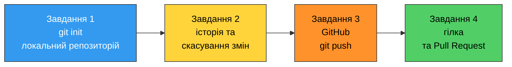

# 13. (П6) Робота з локальним та віддаленим репозиторіями у GitHub

## Мета роботи

Створити власний локальний Git-репозиторій, навчитися фіксувати зміни комітами та скасовувати їх, опублікувати репозиторій на GitHub і оформити **запит на злиття (Pull Request)** через окрему гілку.

!!! danger "Персоналізація обов'язкова"
    Репозиторій, коміти та вміст файлів мають містити **ваші справжні дані**: ім'я, прізвище, групу, ваші розв'язки попередніх практичних робіт. Коміти підписані чужою поштою, скопійовані репозиторії або посилання на чужий профіль GitHub не приймаються.

## Підготовка

1. Git встановлений і налаштований — див. розділ «Встановлення та початкове налаштування Git» у [лекції 12](12-git-lecture.md). Перевірте:

    ```bash
    git --version
    git config user.name
    git config user.email
    ```

2. Створений акаунт на [github.com](https://github.com/) з **тією самою поштою**, що вказана в `git config user.email`.
3. Під рукою — ваші файли з практичних робіт 3, 4 і 5.

### Ваші персональні дані

| Позначення | Звідки береться | Приклад |
|---|---|---|
| `<surname>` | ваше прізвище латиницею, малими літерами | `petrenko` |
| `<name>` | ваше ім'я латиницею | `Ivan` |
| `<group>` | ваша група | `PZ-11` |
| `<login>` | ваш логін на GitHub | `ivan-petrenko` |

Назва репозиторію в усій роботі: **`python-practice-<surname>`** (наприклад, `python-practice-petrenko`).



!!! warning "Знімки екрана обов'язкові"
    Кожне завдання завершується виводом команди або сторінкою GitHub. Робіть знімок екрана **одразу** — відтворити стан репозиторію заднім числом складно.

## Хід роботи

### Завдання 1. Локальний репозиторій і перші коміти

1. Створіть каталог `python-practice-<surname>` і перейдіть у нього. **Не** створюйте репозиторій у домашньому каталозі.

    ```bash
    mkdir python-practice-petrenko
    cd python-practice-petrenko
    git init
    ```

2. Створіть файл `README.md` з такою структурою (замініть на власні дані):

    ```markdown
    # Python practice - Ivan Petrenko

    Student: Ivan Petrenko
    Group: PZ-11
    Course: Python programming, semester 1

    ## Contents

    - practice3 - development environment
    - practice4 - loops
    - practice5 - functions
    ```

3. Виконайте `git status` і **до** першого коміту збережіть його вивід. Знайдіть у ньому слово `Untracked`.
4. Зробіть перший коміт:

    ```bash
    git add README.md
    git commit -m "Add readme with student info"
    ```

5. Створіть каталоги `practice3`, `practice4`, `practice5` і скопіюйте в них **свої** розв'язки відповідних практичних робіт.
6. Зафіксуйте їх **трьома окремими комітами** — по одному на практичну. Повідомлення англійською, у наказовому способі, наприклад:

    ```text
    Add practice 3 solution
    Add practice 4 loop tasks
    Add practice 5 functions
    ```

7. Виведіть історію:

    ```bash
    git log --oneline
    ```

Очікуваний результат:

```text
c47d2f8 (HEAD -> main) Add practice 5 functions
a91b7e4 Add practice 4 loop tasks
5d0c3b1 Add practice 3 solution
8f3a1c2 Add readme with student info
```

**Питання:** чому чотири коміти краще за один коміт `Add all my work`?

### Завдання 2. Історія, `.gitignore` та скасування змін

1. Запустіть будь-яку свою програму з каталогу `practice5` — поряд з'явиться каталог `__pycache__`. Переконайтеся, що `git status` його бачить.
2. Створіть у корені репозиторію файл `.gitignore`:

    ```text
    __pycache__/
    *.pyc
    env/
    .venv/
    .vscode/
    .idea/
    *.log
    ```

3. Виконайте `git status` ще раз і збережіть вивід — `__pycache__` має зникнути зі списку. Закомітьте `.gitignore` окремим комітом `Add gitignore for Python project`.
4. **Скасування незакомічених змін.** Відкрийте `README.md`, зіпсуйте в ньому назву своєї групи, збережіть файл і подивіться, що змінилося:

    ```bash
    git diff
    ```

    Збережіть вивід, потім поверніть файл у попередній стан **однією командою** `git restore README.md` і покажіть, що `git status` знову чистий.

5. **Виправлення останнього коміту.** Додайте до `README.md` рядок зі своєю поштою та зробіть коміт із **навмисно поганим** повідомленням `fix`. Потім виправте це повідомлення:

    ```bash
    git commit --amend -m "Add contact email to readme"
    ```

    Наведіть `git log --oneline` до і після виправлення.

6. **Скасування давнього коміту.** Створіть файл `temp.txt` з будь-яким текстом, закомітьте його (`Add temporary file`), а потім скасуйте цей коміт через `git revert`. Поясніть, чому після `revert` у `git log` **два** коміти, а не жодного, і чи існує файл `temp.txt` після цього.

**Питання:** чим `git restore` відрізняється від `git revert` і коли який застосовують?

### Завдання 3. Публікація на GitHub

1. Налаштуйте SSH-ключ (якщо ще не налаштований):

    ```bash
    ssh-keygen -t ed25519 -C "your.email@example.com"
    cat ~/.ssh/id_ed25519.pub
    ```

    Скопіюйте **публічний** ключ і додайте його на GitHub: **Settings → SSH and GPG keys → New SSH key**.

2. Перевірте зв'язок і збережіть вивід:

    ```bash
    ssh -T git@github.com
    ```

    ```text
    Hi ivan-petrenko! You've successfully authenticated, but GitHub does not provide shell access.
    ```

3. На GitHub створіть **публічний** репозиторій `python-practice-<surname>`. Файли README, `.gitignore` та ліцензію при створенні **не** додавайте — вони у вас уже є локально.
4. Прив'яжіть віддалений репозиторій і вивантажте свою роботу:

    ```bash
    git remote add origin git@github.com:ivan-petrenko/python-practice-petrenko.git
    git remote -v
    git push -u origin main
    ```

5. Відкрийте репозиторій у браузері й перевірте, що там є всі ваші коміти (вкладка **Commits**) і що `__pycache__` **відсутній**.
6. **Перевірка авторства.** Відкрийте будь-який коміт на GitHub. Якщо поруч з іменем немає вашого аватара й посилання на профіль — пошта в `git config user.email` не збігається з поштою акаунта. Виправте налаштування, зробіть новий коміт і покажіть, що тепер авторство визначається правильно.

**Питання:** що станеться з віддаленим репозиторієм, якщо ви видалите каталог проєкту на своєму комп'ютері? А що станеться з локальним, якщо видалити репозиторій на GitHub?

### Завдання 4. Гілка та запит на злиття у власному репозиторії

Тепер додамо нову можливість так, як це роблять у справжніх проєктах: **не** прямо в `main`, а через окрему гілку й Pull Request.

```mermaid
graph LR
    M["main"] -->|"git switch -c add-about"| B["гілка add-about"]
    B -->|"git commit"| C["коміт"]
    C -->|"git push -u origin add-about"| GH["гілка на GitHub"]
    GH -->|"Compare & pull request"| PR["Pull Request"]
    PR -->|"Merge"| M2["main з новим кодом"]

    style M fill:#339af0,stroke:#333,color:#fff
    style B fill:#ffd43b,stroke:#333,color:#000
    style C fill:#ffd43b,stroke:#333,color:#000
    style GH fill:#ff922b,stroke:#333,color:#000
    style PR fill:#845ef7,stroke:#333,color:#fff
    style M2 fill:#51cf66,stroke:#333,color:#000
```



1. Створіть гілку й перейдіть до неї:

    ```bash
    git switch -c add-about
    ```

2. У гілці створіть файл `about.py`, який друкує ваші дані. Програма має бути повноцінною й запускатися з порожнього файлу:

    ```python
    # Program: personal information card
    def main():
        name = "Ivan"
        surname = "Petrenko"
        group = "PZ-11"
        birth_year = 2007
        print(f"Name: {name} {surname}")
        print(f"Group: {group}")
        print(f"Age in 2026: {2026 - birth_year}")
        print("Favourite language: Python")


    main()
    ```

    ```text
    Name: Ivan Petrenko
    Group: PZ-11
    Age in 2026: 19
    Favourite language: Python
    ```

3. Закомітьте файл (`Add personal information script`) і вивантажте гілку:

    ```bash
    git push -u origin add-about
    ```

4. На GitHub натисніть **Compare & pull request**. У запиті вкажіть:

    - **заголовок** англійською, що описує зміну, наприклад `Add personal information script`;
    - **опис**: що додано, як запустити (`python3 about.py`) і який очікуваний вивід.

5. Відкрийте вкладку **Files changed** і зробіть знімок екрана — це те, що бачить рецензент.
6. **Доопрацювання за зауваженням.** Не зливаючи запит, додайте в `about.py` ще один рядок виводу (наприклад, кількість літер у вашому прізвищі), закомітьте та виконайте `git push`. Оновіть сторінку PR і покажіть, що там **автоматично** з'явився другий коміт.
7. Натисніть **Merge pull request**, потім **Delete branch** на GitHub.
8. Поверніться локально в `main`, заберіть зміни й приберіть за собою:

    ```bash
    git switch main
    git pull
    git branch -d add-about
    git log --oneline --graph --all
    ```

