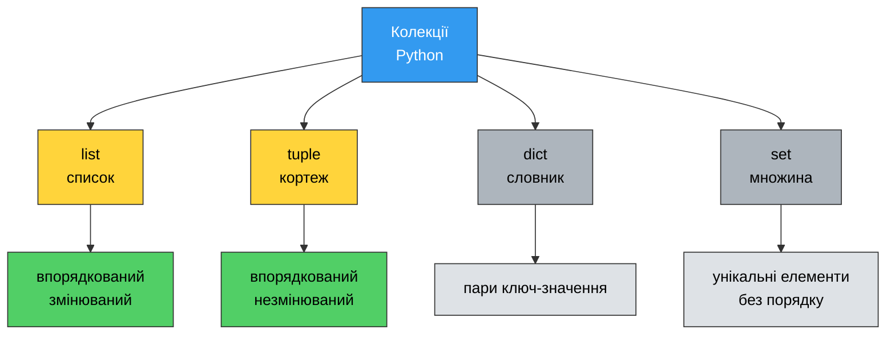
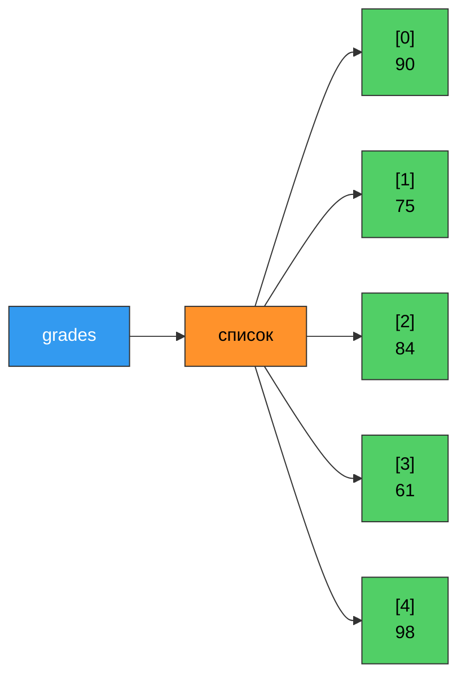
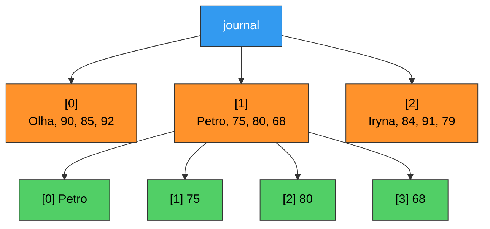
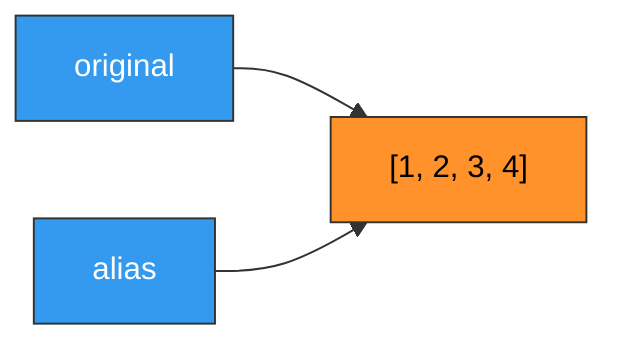
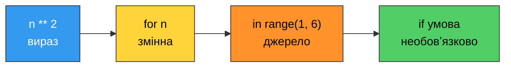

# 14. (Л) Списки та кортежі

## Зміст лекції

1. Навіщо потрібні колекції
2. Список: створення та літерал
3. Індексація елементів
4. Зрізи
5. Зміна списку: список — змінюваний тип
6. Додавання та вилучення елементів
7. Пошук, підрахунок і перевірка входження
8. Агрегатні функції: `len`, `sum`, `min`, `max`
9. Сортування та розвертання
10. Перебір списку в циклі
11. Вкладені списки
12. Копіювання списків
13. Списковий вираз
14. Кортеж: створення та особливості
15. Незмінюваність кортежа
16. Розпакування послідовностей
17. Список чи кортеж: як обрати
18. Приклад: журнал оцінок
19. Типові помилки

## Навіщо потрібні колекції

Уявіть, що потрібно зберегти оцінки студента за семестр. Із тим, що ми знаємо після першого модуля, вихід один:

```python
grade1 = 90
grade2 = 75
grade3 = 84
grade4 = 61
grade5 = 98

average = (grade1 + grade2 + grade3 + grade4 + grade5) / 5
print(f"Average: {average}")
```

```text
Average: 81.6
```

Код працює, але має три непереборні вади:

- **Кількість жорстко зашита.** З'явиться шоста оцінка — доведеться правити програму, а не дані.
- **Немає способу обійти всі значення циклом.** Змінні `grade1`…`grade5` не пов'язані між собою нічим, крім схожих імен; Python не знає, що вони утворюють групу.
- **Кожна операція пишеться вручну.** Знайти максимум із п'яти змінних — це ланцюжок `if`; із сорока — нереально.

**Колекція** — це один об'єкт, який зберігає багато значень і дає доступ до них за номером або ключем. Уся група оцінок стає **однією** змінною:

```python
grades = [90, 75, 84, 61, 98]

print(f"Average: {sum(grades) / len(grades)}")
print(f"Best: {max(grades)}")
print(f"Count: {len(grades)}")
```

```text
Average: 81.6
Best: 98
Count: 5
```

Тепер додавання шостої оцінки — це зміна **даних**, а не коду. Саме тому колекції є в кожній мові програмування: вони перетворюють «багато змінних» на «одну змінну з багатьма значеннями».

### Чотири вбудовані колекції Python



Ця лекція присвячена двом першим — **списку** й **кортежу**. Словники та множини будуть на лекції 16.

## Список: створення та літерал

**Список** (`list`) — впорядкована колекція елементів, яку можна змінювати.

Найпростіший спосіб створити список — записати елементи через кому у квадратних дужках:

```python
# Program: different ways to create a list
grades = [90, 75, 84, 61, 98]
names = ["Olha", "Petro", "Iryna"]
empty = []
mixed = [42, "text", 3.14, True, None]

print(grades)
print(names)
print(empty)
print(mixed)
print(type(grades))
```

```text
[90, 75, 84, 61, 98]
['Olha', 'Petro', 'Iryna']
[]
[42, 'text', 3.14, True, None]
<class 'list'>
```

Зверніть увагу на список `mixed`: у Python елементи **не зобов'язані** бути одного типу. Технічно це дозволено, але на практиці список майже завжди зберігає однорідні дані — оцінки, імена, ціни. Мішанина типів у списку — ознака того, що структуру даних обрано невдало.

### Функція `list()`

Другий спосіб — перетворити на список іншу послідовність:

```python
# Program: build lists from other sequences
letters = list("python")
numbers = list(range(1, 6))
copy_of_list = list([1, 2, 3])

print(letters)
print(numbers)
print(copy_of_list)
```

```text
['p', 'y', 't', 'h', 'o', 'n']
[1, 2, 3, 4, 5]
[1, 2, 3]
```

`list(range(...))` — найшвидший спосіб отримати список чисел. Сам по собі `range` списком **не є**: він лише вміє видавати числа по одному, тому `print(range(5))` покаже `range(0, 5)`, а не числа.

### Список як об'єкт

Список — це один об'єкт, на який посилається змінна. Уся група значень живе в пам'яті разом:



## Індексація елементів

Кожен елемент списку має **індекс** — свій порядковий номер. Нумерація починається з **нуля**, а не з одиниці.

```python
# Program: access list elements by index
grades = [90, 75, 84, 61, 98]

print(grades[0])        # перший елемент
print(grades[2])        # третій елемент
print(grades[4])        # останній елемент
```

```text
90
84
98
```

| Індекс | 0 | 1 | 2 | 3 | 4 |
|---|---|---|---|---|---|
| Значення | 90 | 75 | 84 | 61 | 98 |
| Від'ємний індекс | -5 | -4 | -3 | -2 | -1 |

### Від'ємні індекси

Індекс `-1` означає останній елемент, `-2` — передостанній і так далі. Це зручно, коли довжина списку невідома:

```python
# Program: negative indexing
names = ["Olha", "Petro", "Iryna", "Andrii"]

print(names[-1])        # останній
print(names[-2])        # передостанній
print(names[len(names) - 1])    # те саме, що names[-1], але довше
```

```text
Andrii
Iryna
Andrii
```

!!! tip "Чому нумерація з нуля"
    Індекс означає не «номер елемента», а **зсув від початку списку**. Перший елемент лежить на нульовому зсуві — рухатися нікуди не треба. Такий підхід успадкований від мови C і використовується в переважній більшості мов програмування.

### Вихід за межі списку

```python
grades = [90, 75, 84]

print(grades[2])
# print(grades[3])      -> IndexError: list index out of range
```

```text
84
```

У списку з трьох елементів найбільший допустимий індекс — `2`. Звернення до `grades[3]` викликає `IndexError` і зупиняє програму. Це одна з найчастіших помилок роботи зі списками: **останній індекс завжди на одиницю менший за довжину**.

```python
# Program: safe access to the last element
grades = [90, 75, 84]
last_index = len(grades) - 1

print(f"Length: {len(grades)}")
print(f"Last index: {last_index}")
print(f"Last value: {grades[last_index]}")
```

```text
Length: 3
Last index: 2
Last value: 84
```

## Зрізи

**Зріз** (slice) дає не один елемент, а **новий список** із частини наявного. Синтаксис: `list[start:stop:step]`.

```python
# Program: list slicing
numbers = [10, 20, 30, 40, 50, 60, 70]

print(numbers[1:4])         # з 1-го до 3-го включно
print(numbers[:3])          # від початку до 2-го
print(numbers[4:])          # з 4-го до кінця
print(numbers[:])           # весь список (копія)
print(numbers[::2])         # кожен другий
print(numbers[::-1])        # у зворотному порядку
print(numbers[-3:])         # останні три
```

```text
[20, 30, 40]
[10, 20, 30]
[50, 60, 70]
[10, 20, 30, 40, 50, 60, 70]
[10, 30, 50, 70]
[70, 60, 50, 40, 30, 20, 10]
[50, 60, 70]
```

Головне правило зрізу таке саме, як у `range()`: **лівий індекс входить, правий — ні**. `numbers[1:4]` бере елементи з індексами 1, 2 і 3.

| Зріз | Що дає |
|---|---|
| `lst[start:stop]` | елементи з `start` до `stop - 1` |
| `lst[:stop]` | від початку до `stop - 1` |
| `lst[start:]` | від `start` до кінця |
| `lst[:]` | копія всього списку |
| `lst[::step]` | кожен `step`-й елемент |
| `lst[::-1]` | список у зворотному порядку |

!!! info "Зріз ніколи не викликає `IndexError`"
    ```python
    numbers = [10, 20, 30]

    # print(numbers[10])      -> IndexError
    print(numbers[10:20])     # порожній список, без помилки
    print(numbers[1:100])     # обрізається до наявної довжини
    ```

    ```text
    []
    [20, 30]
    ```

    Індексація вимагає, щоб елемент існував; зріз просто бере те, що є. Через це помилку в межах зрізу легко не помітити — програма не падає, а мовчки повертає порожній список.

## Зміна списку: список — змінюваний тип

Списки — **змінюваний** (mutable) тип: значення елемента можна перезаписати після створення.

```python
# Program: modify list elements in place
grades = [90, 75, 84, 61, 98]
print(f"Before: {grades}")

grades[1] = 80          # виправляємо другу оцінку
print(f"After:  {grades}")

grades[-1] = 100        # і останню
print(f"Final:  {grades}")
```

```text
Before: [90, 75, 84, 61, 98]
After:  [90, 80, 84, 61, 98]
Final:  [90, 80, 84, 61, 100]
```

Порівняйте з рядком, який змінити **не можна**:

```python
name = "Olha"
print(name[0])
# name[0] = "A"         -> TypeError: 'str' object does not support item assignment
```

```text
O
```

Ця відмінність — одна з найважливіших у Python. Детально до неї повернемося на лекції 20, а поки достатньо запам'ятати: **список змінюваний, рядок і кортеж — ні**.

### Присвоєння зрізу

Замінити можна не лише один елемент, а цілу ділянку:

```python
# Program: assign to a slice
numbers = [10, 20, 30, 40, 50]

numbers[1:3] = [0, 0]           # заміна рівною кількістю
print(numbers)

numbers[1:3] = [1, 2, 3, 4]     # заміна більшою кількістю - список росте
print(numbers)

numbers[0:2] = []               # заміна порожнім - елементи зникають
print(numbers)
```

```text
[10, 0, 0, 40, 50]
[10, 1, 2, 3, 4, 40, 50]
[2, 3, 4, 40, 50]
```

Прийом потужний, але й заплутаний: довжина списку змінюється непомітно для читача. У навчальному коді краще користуватися явними методами, про які нижче.

## Додавання та вилучення елементів

### Додавання

```python
# Program: add elements to a list
tasks = ["read", "write"]

tasks.append("test")            # додати в кінець
print(tasks)

tasks.insert(0, "plan")         # вставити за індексом
print(tasks)

tasks.extend(["deploy", "rest"])    # додати кілька елементів
print(tasks)

tasks = tasks + ["review"]      # конкатенація створює новий список
print(tasks)
```

```text
['read', 'write', 'test']
['plan', 'read', 'write', 'test']
['plan', 'read', 'write', 'test', 'deploy', 'rest']
['plan', 'read', 'write', 'test', 'deploy', 'rest', 'review']
```

!!! warning "`append` і `extend` — різні речі"
    ```python
    a = [1, 2]
    a.append([3, 4])
    print(a)

    b = [1, 2]
    b.extend([3, 4])
    print(b)
    ```

    ```text
    [1, 2, [3, 4]]
    [1, 2, 3, 4]
    ```

    `append` додає аргумент як **один** елемент — навіть якщо це цілий список. `extend` розкриває аргумент і додає його елементи по одному.

### Вилучення

```python
# Program: remove elements from a list
tasks = ["plan", "read", "write", "test", "read"]

tasks.remove("read")            # вилучає ПЕРШЕ входження за значенням
print(tasks)

removed = tasks.pop()           # вилучає останній і ПОВЕРТАЄ його
print(removed, tasks)

first = tasks.pop(0)            # вилучає за індексом
print(first, tasks)

del tasks[0]                    # вилучає за індексом, нічого не повертає
print(tasks)

tasks.clear()                   # спорожнити список
print(tasks)
```

```text
['plan', 'write', 'test', 'read']
read ['plan', 'write', 'test']
plan ['write', 'test']
['test']
[]
```

| Операція | За чим шукає | Що повертає | Якщо не знайдено |
|---|---|---|---|
| `lst.remove(value)` | за значенням | `None` | `ValueError` |
| `lst.pop()` | останній | вилучений елемент | `IndexError` на порожньому |
| `lst.pop(i)` | за індексом | вилучений елемент | `IndexError` |
| `del lst[i]` | за індексом | нічого | `IndexError` |
| `lst.clear()` | усе | `None` | — |

### Методи змінюють список, а не повертають новий

Це джерело класичної помилки:

```python
# Program: methods modify the list and return None
grades = [90, 75, 84]

result = grades.append(100)     # append повертає None!
print(result)
print(grades)

# правильно:
grades.append(60)
print(grades)
```

```text
None
[90, 75, 84, 100]
[90, 75, 84, 100, 60]
```

**Правило:** методи, які змінюють список на місці (`append`, `insert`, `extend`, `remove`, `sort`, `reverse`, `clear`), повертають `None`. Записувати `grades = grades.append(...)` — означає втратити список.

## Пошук, підрахунок і перевірка входження

```python
# Program: search inside a list
names = ["Olha", "Petro", "Iryna", "Petro"]

print("Petro" in names)         # чи є елемент
print("Maryna" in names)
print("Maryna" not in names)

print(names.index("Petro"))     # індекс ПЕРШОГО входження
print(names.count("Petro"))     # скільки разів трапляється
print(names.count("Maryna"))
```

```text
True
False
True
1
2
0
```

Оператор `in` — найзручніший спосіб перевірити наявність. Метод `index()` на відсутньому значенні викликає `ValueError`, тому його прийнято захищати перевіркою:

```python
# Program: safe index lookup
names = ["Olha", "Petro", "Iryna"]
wanted = "Maryna"

if wanted in names:
    print(f"Found at index {names.index(wanted)}")
else:
    print(f"{wanted} is not in the list")
```

```text
Maryna is not in the list
```

## Агрегатні функції: `len`, `sum`, `min`, `max`

```python
# Program: aggregate functions over a list
grades = [90, 75, 84, 61, 98]

print(f"Count:   {len(grades)}")
print(f"Sum:     {sum(grades)}")
print(f"Min:     {min(grades)}")
print(f"Max:     {max(grades)}")
print(f"Average: {sum(grades) / len(grades):.2f}")
```

```text
Count:   5
Sum:     408
Min:     61
Max:     98
Average: 81.60
```

`min()` і `max()` працюють не лише з числами — рядки порівнюються за алфавітом:

```python
names = ["Olha", "Petro", "Iryna", "Andrii"]

print(min(names))
print(max(names))
```

```text
Andrii
Petro
```

!!! danger "Порожній список і агрегатні функції"
    ```python
    empty = []

    print(len(empty))       # 0 - працює
    print(sum(empty))       # 0 - працює
    # print(min(empty))     -> ValueError: min() arg is an empty sequence
    # print(sum(empty) / len(empty))  -> ZeroDivisionError
    ```

    ```text
    0
    0
    ```

    Перед обчисленням середнього список **завжди** перевіряють на порожність:

    ```python
    grades = []

    if grades:
        print(sum(grades) / len(grades))
    else:
        print("No grades yet")
    ```

    ```text
    No grades yet
    ```

    Порожній список у логічному контексті хибний, тому `if grades:` читається як «якщо в списку щось є».

## Сортування та розвертання

Є два способи впорядкувати список, і різниця між ними принципова.

```python
# Program: sort() modifies in place, sorted() returns a new list
grades = [90, 75, 84, 61, 98]

ordered = sorted(grades)        # новий список, оригінал не змінився
print(f"sorted():  {ordered}")
print(f"original:  {grades}")

grades.sort()                   # змінює сам список, повертає None
print(f"after sort: {grades}")
```

```text
sorted():  [61, 75, 84, 90, 98]
original:  [90, 75, 84, 61, 98]
after sort: [61, 75, 84, 90, 98]
```

| | `lst.sort()` | `sorted(lst)` |
|---|---|---|
| Що робить | сортує сам список | створює новий відсортований |
| Повертає | `None` | новий список |
| Оригінал | змінюється | лишається без змін |
| Працює з | лише зі списком | з будь-якою послідовністю |

### Спадання та ключ сортування

```python
# Program: sort in reverse order and by a key
grades = [90, 75, 84, 61, 98]
names = ["Olha", "Andrii", "Iryna", "Petro"]

print(sorted(grades, reverse=True))
print(sorted(names))
print(sorted(names, key=len))           # за довжиною імені
print(sorted(names, key=len, reverse=True))
```

```text
[98, 90, 84, 75, 61]
['Andrii', 'Iryna', 'Olha', 'Petro']
['Olha', 'Iryna', 'Petro', 'Andrii']
['Andrii', 'Iryna', 'Petro', 'Olha']
```

Параметр `key` приймає **функцію**, яку Python застосує до кожного елемента, і порівнюватиме результати. Тут стає в пригоді все, що ми вчили про функції: `key=len` — це передача функції як аргумента, без дужок.

### Розвертання

```python
# Program: reverse a list
numbers = [10, 20, 30, 40]

print(numbers[::-1])        # новий список
print(numbers)

numbers.reverse()           # змінює сам список
print(numbers)
```

```text
[40, 30, 20, 10]
[10, 20, 30, 40]
[40, 30, 20, 10]
```

!!! warning "Список мішаних типів не сортується"
    ```python
    mixed = [3, "one", 2]
    # print(sorted(mixed))  -> TypeError: '<' not supported between instances of 'str' and 'int'
    ```

    Python не знає, що більше — число чи рядок. Ще одна причина тримати в списку однорідні дані.

## Перебір списку в циклі

Основний спосіб — перебирати самі елементи:

```python
# Program: iterate over list elements
grades = [90, 75, 84, 61, 98]

for grade in grades:
    print(grade, end=" ")
print()
```

```text
90 75 84 61 98 
```

Коли потрібен і номер, і значення — `enumerate()`:

```python
# Program: iterate with index using enumerate
names = ["Olha", "Petro", "Iryna"]

for index, name in enumerate(names, start=1):
    print(f"{index}. {name}")
```

```text
1. Olha
2. Petro
3. Iryna
```

Коли потрібно **змінювати** елементи — індексний перебір:

```python
# Program: modify every element of a list
grades = [90, 75, 84]

for i in range(len(grades)):
    grades[i] = grades[i] + 2       # додаємо бонусні бали

print(grades)
```

```text
[92, 77, 86]
```

!!! danger "Не змінюйте довжину списку під час перебору"
    ```python
    numbers = [1, 2, 3, 4, 5, 6]

    for number in numbers:
        if number % 2 == 0:
            numbers.remove(number)      # НЕПРАВИЛЬНО

    print(numbers)
    ```

    ```text
    [1, 3, 5]
    ```

    Тут результат випадково правильний, але з `[2, 4]` він був би `[4]`. Причина: після вилучення елемента всі наступні зсуваються ліворуч, а внутрішній лічильник циклу — ні, тому один елемент завжди пропускається. Правильний спосіб — **побудувати новий список**:

    ```python
    numbers = [1, 2, 3, 4, 5, 6]
    odd_only = []

    for number in numbers:
        if number % 2 != 0:
            odd_only.append(number)

    print(odd_only)
    ```

    ```text
    [1, 3, 5]
    ```

### Два цикли поруч: `zip()`

```python
# Program: iterate over two lists at once
names = ["Olha", "Petro", "Iryna"]
grades = [90, 75, 84]

for name, grade in zip(names, grades):
    print(f"{name:8} {grade}")
```

```text
Olha     90
Petro    75
Iryna    84
```

`zip()` зупиняється на коротшому зі списків — це часто рятує від `IndexError`, але може й приховати помилку в даних.

## Вкладені списки

Елементом списку може бути інший список. Так утворюють таблиці, матриці, журнали:

```python
# Program: nested lists as a table
journal = [
    ["Olha", 90, 85, 92],
    ["Petro", 75, 80, 68],
    ["Iryna", 84, 91, 79],
]

print(journal[0])           # цілий рядок
print(journal[0][0])        # ім'я в першому рядку
print(journal[1][2])        # друга оцінка Petro
print(len(journal))         # кількість рядків
print(len(journal[0]))      # кількість стовпців у першому рядку
```

```text
['Olha', 90, 85, 92]
Olha
80
3
4
```

Два індекси поспіль читаються зліва направо: `journal[1]` дає список `["Petro", 75, 80, 68]`, а `[2]` бере з нього елемент з індексом 2.



Обхід вкладеного списку — вкладений цикл:

```python
# Program: walk through a nested list
journal = [
    ["Olha", 90, 85, 92],
    ["Petro", 75, 80, 68],
    ["Iryna", 84, 91, 79],
]

for row in journal:
    name = row[0]
    grades = row[1:]                    # зріз: усе, крім імені
    average = sum(grades) / len(grades)
    print(f"{name:8} {grades} avg={average:.1f}")
```

```text
Olha     [90, 85, 92] avg=89.0
Petro    [75, 80, 68] avg=74.3
Iryna    [84, 91, 79] avg=84.7
```

## Копіювання списків

Це найпідступніша тема лекції. Присвоєння списку **не створює копію** — воно створює друге ім'я для того самого об'єкта.

```python
# Program: assignment does NOT copy a list
original = [1, 2, 3]
alias = original            # НЕ копія!

alias.append(4)

print(f"alias:    {alias}")
print(f"original: {original}")
print(f"Same object: {original is alias}")
```

```text
alias:    [1, 2, 3, 4]
original: [1, 2, 3, 4]
Same object: True
```

Змінна зберігає не сам список, а **посилання** на нього. Після `alias = original` обидва імені вказують на один і той самий об'єкт у пам'яті, тому зміна «через одне ім'я» видима «через друге».



### Як зробити справжню копію

```python
# Program: three ways to copy a list
original = [1, 2, 3]

copy1 = original.copy()
copy2 = original[:]
copy3 = list(original)

copy1.append(99)

print(f"original: {original}")
print(f"copy1:    {copy1}")
print(f"Same object: {original is copy1}")
print(f"Equal values: {original == copy2}")
```

```text
original: [1, 2, 3]
copy1:    [1, 2, 3, 99]
Same object: False
Equal values: True
```

Зверніть увагу на різницю операторів:

| Оператор | Питання | Приклад |
|---|---|---|
| `==` | однакові **значення**? | `[1, 2] == [1, 2]` → `True` |
| `is` | це **той самий об'єкт**? | `[1, 2] is [1, 2]` → `False` |

### Копія копії: вкладені списки

```python
# Program: a shallow copy does not copy nested lists
journal = [["Olha", 90], ["Petro", 75]]
shallow = journal.copy()

shallow[0][1] = 100         # змінюємо ВКЛАДЕНИЙ список

print(f"shallow: {shallow}")
print(f"journal: {journal}")
```

```text
shallow: [['Olha', 100], ['Petro', 75]]
journal: [['Olha', 100], ['Petro', 75]]
```

`copy()` створює новий зовнішній список, але кладе в нього **ті самі** посилання на вкладені списки. Це називається **поверхневою копією**. Щоб скопіювати всю структуру, потрібна **глибока копія**:

```python
# Program: deep copy of a nested list
import copy

journal = [["Olha", 90], ["Petro", 75]]
deep = copy.deepcopy(journal)

deep[0][1] = 100

print(f"deep:    {deep}")
print(f"journal: {journal}")
```

```text
deep:    [['Olha', 100], ['Petro', 75]]
journal: [['Olha', 90], ['Petro', 75]]
```

### Список як аргумент функції

Ця сама механіка пояснює поведінку, яку ми бачили на лекції про функції:

```python
# Program: a function can modify the list passed to it
def add_bonus(grades):
    """Add one bonus point to every grade in place."""
    for i in range(len(grades)):
        grades[i] += 1


student_grades = [90, 75, 84]
add_bonus(student_grades)

print(student_grades)
```

```text
[91, 76, 85]
```

Функція отримала **посилання** на список, а не його копію, тому зміни видимі зовні. Якщо це небажано — копіюйте всередині функції та повертайте новий список:

```python
# Program: a function that does not touch the original list
def with_bonus(grades):
    """Return a new list where every grade is increased by one."""
    result = grades.copy()
    for i in range(len(result)):
        result[i] += 1
    return result


student_grades = [90, 75, 84]
improved = with_bonus(student_grades)

print(f"original: {student_grades}")
print(f"improved: {improved}")
```

```text
original: [90, 75, 84]
improved: [91, 76, 85]
```

!!! danger "Порожній список як значення за замовчуванням"
    ```python
    def bad_add(item, storage=[]):          # НІКОЛИ так не робіть
        storage.append(item)
        return storage


    print(bad_add("a"))
    print(bad_add("b"))
    print(bad_add("c"))
    ```

    ```text
    ['a']
    ['a', 'b']
    ['a', 'b', 'c']
    ```

    Значення за замовчуванням обчислюється **один раз**, під час оголошення функції, тому всі виклики користуються тим самим списком. Правильний зразок:

    ```python
    def good_add(item, storage=None):
        if storage is None:
            storage = []
        storage.append(item)
        return storage


    print(good_add("a"))
    print(good_add("b"))
    ```

    ```text
    ['a']
    ['b']
    ```

## Списковий вираз

**Списковий вираз** (list comprehension) — компактний запис циклу, що будує список.

```python
# Program: build a list with a loop and with a comprehension
squares_loop = []
for n in range(1, 6):
    squares_loop.append(n ** 2)

squares = [n ** 2 for n in range(1, 6)]

print(squares_loop)
print(squares)
```

```text
[1, 4, 9, 16, 25]
[1, 4, 9, 16, 25]
```

Структура читається так: **що покласти** — **для кожного елемента** — **звідки брати**.



### Із умовою

```python
# Program: comprehension with a condition
grades = [90, 75, 84, 61, 98, 55]

passed = [g for g in grades if g >= 60]
doubled = [g * 2 for g in grades]
names = ["Olha", "Petro", "Iryna"]
upper = [name.upper() for name in names]
lengths = [len(name) for name in names]

print(passed)
print(doubled)
print(upper)
print(lengths)
```

```text
[90, 75, 84, 61, 98]
[180, 150, 168, 122, 196, 110]
['OLHA', 'PETRO', 'IRYNA']
[4, 5, 5]
```

!!! tip "Коли списковий вираз доречний"
    Списковий вираз хороший, поки він **вміщується в один рядок і читається вголос**. Щойно всередині зʼявляється кілька умов або вкладений цикл — звичайний `for` зрозуміліший. Компактність не є самоціллю.

## Кортеж: створення та особливості

**Кортеж** (`tuple`) — впорядкована колекція, яку **не можна змінити** після створення. Записується у круглих дужках:

```python
# Program: create tuples
point = (10, 20)
rgb = (255, 128, 0)
person = ("Olha", 2007, "IPZ-11")
empty = ()

print(point)
print(person)
print(type(point))
print(len(person))
```

```text
(10, 20)
('Olha', 2007, 'IPZ-11')
<class 'tuple'>
3
```

Кортеж підтримує все, що не змінює його вміст: індексацію, зрізи, `in`, `len`, `count`, `index`, перебір у циклі, агрегатні функції.

```python
# Program: read operations work the same as for lists
person = ("Olha", 2007, "IPZ-11")
numbers = (10, 20, 30, 40, 50)

print(person[0])
print(person[-1])
print(numbers[1:4])
print(20 in numbers)
print(sum(numbers), max(numbers))

for value in person:
    print(value, end=" | ")
print()
```

```text
Olha
IPZ-11
(20, 30, 40)
True
150 50
Olha | 2007 | IPZ-11 | 
```

### Кортеж із одного елемента

```python
# Program: a one-element tuple needs a trailing comma
not_a_tuple = (5)
real_tuple = (5,)

print(not_a_tuple, type(not_a_tuple))
print(real_tuple, type(real_tuple))
```

```text
5 <class 'int'>
(5,) <class 'tuple'>
```

Кортеж утворюють **коми**, а не дужки. `(5)` — це просто число в дужках; щоб отримати кортеж із одного елемента, кому ставлять обовʼязково. З тієї ж причини дужки часто взагалі не потрібні:

```python
# Program: parentheses are optional
point = 10, 20
print(point, type(point))
```

```text
(10, 20) <class 'tuple'>
```

## Незмінюваність кортежа

```python
# Program: a tuple cannot be changed
point = (10, 20)

print(point[0])
# point[0] = 99         -> TypeError: 'tuple' object does not support item assignment
# point.append(30)      -> AttributeError: 'tuple' object has no attribute 'append'
```

```text
10
```

У кортежа немає жодного методу, який щось змінює: ні `append`, ні `remove`, ні `sort`. Лише два методи для читання — `count()` та `index()`.

«Змінити» кортеж можна тільки одним способом — створити новий:

```python
# Program: "changing" a tuple means building a new one
point = (10, 20)
print(f"id before: {id(point)}")

point = point + (30,)       # конкатенація дає НОВИЙ кортеж
print(point)
print(f"id after:  {id(point)}")
```

```text
id before: 140234567890123
(10, 20, 30)
id after:  140234567891456
```

(Конкретні числа `id` у вас будуть іншими — це адреса обʼєкта в памʼяті.) Змінна тепер вказує на **інший** обʼєкт; старий кортеж не змінився, він просто став непотрібним.

!!! warning "Незмінюваність кортежа неглибока"
    ```python
    data = ([1, 2], "text")

    # data[0] = [9]         -> TypeError
    data[0].append(3)       # а це працює!

    print(data)
    ```

    ```text
    ([1, 2, 3], 'text')
    ```

    Кортеж гарантує, що **його елементи** — тобто посилання — не зміняться. Але якщо елемент сам є списком, вміст цього списку змінити можна. Кортеж «заморожує» структуру, а не всі дані вглиб.

### Навіщо потрібен незмінюваний тип

- **Захист від випадкової зміни.** Координати, дата народження, налаштування конфігурації не мають змінюватися — кортеж робить це технічно неможливим.
- **Ключ словника.** Кортеж можна використати як ключ у словнику, а список — ні (побачимо на лекції 16).
- **Швидкість і памʼять.** Кортеж займає менше памʼяті й створюється швидше:

```python
# Program: compare memory footprint of a list and a tuple
import sys

as_list = [1, 2, 3, 4, 5]
as_tuple = (1, 2, 3, 4, 5)

print(f"list:  {sys.getsizeof(as_list)} bytes")
print(f"tuple: {sys.getsizeof(as_tuple)} bytes")
```

```text
list:  104 bytes
tuple: 80 bytes
```

(Точні числа залежать від версії Python — важливе саме співвідношення.)

## Розпакування послідовностей

**Розпакування** (unpacking) — присвоєння кільком змінним одразу з однієї послідовності:

```python
# Program: unpack a tuple and a list
person = ("Olha", 2007, "IPZ-11")
name, birth_year, group = person

print(name)
print(birth_year)
print(group)

# працює і зі списком
red, green, blue = [255, 128, 0]
print(red, green, blue)
```

```text
Olha
2007
IPZ-11
255 128 0
```

Кількість змінних має **точно** збігатися з кількістю елементів:

```python
point = (10, 20, 30)
# x, y = point          -> ValueError: too many values to unpack (expected 2)
x, y, z = point
print(x, y, z)
```

```text
10 20 30
```

### Зірочка при розпакуванні

```python
# Program: collect the rest with a star
grades = [90, 75, 84, 61, 98]

first, *rest = grades
print(first, rest)

*head, last = grades
print(head, last)

first, *middle, last = grades
print(first, middle, last)
```

```text
90 [75, 84, 61, 98]
[90, 75, 84, 61] 98
90 [75, 84, 61] 98
```

Змінна із зірочкою завжди отримує **список**, навіть якщо джерелом був кортеж.

### Розпакування вже знайоме

Обмін значеннями, який ми писали на лекції 4, — це кортеж і розпакування:

```python
a, b = 1, 2         # праворуч створюється кортеж (1, 2)
a, b = b, a         # створюється (2, 1) і розпаковується
print(a, b)
```

```text
2 1
```

Так само працює повернення кількох значень із функції:

```python
# Program: a function returning several values returns a tuple
def min_max_avg(numbers):
    """Return the minimum, the maximum and the average of a list."""
    return min(numbers), max(numbers), sum(numbers) / len(numbers)


grades = [90, 75, 84, 61, 98]
lowest, highest, average = min_max_avg(grades)

print(f"min={lowest} max={highest} avg={average:.2f}")
print(min_max_avg(grades))          # без розпакування це кортеж
```

```text
min=61 max=98 avg=81.60
(61, 98, 81.6)
```

І перебір із `enumerate()` — теж розпакування: на кожній ітерації `enumerate` віддає кортеж `(індекс, значення)`, який ми одразу розкладаємо на дві змінні.

```python
# Program: enumerate yields tuples
names = ["Olha", "Petro"]

for pair in enumerate(names):
    print(pair)

for index, name in enumerate(names):
    print(index, name)
```

```text
(0, 'Olha')
(1, 'Petro')
0 Olha
1 Petro
```

## Список чи кортеж: як обрати

| | `list` | `tuple` |
|---|---|---|
| Дужки | `[1, 2, 3]` | `(1, 2, 3)` |
| Змінюваність | змінюваний | незмінюваний |
| Додати / вилучити елемент | так | ні |
| Індексація, зрізи, `in`, `len` | так | так |
| Методи зміни (`append`, `sort`…) | так | немає |
| Може бути ключем словника | ні | так |
| Памʼять і швидкість створення | більше / повільніше | менше / швидше |
| Типове застосування | набір однорідних даних, що росте | фіксований запис із різних полів |

Практичне правило:

- **Список** — коли елементи однорідні, їх кількість може змінюватися і порядок має значення: оцінки, товари в кошику, рядки файлу, список студентів.
- **Кортеж** — коли набір полів фіксований і кожна позиція має власний зміст: координата `(x, y)`, колір `(r, g, b)`, запис `(імʼя, рік, група)`, значення, що повертає функція.

Перетворення в обидва боки — одним викликом:

```python
# Program: convert between list and tuple
grades_list = [90, 75, 84]
grades_tuple = tuple(grades_list)
back_to_list = list(grades_tuple)

print(grades_tuple, type(grades_tuple))
print(back_to_list, type(back_to_list))

# типовий прийом: відсортувати кортеж
point = (30, 10, 20)
ordered = tuple(sorted(point))
print(ordered)
```

```text
(90, 75, 84) <class 'tuple'>
[90, 75, 84] <class 'list'>
(10, 20, 30)
```

`sorted()` завжди повертає **список**, навіть якщо на вході був кортеж — тому результат довелося обгорнути в `tuple()`.

## Приклад: журнал оцінок

Зберемо все разом. Програма зберігає записи студентів як кортежі всередині списку та рахує статистику.

```python
# Program: student journal built from a list of tuples


def average(numbers):
    """Return the average of a non-empty list of numbers."""
    if not numbers:
        return 0.0
    return sum(numbers) / len(numbers)


def build_report(records):
    """Return a list of (name, average) tuples sorted by average, best first."""
    report = []
    for name, grades in records:
        report.append((name, average(grades)))
    return sorted(report, key=lambda pair: pair[1], reverse=True)


def print_report(report):
    """Print a formatted report table."""
    print(f"{'Place':<6}{'Name':<10}{'Average':>8}")
    print("-" * 24)
    for place, (name, avg) in enumerate(report, start=1):
        print(f"{place:<6}{name:<10}{avg:>8.2f}")


def main():
    # кожен запис - кортеж (імʼя, список оцінок)
    journal = [
        ("Olha", [90, 85, 92]),
        ("Petro", [75, 80, 68]),
        ("Iryna", [84, 91, 79]),
        ("Andrii", [60, 72, 65]),
    ]

    report = build_report(journal)
    print_report(report)

    all_grades = []
    for name, grades in journal:
        all_grades.extend(grades)

    print("-" * 24)
    print(f"Students:      {len(journal)}")
    print(f"Grades total:  {len(all_grades)}")
    print(f"Group average: {average(all_grades):.2f}")
    print(f"Best grade:    {max(all_grades)}")
    print(f"Worst grade:   {min(all_grades)}")

    top_name, top_avg = report[0]
    print(f"Top student:   {top_name} ({top_avg:.2f})")


main()
```

```text
Place Name       Average
------------------------
1     Olha         89.00
2     Iryna        84.67
3     Petro        74.33
4     Andrii       65.67
------------------------
Students:      4
Grades total:  12
Group average: 78.42
Best grade:    92
Worst grade:   60
Top student:   Olha (89.00)
```

Розберемо кілька місць:

- `for name, grades in records` — розпакування кортежу прямо в заголовку циклу.
- `report.append((name, average(grades)))` — подвійні дужки обовʼязкові: зовнішні належать виклику `append`, внутрішні створюють кортеж.
- `key=lambda pair: pair[1]` — сортування за другим елементом кортежа, тобто за середнім балом. `lambda` — це коротка безіменна функція: `lambda pair: pair[1]` робить те саме, що звичайна функція з одним параметром і одним `return`.
- `for place, (name, avg) in enumerate(report, start=1)` — вкладене розпакування: `enumerate` дає `(1, ("Olha", 89.0))`, і ми одразу розкладаємо обидва рівні.

## Типові помилки

| Помилка | Причина | Виправлення |
|---|---|---|
| `IndexError: list index out of range` | індекс ≥ довжини списку | останній індекс — `len(lst) - 1` |
| `TypeError: 'tuple' object does not support item assignment` | спроба змінити кортеж | використати список або створити новий кортеж |
| `AttributeError: 'tuple' object has no attribute 'append'` | метод списку застосовано до кортежа | перетворити на список через `list()` |
| `ValueError: ... is not in list` | `remove()` або `index()` не знайшли значення | перевірити через `in` перед викликом |
| Список став `None` | `lst = lst.append(x)` | просто `lst.append(x)` |
| Зміни в одному списку зʼявляються в іншому | `b = a` створює друге імʼя, не копію | `b = a.copy()` |
| `TypeError: '<' not supported between...` | сортування списку з мішаними типами | зберігати однорідні дані |
| `ZeroDivisionError` при обчисленні середнього | список порожній | перевірити `if lst:` перед діленням |
| `(5)` виявився числом | кортеж із одного елемента без коми | `(5,)` |
| Цикл пропускає елементи | вилучення під час перебору | будувати новий список |

```python
# 1. останній індекс на одиницю менший за довжину
grades = [90, 75, 84]
print(grades[len(grades) - 1])
# print(grades[len(grades)])    -> IndexError

# 2. методи зміни повертають None
tasks = ["a"]
tasks.append("b")               # правильно
# tasks = tasks.append("c")     -> tasks стане None
print(tasks)

# 3. присвоєння не копіює
a = [1, 2]
b = a
c = a.copy()
b.append(3)
print(a, b, c)

# 4. кома робить кортеж, а не дужки
one = (7,)
print(type(one))
```

```text
84
['a', 'b']
[1, 2, 3] [1, 2, 3] [1, 2]
<class 'tuple'>
```

!!! info "Список ≠ масив"
    У багатьох мовах масив зберігає елементи одного типу й має фіксовану довжину. Список Python може містити що завгодно і росте динамічно. Як це влаштовано всередині і чому `append` швидкий, а `insert(0, x)` — повільний, розберемо на лекції 25.

## Підсумок

- **Колекція** зберігає багато значень в одному обʼєкті й дозволяє обробляти їх циклом.
- **Список** `[...]` — впорядкована **змінювана** колекція; **кортеж** `(...)` — впорядкована **незмінювана**.
- Індексація починається з **нуля**; `-1` означає останній елемент; вихід за межі дає `IndexError`.
- **Зріз** `lst[start:stop:step]` повертає новий список; права межа не входить; зріз не викликає `IndexError`.
- Додавання: `append` (один елемент), `insert` (за індексом), `extend` (кілька елементів).
- Вилучення: `remove` (за значенням), `pop` (за індексом, повертає елемент), `del`, `clear`.
- Методи, які змінюють список на місці, повертають `None` — `lst = lst.append(x)` знищує список.
- `in`, `index()`, `count()` — пошук; `len`, `sum`, `min`, `max` — агрегати; на порожньому списку `min`/`max` дають `ValueError`.
- `lst.sort()` сортує сам список і повертає `None`; `sorted(lst)` повертає новий список; `key` і `reverse` керують порядком.
- Присвоєння списку **не копіює** його: `b = a` створює друге імʼя. Копія — `a.copy()`, `a[:]`, `list(a)`; для вкладених структур — `copy.deepcopy()`.
- Функція, що отримала список, може його змінити — це видно ззовні.
- **Списковий вираз** `[вираз for x in джерело if умова]` — компактна заміна циклу, що будує список.
- Кортеж утворюють **коми**, а не дужки: `(5)` — число, `(5,)` — кортеж.
- Незмінюваність кортежа неглибока: вкладений список усередині кортежа змінити можна.
- **Розпакування** `a, b, c = послідовність` вимагає точного збігу кількості; зірочка `*rest` збирає решту у список.
- Список — для однорідних даних змінної довжини; кортеж — для фіксованого запису з різнорідних полів.

## Корисні посилання

- [Списки — підручник Python](https://docs.python.org/3/tutorial/introduction.html#lists)
- [Детальніше про списки та їх методи](https://docs.python.org/3/tutorial/datastructures.html#more-on-lists)
- [Кортежі та послідовності](https://docs.python.org/3/tutorial/datastructures.html#tuples-and-sequences)
- [Спискові вирази](https://docs.python.org/3/tutorial/datastructures.html#list-comprehensions)
- [Типи послідовностей — довідник](https://docs.python.org/3/library/stdtypes.html#sequence-types-list-tuple-range)
- [Модуль `copy`](https://docs.python.org/3/library/copy.html)
- [Функція `sorted()` та сортування](https://docs.python.org/3/howto/sorting.html)

## Домашнє завдання

Мета — навчитися обирати між списком і кортежем та впевнено розрізняти копію й друге імʼя.

1. Створіть файл `lists_basics.py`. Запишіть у список `my_grades` **свої реальні** оцінки за останні шість контрольних або тестів. Виведіть: кількість оцінок, суму, найкращу, найгіршу, середнє з двома знаками після коми та відсортований список від найкращої до найгіршої. Оригінальний список після всіх обчислень має лишитися **невідсортованим** — доведіть це виводом.

2. Дослідіть індекси на власних даних. Створіть список `my_name_letters = list("...")` із літер свого прізвища латиницею. Виведіть перший, останній і середній символ, використавши для останнього **два різні** способи. Потім навмисно зверніться до індексу `len(my_name_letters)`, збережіть текст помилки та поясніть одним реченням, чому цей індекс завжди помилковий.

3. Заповніть таблицю зрізів для свого списку літер із завдання 2: `[:3]`, `[3:]`, `[::2]`, `[::-1]`, `[-2:]`, `[100:200]`. Для кожного випишіть результат і поясніть, чому останній зріз не викликає `IndexError`, хоча індекс `100` явно виходить за межі.

4. Створіть список своїх щоденних завдань на тиждень (щонайменше пʼять). Продемонструйте на ньому **всі** операції зміни: `append`, `insert`, `extend`, `remove`, `pop`, `del`, `clear`. Після кожної операції виводьте список. Окремо покажіть, що станеться, якщо записати `tasks = tasks.append("new")`, і поясніть чому.

5. Дослід із копіюванням. Створіть список `plan_a` зі своїми планами, зробіть `plan_b = plan_a` і `plan_c = plan_a.copy()`. Змініть один елемент через `plan_b` і виведіть усі три списки, а також результати `plan_a is plan_b`, `plan_a is plan_c`, `plan_a == plan_c`. Двома реченнями поясніть, чому `is` і `==` дали різні відповіді для `plan_c`.

6. Опишіть себе кортежем `me = (імʼя, прізвище, рік_народження, група)` — усе латиницею. Розпакуйте його в чотири змінні й виведіть речення про себе через f-рядок. Потім спробуйте змінити рік народження прямо в кортежі, збережіть текст помилки та покажіть **правильний** спосіб отримати оновлений запис.

7. Побудуйте список кортежів `subjects` — щонайменше чотири ваші предмети цього семестру у вигляді `(назва, кількість_годин)`. Виведіть: усі предмети через `enumerate` з нумерацією, загальну кількість годин, предмет із найбільшою кількістю годин і список предметів, відсортований за годинами за спаданням. Для сортування використайте `key`.

8. Одним списковим виразом побудуйте список квадратів усіх чисел від 1 до вашого віку, які діляться на 3. Поруч напишіть **той самий** результат звичайним циклом із `append`. Порівняйте обидві версії й напишіть одне речення про те, яка з них зрозуміліша особисто вам і чому.
