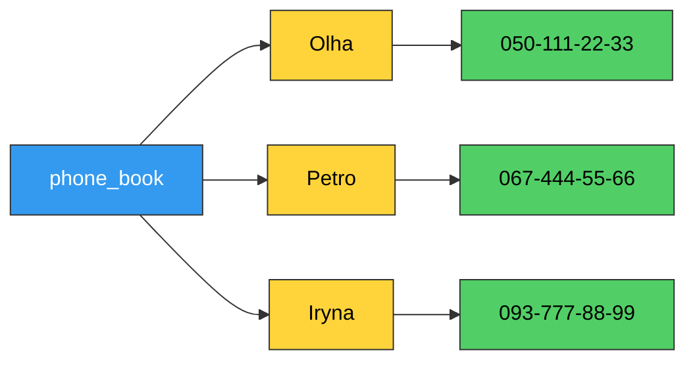
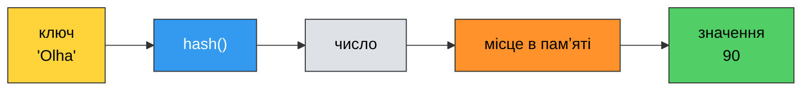
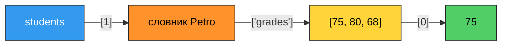
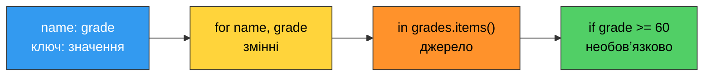
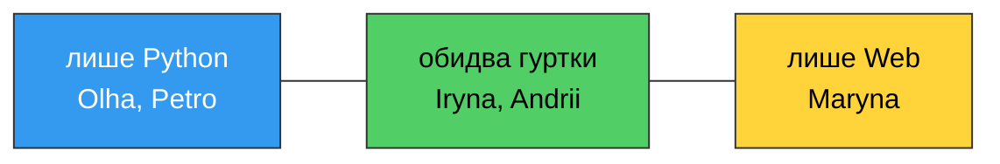
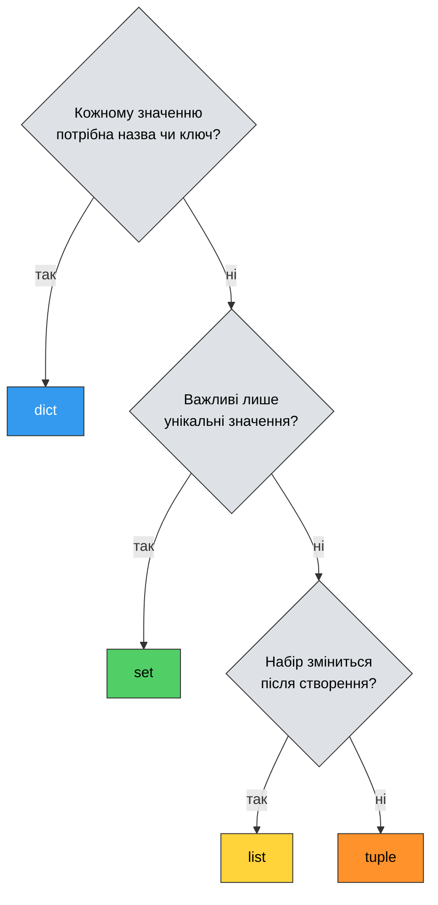

# 16. (Л) Словники та множини

## Зміст лекції

1. Навіщо потрібен словник
2. Словник: створення та літерал
3. Доступ до значення за ключем
4. Перевірка наявності ключа
5. Додавання, зміна та вилучення пар
6. Перебір словника
7. Які значення можуть бути ключами
8. Типові прийоми: підрахунок, групування, пошук максимуму
9. Сортування словника
10. Вкладені структури
11. Копіювання та обʼєднання словників
12. Словниковий вираз
13. Множина: створення та особливості
14. Додавання та вилучення елементів множини
15. Унікальність і швидка перевірка входження
16. Операції над множинами
17. Незмінювана множина `frozenset`
18. Множинний вираз
19. Чотири колекції: як обрати
20. Приклад: курси за вибором
21. Типові помилки

## Навіщо потрібен словник

На лекції 14 ми розглянули список і кортеж — колекції, де до елемента звертаються за **номером**. Але часто номер нічого не означає. Уявіть телефонну книгу, збудовану на двох списках:

```python
# Program: phone book built on two parallel lists
names = ["Olha", "Petro", "Iryna"]
phones = ["050-111-22-33", "067-444-55-66", "093-777-88-99"]

wanted = "Iryna"
index = names.index(wanted)
print(f"{wanted}: {phones[index]}")
```

```text
Iryna: 093-777-88-99
```

Код працює, але має вади:

- **Два списки треба тримати синхронними.** Додали імʼя, але забули телефон — і всі наступні пари зсунулися.
- **Звʼязок між імʼям і телефоном лише уявний.** Python не знає, що `names[2]` і `phones[2]` належать одній людині.
- **Пошук — це перебір.** `names.index()` порівнює `wanted` з кожним іменем по черзі, поки не знайде.

**Словник** (`dict`) зберігає саме **пари**: кожному **ключу** відповідає **значення**. Звертаються до значення не за номером, а за ключем:

```python
# Program: phone book built on a dictionary
phone_book = {
    "Olha": "050-111-22-33",
    "Petro": "067-444-55-66",
    "Iryna": "093-777-88-99",
}

print(f"Iryna: {phone_book['Iryna']}")
```

```text
Iryna: 093-777-88-99
```



Словник — одна з найчастіше вживаних структур у Python. Налаштування програми, запис про студента, підрахунок голосів, відповідь вебсервера у форматі JSON — усе це словники.

Ця лекція завершує огляд чотирьох вбудованих колекцій: після **списку** й **кортежу** розглянемо **словник** і **множину**.

## Словник: створення та літерал

Словник записують у фігурних дужках: пари `ключ: значення` через кому.

```python
# Program: different ways to create a dictionary
student = {"name": "Olha", "year": 2007, "group": "IPZ-11"}
empty = {}
ages = dict(Olha=19, Petro=18)
colors = dict([("red", "#ff0000"), ("green", "#00ff00")])

days = ["Mon", "Tue", "Wed"]
pairs = [4, 6, 2]
schedule = dict(zip(days, pairs))

print(student)
print(empty, type(empty))
print(ages)
print(colors)
print(schedule)
print(len(student))
```

```text
{'name': 'Olha', 'year': 2007, 'group': 'IPZ-11'}
{} <class 'dict'>
{'Olha': 19, 'Petro': 18}
{'red': '#ff0000', 'green': '#00ff00'}
{'Mon': 4, 'Tue': 6, 'Wed': 2}
3
```

| Спосіб | Коли зручний |
|---|---|
| `{"a": 1, "b": 2}` | дані відомі заздалегідь — найпоширеніший варіант |
| `{}` | порожній словник, який заповнимо пізніше |
| `dict(a=1, b=2)` | ключі — прості слова, без лапок |
| `dict([("a", 1), ("b", 2)])` | є список пар (кортежів) |
| `dict(zip(keys, values))` | є два окремі списки: ключі та значення |

`len()` повертає кількість **пар**, а не суму ключів і значень.

### Ключі унікальні

```python
# Program: a repeated key keeps only the last value
grades = {"Olha": 90, "Petro": 75, "Olha": 100}

print(grades)
print(len(grades))
```

```text
{'Olha': 100, 'Petro': 75}
2
```

У словнику не може бути двох однакових ключів. Якщо ключ повторюється, лишається **останнє** значення — без жодного попередження. Значення ж можуть повторюватися скільки завгодно: `{"Olha": 90, "Petro": 90}` — цілком нормальний словник.

## Доступ до значення за ключем

```python
# Program: read values by key
student = {"name": "Olha", "year": 2007, "group": "IPZ-11"}

print(student["name"])
print(student["group"])
print(2026 - student["year"])
# print(student["email"])   -> KeyError: 'email'
# print(student[0])         -> KeyError: 0
```

```text
Olha
IPZ-11
19
```

Квадратні дужки ті самі, що в списку, але зміст інший: у дужках **ключ**, а не номер позиції. Тому `student[0]` шукає ключ `0`, а не «перший елемент», і, не знайшовши, викликає `KeyError`. Індексів і зрізів у словнику немає.

!!! warning "Регістр і тип ключа мають значення"
    `"name"`, `"Name"` і `"NAME"` — три різні ключі. Так само `1` і `"1"` — різні ключі: число і рядок.

### Метод `get()`

Щоб не отримати `KeyError`, використовують `get()`:

```python
# Program: safe access with get()
student = {"name": "Olha", "year": 2007, "group": "IPZ-11"}

print(student.get("name"))
print(student.get("email"))
print(student.get("email", "not set"))
print(student)
```

```text
Olha
None
not set
{'name': 'Olha', 'year': 2007, 'group': 'IPZ-11'}
```

| Запис | Ключ є | Ключа немає |
|---|---|---|
| `d[key]` | значення | `KeyError` |
| `d.get(key)` | значення | `None` |
| `d.get(key, default)` | значення | `default` |

`get()` лише читає: відсутній ключ **не додається** в словник, що видно з останнього рядка виводу.

!!! tip "Коли `[]`, а коли `get()`"
    Якщо ключ **обовʼязково** має бути (імʼя студента в записі про студента), пишіть `d[key]`: відсутність ключа — це помилка в даних, і краще дізнатися про неї одразу. Якщо ключ **може бути відсутнім** (email, який вказали не всі), пишіть `d.get(key, default)`.

## Перевірка наявності ключа

```python
# Program: the in operator checks keys
student = {"name": "Olha", "year": 2007, "group": "IPZ-11"}

print("name" in student)
print("email" in student)
print("email" not in student)
print("Olha" in student)                # серед КЛЮЧІВ такого немає
print("Olha" in student.values())       # а серед значень - є
```

```text
True
False
True
False
True
```

Оператор `in` для словника перевіряє **лише ключі**. Це типова пастка: `"Olha" in student` дає `False`, хоча `"Olha"` у словнику є — як значення.

```python
# Program: check a key before reading
phone_book = {"Olha": "050-111-22-33", "Petro": "067-444-55-66"}
wanted = "Maryna"

if wanted in phone_book:
    print(f"{wanted}: {phone_book[wanted]}")
else:
    print(f"{wanted} is not in the phone book")
```

```text
Maryna is not in the phone book
```

!!! info "Пошук у словнику не перебирає пари"
    `"Olha" in names` для списку порівнює `"Olha"` з кожним елементом — чим довший список, тим довше. Словник знаходить ключ **майже миттєво** незалежно від того, скільки в ньому пар: десять чи десять мільйонів. Як це можливо — пояснимо в розділі про ключі нижче, а докладно розберемо на лекції 25.

## Додавання, зміна та вилучення пар

Словник — **змінюваний** тип, як і список.

### Додавання та зміна

```python
# Program: add and update entries
stock = {"apple": 10, "pear": 4}

stock["banana"] = 7                 # нового ключа не було - пара додається
print(stock)

stock["apple"] = 12                 # ключ уже є - значення замінюється
print(stock)

stock["pear"] += 6                  # нове значення на основі старого
print(stock)

stock.update({"apple": 0, "kiwi": 3})   # кілька пар одразу
print(stock)
```

```text
{'apple': 10, 'pear': 4, 'banana': 7}
{'apple': 12, 'pear': 4, 'banana': 7}
{'apple': 12, 'pear': 10, 'banana': 7}
{'apple': 0, 'pear': 10, 'banana': 7, 'kiwi': 3}
```

Запис `d[key] = value` означає «додати **або** замінити» — залежно від того, чи був ключ. Python не попереджає, яка з двох дій відбулася.

!!! warning "Помилка в ключі створює нову пару"
    ```python
    stock = {"apple": 10}

    stock["aple"] = 20      # друкарська помилка
    print(stock)
    ```

    ```text
    {'apple': 10, 'aple': 20}
    ```

    Замість оновлення `apple` у словнику зʼявився новий ключ. Помилки програма не видала — лише неправильні дані.

А от `+=` для відсутнього ключа вже не спрацює: щоб додати `1`, потрібне старе значення, а його немає.

```python
stock = {"apple": 10}

stock["apple"] += 1
# stock["kiwi"] += 1        -> KeyError: 'kiwi'
print(stock)
```

```text
{'apple': 11}
```

### Вилучення

```python
# Program: remove entries from a dictionary
stock = {"apple": 12, "pear": 10, "banana": 7, "kiwi": 3}

removed = stock.pop("apple")        # вилучає за ключем і ПОВЕРТАЄ значення
print(removed, stock)

missing = stock.pop("mango", 0)     # ключа немає - повертає значення за замовчуванням
print(missing, stock)

del stock["pear"]                   # вилучає за ключем, нічого не повертає
print(stock)

last = stock.popitem()              # вилучає ОСТАННЮ додану пару
print(last, stock)

stock.clear()                       # спорожнити словник
print(stock)
```

```text
12 {'pear': 10, 'banana': 7, 'kiwi': 3}
0 {'pear': 10, 'banana': 7, 'kiwi': 3}
{'banana': 7, 'kiwi': 3}
('kiwi', 3) {'banana': 7}
{}
```

| Операція | Що повертає | Якщо ключа немає |
|---|---|---|
| `d.pop(key)` | значення | `KeyError` |
| `d.pop(key, default)` | значення або `default` | повертає `default` |
| `del d[key]` | нічого | `KeyError` |
| `d.popitem()` | кортеж `(ключ, значення)` | `KeyError` на порожньому |
| `d.clear()` | `None` | — |

## Перебір словника

Цикл `for` по словнику перебирає **ключі**:

```python
# Program: iterate over a dictionary
grades = {"Olha": 90, "Petro": 75, "Iryna": 84}

for name in grades:
    print(name, end=" ")
print()

for grade in grades.values():
    print(grade, end=" ")
print()

for name, grade in grades.items():
    print(f"{name:6} {grade}")
```

```text
Olha Petro Iryna 
90 75 84 
Olha   90
Petro  75
Iryna  84
```

| Що перебираємо | Запис | Що отримує змінна циклу |
|---|---|---|
| ключі | `for k in d:` або `for k in d.keys():` | ключ |
| значення | `for v in d.values():` | значення |
| пари | `for k, v in d.items():` | кортеж `(ключ, значення)`, одразу розпакований |

Варіант з `items()` — найчастіший. Він поєднує вже знайоме розпакування кортежу з лекції 14 і позбавляє від запису `grades[name]` у тілі циклу.

### `keys()`, `values()`, `items()`

```python
# Program: dictionary views
grades = {"Olha": 90, "Petro": 75, "Iryna": 84}

print(grades.keys())
print(grades.values())
print(grades.items())
print(list(grades.items()))
print(f"Average: {sum(grades.values()) / len(grades):.1f}")
print(f"Best grade: {max(grades.values())}")
```

```text
dict_keys(['Olha', 'Petro', 'Iryna'])
dict_values([90, 75, 84])
dict_items([('Olha', 90), ('Petro', 75), ('Iryna', 84)])
[('Olha', 90), ('Petro', 75), ('Iryna', 84)]
Average: 83.0
Best grade: 90
```

Ці методи повертають не списки, а особливі **представлення** (views) — «вікна» в словник. Їх можна перебирати, передавати в `sum`, `max`, `len`, `sorted`, перевіряти через `in`. Якщо потрібен справжній список (наприклад, щоб звернутися за індексом), обгортають у `list()`.

### Порядок пар

Починаючи з Python 3.7, словник **памʼятає порядок додавання**: пари перебираються в тій послідовності, у якій їх додали. Проте номерів позицій у словника немає, а порівняння `==` порядок ігнорує:

```python
# Program: equal dictionaries may have a different order
a = {"x": 1, "y": 2}
b = {"y": 2, "x": 1}

print(a == b)
print(list(a), list(b))
```

```text
True
['x', 'y'] ['y', 'x']
```

!!! danger "Не змінюйте розмір словника під час перебору"
    ```python
    grades = {"Olha": 90, "Petro": 55, "Iryna": 84, "Andrii": 40}

    # for name in grades:
    #     if grades[name] < 60:
    #         del grades[name]    -> RuntimeError: dictionary changed size during iteration

    for name in list(grades):       # перебираємо КОПІЮ ключів
        if grades[name] < 60:
            del grades[name]

    print(grades)
    ```

    ```text
    {'Olha': 90, 'Iryna': 84}
    ```

    Зі списком така помилка мовчки пропускала елементи (лекція 14), словник же одразу зупиняє програму. Вихід той самий: перебирати копію (`list(grades)`) або будувати новий словник — найзручніше словниковим виразом, про який нижче.

    Змінювати **значення** наявних ключів під час перебору можна: розмір словника від цього не змінюється.

## Які значення можуть бути ключами

**Значенням** може бути що завгодно: число, рядок, список, інший словник. А от **ключем** — лише обʼєкт **незмінюваного** типу: `int`, `float`, `str`, `bool`, `tuple`.

```python
# Program: tuples as dictionary keys
distances = {
    ("Kyiv", "Lviv"): 540,
    ("Kyiv", "Odesa"): 475,
}
print(distances[("Kyiv", "Lviv")])

board = {}
board[(0, 0)] = "X"
board[(1, 2)] = "O"
print(board)
print((1, 1) in board)

# routes = {["Kyiv", "Lviv"]: 540}    -> TypeError: unhashable type: 'list'
```

```text
540
{(0, 0): 'X', (1, 2): 'O'}
False
```

Кортеж — природний ключ для складених даних: пара міст, координата клітинки, пара `(група, предмет)`. Саме це ми обіцяли на лекції 14, коли порівнювали список і кортеж. Список ключем бути не може.

### Чому ключ має бути незмінюваним

Словник не шукає ключ перебором. Натомість він обчислює з ключа число — **хеш** (hash) — і за цим числом одразу знає, у якому місці памʼяті лежить пара. Звідси й швидкість.

```python
# Program: hash values
print(hash(42))
print(hash((1, 2)) == hash((1, 2)))
# print(hash([1, 2]))       -> TypeError: unhashable type: 'list'
```

```text
42
True
```



Уявіть, що ключем був би список, і після додавання пари його змінили. Хеш зміненого списку інший — словник шукав би пару не там, де вона лежить, і дані «загубилися» б. Тому Python дозволяє ключами лише ті обʼєкти, які змінитися не можуть. Такі обʼєкти називають **хешованими** (hashable).

!!! info "Що лишилося за кадром"
    Кортеж хешований, лише якщо всі його елементи хешовані: `{([1, 2], 3): "x"}` теж дасть `TypeError: unhashable type: 'list'`. Детально про змінювані та незмінювані обʼєкти — на лекції 20, а про те, як влаштована хеш-таблиця всередині словника, — на лекції 25.

## Типові прийоми: підрахунок, групування, пошук максимуму

### Підрахунок

Словник «елемент → скільки разів трапився» — мабуть, найпоширеніший прийом.

```python
# Program: count votes with a dictionary
votes = ["Python", "Java", "Python", "C", "Python", "Java"]
counts = {}

for language in votes:
    if language in counts:
        counts[language] += 1
    else:
        counts[language] = 1

print(counts)
```

```text
{'Python': 3, 'Java': 2, 'C': 1}
```

Те саме коротше — з `get()`: якщо ключа ще немає, беремо `0`.

```python
# Program: count letters with get()
word = "mississippi"
letters = {}

for letter in word:
    letters[letter] = letters.get(letter, 0) + 1

print(letters)
```

```text
{'m': 1, 'i': 4, 's': 4, 'p': 2}
```

### Групування

Словник «ключ групи → список елементів»:

```python
# Program: group students by their group
students = [
    ("Olha", "IPZ-11"),
    ("Petro", "IPZ-12"),
    ("Iryna", "IPZ-11"),
    ("Andrii", "IPZ-12"),
    ("Maryna", "IPZ-11"),
]

by_group = {}
for name, group in students:
    if group not in by_group:
        by_group[group] = []            # перший студент групи - створюємо список
    by_group[group].append(name)

print(by_group)
print(by_group["IPZ-12"])
```

```text
{'IPZ-11': ['Olha', 'Iryna', 'Maryna'], 'IPZ-12': ['Petro', 'Andrii']}
['Petro', 'Andrii']
```

Перевірку `if ... not in` можна замінити методом `setdefault()`. Він повертає значення за ключем, а якщо ключа немає — спершу додає пару з указаним значенням:

```python
# Program: group with setdefault()
students = [("Olha", "IPZ-11"), ("Petro", "IPZ-12"), ("Iryna", "IPZ-11")]

by_group = {}
for name, group in students:
    by_group.setdefault(group, []).append(name)

print(by_group)
```

```text
{'IPZ-11': ['Olha', 'Iryna'], 'IPZ-12': ['Petro']}
```

!!! warning "`get()` не підходить для групування"
    ```python
    by_group = {}

    by_group.get("IPZ-11", []).append("Olha")
    print(by_group)
    ```

    ```text
    {}
    ```

    `get()` повернув **новий порожній список**, у нього додали імʼя — але в словник цей список ніхто не поклав. `setdefault()` відрізняється саме тим, що зберігає значення за замовчуванням у словнику.

### Пошук ключа з найбільшим значенням

`max(grades)` порівнює **ключі** (імена за алфавітом), а не оцінки. Щоб порівнювати значення, передаємо `key` — як у сортуванні на лекції 14:

```python
# Program: find the key with the largest value
grades = {"Olha": 90, "Petro": 75, "Iryna": 94}

print(max(grades))                      # найбільший КЛЮЧ за алфавітом

best = max(grades, key=grades.get)
worst = min(grades, key=grades.get)

print(f"Best:  {best} ({grades[best]})")
print(f"Worst: {worst} ({grades[worst]})")
```

```text
Petro
Best:  Iryna (94)
Worst: Petro (75)
```

`key=grades.get` означає: «для кожного ключа виклич `grades.get(ключ)` і порівнюй результати». Дужок після `get` немає — ми передаємо саму функцію, а не результат її виклику.

### Інверсія словника

```python
# Program: swap keys and values
codes = {"UA": "Ukraine", "PL": "Poland", "DE": "Germany"}
by_country = {}

for code, country in codes.items():
    by_country[country] = code

print(by_country)
print(by_country["Poland"])
```

```text
{'Ukraine': 'UA', 'Poland': 'PL', 'Germany': 'DE'}
PL
```

Прийом коректний, лише якщо значення **унікальні**. Якщо двом ключам відповідало одне значення, після інверсії лишиться тільки одна пара.

## Сортування словника

Словник не має методу `sort()`. Зате `sorted()` уміє працювати з ним і повертає **список**:

```python
# Program: sort a dictionary by keys and by values
grades = {"Petro": 75, "Olha": 90, "Iryna": 94, "Andrii": 61}

print(sorted(grades))                   # ключі за алфавітом
print(sorted(grades.items()))           # пари за ключем

by_grade = sorted(grades.items(), key=lambda pair: pair[1], reverse=True)
print(by_grade)                         # пари за значенням, від більшого

ranking = dict(by_grade)                # назад у словник
print(ranking)
```

```text
['Andrii', 'Iryna', 'Olha', 'Petro']
[('Andrii', 61), ('Iryna', 94), ('Olha', 90), ('Petro', 75)]
[('Iryna', 94), ('Olha', 90), ('Petro', 75), ('Andrii', 61)]
{'Iryna': 94, 'Olha': 90, 'Petro': 75, 'Andrii': 61}
```

`grades.items()` дає кортежі `(імʼя, оцінка)`, тому `lambda pair: pair[1]` — це сортування за оцінкою. Оскільки словник памʼятає порядок додавання, `dict(by_grade)` зберігає пари вже у відсортованому порядку.

Найчастіше словник сортують просто для **виводу**:

```python
# Program: print a ranking
grades = {"Petro": 75, "Olha": 90, "Iryna": 94, "Andrii": 61}

for place, name in enumerate(sorted(grades, key=grades.get, reverse=True), start=1):
    print(f"{place}. {name:7} {grades[name]}")
```

```text
1. Iryna   94
2. Olha    90
3. Petro   75
4. Andrii  61
```

## Вкладені структури

Реальні дані рідко бувають пласкими. Словники і списки вкладають одне в одне.

### Список словників

Типова «таблиця»: кожен рядок — словник з однаковими ключами.

```python
# Program: a list of dictionaries as a table
students = [
    {"name": "Olha", "group": "IPZ-11", "grades": [90, 85, 92]},
    {"name": "Petro", "group": "IPZ-12", "grades": [75, 80, 68]},
    {"name": "Iryna", "group": "IPZ-11", "grades": [84, 91, 79]},
]

for student in students:
    average = sum(student["grades"]) / len(student["grades"])
    print(f"{student['name']:6} {student['group']}  avg={average:.1f}")

print(students[1]["grades"][0])
```

```text
Olha   IPZ-11  avg=89.0
Petro  IPZ-12  avg=74.3
Iryna  IPZ-11  avg=84.7
75
```

Порівняйте із записом-кортежем з лекції 14: `person[2]` нічого не каже читачеві, а `student["group"]` пояснює сам себе. Коли полів більше двох-трьох, словник читається набагато легше.

Ланцюжок `students[1]["grades"][0]` розбирається зліва направо:



!!! tip "Лапки всередині f-рядка"
    У `f"{student['name']}"` ключ записано в **одинарних** лапках, бо весь f-рядок — у подвійних. Однакові лапки всередині й зовні дозволені лише з Python 3.12, тому надійніше чергувати.

### Словник словників

Коли в кожного запису є природний унікальний ідентифікатор (назва товару, номер залікової книжки), зручніше зробити його ключем:

```python
# Program: a dictionary of dictionaries
inventory = {
    "apple": {"price": 32.5, "count": 10},
    "pear": {"price": 45.0, "count": 4},
}

inventory["pear"]["count"] -= 1                     # продали одну грушу
inventory["kiwi"] = {"price": 80.0, "count": 12}    # новий товар

for product, info in inventory.items():
    total = info["price"] * info["count"]
    print(f"{product:6} {info['count']:3} x {info['price']:6.2f} = {total:8.2f}")
```

```text
apple   10 x  32.50 =   325.00
pear     3 x  45.00 =   135.00
kiwi    12 x  80.00 =   960.00
```

| Структура | Доступ до запису | Коли обирати |
|---|---|---|
| список словників | за номером: `students[1]` | важливий порядок, записи перебирають по черзі |
| словник словників | за ключем: `inventory["pear"]` | записи шукають за унікальною назвою чи кодом |
| словник списків | за ключем: `by_group["IPZ-11"]` | групування: одному ключу відповідає багато значень |

## Копіювання та обʼєднання словників

Усе, що ми казали про копіювання списків, стосується і словників: присвоєння **не створює копію**.

```python
# Program: assignment does NOT copy a dictionary
original = {"Olha": 90}
alias = original
copy = original.copy()

alias["Petro"] = 75

print(f"original: {original}")
print(f"alias:    {alias}")
print(f"copy:     {copy}")
print(original is alias, original is copy)
```

```text
original: {'Olha': 90, 'Petro': 75}
alias:    {'Olha': 90, 'Petro': 75}
copy:     {'Olha': 90}
True False
```

Копію роблять через `d.copy()` або `dict(d)`. Як і для списків, це **неглибока** копія: вкладені списки та словники залишаються спільними. Чому — на лекції 20.

### Обʼєднання

```python
# Program: merge two dictionaries
defaults = {"theme": "light", "lang": "en", "font": 14}
user = {"lang": "uk", "font": 16}

settings = defaults | user          # новий словник, праві значення перемагають
print(settings)
print(defaults)

defaults.update(user)               # змінює сам defaults
print(defaults)
```

```text
{'theme': 'light', 'lang': 'uk', 'font': 16}
{'theme': 'light', 'lang': 'en', 'font': 14}
{'theme': 'light', 'lang': 'uk', 'font': 16}
```

Оператор `|` для словників зʼявився в Python 3.9. Різниця та сама, що між `sorted()` і `sort()`: `|` створює новий словник, `update()` змінює наявний.

## Словниковий вираз

**Словниковий вираз** (dict comprehension) — аналог спискового виразу, але в фігурних дужках і з двокрапкою між ключем і значенням.

```python
# Program: dictionary comprehensions
squares = {n: n ** 2 for n in range(1, 6)}
print(squares)

names = ["Olha", "Petro", "Iryna"]
lengths = {name: len(name) for name in names}
print(lengths)

grades = {"Olha": 90, "Petro": 55, "Iryna": 84, "Andrii": 40}
passed = {name: grade for name, grade in grades.items() if grade >= 60}
print(passed)

codes = {"UA": "Ukraine", "PL": "Poland"}
by_country = {country: code for code, country in codes.items()}
print(by_country)
```

```text
{1: 1, 2: 4, 3: 9, 4: 16, 5: 25}
{'Olha': 4, 'Petro': 5, 'Iryna': 5}
{'Olha': 90, 'Iryna': 84}
{'Ukraine': 'UA', 'Poland': 'PL'}
```



Вираз `passed` — це правильний спосіб «вилучити» пари за умовою: не видаляти їх під час перебору, а побудувати новий словник лише з потрібних.

## Множина: створення та особливості

**Множина** (`set`) — колекція **унікальних** елементів **без порядку**. По суті це словник, у якого є лише ключі без значень: ті самі фігурні дужки, та сама швидка перевірка входження, ті самі вимоги до елементів.

```python
# Program: create sets
primes = {2, 3, 5, 7}
digits = {1, 2, 2, 3, 3, 3}
from_list = set([4, 1, 4, 2, 1])
empty = set()
not_a_set = {}

print(primes)
print(digits)
print(from_list)
print(len(digits))
print(empty, type(empty))
print(not_a_set, type(not_a_set))
```

```text
{2, 3, 5, 7}
{1, 2, 3}
{1, 2, 4}
3
set() <class 'set'>
{} <class 'dict'>
```

Дублікати зникають автоматично: `{1, 2, 2, 3, 3, 3}` містить три елементи.

!!! danger "`{}` — це порожній словник, а не множина"
    Фігурні дужки спершу належали словникам, тому `{}` створює **словник**. Порожню множину створюють лише викликом `set()`. Python і виводить її як `set()`, щоб не сплутати.

### Порядку в множині немає

```python
# Program: a set has no order
numbers = {100, 3, 50}
letters = set("banana")

print(numbers)
print(letters)
print(sorted(letters))
# print(numbers[0])         -> TypeError: 'set' object is not subscriptable
```

```text
{50, 3, 100}
{'n', 'b', 'a'}
['a', 'b', 'n']
```

Множина розкладає елементи за їхнім хешем, а не в порядку додавання. Тому:

- `{100, 3, 50}` вивелося як `{50, 3, 100}` — ні в порядку запису, ні за зростанням;
- порядок у множині рядків **у вас може бути іншим** і навіть змінюватися між запусками програми;
- індексів і зрізів немає — «перший елемент множини» не має сенсу.

Через це в прикладах далі множини рядків виводимо через `sorted()`: він повертає список у передбачуваному порядку. Те, що `{2, 3, 5, 7}` вивелося відсортованим, — випадковість реалізації для малих цілих чисел, покладатися на неї не можна.

### Елементи мають бути хешованими

```python
# Program: set elements must be hashable
cells = {(0, 0), (1, 2), (0, 0)}
print(len(cells))
print((1, 2) in cells)
# bad = {[0, 0], [1, 2]}    -> TypeError: unhashable type: 'list'
```

```text
2
True
```

Правило те саме, що для ключів словника: числа, рядки, кортежі — можна; списки, словники, множини — ні.

## Додавання та вилучення елементів множини

```python
# Program: add and remove set elements
tags = {"python", "web"}

tags.add("api")
tags.add("python")                  # уже є - нічого не зміниться
print(sorted(tags))

tags.update(["sql", "web", "docker"])   # кілька елементів
print(sorted(tags))

tags.remove("web")
print(sorted(tags))

tags.discard("java")                # елемента немає - тихо нічого не робить
# tags.remove("java")               -> KeyError: 'java'
print(sorted(tags), len(tags))

tags.clear()
print(tags)
```

```text
['api', 'python', 'web']
['api', 'docker', 'python', 'sql', 'web']
['api', 'docker', 'python', 'sql']
['api', 'docker', 'python', 'sql'] 4
set()
```

| Операція | Що робить | Якщо елемента немає |
|---|---|---|
| `s.add(x)` | додає один елемент | — |
| `s.update(iterable)` | додає всі елементи послідовності | — |
| `s.remove(x)` | вилучає елемент | `KeyError` |
| `s.discard(x)` | вилучає елемент | нічого не робить |
| `s.pop()` | вилучає й повертає **довільний** елемент | `KeyError` на порожній |
| `s.clear()` | спорожнює множину | — |

Методу `append` у множини немає: «додати в кінець» без порядку не має сенсу. Звідси й назва `add`.

## Унікальність і швидка перевірка входження

Два головні застосування множини — **прибрати дублікати** і **швидко перевірити**, чи є елемент.

```python
# Program: remove duplicates and check membership
visitors = ["Olha", "Petro", "Olha", "Iryna", "Petro", "Olha"]

unique = set(visitors)
print(f"Visits: {len(visitors)}")
print(f"Unique visitors: {len(unique)}")
print(sorted(unique))
print("Iryna" in unique)
print("Maryna" in unique)
```

```text
Visits: 6
Unique visitors: 3
['Iryna', 'Olha', 'Petro']
True
False
```

!!! tip "Унікальні елементи зі збереженням порядку"
    `set()` втрачає порядок. Якщо порядок першої появи важливий, скористайтеся тим, що ключі словника унікальні і памʼятають порядок:

    ```python
    visitors = ["Olha", "Petro", "Olha", "Iryna", "Petro", "Olha"]

    print(list(dict.fromkeys(visitors)))
    ```

    ```text
    ['Olha', 'Petro', 'Iryna']
    ```

    `dict.fromkeys(visitors)` створює словник, де кожне імʼя — ключ (зі значенням `None`), а дублікати ключів зливаються.

### Множина «вже бачили»

Коли під час перебору потрібно памʼятати, які елементи вже траплялися, множина — найкращий вибір:

```python
# Program: find the first repeated element
numbers = [4, 8, 15, 16, 8, 23, 42, 4]
seen = set()

for number in numbers:
    if number in seen:
        print(f"First repeat: {number}")
        break
    seen.add(number)
```

```text
First repeat: 8
```

Те саме можна написати зі списком `seen = []`, і результат буде тим самим. Різниця у швидкості: `number in seen` для списку перебирає всі збережені елементи, для множини — ні. На восьми числах різниці не видно, на мільйоні — програма зі списком працюватиме хвилини, а з множиною — частки секунди. Чому так — на лекції 25.

## Операції над множинами

Множини в Python підтримують ті самі операції, що й множини в математиці.

```python
# Program: set operations
python_club = {"Olha", "Petro", "Iryna", "Andrii"}
web_club = {"Iryna", "Andrii", "Maryna"}

print(sorted(python_club | web_club))       # обʼєднання
print(sorted(python_club & web_club))       # перетин
print(sorted(python_club - web_club))       # різниця
print(sorted(web_club - python_club))
print(sorted(python_club ^ web_club))       # симетрична різниця
```

```text
['Andrii', 'Iryna', 'Maryna', 'Olha', 'Petro']
['Andrii', 'Iryna']
['Olha', 'Petro']
['Maryna']
['Maryna', 'Olha', 'Petro']
```

| Оператор | Метод | Назва | Результат для гуртків |
|---|---|---|---|
| `a | b` | `a.union(b)` | обʼєднання | ходять хоча б в один гурток |
| `a & b` | `a.intersection(b)` | перетин | ходять в обидва |
| `a - b` | `a.difference(b)` | різниця | ходять лише в `a` |
| `a ^ b` | `a.symmetric_difference(b)` | симетрична різниця | ходять рівно в один |



Різниця `-` — єдина операція, де порядок операндів важливий: `python_club - web_club` і `web_club - python_club` дають різні множини.

Оператори вимагають, щоб **обидва** операнди були множинами. Методи приймають будь-яку послідовність:

```python
# Program: methods accept any iterable
python_club = {"Olha", "Petro", "Iryna"}
newcomers = ["Maryna", "Olha"]

# print(python_club | newcomers)  -> TypeError: unsupported operand type(s) for |: 'set' and 'list'
print(sorted(python_club.union(newcomers)))
print(sorted(python_club | set(newcomers)))
```

```text
['Iryna', 'Maryna', 'Olha', 'Petro']
['Iryna', 'Maryna', 'Olha', 'Petro']
```

### Зміна на місці

Кожна операція має скорочену форму, що змінює саму множину: `|=`, `&=`, `-=`, `^=`.

```python
# Program: in-place set operations
allowed = {"read", "write", "delete"}

allowed -= {"delete"}
print(sorted(allowed))

allowed |= {"share"}
print(sorted(allowed))

allowed &= {"read", "share", "admin"}
print(sorted(allowed))
```

```text
['read', 'write']
['read', 'share', 'write']
['read', 'share']
```

### Підмножини

```python
# Program: subsets and disjoint sets
required = {"python", "git"}
skills = {"python", "git", "sql"}

print(required <= skills)           # required - підмножина skills?
print(required.issubset(skills))    # те саме методом
print(skills >= required)           # skills - надмножина required?
print(required < required)          # строга підмножина: не рівна
print(skills.isdisjoint({"java", "go"}))    # спільних елементів немає?
```

```text
True
True
True
False
True
```

| Запис | Питання |
|---|---|
| `a <= b`, `a.issubset(b)` | чи всі елементи `a` є в `b`? |
| `a < b` | `a` — підмножина `b` і `a != b`? |
| `a >= b`, `a.issuperset(b)` | чи всі елементи `b` є в `a`? |
| `a.isdisjoint(b)` | чи немає спільних елементів? |
| `a == b` | чи однакові елементи (порядок не важливий)? |

## Незмінювана множина `frozenset`

Множина змінювана, тому сама не може бути ключем словника чи елементом іншої множини. Для цього існує `frozenset` — те саме, що `set`, але без методів зміни. Співвідношення таке саме, як між списком і кортежем.

```python
# Program: frozenset is an immutable set
weekend = frozenset({"Sat", "Sun"})

print("Sun" in weekend)
print(len(weekend | {"Fri"}))       # операції працюють, результат - новий обʼєкт
# weekend.add("Mon")                -> AttributeError: 'frozenset' object has no attribute 'add'

day_types = {weekend: "rest"}
print(day_types[frozenset({"Sun", "Sat"})])
```

```text
True
3
rest
```

Останній рядок показує, що `frozenset({"Sun", "Sat"})` і `frozenset({"Sat", "Sun"})` — однаковий ключ: порядку в множині немає.

## Множинний вираз

```python
# Program: set comprehensions
numbers = [3, -1, 4, -1, 5, -9, 2, 6, 5, 3]
squares = {n * n for n in numbers}
print(sorted(squares))

words = ["apple", "avocado", "banana", "blueberry", "cherry"]
first_letters = {word[0] for word in words}
print(sorted(first_letters))
```

```text
[1, 4, 9, 16, 25, 36, 81]
['a', 'b', 'c']
```

Фігурні дужки однакові для всіх трьох виразів — тип визначає вміст:

| Вираз | Результат |
|---|---|
| `[x for x in data]` | список |
| `{x for x in data}` | множина |
| `{x: f(x) for x in data}` | словник — є двокрапка |

## Чотири колекції: як обрати

| | `list` | `tuple` | `dict` | `set` |
|---|---|---|---|---|
| Запис | `[1, 2]` | `(1, 2)` | `{"a": 1}` | `{1, 2}` |
| Порожня | `[]` | `()` | `{}` | `set()` |
| Змінюваність | так | ні | так | так |
| Порядок | за позицією | за позицією | порядок додавання | немає |
| Дублікати | можна | можна | ключі унікальні | заборонені |
| Доступ | за індексом | за індексом | за ключем | лише перевірка `in` |
| Швидкість `in` | перебір | перебір | швидко (ключі) | швидко |
| Вимоги до елементів | немає | немає | ключі хешовані | хешовані |



Кілька типових ситуацій:

| Задача | Колекція |
|---|---|
| оцінки студента за семестр | `list` |
| координата `(x, y)`, дата `(day, month, year)` | `tuple` |
| запис про студента з полями `name`, `group`, `email` | `dict` |
| скільки разів трапилося кожне слово | `dict` |
| які теги використано хоча б раз | `set` |
| хто відвідав обидва заняття | `set` + `&` |

## Приклад: курси за вибором

Зберемо все разом. Студенти обирають курси за вибором; програма перевіряє вибір, будує списки груп і відповідає на кілька запитань деканату.

```python
# Program: elective courses report built from dictionaries and sets


def build_enrollment(choices):
    """Return a dictionary: course -> set of students who chose it."""
    enrollment = {}
    for student, courses in choices.items():
        for course in courses:
            enrollment.setdefault(course, set()).add(student)
    return enrollment


def print_enrollment(enrollment):
    """Print every course with the number and the names of its students."""
    print(f"{'Course':<11}{'Count':>5}  Students")
    print("-" * 50)
    for course in sorted(enrollment):
        students = enrollment[course]
        print(f"{course:<11}{len(students):>5}  {sorted(students)}")
    print("-" * 50)


def main():
    offered = {"Python", "Databases", "Networks", "Design", "Robotics"}

    # кожен студент обрав множину курсів; курсу "Chess" у переліку немає
    choices = {
        "Olha": {"Python", "Databases", "Design"},
        "Petro": {"Python", "Networks"},
        "Iryna": {"Python", "Databases", "Chess"},
        "Andrii": {"Networks", "Design", "Python"},
    }

    unknown = set()
    for courses in choices.values():
        unknown |= courses - offered
    print(f"Ignored courses: {sorted(unknown)}")

    # лишаємо тільки ті курси, які справді пропонуються
    valid = {student: courses & offered for student, courses in choices.items()}

    enrollment = build_enrollment(valid)
    print_enrollment(enrollment)

    popular = max(enrollment, key=lambda course: len(enrollment[course]))
    print(f"Most popular:  {popular} ({len(enrollment[popular])})")
    print(f"Not chosen:    {sorted(offered - set(enrollment))}")

    common = set(offered)
    for courses in valid.values():
        common &= courses
    print(f"Everyone took: {sorted(common)}")

    shared = valid["Olha"] & valid["Iryna"]
    print(f"Olha & Iryna:  {sorted(shared)}")

    load = {student: len(courses) for student, courses in valid.items()}
    print(f"Load:          {load}")


main()
```

```text
Ignored courses: ['Chess']
Course     Count  Students
--------------------------------------------------
Databases      2  ['Iryna', 'Olha']
Design         2  ['Andrii', 'Olha']
Networks       2  ['Andrii', 'Petro']
Python         4  ['Andrii', 'Iryna', 'Olha', 'Petro']
--------------------------------------------------
Most popular:  Python (4)
Not chosen:    ['Robotics']
Everyone took: ['Python']
Olha & Iryna:  ['Databases', 'Python']
Load:          {'Olha': 3, 'Petro': 2, 'Iryna': 2, 'Andrii': 3}
```

Розберемо кілька місць:

- `choices` — **словник множин**: ключ — студент, значення — множина обраних курсів. Множина, бо той самий курс двічі обрати не можна, а порядок вибору неважливий.
- `unknown |= courses - offered` — різниця дає курси студента, яких немає в переліку, а `|=` накопичує їх з усіх студентів.
- `{student: courses & offered for ...}` — словниковий вираз, де значенням є перетин множин: у кожного студента лишаються тільки дійсні курси.
- `enrollment.setdefault(course, set()).add(student)` — групування, як у розділі про типові прийоми, але значення — множина, тож замість `append` стоїть `add`.
- `for course in sorted(enrollment)` — ключі словника перебираються в алфавітному порядку. Без `sorted()` порядок залежав би від того, у якій послідовності множини віддали курси, а він непередбачуваний.
- `common &= courses` — починаємо з усіх курсів і перетинаємо з вибором кожного студента: лишається те, що обрали всі.
- `offered - set(enrollment)` — `set(enrollment)` перетворює ключі словника на множину; різниця дає курси, які ніхто не обрав.

## Типові помилки

| Помилка | Причина | Виправлення |
|---|---|---|
| `KeyError: 'email'` | звернення до відсутнього ключа | `d.get("email", default)` або перевірка `in` |
| `"Olha" in d` дає `False`, хоча `"Olha"` є | `in` перевіряє ключі, а не значення | `"Olha" in d.values()` |
| `KeyError` у `d[key] += 1` | ключа ще немає, старого значення нема до чого додавати | `d[key] = d.get(key, 0) + 1` |
| `TypeError: unhashable type: 'list'` | список як ключ словника або елемент множини | використати кортеж |
| `RuntimeError: dictionary changed size during iteration` | додавання чи вилучення пар у циклі по словнику | перебирати `list(d)` або будувати новий словник |
| `x = {}` виявився словником | порожні фігурні дужки — це словник | `x = set()` |
| `TypeError: 'set' object is not subscriptable` | індекс для множини | перевіряти `in` або перетворити на `sorted(s)` |
| Порядок елементів множини «стрибає» | множина не має порядку | `sorted(s)` для виводу |
| Зміни в одному словнику видно в іншому | `b = a` створює друге імʼя | `b = a.copy()` |
| `max(d)` дав не той результат | порівнюються ключі, а не значення | `max(d, key=d.get)` |
| Групування через `get()` лишає словник порожнім | `get()` не зберігає значення за замовчуванням | `setdefault()` |

```python
# 1. in перевіряє ключі
student = {"name": "Olha"}
print("name" in student, "Olha" in student)

# 2. безпечний підрахунок
counts = {}
for letter in "abca":
    counts[letter] = counts.get(letter, 0) + 1
print(counts)

# 3. порожня множина
empty_dict = {}
empty_set = set()
print(type(empty_dict), type(empty_set))

# 4. ключ з найбільшим значенням
grades = {"Olha": 90, "Petro": 95}
print(max(grades, key=grades.get))
```

```text
True False
{'a': 2, 'b': 1, 'c': 1}
<class 'dict'> <class 'set'>
Petro
```

## Підсумок

- **Словник** `{ключ: значення}` зберігає пари; до значення звертаються за ключем, а не за номером.
- Ключі **унікальні**; повторний ключ перезаписує значення. Порядок пар — порядок додавання (з Python 3.7).
- `d[key]` для відсутнього ключа дає `KeyError`; `d.get(key, default)` повертає значення за замовчуванням і нічого не додає.
- `in` для словника перевіряє **лише ключі**.
- `d[key] = value` і додає, і замінює; вилучення — `pop`, `del`, `popitem`, `clear`.
- Перебір: `for k in d`, `d.values()`, `d.items()`; змінювати розмір словника під час перебору не можна.
- Ключами й елементами множин можуть бути лише **хешовані** (незмінювані) обʼєкти: числа, рядки, кортежі. Список — ні.
- Типові прийоми: підрахунок через `get(key, 0) + 1`, групування через `setdefault(key, [])`, пошук максимуму через `max(d, key=d.get)`.
- `sorted(d.items(), key=...)` сортує пари; результат — список, який можна перетворити назад на словник.
- Присвоєння словника не копіює його; копія — `d.copy()`, обʼєднання — `a | b` або `a.update(b)`.
- **Словниковий вираз** `{k: v for ... if ...}` — компактний спосіб побудувати чи відфільтрувати словник.
- **Множина** `{1, 2, 3}` — унікальні елементи без порядку; порожня множина — `set()`, а не `{}`.
- Множина прибирає дублікати і дуже швидко перевіряє `in`; індексів у неї немає.
- Операції: `|` обʼєднання, `&` перетин, `-` різниця, `^` симетрична різниця, `<=` підмножина.
- `frozenset` — незмінювана множина, яка може бути ключем словника.

## Корисні посилання

- [Словники — підручник Python](https://docs.python.org/3/tutorial/datastructures.html#dictionaries)
- [Множини — підручник Python](https://docs.python.org/3/tutorial/datastructures.html#sets)
- [Техніки перебору колекцій](https://docs.python.org/3/tutorial/datastructures.html#looping-techniques)
- [Тип `dict` — довідник](https://docs.python.org/3/library/stdtypes.html#mapping-types-dict)
- [Типи `set` і `frozenset` — довідник](https://docs.python.org/3/library/stdtypes.html#set-types-set-frozenset)
- [Глосарій: hashable](https://docs.python.org/3/glossary.html#term-hashable)

## Домашнє завдання

Мета — навчитися описувати дані словниками, рахувати й групувати за їх допомогою та застосовувати операції над множинами. Усі дані — **ваші власні**, латиницею.

1. Створіть файл `dict_basics.py` і словник `me` з ключами `name`, `surname`, `group`, `birth_year`, `city`, `hobbies` (список щонайменше з трьох ваших захоплень). Виведіть кожну пару окремим рядком через `items()`. Потім: додайте ключ `email`, змініть `city` на місто, де навчаєтеся, вилучіть `birth_year` через `pop()` і виведіть вилучене значення. Наостанок виведіть `me.get("phone", "unknown")` та поясніть одним реченням, чому `me["phone"]` на цьому місці завершило б програму.

2. Порахуйте частоту літер у своєму повному імені: рядок `"surname name"` у нижньому регістрі без пробілу. Побудуйте словник «літера → кількість» двома способами: через `if ... in` та через `get()`. Виведіть найчастішу літеру, використавши `max` з `key`, і всі літери, відсортовані за кількістю від більшої до меншої.

3. Опишіть свій реальний розклад словником `schedule`: ключ — день тижня (`"Mon"`, `"Tue"`, …), значення — список предметів цього дня. Виведіть кількість пар у кожен день, день із найбільшою кількістю пар, загальну кількість пар на тиждень і множину **всіх різних** предметів. Окремо виведіть предмети, які є і в понеділок, і в середу, та предмети, що бувають лише в понеділок.

4. Згрупуйте предмети з розкладу завдання 3 за першою літерою назви: словник «літера → список предметів». Зробіть це через `setdefault()`. Потім спробуйте зробити те саме через `get(letter, []).append(...)`, виведіть результат і поясніть, чому словник лишився порожнім.

5. Створіть множини `name_letters` і `surname_letters` з літер свого імені та прізвища в нижньому регістрі. Виведіть (через `sorted`): спільні літери, літери лише імені, літери лише прізвища, усі літери, літери рівно одного з двох слів. Виведіть, чи є множина літер імені підмножиною літер прізвища, і чи не мають вони жодної спільної літери.

6. Запишіть дату свого народження рядком `DDMMYYYY`. Виведіть: множину цифр, які в ній трапляються; кількість різних цифр; цифри від `0` до `9`, яких у даті **немає** (через різницю множин); цифри в порядку першої появи без повторів (через `dict.fromkeys`).

7. Складіть словник `subjects` з ваших предметів цього семестру: ключ — назва, значення — ваша оцінка (реальна або очікувана). Одним словниковим виразом отримайте предмети з оцінкою `10` і вище. Побудуйте «обернений» словник «оцінка → список предметів», використавши групування. Виведіть рейтинг предметів від найвищої оцінки до найнижчої з нумерацією від `1`.

8. Дослід із копіюванням. Створіть словник `plan_a` зі своїми планами на три дні (`"Mon": "gym"`, …), зробіть `plan_b = plan_a` і `plan_c = plan_a.copy()`. Змініть один день через `plan_b` і додайте новий день через `plan_c`. Виведіть усі три словники та результати `plan_a is plan_b`, `plan_a is plan_c`, `plan_a == plan_c`. Двома реченнями поясніть отримані результати.
