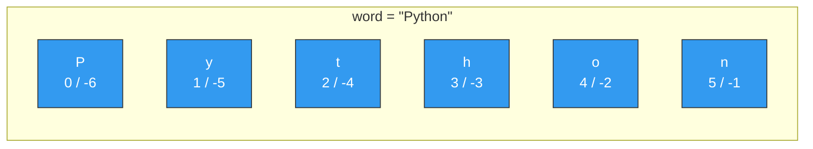

# 18. (Л) Робота з рядками

## Зміст лекції

1. Рядок як послідовність символів
2. Індекси та зрізи рядка
3. Незмінюваність рядка
4. Спеціальні символи та сирі рядки
5. Перебір рядка та перевірка входження
6. Регістр літер
7. Перевірка вмісту: `isdigit`, `isalpha` та інші
8. Пошук і підрахунок підрядків
9. Заміна та очищення: `replace`, `strip`
10. Розбиття та зʼєднання: `split`, `join`
11. Вирівнювання та форматування
12. Коди символів: `ord` і `chr`
13. Порівняння рядків
14. Як ефективно будувати рядок
15. Приклад: аналіз рядка з даними студентів
16. Типові помилки

## Рядок як послідовність символів

З рядками ми працюємо з першої лекції: `print("Hello")`, `input()`, f-рядки. На лекції 4 ми бачили, що рядки можна склеювати `+`, повторювати `*` і дізнаватися їхню довжину `len()`. Тепер розглянемо рядок як **послідовність** — таку саму, як список чи кортеж із лекції 14, тільки елементами є окремі символи.

```python
# Program: a string is a sequence of characters
word = "Python"

print(len(word))
print(word[0], word[-1])
print(list(word))
print("-".join(word))
```

```text
6
P n
['P', 'y', 't', 'h', 'o', 'n']
P-y-t-h-o-n
```



Окремого типу «символ» у Python немає: `word[0]` — це теж рядок, просто довжиною `1`.

Рядок записують в одинарних або подвійних лапках — різниці немає. Потрійні лапки дозволяють записати текст на кількох рядках:

```python
# Program: different ways to write a string
single = 'It is "Python"'
double = "It's Python"
multi = """first line
second line"""
empty = ""

print(single)
print(double)
print(multi)
print(len(empty), bool(empty))
```

```text
It is "Python"
It's Python
first line
second line
0 False
```

Порожній рядок `""` у логічному контексті хибний, будь-який непорожній — істинний. Тому перевірку «користувач нічого не ввів» зазвичай пишуть як `if not text:`.

## Індекси та зрізи рядка

Індекси та зрізи працюють точно так само, як для списків.

```python
# Program: indexing and slicing a string
code = "PZ-11-2025"

print(code[0])        # перший символ
print(code[-1])       # останній символ
print(code[:2])       # перші два символи
print(code[3:5])      # символи з 3 по 4
print(code[-4:])      # останні чотири символи
print(code[::2])      # кожен другий символ
print(code[::-1])     # рядок навпаки
```

```text
P
5
PZ
11
2025
P-122
5202-11-ZP
```

Нагадаємо правила зрізу `s[start:stop:step]`:

- `start` входить у результат, `stop` — ні;
- пропущений `start` означає «з початку», пропущений `stop` — «до кінця»;
- від'ємний `step` іде у зворотному напрямку, тому `s[::-1]` розвертає рядок.

Зріз ніколи не дає `IndexError`: якщо межі виходять за рядок, Python просто обріже їх. А от звернення за одним індексом — дає.

```python
# Program: slices are safe, single indexes are not
name = "Olha"

print(name[1:100])
print(repr(name[10:]))
# print(name[10])      -> IndexError: string index out of range
```

```text
lha
''
```

Функція `repr()` показує рядок разом із лапками — так порожній рядок видно на екрані.

## Незмінюваність рядка

Рядок, як і кортеж, **незмінюваний**: замінити символ усередині не можна.

```python
# Program: strings are immutable
name = "olha"
# name[0] = "O"        -> TypeError: 'str' object does not support item assignment

name = "O" + name[1:]
print(name)
```

```text
Olha
```

Рядок `"O" + name[1:]` — це **новий** обʼєкт; після присвоєння змінна `name` просто вказує на нього. Старий рядок `"olha"` не змінився.

Звідси важливе правило: **усі методи рядка повертають новий рядок**, а вихідний лишають без змін. Результат методу треба зберегти.

```python
# Program: string methods return a new string
city = "kyiv"

city.upper()           # результат ніде не збережено - виклик марний
print(city)

city = city.upper()
print(city)
```

```text
kyiv
KYIV
```

!!! warning "Порівняйте зі списками"
    У списку `tasks.append("x")` змінює сам список і повертає `None`. У рядку `city.upper()` нічого не змінює, а повертає новий рядок. Помилки в обидва боки — `tasks = tasks.append(...)` і `city.upper()` без присвоєння — дуже поширені.

## Спеціальні символи та сирі рядки

Деякі символи неможливо набрати в лапках напряму, тому їх записують через зворотну косу риску `\`:

| Запис | Значення |
|---|---|
| `\n` | новий рядок |
| `\t` | табуляція |
| `\\` | сама зворотна коса риска |
| `\'`, `\"` | лапка всередині рядка |

```python
# Program: escape sequences
print("Name:\tOlha\nGroup:\tPZ-11")
print("C:\\Users\\olha")
print(len("a\nb"))
```

```text
Name:	Olha
Group:	PZ-11
C:\Users\olha
3
```

`"a\nb"` має довжину `3`: `\n` — це **один** символ, хоч записаний двома.

Якщо зворотних косих рисок багато (шляхи до файлів, регулярні вирази), зручніше **сирий рядок** — з префіксом `r`. У ньому `\` не має спеціального значення:

```python
# Program: raw strings
path = r"C:\new\table"
print(path)
print(len(r"\n"))
```

```text
C:\new\table
2
```

Без `r` рядок `"C:\new\table"` містив би символ нового рядка (`\n`) і табуляцію (`\t`).

## Перебір рядка та перевірка входження

Цикл `for` перебирає рядок посимвольно — це ми вже робили на лекції 8. Оператор `in` для рядків перевіряє не лише окремий символ, а й цілий **підрядок**.

```python
# Program: iterate over a string and check substrings
text = "Python is fun"

vowels = 0
for char in text.lower():
    if char in "aeiou":
        vowels += 1
print(f"Vowels: {vowels}")

print("fun" in text)
print("Fun" in text)
print("java" not in text)
```

```text
Vowels: 3
True
False
True
```

Зверніть увагу на `char in "aeiou"` — рядок тут працює як компактний набір символів.

Якщо потрібен і символ, і його номер, використовуйте `enumerate()`:

```python
# Program: positions of a character
word = "banana"

for index, char in enumerate(word):
    if char == "a":
        print(f"'a' at position {index}")
```

```text
'a' at position 1
'a' at position 3
'a' at position 5
```

## Регістр літер

| Метод | Що робить | `"hello WORLD"` → |
|---|---|---|
| `upper()` | усі літери великі | `"HELLO WORLD"` |
| `lower()` | усі літери малі | `"hello world"` |
| `capitalize()` | перша літера велика, решта малі | `"Hello world"` |
| `title()` | кожне слово з великої | `"Hello World"` |
| `swapcase()` | міняє регістр кожної літери | `"HELLO world"` |

```python
# Program: change the case of letters
text = "hello WORLD"

print(text.upper())
print(text.lower())
print(text.capitalize())
print(text.title())
print(text.swapcase())
```

```text
HELLO WORLD
hello world
Hello world
Hello World
HELLO world
```

Найчастіше регістр змінюють для **порівняння без урахування регістру**: обидва рядки зводять до нижнього.

```python
# Program: case-insensitive comparison
answer = "YES"

if answer.lower() == "yes":
    print("Confirmed")
```

```text
Confirmed
```

## Перевірка вмісту: `isdigit`, `isalpha` та інші

Методи `is...()` повертають `True` чи `False` і не змінюють рядок.

| Метод | `True`, якщо... | Приклад `True` |
|---|---|---|
| `isdigit()` | усі символи — цифри | `"2025"` |
| `isalpha()` | усі символи — літери | `"Olha"` |
| `isalnum()` | усі символи — літери або цифри | `"PZ11"` |
| `isspace()` | усі символи — пробільні | `"  \t"` |
| `isupper()` | усі літери великі | `"PZ-11"` |
| `islower()` | усі літери малі | `"olha"` |
| `startswith(x)` | рядок починається з `x` | `"PZ-11".startswith("PZ")` |
| `endswith(x)` | рядок закінчується на `x` | `"task1.py".endswith(".py")` |

```python
# Program: check the content of strings
print("2025".isdigit(), "20.25".isdigit(), "-5".isdigit())
print("Olha".isalpha(), "Olha K".isalpha())
print("PZ11".isalnum(), "PZ-11".isalnum())
print("".isdigit())
print("report.pdf".endswith((".pdf", ".docx")))
```

```text
True False False
True False
True False
False
True
```

Кілька тонкощів:

- `isdigit()` не пропускає ні крапку, ні мінус: `"20.25"` і `"-5"` — не цифри.
- Пробіл — не літера, тож `"Olha K".isalpha()` дає `False`.
- Для порожнього рядка всі методи `is...()` повертають `False`.
- `startswith` і `endswith` приймають і кортеж варіантів.

Типове застосування — перевірити введення **до** перетворення в число, щоб `int()` не завершив програму помилкою:

```python
# Program: validate input before converting it
raw = input("Enter your age: ")

if raw.isdigit():
    age = int(raw)
    print(f"Next year you will be {age + 1}")
else:
    print("Please enter a whole number")
```

```text
Enter your age: 19
Next year you will be 20
```

## Пошук і підрахунок підрядків

| Метод | Результат |
|---|---|
| `s.find(x)` | індекс першого входження `x` або `-1` |
| `s.rfind(x)` | індекс останнього входження `x` або `-1` |
| `s.index(x)` | як `find`, але якщо `x` немає — `ValueError` |
| `s.count(x)` | скільки разів `x` трапляється в `s` (без перекриттів) |

```python
# Program: search inside a string
email = "olha.koval@student.edu.ua"

print(email.find("@"))
print(email.find("."))
print(email.rfind("."))
print(email.find("#"))
print(email.count("."))
# print(email.index("#"))   -> ValueError: substring not found
```

```text
10
4
22
-1
3
```

Знайдений індекс зазвичай одразу використовують у зрізі:

```python
# Program: split an email into login and domain
email = "olha.koval@student.edu.ua"

at = email.find("@")
login = email[:at]
domain = email[at + 1:]

print(login)
print(domain)
print(email[email.rfind(".") + 1:])
```

```text
olha.koval
student.edu.ua
ua
```

!!! tip "`find` чи `index`"
    Якщо відсутність підрядка — нормальна ситуація, беріть `find()` і перевіряйте `-1`. Якщо відсутність означає помилку в даних, `index()` одразу її покаже. Лише перевірити наявність — простіше через `in`.

## Заміна та очищення: `replace`, `strip`

`replace(old, new)` замінює **всі** входження підрядка; третій аргумент обмежує кількість замін.

```python
# Program: replace substrings
phone = "050-111-22-33"

print(phone.replace("-", ""))
print(phone.replace("-", " ", 1))
print("a b  c".replace(" ", ""))
```

```text
0501112233
050 111-22-33
abc
```

`strip()` прибирає пробільні символи (пробіли, `\t`, `\n`) **з країв** рядка; `lstrip()` — лише зліва, `rstrip()` — лише справа. Усередині рядка нічого не чіпається.

```python
# Program: strip whitespace and other characters
raw = "   Olha Koval \n"

print(repr(raw.strip()))
print(repr(raw.lstrip()))
print(repr(raw.rstrip()))
print("...Hello!!!".strip(".!"))
```

```text
'Olha Koval'
'Olha Koval \n'
'   Olha Koval'
Hello
```

Аргумент `strip(".!")` — це **набір символів**, а не підрядок: з країв прибирається будь-яка комбінація крапок і знаків оклику.

Очищення введення — `input().strip()` — корисна звичка: випадковий пробіл наприкінці не зламає порівняння.

```python
# Program: clean up user input
command = input("Command: ").strip().lower()

if command == "exit":
    print("Bye")
else:
    print(f"Unknown command: {command}")
```

```text
Command:   EXIT 
Bye
```

Методи можна викликати ланцюжком: кожен наступний працює з рядком, який повернув попередній.

## Розбиття та зʼєднання: `split`, `join`

### `split()`

`split()` розрізає рядок на **список** частин.

```python
# Program: split a string into parts
sentence = "  Python   is  easy  "
print(sentence.split())

line = "Olha;PZ-11;95"
print(line.split(";"))

date = "19.09.2026"
day, month, year = date.split(".")
print(day, month, year)

print("a,b,,c".split(","))
print("key=value=x".split("=", 1))
```

```text
['Python', 'is', 'easy']
['Olha', 'PZ-11', '95']
19 09 2026
['a', 'b', '', 'c']
['key', 'value=x']
```

- `split()` **без аргументу** ділить за будь-якою кількістю пробільних символів і відкидає порожні частини — ідеально для слів.
- `split(sep)` ділить точно за роздільником; два роздільники поспіль дають порожній рядок.
- Другий аргумент — максимальна кількість розрізів.
- Результат зручно одразу розпакувати в змінні, як на лекції 14.

Числа після `split()` лишаються рядками — їх треба перетворити:

```python
# Program: read several numbers from one line
raw = input("Enter grades: ")
grades = [int(part) for part in raw.split()]

print(grades)
print(f"Average: {sum(grades) / len(grades):.1f}")
```

```text
Enter grades: 90 85 77
[90, 85, 77]
Average: 84.0
```

`splitlines()` ділить текст на рядки за символами нового рядка:

```python
# Program: split text into lines
text = "first\nsecond\nthird"
for number, line in enumerate(text.splitlines(), start=1):
    print(number, line)
```

```text
1 first
2 second
3 third
```

### `join()`

`join()` робить протилежне: склеює список рядків в один, вставляючи між ними роздільник. Метод викликають у **роздільника**:

```python
# Program: join strings with a separator
words = ["Python", "is", "easy"]

print(" ".join(words))
print("-".join(words))
print("".join(words))
print(", ".join(["Kyiv", "Lviv", "Odesa"]))

numbers = [1, 2, 3]
print(" + ".join(str(n) for n in numbers))
```

```text
Python is easy
Python-is-easy
Pythoniseasy
Kyiv, Lviv, Odesa
1 + 2 + 3
```

`join()` приймає лише рядки: `" ".join([1, 2, 3])` дасть `TypeError`. Числа спочатку перетворюють через `str()`.

Разом `split` і `join` розвʼязують багато задач одним рядком:

```python
# Program: typical split + join tricks
text = "  too    many   spaces  "
print(" ".join(text.split()))

sentence = "Python is easy"
print(" ".join(reversed(sentence.split())))
print(" ".join(word[::-1] for word in sentence.split()))

full_name = "koval olha petrivna"
print("".join(part[0].upper() for part in full_name.split()))
```

```text
too many spaces
easy is Python
nohtyP si ysae
KOP
```

### `partition()`

Коли рядок треба поділити за **першим** роздільником рівно на дві частини, зручний `partition()`. Він повертає кортеж із трьох елементів: частина до, сам роздільник, частина після.

```python
# Program: partition a string
print("name=Olha".partition("="))
print("no separator".partition("="))

key, _, value = "group=PZ-11".partition("=")
print(key, value)
```

```text
('name', '=', 'Olha')
('no separator', '', '')
group PZ-11
```

На відміну від `split()` з розпакуванням, `partition()` не падає, якщо роздільника немає.

## Вирівнювання та форматування

### Методи вирівнювання

```python
# Program: align strings
word = "Python"

print(f"[{word.ljust(10)}]")
print(f"[{word.rjust(10)}]")
print(f"[{word.center(10)}]")
print(f"[{word.center(10, '*')}]")
print("7".zfill(3), "42".zfill(3))
```

```text
[Python    ]
[    Python]
[  Python  ]
[**Python**]
007 042
```

`zfill()` доповнює рядок нулями зліва — зручно для номерів і часу.

### Специфікатор формату в f-рядку

Те саме і навіть більше вміє f-рядок. Після двокрапки всередині `{}` пишуть **специфікатор формату**:

| Запис | Значення | `x = 3.14159`, `s = "Ok"` |
|---|---|---|
| `{s:<6}` | ширина 6, вирівнювання вліво | `Ok    ` |
| `{s:>6}` | ширина 6, вправо | `    Ok` |
| `{s:^6}` | ширина 6, по центру | `  Ok  ` |
| `{s:*^6}` | заповнювач `*` | `**Ok**` |
| `{x:.2f}` | 2 знаки після коми | `3.14` |
| `{x:8.2f}` | ширина 8, 2 знаки | `    3.14` |
| `{7:03}` | ширина 3, доповнення нулями | `007` |
| `{1234567:,}` | розділення тисяч | `1,234,567` |
| `{0.256:.1%}` | відсотки | `25.6%` |

```python
# Program: format a table with f-strings
students = [("Olha", 95.5), ("Petro", 78.25), ("Iryna", 100)]

print(f"{'Name':<8}|{'Score':>7}")
print("-" * 16)
for name, score in students:
    print(f"{name:<8}|{score:>7.1f}")
```

```text
Name    |  Score
----------------
Olha    |   95.5
Petro   |   78.2
Iryna   |  100.0
```

Специфікатор може залежати від змінної: `f"{name:<{width}}"`.

!!! info "Округлення `78.25` до `78.2`"
    Python округлює до найближчого парного («банківське» округлення), до того ж `78.25` у двійковій системі записано неточно. Для виводу це не проблема, але для грошових розрахунків таке округлення не підходить.

## Коди символів: `ord` і `chr`

Кожен символ у компʼютері — це число, його **код** у таблиці Unicode. `ord()` повертає код символу, `chr()` — символ за кодом.

```python
# Program: character codes
print(ord("A"), ord("a"), ord("0"))
print(chr(66), chr(98))
print(chr(ord("a") + 2))

alphabet = "".join(chr(code) for code in range(ord("a"), ord("z") + 1))
print(alphabet)
```

```text
65 97 48
B b
c
abcdefghijklmnopqrstuvwxyz
```

Латинські літери та цифри йдуть поспіль, тому з кодами можна виконувати арифметику. Класичний приклад — шифр Цезаря, де кожна літера зсувається на кілька позицій алфавіту:

```python
# Program: Caesar cipher for lowercase Latin letters


def caesar(text, shift):
    """Shift every lowercase Latin letter by the given number of positions."""
    result = []
    for char in text:
        if "a" <= char <= "z":
            position = (ord(char) - ord("a") + shift) % 26
            result.append(chr(ord("a") + position))
        else:
            result.append(char)
    return "".join(result)


secret = caesar("hello, world", 3)
print(secret)
print(caesar(secret, -3))
```

```text
khoor, zruog
hello, world
```

`% 26` «загортає» алфавіт: після `z` знову йде `a`.

!!! tip "Готові набори символів"
    Модуль `string` містить готові рядки: `string.ascii_lowercase`, `string.ascii_uppercase`, `string.digits`, `string.punctuation`. Про модулі та `import` детально поговоримо пізніше, але користуватися цими рядками можна вже зараз: `import string` на початку програми.

## Порівняння рядків

Рядки порівнюються **посимвольно за кодами**: перші символи, якщо рівні — другі, і так далі. Тому:

```python
# Program: compare strings
print("apple" < "banana")
print("apple" < "apricot")
print("app" < "apple")
print("Zebra" < "apple")
print("10" < "9")
print(sorted(["banana", "Apple", "cherry"]))
print(sorted(["banana", "Apple", "cherry"], key=str.lower))
```

```text
True
True
True
True
True
['Apple', 'banana', 'cherry']
['Apple', 'banana', 'cherry']
```

- Коротший рядок, що є початком довшого, менший: `"app" < "apple"`.
- Великі латинські літери мають менші коди, ніж малі: `"Zebra" < "apple"`.
- Рядки з цифр порівнюються не як числа: `"10" < "9"`, бо `"1" < "9"`. Щоб порівняти числа, спершу перетворіть їх `int()`.
- `key=str.lower` сортує без урахування регістру.

## Як ефективно будувати рядок

Рядок незмінюваний, тому `result += char` щоразу створює **новий** рядок і копіює в нього все накопичене. Для коротких рядків різниці не видно, але при тисячах повторень це повільно.

Надійний прийом — збирати частини у **список**, а наприкінці один раз склеїти через `join()`:

```python
# Program: build a string from parts


def only_digits(text):
    """Return a string with all digits from text."""
    parts = []
    for char in text:
        if char.isdigit():
            parts.append(char)
    return "".join(parts)


print(only_digits("tel: +38 (050) 111-22-33"))
print("".join(char for char in "PZ-11-2025" if char.isdigit()))
```

```text
380501112233
112025
```

Другий рядок — те саме одним виразом: генератор усередині `join()`.

## Приклад: аналіз рядка з даними студентів

Зберемо все разом. Програма отримує текст, у якому кожен рядок описує студента у форматі `surname;name;group;grades`. Дані «брудні»: зайві пробіли, різний регістр, порожні рядки. Треба їх очистити і побудувати звіт.

```python
# Program: parse and report student records from raw text

RAW_DATA = """
  koval; olha ;pz-11; 95 88 100
PETRENKO;Petro;PZ-12;70 65 81

bondar ;IRYNA; pz-11 ;90 92
shevchenko;andrii;PZ-12;
"""


def parse_line(line):
    """Turn one raw line into a dictionary or return None for an empty line."""
    line = line.strip()
    if not line:
        return None

    surname, name, group, grades_text = [part.strip() for part in line.split(";")]
    grades = [int(grade) for grade in grades_text.split()]

    return {
        "surname": surname.capitalize(),
        "name": name.capitalize(),
        "group": group.upper(),
        "grades": grades,
    }


def make_login(student):
    """Build a login: first letter of the name + surname, in lowercase."""
    return (student["name"][0] + student["surname"]).lower()


def print_report(students):
    """Print a formatted table of students."""
    print(f"{'Student':<20}{'Group':<7}{'Login':<12}{'Avg':>5}")
    print("-" * 44)
    for student in students:
        full_name = f"{student['surname']} {student['name'][0]}."
        grades = student["grades"]
        average = f"{sum(grades) / len(grades):.1f}" if grades else "-"
        print(f"{full_name:<20}{student['group']:<7}{make_login(student):<12}{average:>5}")
    print("-" * 44)


def main():
    students = []
    for line in RAW_DATA.splitlines():
        student = parse_line(line)
        if student is not None:
            students.append(student)

    print_report(students)

    initials = ", ".join(s["surname"][0] + s["name"][0] for s in students)
    print(f"Initials: {initials}")

    longest = max(students, key=lambda s: len(s["surname"]))
    print(f"Longest surname: {longest['surname']} ({len(longest['surname'])} letters)")


main()
```

```text
Student             Group  Login         Avg
--------------------------------------------
Koval O.            PZ-11  okoval       94.3
Petrenko P.         PZ-12  ppetrenko    72.0
Bondar I.           PZ-11  ibondar      91.0
Shevchenko A.       PZ-12  ashevchenko     -
--------------------------------------------
Initials: KO, PP, BI, SA
Longest surname: Shevchenko (10 letters)
```

Розберемо кілька місць:

- `RAW_DATA.splitlines()` — текст ділиться на рядки; порожні рядки `parse_line` відкидає через `if not line`.
- `[part.strip() for part in line.split(";")]` — `split` розрізає рядок на поля, а списковий вираз очищає кожне поле від пробілів. Результат одразу розпаковується в чотири змінні.
- `grades_text.split()` без аргументу коректно обробляє і кілька пробілів поспіль, і порожній рядок (дає порожній список) — тому у Шевченка немає помилки, а стоїть `-`.
- `capitalize()` і `upper()` зводять імена та групи до єдиного вигляду, хоч би як їх записали у вихідних даних.
- `f"{full_name:<20}"` — специфікатор формату вирівнює колонки таблиці.
- `", ".join(...)` збирає ініціали в один рядок без зайвої коми наприкінці.

## Типові помилки

| Помилка | Причина | Виправлення |
|---|---|---|
| `TypeError: 'str' object does not support item assignment` | спроба змінити символ рядка | побудувати новий рядок зрізами або `replace` |
| Метод «не спрацював», рядок той самий | результат методу не збережено | `s = s.upper()` |
| `TypeError: can only concatenate str (not "int") to str` | склеювання рядка з числом через `+` | `str(n)` або f-рядок |
| `TypeError: sequence item 0: expected str instance, int found` | `join()` зі списком чисел | `" ".join(str(n) for n in numbers)` |
| `ValueError: substring not found` | `index()` не знайшов підрядок | `find()` і перевірка `-1` або `in` |
| `ValueError: invalid literal for int()` | у рядку пробіли, крапка чи літери | `strip()`, перевірка `isdigit()` |
| `ValueError: not enough values to unpack` | `split()` дав менше частин, ніж змінних | перевірити кількість частин або `partition()` |
| `"10" < "9"` дає `True` | рядки порівнюються посимвольно | перетворити на числа `int()` |
| `"Kyiv" == "kyiv "` дає `False` | регістр і зайві пробіли | `a.strip().lower() == b.strip().lower()` |
| `"C:\new"` виводиться з переносом рядка | `\n` — спецсимвол | сирий рядок `r"C:\new"` |

```python
# 1. методи не змінюють рядок
city = "kyiv"
city.upper()
print(city)
city = city.upper()
print(city)

# 2. join працює лише з рядками
numbers = [1, 2, 3]
print(", ".join(str(n) for n in numbers))

# 3. рядкове порівняння - не числове
print("10" < "9", int("10") < int("9"))

# 4. зайві пробіли і регістр
print("Kyiv" == "kyiv ", "Kyiv".lower() == "kyiv ".strip().lower())
```

```text
kyiv
KYIV
1, 2, 3
True False
False True
```

## Підсумок

- Рядок — **незмінювана послідовність** символів: індекси, зрізи, `len`, `in`, перебір `for` працюють так само, як для списку і кортежа.
- Змінити символ на місці не можна; **кожен метод повертає новий рядок**, тож результат треба зберегти.
- `\n`, `\t`, `\\` — спецсимволи; у сирому рядку `r"..."` зворотна коса риска звичайна.
- Регістр: `upper`, `lower`, `capitalize`, `title`, `swapcase`. Порівняння без регістру — через `lower()`.
- Перевірки: `isdigit`, `isalpha`, `isalnum`, `isspace`, `startswith`, `endswith`.
- Пошук: `in`, `find` (дає `-1`), `index` (дає `ValueError`), `rfind`, `count`.
- Очищення та заміна: `strip`, `lstrip`, `rstrip`, `replace`.
- `split()` розрізає рядок на список, `join()` склеює список рядків; `partition()` ділить за першим роздільником на три частини.
- Вирівнювання: `ljust`, `rjust`, `center`, `zfill` або специфікатор формату в f-рядку `{x:>8.2f}`.
- `ord()` і `chr()` перетворюють символ на код і назад.
- Рядки порівнюються посимвольно за кодами; `"10" < "9"`.
- Довгий рядок краще збирати у список частин і склеювати одним `join()`.

## Корисні посилання

- [Рядки — підручник Python](https://docs.python.org/3/tutorial/introduction.html#text)
- [Методи рядків — довідник](https://docs.python.org/3/library/stdtypes.html#string-methods)
- [Специфікатор формату](https://docs.python.org/3/library/string.html#format-specification-mini-language)
- [f-рядки — довідник](https://docs.python.org/3/reference/lexical_analysis.html#f-strings)
- [Модуль `string`](https://docs.python.org/3/library/string.html)

## Домашнє завдання

Мета — навчитися опрацьовувати рядки методами, індексами та зрізами, розбирати текст на частини і форматувати результат. Усі дані — **ваші власні**, латиницею.

1. Запишіть своє повне імʼя рядком `"surname name patronymic"` у нижньому регістрі. Виведіть: довжину рядка; перший і останній символ; прізвище через зріз (знайдіть межу через `find(" ")`); рядок навпаки; імʼя у форматі `Surname N. P.`; ініціали великими літерами без крапок.

2. Попросіть користувача ввести групу. Приберіть зайві пробіли, переведіть у верхній регістр і перевірте: чи починається вона з вашої спеціальності (наприклад, `"PZ"`), чи є в ній дефіс, чи є частина після дефіса числом (`isdigit`). Виведіть результат кожної перевірки.

3. Візьміть речення про себе з щонайменше восьми слів. Виведіть: кількість слів; найдовше слово; слова в зворотному порядку; кількість голосних; речення, де кожне слово з великої літери; речення, в якому всі пробіли замінено на `_`.

4. Напишіть функцію `is_palindrome(text)`, яка ігнорує регістр, пробіли та розділові знаки. Перевірте її на своєму імені, на `"Was it a car or a cat I saw?"` і на ще двох власних прикладах.

5. Складіть рядок зі своїми оцінками через кому з пробілами, наприклад `"95, 88, 100, 73"`. Отримайте з нього список чисел, виведіть середнє з двома знаками після коми, найвищу та найнижчу оцінку, а також оцінки, склеєні через `" | "`.

6. Напишіть функцію `make_email(name, surname)`, яка повертає адресу у форматі `n.surname@student.edu.ua` у нижньому регістрі. Виведіть адреси для себе і трьох одногрупників у вигляді таблиці з вирівняними колонками (f-рядок зі специфікатором ширини).

7. Зашифруйте своє імʼя шифром Цезаря зі зсувом, що дорівнює дню вашого народження. Виведіть зашифрований рядок і розшифрований назад. Поясніть одним реченням, навіщо в обчисленні потрібна операція `% 26`.

8. Дослід із порівнянням. Відсортуйте список `["banana", "Apple", "cherry", "10", "9"]` звичайним `sorted()` і з `key=str.lower`. Виведіть коди перших символів кожного рядка через `ord()` і двома реченнями поясніть отриманий порядок.
