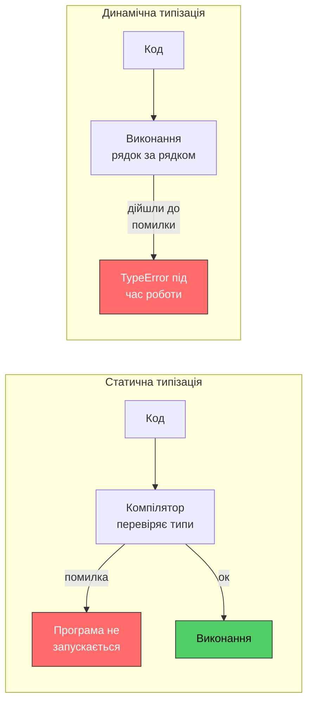
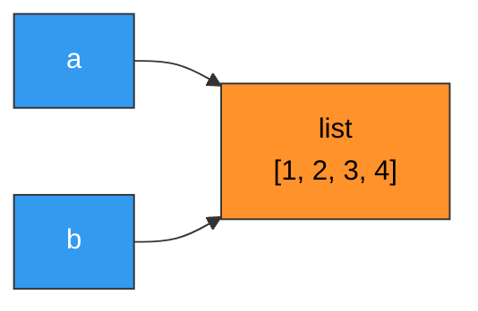
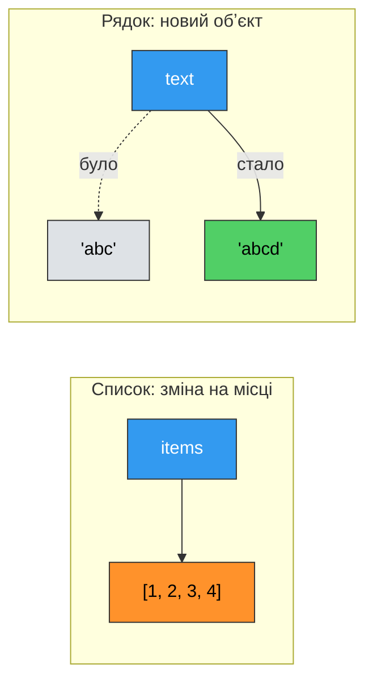
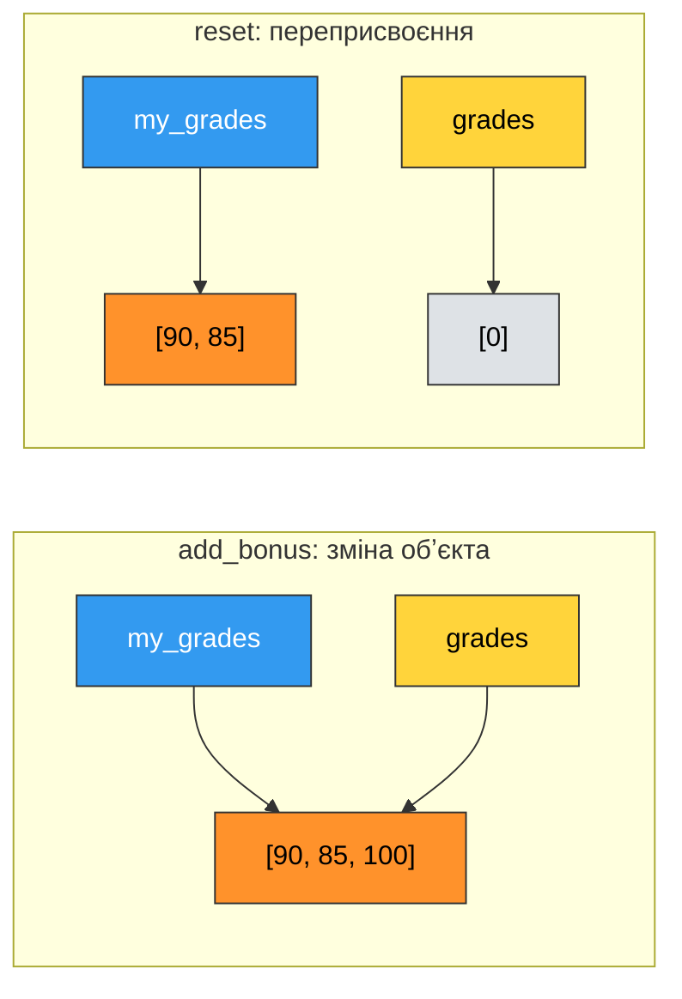
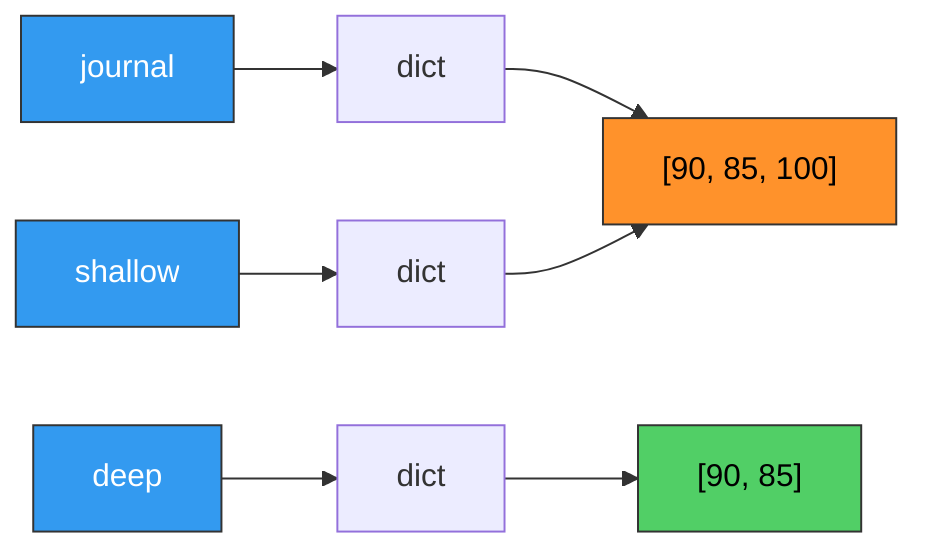

# 20. (Л) Типізація. Змінювані та незмінювані обʼєкти

## Зміст лекції

1. Що таке тип
2. Статична і динамічна типізація
3. Сильна і слабка типізація
4. Змінна — це імʼя, а не коробка
5. Ідентичність, тип і значення обʼєкта
6. Змінювані та незмінювані обʼєкти
7. Що насправді робить `+=`
8. Обʼєкти у функціях
9. Пастка: змінюване значення за замовчуванням
10. Вкладені структури та глибока копія
11. Типізація у Python 3.10+: анотації
12. Типи колекцій: `list[int]`, `dict[str, int]`
13. Обʼєднання типів: `int | float`, `str | None`
14. Псевдоніми типів, `Any` і `Final`
15. Статична перевірка типів: mypy
16. Приклад: типізований журнал оцінок
17. Типові помилки

## Що таке тип

Кожне значення в Python має **тип** (type). Тип визначає дві речі: які значення можливі і які операції з ними дозволені.

```python
# Program: every value has a type
print(type(42))
print(type(3.5))
print(type("42"))
print(type([4, 2]))
print(type(None))
```

```text
<class 'int'>
<class 'float'>
<class 'str'>
<class 'list'>
<class 'NoneType'>
```

`42` і `"42"` виглядають схоже, але поводяться зовсім по-різному: число можна множити й ділити, а рядок — переводити у верхній регістр чи розбивати на частини. Одна й та сама операція `+` для чисел означає додавання, а для рядків — склеювання:

```python
# Program: the same operator depends on the type
print(42 + 8)
print("42" + "8")
print([4, 2] + [8])
```

```text
50
428
[4, 2, 8]
```

Отже, щоб виконати `a + b`, мова мусить знати типи `a` і `b`. Питання лише в тому, **коли** вона їх дізнається — і саме тут мови програмування поділяються на два табори.

## Статична і динамічна типізація

### Статична типізація

У мовах зі **статичною типізацією** (Java, C, C++, C#, Go, Rust) тип закріплений за **змінною**. Його вказують (або компілятор виводить) під час написання програми, і він не змінюється. Перевірка типів відбувається **до запуску** — під час компіляції.

Сам Python так не працює, але змоделювати цю поведінку можна: закріпимо тип за змінною через **анотацію** і доручимо перевірку окремому інструменту — статичному аналізатору mypy (докладно про нього в кінці лекції).

```python
# Program: the type is fixed for the variable
age: int = 20
age = "twenty"      # тип не збігається з оголошеним
print(age)
```

Перевірка до запуску:

```bash
mypy main.py
```

```text
main.py:3: error: Incompatible types in assignment (expression has type "str", variable has type "int")  [assignment]
Found 1 error in 1 file (checked 1 source file)
```

Аналізатор знайшов помилку, хоча програма ще жодного разу не виконувалася. Саме так поводиться компілятор у мовах зі статичною типізацією, з однією різницею: там програму з такою помилкою взагалі неможливо запустити, а в Python `python3 main.py` виконається і виведе `twenty`.

### Динамічна типізація

У мовах із **динамічною типізацією** (Python, JavaScript, Ruby, PHP) тип закріплений за **значенням**, а не за змінною. Та сама змінна може послідовно посилатися на значення різних типів. Типи перевіряються **під час виконання** — у той момент, коли виконується конкретний рядок.

```python
# Program: one variable, values of different types
value = 20
print(value, type(value))

value = "twenty"
print(value, type(value))

value = [20]
print(value, type(value))
```

```text
20 <class 'int'>
twenty <class 'str'>
[20] <class 'list'>
```

Помилка типу в Python виявляється лише тоді, коли виконання дійде до проблемного рядка:

```python
# Program: a type error is found only at run time
def describe(age):
    if age >= 18:
        return "adult"
    return "minor, age " + age     # помилка: str + int


print(describe(20))
print(describe(15))
```

```text
adult
Traceback (most recent call last):
  File "main.py", line 9, in <module>
    print(describe(15))
          ~~~~~~~~^^^^
  File "main.py", line 5, in describe
    return "minor, age " + age     # помилка: str + int
           ~~~~~~~~~~~~~~^~~~~
TypeError: can only concatenate str (not "int") to str
```

Перший виклик відпрацював без проблем. Якби ми тестували програму лише на дорослих, помилка дожила б до користувача.



### Переваги та недоліки

| | Статична | Динамічна |
|---|---|---|
| Коли знаходяться помилки типів | до запуску | під час виконання |
| Обсяг коду | більший: треба оголошувати типи | менший, код коротший |
| Швидкість написання прототипу | нижча | вища |
| Підказки редактора | точні | обмежені |
| Великі проєкти, рефакторинг | безпечніше | ризиковано без тестів |
| Швидкість виконання | зазвичай вища | зазвичай нижча |

### Качина типізація

Динамічна типізація дозволяє писати функції, яким байдуже, **який саме** тип їм передали, — важливо лише, щоб обʼєкт умів те, що з ним роблять. Цей підхід називають **качиною типізацією** (duck typing): «якщо щось ходить як качка і крякає як качка — це качка».

```python
# Program: duck typing - any object that supports len() and iteration works
def summary(items):
    return f"{len(items)} items, first: {next(iter(items))}"


print(summary("Python"))
print(summary([10, 20, 30]))
print(summary((7, 8)))
print(summary({"Olha": 90, "Petro": 75}))
```

```text
6 items, first: P
3 items, first: 10
2 items, first: 7
2 items, first: Olha
```

Функція `summary` працює з рядком, списком, кортежем і словником, бо всі вони підтримують `len()` і перебір.

## Сильна і слабка типізація

Це **інша** вісь класифікації, яку часто плутають зі статичною/динамічною. Вона відповідає на питання: чи перетворює мова типи **автоматично**, коли в операції зустрічаються несумісні значення?

Python — мова із **сильною** (strong) типізацією: він не вгадує, що ви мали на увазі.

```python
# Program: Python does not convert types implicitly
print("5" * 3)
print(int("5") + 5)
print("5" + str(5))
# print("5" + 5)       -> TypeError: can only concatenate str (not "int") to str
```

```text
555
10
55
```

JavaScript — мова зі **слабкою** (weak) типізацією: `"5" + 5` там дає `"55"`, а `"5" - 2` дає `3`. Такі неявні перетворення зручні, доки не призводять до важких для пошуку помилок.

| | Сильна | Слабка |
|---|---|---|
| **Статична** | Java, Rust, Go | C |
| **Динамічна** | **Python**, Ruby | JavaScript, PHP |

!!! info "Невеликий виняток"
    Деякі неявні перетворення Python усе ж робить — там, де вони безпечні і не втрачають інформацію: `1 + 2.5` дає `3.5` (`int` → `float`), `True + 1` дає `2` (`bool` — підтип `int`). Але між числами й рядками — ніколи.

## Змінна — це імʼя, а не коробка

На лекції 14 ми побачили, що присвоєння списку не створює копії. Тепер узагальнимо: у Python **кожна** змінна — це лише **імʼя**, яке посилається на обʼєкт у памʼяті. Сам обʼєкт живе окремо від імені.

```python
# Program: names refer to objects
a = [1, 2, 3]
b = a

b.append(4)
print(a)
print(a is b)
```

```text
[1, 2, 3, 4]
True
```

Корисно уявляти змінну не як коробку, в яку поклали значення, а як **ярлик**, приклеєний до обʼєкта. На один обʼєкт можна приклеїти скільки завгодно ярликів.



Саме тому в Python тип належить обʼєкту: ярлик `a` не має типу, тип має список, до якого він приклеєний.

## Ідентичність, тип і значення обʼєкта

Кожен обʼєкт у Python має три характеристики:

| Характеристика | Як отримати | Чи може змінитися |
|---|---|---|
| **Ідентичність** (identity) | `id(obj)`, оператор `is` | ніколи |
| **Тип** (type) | `type(obj)`, `isinstance()` | ніколи |
| **Значення** (value) | сам обʼєкт, оператор `==` | залежить від типу |

```python
# Program: identity, type and value
x = [1, 2]
y = [1, 2]
z = x

print(f"x == y: {x == y}")
print(f"x is y: {x is y}")
print(f"x is z: {x is z}")
print(f"id(x) == id(z): {id(x) == id(z)}")
print(f"type: {type(x).__name__}")
```

```text
x == y: True
x is y: False
x is z: True
id(x) == id(z): True
type: list
```

`x` і `y` рівні за значенням, але це два різні обʼєкти. `x` і `z` — один обʼєкт під двома іменами.

### `isinstance()` замість `type() ==`

Перевіряти тип значення найкраще через `isinstance()`. Вона правильно працює з підтипами і вміє перевіряти кілька типів одразу:

```python
# Program: checking the type of a value
def is_number(value):
    return isinstance(value, int | float) and not isinstance(value, bool)


print(is_number(5))
print(is_number(2.5))
print(is_number("5"))
print(is_number(True))
```

```text
True
True
False
False
```

Запис `int | float` у `isinstance()` доступний з Python 3.10; у старіших версіях писали кортеж `isinstance(value, (int, float))`. Перевірка на `bool` потрібна, бо `True` формально теж `int`.

## Змінювані та незмінювані обʼєкти

Ідентичність і тип обʼєкта ніколи не змінюються. А от **значення** — залежно від типу:

- **Змінюваний** (mutable) обʼєкт можна змінити «на місці»: `id` лишається тим самим, а вміст інший.
- **Незмінюваний** (immutable) обʼєкт після створення змінити неможливо. Будь-яка «зміна» насправді створює **новий** обʼєкт.

| Незмінювані (immutable) | Змінювані (mutable) |
|---|---|
| `int`, `float`, `bool` | `list` |
| `str` | `dict` |
| `tuple` | `set` |
| `frozenset` | |
| `None` | |

```python
# Program: a list changes in place, a string does not
items = [1, 2, 3]
items_id = id(items)
items.append(4)
print(f"list:   same object after change: {id(items) == items_id}")

text = "abc"
text_id = id(text)
text = text + "d"
print(f"string: same object after change: {id(text) == text_id}")
```

```text
list:   same object after change: True
string: same object after change: False
```

Список змінився сам. А рядок `"abc"` залишився недоторканим — зʼявився новий рядок `"abcd"`, і імʼя `text` переклеїли на нього.



### Незмінюваний — не те саме, що константа

Незмінюваність стосується **обʼєкта**, а не **імені**. Імʼя завжди можна переприсвоїти:

```python
# Program: an immutable object vs a reassignable name
count = 10
count = count + 1     # число 10 не змінилося - count тепер вказує на 11
print(count)
```

```text
11
```

Число `10` лишилося числом `10`. Змінилося лише те, на що вказує імʼя `count`. Справжніх констант у Python немає — є домовленість писати їх `ВЕЛИКИМИ_ЛІТЕРАМИ` (`MAX_GRADE = 100`) і не переприсвоювати. Нижче побачимо, як попросити статичний аналізатор стежити за цим.

### Навіщо потрібна незмінюваність

- **Безпечне спільне використання.** Якщо обʼєкт не можна змінити, його можна спокійно передавати в будь-які функції — ніхто його не зіпсує.
- **Хешованість.** Ключем словника й елементом множини може бути лише незмінюваний обʼєкт (лекція 16): його хеш ніколи не зміниться.
- **Передбачуваність.** Дивлячись на `name = "Olha"`, можна бути певним: хоч би що відбувалося в програмі далі, цей рядок буде саме `"Olha"`.

```python
# Program: only immutable objects can be dict keys
distances = {("Kyiv", "Lviv"): 540}
print(distances[("Kyiv", "Lviv")])

print(hash("Kyiv") == hash("Kyiv"))
# distances[["Kyiv", "Odesa"]] = 475    -> TypeError: unhashable type: 'list'
```

```text
540
True
```

## Що насправді робить `+=`

Оператор `+=` виглядає однаково для всіх типів, але поводиться по-різному:

- для **змінюваного** обʼєкта він змінює обʼєкт на місці;
- для **незмінюваного** — створює новий і переприсвоює імʼя.

Різниця стає помітною, коли на обʼєкт посилаються два імені:

```python
# Program: += on immutable and mutable objects
a = 5
b = a
a += 1
print(f"int:   a={a}, b={b}")

s = "hi"
t = s
s += "!"
print(f"str:   s={s}, t={t}")

x = (1, 2)
y = x
x += (3,)
print(f"tuple: x={x}, y={y}")

p = [1, 2]
q = p
p += [3]
print(f"list:  p={p}, q={q}")
```

```text
int:   a=6, b=5
str:   s=hi!, t=hi
tuple: x=(1, 2, 3), y=(1, 2)
list:  p=[1, 2, 3], q=[1, 2, 3]
```

Для чисел, рядків і кортежів друге імʼя зберегло старе значення. Для списку зміна видна через обидва імені: `p += [3]` — це те саме, що `p.extend([3])`.

!!! warning "`p += [3]` і `p = p + [3]` — не одне й те саме"
    ```python
    p = [1, 2]
    q = p
    p = p + [3]      # новий список, q не змінюється

    print(p, q)
    ```

    ```text
    [1, 2, 3] [1, 2]
    ```

    `p + [3]` створює **новий** список, а `p += [3]` змінює **наявний**.

## Обʼєкти у функціях

У функцію передається **посилання на обʼєкт**, а не його копія. Параметр функції — це ще один ярлик на той самий обʼєкт. Наслідки залежать від того, що функція робить із параметром.

### Зміна змінюваного обʼєкта видна ззовні

```python
# Program: a function mutates a list passed to it
def add_bonus(grades):
    grades.append(100)


my_grades = [90, 85]
add_bonus(my_grades)
print(my_grades)
```

```text
[90, 85, 100]
```

### Переприсвоєння параметра ззовні не видно

```python
# Program: rebinding a parameter does not affect the caller
def reset(grades):
    grades = []          # параметр тепер вказує на новий список
    grades.append(0)


my_grades = [90, 85]
reset(my_grades)
print(my_grades)
```

```text
[90, 85]
```



### Незмінюваний обʼєкт функція змінити не може

```python
# Program: a function cannot change an int passed to it
def increment(n):
    n += 1               # новий обʼєкт, лише локальне імʼя n
    return n


count = 5
increment(count)
print(count)

count = increment(count)
print(count)
```

```text
5
6
```

Щоб отримати новий результат із незмінюваного обʼєкта, функція має його **повернути**, а викликач — **зберегти**.

### Добра практика: не змінюйте аргументи без потреби

Функція, яка тихо змінює переданий список, — часте джерело помилок: викликач не очікує, що його дані зміняться. Якщо зміна не є прямою метою функції, будуйте й повертайте новий обʼєкт:

```python
# Program: return a new list instead of mutating the argument
def normalized(grades):
    """Return grades clipped to the range 0..100."""
    return [min(max(g, 0), 100) for g in grades]


raw = [95, 105, -3, 80]
clean = normalized(raw)
print(f"raw:   {raw}")
print(f"clean: {clean}")
```

```text
raw:   [95, 105, -3, 80]
clean: [95, 100, 0, 80]
```

Та сама домовленість є в самому Python: `sorted(items)` повертає новий список, а `items.sort()` змінює наявний і повертає `None` — назва методу й документація чесно про це кажуть.

## Пастка: змінюване значення за замовчуванням

Значення параметра за замовчуванням обчислюється **один раз** — коли Python виконує рядок `def`, а не при кожному виклику. Якщо це змінюваний обʼєкт, усі виклики ділитимуть **той самий** обʼєкт:

```python
# Program: the mutable default argument trap
def add_student(name, group=[]):
    group.append(name)
    return group


print(add_student("Olha"))
print(add_student("Petro"))
print(add_student("Iryna"))
```

```text
['Olha']
['Olha', 'Petro']
['Olha', 'Petro', 'Iryna']
```

Кожен виклик мав би повертати новий список з одного імені, але список «памʼятає» попередні виклики. Правильний прийом — використати `None` як значення за замовчуванням і створити новий список усередині функції:

```python
# Program: use None as the default for a mutable parameter
def add_student(name, group=None):
    if group is None:
        group = []
    group.append(name)
    return group


print(add_student("Olha"))
print(add_student("Petro"))

team = ["Iryna"]
print(add_student("Taras", team))
```

```text
['Olha']
['Petro']
['Iryna', 'Taras']
```

!!! tip "Правило"
    Значення за замовчуванням — лише незмінювані обʼєкти: числа, рядки, кортежі, `None`. Для списку, словника чи множини — `None` і створення всередині функції.

## Вкладені структури та глибока копія

### Пастка множення списку

```python
# Program: [[0] * 3] * 3 creates three references to ONE row
grid = [[0] * 3] * 3
grid[0][0] = 5
print(grid)
print(grid[0] is grid[1])
```

```text
[[5, 0, 0], [5, 0, 0], [5, 0, 0]]
True
```

`* 3` копіює **посилання**, а не рядки таблиці: вийшов список із трьох ярликів на один і той самий внутрішній список. Для чисел у `[0] * 3` це не проблема — число незмінюване, і `grid[0][0] = 5` просто переклеює ярлик. А от внутрішній список спільний.

Правильно — створювати кожен рядок окремо списковим виразом:

```python
# Program: build independent rows with a comprehension
grid = [[0] * 3 for _ in range(3)]
grid[0][0] = 5
print(grid)
print(grid[0] is grid[1])
```

```text
[[5, 0, 0], [0, 0, 0], [0, 0, 0]]
False
```

### Неглибока і глибока копія

На лекції 14 ми бачили, що `copy()` робить **неглибоку** (shallow) копію: новий зовнішній список, але ті самі вкладені обʼєкти. Щоб скопіювати структуру повністю, на всю глибину, використовують `deepcopy()` із модуля `copy`:

```python
# Program: shallow copy vs deep copy
import copy

journal = {"Olha": [90, 85], "Petro": [70]}

shallow = journal.copy()
deep = copy.deepcopy(journal)

journal["Olha"].append(100)

print(f"journal: {journal}")
print(f"shallow: {shallow}")
print(f"deep:    {deep}")
```

```text
journal: {'Olha': [90, 85, 100], 'Petro': [70]}
shallow: {'Olha': [90, 85, 100], 'Petro': [70]}
deep:    {'Olha': [90, 85], 'Petro': [70]}
```



| Спосіб | Зовнішній обʼєкт | Вкладені обʼєкти |
|---|---|---|
| `b = a` | той самий | ті самі |
| `a.copy()`, `list(a)`, `a[:]`, `dict(a)` | новий | ті самі |
| `copy.deepcopy(a)` | новий | нові |

Якщо всі вкладені обʼєкти незмінювані (список чисел, словник рядків), неглибокої копії досить — ділити незмінюваний обʼєкт безпечно.

## Типізація у Python 3.10+: анотації

Python залишається мовою з динамічною типізацією. Але починаючи з версії 3.5 у ньому зʼявилися **анотації типів** (type hints), і з кожною версією вони стають зручнішими. Анотації дозволяють отримати переваги статичної типізації — пошук помилок до запуску та точні підказки редактора — не відмовляючись від динамічної. Такий підхід називають **поступовою типізацією** (gradual typing): анотації можна додавати поступово, частинами програми.

### Анотації функцій

Ми вже бачили їх на лекції 10:

```python
# Program: function annotations
def repeat(text: str, times: int = 2) -> str:
    return text * times


def greet(name: str) -> None:
    print(f"Hello, {name}!")


print(repeat("ab", 3))
greet("Olha")
```

```text
ababab
Hello, Olha!
```

Після параметра через двокрапку пишуть його тип, а після `->` — тип значення, яке повертає функція. Якщо функція нічого не повертає, пишуть `-> None`.

### Анотації змінних

```python
# Program: variable annotations
name: str = "Olha"
age: int = 19
average: float = 91.5
is_active: bool = True

print(name, age, average, is_active)
```

```text
Olha 19 91.5 True
```

Змінні, яким одразу присвоєно значення, анотувати зазвичай не треба: з `age = 19` і так зрозуміло, що це `int`. Анотація корисна там, де тип неочевидний, — наприклад, для порожньої колекції (див. нижче).

### Python не перевіряє анотації під час виконання

Це важливо розуміти: анотації — лише **підказка**. Інтерпретатор їх зберігає, але не перевіряє:

```python
# Program: annotations are not checked at run time
def double(n: int) -> int:
    return n * 2


print(double(5))
print(double("ha"))
print(double([1]))
```

```text
10
haha
[1, 1]
```

Програма працює без помилок, хоча `"ha"` — не `int`. Помилку знайде окремий інструмент — **статичний аналізатор** (про нього далі).

## Типи колекцій: `list[int]`, `dict[str, int]`

Для колекції корисно вказати не лише «це список», а й «список **чого**». Тип елементів пишуть у квадратних дужках:

| Анотація | Значення | Приклад |
|---|---|---|
| `list[int]` | список цілих чисел | `[90, 85, 100]` |
| `set[str]` | множина рядків | `{"math", "physics"}` |
| `dict[str, int]` | словник: ключ `str`, значення `int` | `{"Olha": 90}` |
| `dict[str, list[int]]` | словник списків | `{"Olha": [90, 85]}` |
| `tuple[str, int]` | кортеж рівно з двох елементів: `str` і `int` | `("Olha", 19)` |
| `tuple[int, ...]` | кортеж будь-якої довжини з `int` | `(1, 2, 3)` |

```python
# Program: annotating collections
def average(grades: list[int]) -> float:
    return sum(grades) / len(grades)


def best_student(journal: dict[str, list[int]]) -> tuple[str, float]:
    best_name = ""
    best_avg = 0.0
    for name, grades in journal.items():
        avg = average(grades)
        if avg > best_avg:
            best_name, best_avg = name, avg
    return best_name, best_avg


journal: dict[str, list[int]] = {
    "Olha": [90, 95, 88],
    "Petro": [70, 75, 80],
}
subjects: set[str] = set()      # без анотації тип порожньої множини невідомий
subjects.add("math")

name, avg = best_student(journal)
print(f"{name}: {avg:.1f}")
print(subjects)
```

```text
Olha: 91.0
{'math'}
```

!!! info "Старий запис: `List`, `Dict` з модуля `typing`"
    До Python 3.9 вбудовані `list` і `dict` не можна було писати з квадратними дужками, тому використовували `from typing import List, Dict` і `List[int]`, `Dict[str, int]`. Такий код ще часто трапляється, але в новому коді пишіть просто `list[int]`, `dict[str, int]`.

## Обʼєднання типів: `int | float`, `str | None`

### Кілька можливих типів

З Python 3.10 можна записати, що значення має **один із кількох** типів, через вертикальну риску `|`:

```python
# Program: a union of types
def to_percent(value: int | float, total: int | float) -> float:
    return value / total * 100


print(f"{to_percent(45, 60):.1f}%")
print(f"{to_percent(2.5, 10):.1f}%")
```

```text
75.0%
25.0%
```

### Значення може бути відсутнім: `X | None`

Дуже поширений випадок — функція повертає результат **або** `None`, якщо результату немає. Анотація `str | None` чесно попереджає про це:

```python
# Program: a function that may return None
def find_phone(contacts: dict[str, str], name: str) -> str | None:
    return contacts.get(name)


contacts = {"Olha": "+380501112233", "Petro": "+380671234567"}

for who in ["Olha", "Taras"]:
    phone = find_phone(contacts, who)
    if phone is None:
        print(f"{who}: no phone")
    else:
        print(f"{who}: {phone[-4:]}")
```

```text
Olha: 2233
Taras: no phone
```

Анотація `str | None` нагадує: перш ніж робити з результатом щось «рядкове» (`phone[-4:]`), треба перевірити, що це не `None`. Статичний аналізатор нагадає про це, якщо ви забудете.

Параметр зі значенням за замовчуванням `None` анотують так само — пригадайте виправлену `add_student`:

```python
# Program: an optional mutable parameter with annotations
def add_student(name: str, group: list[str] | None = None) -> list[str]:
    if group is None:
        group = []
    group.append(name)
    return group


print(add_student("Olha"))
print(add_student("Taras", ["Iryna"]))
```

```text
['Olha']
['Iryna', 'Taras']
```

!!! info "Старий запис: `Optional` і `Union`"
    До Python 3.10 замість `str | None` писали `Optional[str]`, а замість `int | float` — `Union[int, float]` (обидва — з модуля `typing`). Значення те саме.

## Псевдоніми типів, `Any` і `Final`

### Псевдонім типу

Якщо складна анотація повторюється, їй дають імʼя — **псевдонім типу** (type alias). Досить звичайного присвоєння:

```python
# Program: a type alias makes annotations readable
Grades = list[int]
Journal = dict[str, Grades]


def average(grades: Grades) -> float:
    return sum(grades) / len(grades) if grades else 0.0


def report(journal: Journal) -> None:
    for name, grades in journal.items():
        print(f"{name:<8}{average(grades):6.1f}")


report({"Olha": [90, 95], "Petro": [70, 81], "Iryna": []})
```

```text
Olha      92.5
Petro     75.5
Iryna      0.0
```

З Python 3.12 для цього є окреме ключове слово: `type Journal = dict[str, list[int]]`. У версіях 3.10–3.11 використовуйте звичайне присвоєння, як вище.

### `Any` — «будь-який тип»

`Any` з модуля `typing` вимикає перевірку для конкретного значення: аналізатор дозволить із ним будь-що. Це «аварійний вихід» для випадків, коли тип справді може бути яким завгодно:

```python
# Program: Any accepts values of every type
from typing import Any


def show(value: Any) -> None:
    print(f"{type(value).__name__:<6}{value}")


show(42)
show("text")
show([1, 2])
```

```text
int   42
str   text
list  [1, 2]
```

Не зловживайте `Any`: кожне таке місце — це місце, де аналізатор помилок не шукає. Якщо тип відомий, вкажіть його.

### `Final` — константа для аналізатора

Раніше ми казали, що справжніх констант у Python немає. `Final` з модуля `typing` просить статичний аналізатор стежити, щоб імʼя не переприсвоювали:

```python
# Program: Final marks a name that must not be reassigned
from typing import Final

MAX_GRADE: Final = 100
PASS_GRADE: Final = 60


def status(grade: int) -> str:
    if grade > MAX_GRADE:
        return "invalid"
    return "passed" if grade >= PASS_GRADE else "failed"


print(status(75), status(40), status(120))
```

```text
passed failed invalid
```

Під час виконання `Final` нічого не забороняє, але спроба написати `MAX_GRADE = 90` буде позначена аналізатором як помилка.

## Статична перевірка типів: mypy

Анотації стають справді корисними разом зі **статичним аналізатором** — програмою, яка читає ваш код, **не запускаючи його**, і шукає невідповідності типів. Найпоширеніший — **mypy**.

### Встановлення та запуск

Встановіть mypy у віртуальне середовище проєкту:

```bash
python3 -m venv env
source env/bin/activate
pip install mypy
```

Створіть файл `main.py` з помилками, які Python під час виконання не помітив би одразу:

```python
# Program: code with type errors that mypy will find
def average(grades: list[int]) -> float:
    return sum(grades) / len(grades)


def find_phone(contacts: dict[str, str], name: str) -> str | None:
    return contacts.get(name)


contacts = {"Olha": "+380501112233"}

print(average([90, 85, "100"]))

phone = find_phone(contacts, "Olha")
print(phone.upper())

count: int = "5"
```

Запустіть перевірку:

```bash
mypy main.py
```

```text
main.py:12: error: List item 2 has incompatible type "str"; expected "int"  [list-item]
main.py:15: error: Item "None" of "str | None" has no attribute "upper"  [union-attr]
main.py:17: error: Incompatible types in assignment (expression has type "str", variable has type "int")  [assignment]
Found 3 errors in 1 file (checked 1 source file)
```

mypy знайшов три помилки, жодного разу не запускаючи програму:

1. У списку оцінок опинився рядок `"100"` — під час виконання `sum()` упала б із `TypeError`.
2. `find_phone` може повернути `None`, а в `None` немає методу `upper()`. Програма з `"Olha"` спрацювала б, а з іменем, якого немає в словнику, — упала б.
3. Змінній, оголошеній як `int`, присвоєно рядок.

Кожен рядок звіту містить імʼя файлу, номер рядка, опис і в квадратних дужках — код помилки.

!!! tip "Перевірка без анотацій"
    Функції без жодної анотації mypy за замовчуванням не перевіряє — вважає, що автор ще не перейшов на типізацію. Режим `mypy --strict main.py` вимагає анотацій усюди і перевіряє найсуворіше.

### Перевірка типів у VS Code

Розширення **Python** для VS Code містить аналізатор **Pylance**, який підкреслює помилки типів прямо під час набору коду. За замовчуванням перевірка типів вимкнена; увімкнути її можна в налаштуваннях (`Ctrl+,`) — знайдіть параметр **Python › Analysis: Type Checking Mode** і встановіть `basic` або `standard`.

Після цього помилки на кшталт `phone.upper()` підсвічуються червоним, а наведення курсора на змінну показує її тип.

## Приклад: типізований журнал оцінок

Зберемо все разом: анотації, колекції, `| None`, псевдоніми, `Final` і функції, які не змінюють свої аргументи.

```python
# Program: typed grade journal
from typing import Final

Grades = list[int]
Journal = dict[str, Grades]

PASS_GRADE: Final = 60
RAW_DATA: Final = """
Shevchenko Olha: 90 85 100
Koval Petro: 55 70 48
Bondar Iryna: 75 81 90
Melnyk Taras:
"""


def parse_journal(text: str) -> Journal:
    """Build a journal from lines like 'Name: g1 g2 g3'."""
    journal: Journal = {}
    for line in text.strip().splitlines():
        name, _, grades_text = line.partition(":")
        journal[name.strip()] = [int(g) for g in grades_text.split()]
    return journal


def average(grades: Grades) -> float | None:
    """Return the mean grade or None for an empty list."""
    if not grades:
        return None
    return sum(grades) / len(grades)


def with_bonus(journal: Journal, bonus: int) -> Journal:
    """Return a NEW journal with the bonus added to every grade (max 100)."""
    return {
        name: [min(g + bonus, 100) for g in grades]
        for name, grades in journal.items()
    }


def print_report(journal: Journal, title: str) -> None:
    print(f"--- {title} ---")
    for name, grades in journal.items():
        avg = average(grades)
        if avg is None:
            print(f"{name:<18}{'-':>6}  no grades")
        else:
            status = "passed" if avg >= PASS_GRADE else "failed"
            print(f"{name:<18}{avg:6.1f}  {status}")


journal = parse_journal(RAW_DATA)
boosted = with_bonus(journal, 5)

print_report(journal, "original")
print_report(boosted, "bonus +5")
print(f"original is unchanged: {journal['Koval Petro']}")
```

```text
--- original ---
Shevchenko Olha     91.7  passed
Koval Petro         57.7  failed
Bondar Iryna        82.0  passed
Melnyk Taras           -  no grades
--- bonus +5 ---
Shevchenko Olha     95.0  passed
Koval Petro         62.7  passed
Bondar Iryna        87.0  passed
Melnyk Taras           -  no grades
original is unchanged: [55, 70, 48]
```

```bash
mypy --strict main.py
```

```text
Success: no issues found in 1 source file
```

Що тут варто помітити:

- Псевдоніми `Grades` і `Journal` роблять сигнатури короткими та зрозумілими.
- `average` повертає `float | None`, тому `print_report` **змушена** перевірити `avg is None`, перш ніж форматувати число. Якщо прибрати цю перевірку, mypy повідомить про помилку.
- `with_bonus` не змінює переданий журнал, а будує новий — тому оригінальні оцінки Коваля лишилися `[55, 70, 48]`.
- `PASS_GRADE` і `RAW_DATA` позначені `Final` — mypy не дасть їх випадково переприсвоїти.

## Типові помилки

| Помилка | Причина | Виправлення |
|---|---|---|
| Зміна одного списку «змінює» інший | `b = a` — два імені одного обʼєкта | `a.copy()`, `list(a)` або `copy.deepcopy(a)` |
| Функція непомітно зіпсувала дані викликача | функція змінює переданий список чи словник | будувати й повертати новий обʼєкт |
| Список за замовчуванням «памʼятає» минулі виклики | `def f(x=[])` — обʼєкт створюється один раз | `def f(x=None)` і `if x is None: x = []` |
| Зміна однієї клітинки змінює весь стовпець | `[[0] * n] * m` — спільні рядки | `[[0] * n for _ in range(m)]` |
| Функція не змінила число | `int` незмінюваний, `n += 1` — локальне | повернути результат і присвоїти `x = f(x)` |
| `TypeError: unhashable type: 'list'` | список як ключ словника чи елемент множини | кортеж замість списку |
| `x is 1000` поводиться непередбачувано | `is` порівнює обʼєкти, а не значення | `==` для значень; `is` — лише для `None` |
| `AttributeError: 'NoneType' object has no attribute ...` | функція повернула `None` | перевірити `if result is None` перед використанням |
| Анотація є, а неправильний тип пройшов | Python не перевіряє анотації під час виконання | запускати `mypy` або ввімкнути перевірку в редакторі |

```python
# 1. is порівнює обʼєкти, == - значення
a = [1, 2]
b = [1, 2]
print(a == b, a is b)

# 2. None перевіряють через is
result = {"x": 1}.get("y")
print(result is None)

# 3. list += змінює спільний обʼєкт, list + створює новий
p = [1]
q = p
p = p + [2]
print(p, q)
p += [3]
print(p, q)
```

```text
True False
True
[1, 2] [1]
[1, 2, 3] [1]
```

## Підсумок

- **Статична типізація**: тип належить змінній, помилки знаходить компілятор до запуску. **Динамічна**: тип належить значенню, помилки виявляються під час виконання. Python — динамічна мова.
- **Сильна типізація** забороняє неявні перетворення між несумісними типами. Python — сильно типізована мова: `"5" + 5` дає `TypeError`.
- Змінна в Python — це **імʼя** (ярлик), яке посилається на обʼєкт. Кілька імен можуть посилатися на один обʼєкт.
- Кожен обʼєкт має **ідентичність** (`id`, `is`), **тип** (`type`, `isinstance`) і **значення** (`==`).
- **Незмінювані**: `int`, `float`, `bool`, `str`, `tuple`, `frozenset`, `None`. **Змінювані**: `list`, `dict`, `set`. «Зміна» незмінюваного обʼєкта створює новий.
- `+=` змінює змінюваний обʼєкт на місці, а для незмінюваного створює новий.
- У функцію передається посилання: зміни змінюваного аргументу видно ззовні, переприсвоєння параметра — ні.
- Змінюване значення за замовчуванням — пастка; використовуйте `None`.
- `copy()` — неглибока копія, `copy.deepcopy()` — глибока.
- **Анотації типів**: `x: int`, `def f(a: str) -> bool`, `list[int]`, `dict[str, list[int]]`, `tuple[str, int]`, `int | float`, `str | None`.
- Псевдонім типу — звичайне присвоєння `Grades = list[int]`; `Any` вимикає перевірку; `Final` позначає константу.
- Python не перевіряє анотації під час виконання — це робить **mypy** або Pylance у VS Code.

## Корисні посилання

- [Модель даних: обʼєкти, значення і типи — довідник](https://docs.python.org/3/reference/datamodel.html#objects-values-and-types)
- [Модуль `copy`](https://docs.python.org/3/library/copy.html)
- [Модуль `typing`](https://docs.python.org/3/library/typing.html)
- [PEP 604 — запис `X | Y` для обʼєднання типів](https://peps.python.org/pep-0604/)
- [Документація mypy](https://mypy.readthedocs.io/en/stable/)
- [Шпаргалка з анотацій типів (mypy)](https://mypy.readthedocs.io/en/stable/cheat_sheet_py3.html)

## Домашнє завдання

Мета — навчитися розрізняти змінювані й незмінювані обʼєкти, передбачати поведінку посилань і анотувати код так, щоб mypy не знаходив помилок. Усі дані — **ваші власні**, латиницею.

1. Створіть змінні зі своїми даними: імʼя (`str`), вік (`int`), середній бал (`float`), список оцінок (`list[int]`), кортеж із датою народження `(day, month, year)`, множину предметів цього семестру. Для кожної виведіть значення, `type(...).__name__` і те, чи є тип змінюваним (напишіть функцію `is_mutable(value)`, яка перевіряє `isinstance` проти `list | dict | set`).

2. Дослід з ідентичністю. Для свого віку і свого списку оцінок виконайте: `b = a`, потім `a += ...` (для віку — додайте кількість літер свого імені, для списку — додайте `[100]`). Виведіть `a`, `b` і `a is b` до та після. Двома реченнями поясніть різницю в результатах.

3. Напишіть дві функції: `add_grade_inplace(grades, grade)`, яка змінює переданий список, і `add_grade(grades, grade)`, яка повертає новий список, не змінюючи вихідного. Викличте обидві зі своїми оцінками і доведіть виводом, що в першому випадку вихідний список змінився, а в другому — ні.

4. Відтворіть пастку змінюваного значення за замовчуванням на функції `add_subject(subject, subjects=[])` із назвами своїх предметів. Покажіть неправильну поведінку, потім виправте функцію через `None` і покажіть правильну.

5. Створіть таблицю розміром `m × n`, де `m` — день вашого народження за модулем 5 плюс 2, а `n` — кількість літер вашого імені. Зробіть це двома способами: `[[0] * n] * m` і списковим виразом. У кожній таблиці встановіть `grid[0][0] = 1`, виведіть обидві і поясніть різницю.

6. Складіть словник `{"your_name": [your grades], ...}` із собою і двома одногрупниками. Зробіть неглибоку і глибоку копії, додайте оцінку собі в оригіналі і виведіть усі три словники.

7. Анотуйте всі функції із завдань 3–6 (параметри, результати, порожні колекції, псевдонім `Grades = list[int]`). Встановіть mypy у віртуальне середовище і доведіть `mypy --strict main.py` до `Success`. Потім навмисно внесіть дві помилки типів (наприклад, передайте рядок замість числа і використайте результат `dict.get()` без перевірки на `None`) і збережіть знімок екрана зі звітом mypy.

8. Напишіть функцію `find_grade(journal: dict[str, list[int]], name: str, index: int) -> int | None`, яка повертає оцінку студента за індексом або `None`, якщо студента немає чи індекс виходить за межі. Перевірте її для себе (індекс — остання цифра вашого року народження за модулем довжини списку), для неіснуючого імені та для завеликого індексу.
