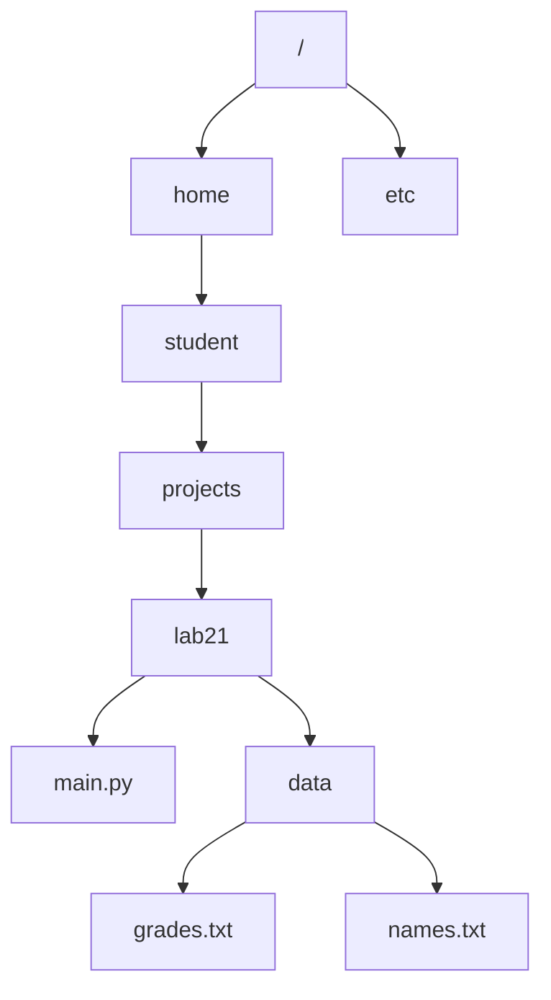

# 21. (Л) Файловий ввід/вивід

## Зміст лекції

1. Навіщо програмі файли
2. Файлова система як дерево
3. Абсолютний шлях
4. Робочий каталог програми
5. Відносний шлях, `.` та `..`
6. Домашній каталог і `~`
7. Шлях відносно самого скрипта
8. Модуль `pathlib`: шлях як обʼєкт
9. Частини шляху
10. Перевірка існування, створення каталогів
11. Перегляд вмісту каталогу
12. Аргументи командного рядка
13. Відкриття файлу: `open()`
14. Менеджер контексту `with`
15. Кодування тексту
16. Режими відкриття файлу
17. Читання: `read`, `readline`, `readlines`, перебір
18. Запис: `write`, `writelines`, `print(file=...)`
19. Додавання в кінець і безпечне створення
20. Швидкі методи `read_text` і `write_text`
21. Позиція у файлі: `tell` і `seek`
22. Двійкові файли
23. Копіювання, перейменування, видалення
24. Приклад: журнал оцінок у файлі
25. Типові помилки

## Навіщо програмі файли

Усі змінні, списки та словники, з якими ми працювали досі, живуть в оперативній памʼяті. Щойно програма завершується, ця памʼять звільняється, і дані зникають. Якщо запустити програму ще раз, вона почне з нуля.

**Файл** — це іменована послідовність байтів на диску. Дані у файлі переживають завершення програми, перезавантаження компʼютера і навіть перевстановлення Python. Тому файли потрібні, щоб:

- зберігати результати роботи між запусками (налаштування, збережена гра, журнал оцінок);
- читати вхідні дані, які незручно вводити з клавіатури (тисяча рядків з датчика);
- обмінюватися даними з іншими програмами (звіт, який відкриють в Excel);
- вести журнал подій (лог), щоб потім розібратися, що пішло не так.

Робота з файлом завжди складається з трьох кроків: **знайти** файл (шлях), **відкрити** його, **прочитати або записати** і **закрити**. Починаємо з першого кроку — бо саме на ньому губиться найбільше часу початківця.

## Файлова система як дерево

Файли на диску впорядковані в **каталоги** (directories, вони ж «теки», «папки»). Каталог може містити файли і вкладені каталоги — тож уся файлова система утворює дерево. У Linux і macOS у цього дерева один корінь, який позначають однією скісною рискою `/`.



Щоб однозначно назвати файл `grades.txt`, треба вказати повний маршрут від кореня до нього, перелічивши каталоги через `/`:

```text
/home/student/projects/lab21/data/grades.txt
```

Такий запис і називається шляхом. Шляхи бувають двох видів — абсолютні та відносні.

## Абсолютний шлях

**Абсолютний шлях** (absolute path) описує маршрут **від кореня** файлової системи. У Linux і macOS він завжди починається з `/`.

```text
/home/student/projects/lab21/data/grades.txt
/etc/hostname
/usr/bin/python3
```

Головна властивість абсолютного шляху: він означає той самий файл незалежно від того, звідки запущено програму. Це його перевага і водночас недолік — такий шлях прибитий до конкретного компʼютера. Якщо у коді написати `/home/student/projects/lab21/data/grades.txt`, програма не запрацює на компʼютері одногрупника, у якого користувач зветься інакше.

!!! note "Одна риска чи дві"
    У Linux і macOS роздільником каталогів у шляху є звичайна скісна риска `/`. Не плутайте її зі зворотною `\` — у Python зворотна коса риска всередині рядка починає спецсимвол (`\n`, `\t`), тому в шляхах її пишуть або подвоєною, або в сирому рядку `r"..."`. Найнадійніший спосіб взагалі не думати про роздільники — будувати шляхи через `pathlib`, до якого дійдемо за кілька розділів.

## Робочий каталог програми

Відносні шляхи неможливо зрозуміти без поняття робочого каталогу.

**Поточний робочий каталог** (current working directory, cwd) — це каталог, від якого програма відлічує всі відносні шляхи. Його визначає не файл програми, а **те місце, з якого програму запустили**.

```python
# Program: where is the program running from
import os
from pathlib import Path

print(os.getcwd())
print(Path.cwd())
```

```text
/home/student/projects/lab21
/home/student/projects/lab21
```

`os.getcwd()` і `Path.cwd()` роблять те саме; другий варіант повертає обʼєкт `Path`, з яким зручніше працювати далі. У вас у виводі буде ваш власний шлях.

Робочий каталог легко перевірити в терміналі командою `pwd`. Спробуйте самі: створіть файл `where.py` з кодом вище і запустіть його двома способами.

```text
$ cd /home/student/projects/lab21
$ python3 where.py
/home/student/projects/lab21

$ cd /home/student
$ python3 projects/lab21/where.py
/home/student
```

Файл програми той самий, а робочий каталог різний. Саме через це найпоширеніша помилка початківця звучить так: «у VS Code працювало, а з термінала — `FileNotFoundError`». Програма шукала файл не там, бо змінився робочий каталог.

## Відносний шлях, `.` та `..`

**Відносний шлях** (relative path) описує маршрут **від поточного робочого каталогу**. Він не починається з `/`.

```text
data/grades.txt        каталог data у робочому каталозі, у ньому grades.txt
grades.txt             файл прямо в робочому каталозі
../notes.txt           файл у батьківському каталозі
```

У кожному каталозі є два спеціальні імені:

| Запис | Значення |
|---|---|
| `.` | сам поточний каталог |
| `..` | батьківський каталог (на рівень вище) |

Тому `./data/grades.txt` і `data/grades.txt` — одне й те саме, а `../..` означає «на два рівні вгору».

Якщо робочий каталог `/home/student/projects/lab21`, то відносні шляхи розгортаються в абсолютні так:

| Відносний шлях | Абсолютний шлях |
|---|---|
| `main.py` | `/home/student/projects/lab21/main.py` |
| `data/grades.txt` | `/home/student/projects/lab21/data/grades.txt` |
| `./data/grades.txt` | `/home/student/projects/lab21/data/grades.txt` |
| `../lab20/main.py` | `/home/student/projects/lab20/main.py` |
| `../../student/notes.txt` | `/home/student/notes.txt` |

Python уміє робити це перетворення сам:

```python
# Program: absolute and relative paths
import os
from pathlib import Path

relative = Path("data/grades.txt")
print(relative)
print(relative.is_absolute())

absolute = relative.resolve()
print(absolute)
print(absolute.is_absolute())

messy = Path("data/../data/./grades.txt")
print(messy)
print(Path(os.path.normpath(messy)))
```

```text
data/grades.txt
False
/home/student/projects/lab21/data/grades.txt
True
data/../data/grades.txt
data/grades.txt
```

- `is_absolute()` відповідає, чи починається шлях з кореня.
- `resolve()` перетворює відносний шлях на абсолютний, підставляючи поточний робочий каталог, і прибирає `.` та `..`. Рядок у вашому виводі буде іншим.
- `os.path.normpath()` спрощує запис шляху **без** звертання до диска і без підстановки cwd — зручно, коли треба просто прибрати `..` та `.`.

Порівняння двох видів шляху:

| | Абсолютний | Відносний |
|---|---|---|
| Починається з | `/` | імені каталогу, `.` або `..` |
| Точка відліку | корінь файлової системи | поточний робочий каталог |
| Залежить від місця запуску | ні | так |
| Переноситься на інший компʼютер | ні | так, разом з каталогом проєкту |
| Коли доречний | системні файли, повністю визначені шляхи | дані всередині свого проєкту |

**Практичне правило:** у коді пишемо відносні шляхи (проєкт має залишатися переносним), але будуємо їх не від робочого каталогу, а від каталогу самого скрипта — так, як показано у наступному розділі.

## Домашній каталог і `~`

У терміналі символ `~` (тильда) означає домашній каталог поточного користувача, наприклад `/home/student`. Тому `~/projects/lab21` і `/home/student/projects/lab21` — один і той самий каталог.

Важливо: тильду розгортає **термінал**, а не Python. Для `open()` рядок `"~/notes.txt"` — це звичайне імʼя каталогу `~`, якого не існує. Розгортати тильду треба явно:

```python
# Program: expand the home directory
import os
from pathlib import Path

print(Path("~/notes.txt"))
print(Path("~/notes.txt").expanduser())
print(os.path.expanduser("~/notes.txt"))
print(Path.home())
```

```text
~/notes.txt
/home/student/notes.txt
/home/student/notes.txt
/home/student
```

## Шлях відносно самого скрипта

Ми зʼясували, що відносний шлях залежить від місця запуску. Щоб програма знаходила свої дані завжди, шлях будують від файлу самої програми. Змінна `__file__` містить шлях до поточного файлу з кодом.

```python
# Program: build paths relative to the script itself
from pathlib import Path

script_path = Path(__file__).resolve()
script_dir = script_path.parent
data_file = script_dir / "data" / "grades.txt"

print(script_path.name)
print(script_dir.name)
print(data_file.name)
print(data_file.is_absolute())
```

```text
main.py
lab21
grades.txt
True
```

`Path(__file__).resolve().parent` — це каталог, у якому лежить скрипт. Далі від нього будуємо шлях до даних. Тепер програму можна запускати звідки завгодно.

!!! warning "`__file__` існує не завжди"
    Змінна `__file__` доступна у файлі з кодом, який запускають як скрипт. В інтерактивному режимі інтерпретатора (`python3` без аргументів) її немає — там буде `NameError`. Приклади цієї лекції розраховані на запуск файлом.

## Модуль `pathlib`: шлях як обʼєкт

Історично шляхи в Python були звичайними рядками, а працювали з ними функції модуля `os.path`. Сучасний підхід — клас `Path` з модуля `pathlib`: шлях стає обʼєктом зі своїми методами.

Головна зручність — оператор `/`, який зʼєднує частини шляху:

```python
# Program: build a path with the / operator
from pathlib import Path

base = Path("/home/student/projects")
project = base / "lab21"
data_file = project / "data" / "grades.txt"

print(base)
print(project)
print(data_file)

parts = ["reports", "2026", "march.txt"]
print(Path("/home/student").joinpath(*parts))
```

```text
/home/student/projects
/home/student/projects/lab21
/home/student/projects/lab21/data/grades.txt
/home/student/reports/2026/march.txt
```

Оператор `/` тут не ділення: для обʼєктів `Path` він перевизначений і означає «зайти всередину». Це набагато надійніше за склеювання рядків через `+`, де легко забути або подвоїти роздільник.

```python
# Program: string concatenation is fragile, Path is not
from pathlib import Path

folder = "data/"
name = "grades.txt"
print(folder + "/" + name)
print(Path("data") / name)
```

```text
data//grades.txt
data/grades.txt
```

`Path` приймає і звичайний рядок, і навпаки — будь-яку функцію, що очікує рядок зі шляхом, можна викликати з `Path` (зокрема `open()`).

## Частини шляху

Обʼєкт `Path` дає доступ до складників шляху без жодного розбору рядка вручну.

```python
# Program: parts of a path
from pathlib import Path

path = Path("/home/student/projects/lab21/data/grades.txt")

print(path.name)
print(path.stem)
print(path.suffix)
print(path.parent)
print(path.parent.parent)
print(path.anchor)
print(path.parts)
print(path.with_suffix(".csv"))
print(path.with_name("marks.txt"))
```

```text
grades.txt
grades
.txt
/home/student/projects/lab21/data
/home/student/projects/lab21
/
('/', 'home', 'student', 'projects', 'lab21', 'data', 'grades.txt')
/home/student/projects/lab21/data/grades.csv
/home/student/projects/lab21/data/marks.txt
```

| Властивість | Що дає |
|---|---|
| `name` | останній компонент шляху (імʼя файлу з розширенням) |
| `stem` | імʼя без розширення |
| `suffix` | розширення разом з крапкою |
| `parent` | каталог, у якому лежить файл |
| `parts` | кортеж усіх компонентів |
| `anchor` | корінь шляху |
| `with_suffix(s)` | новий шлях з іншим розширенням |
| `with_name(n)` | новий шлях з іншим імʼям файлу |

Зверніть увагу: `Path` — **незмінюваний** обʼєкт, як рядок чи кортеж. `with_suffix` і `with_name` не змінюють `path`, а повертають новий шлях.

## Перевірка існування, створення каталогів

Досі всі приклади лише розбирали шлях як текст і до диска не зверталися. Наступні методи вже дивляться на реальну файлову систему.

```python
# Program: check what exists on disk
from pathlib import Path

work_dir = Path("lab21_demo")
work_dir.mkdir(exist_ok=True)

data_dir = work_dir / "data"
data_dir.mkdir(exist_ok=True)

note = data_dir / "note.txt"
note.write_text("hello\n", encoding="utf-8")

print(work_dir.exists(), work_dir.is_dir(), work_dir.is_file())
print(note.exists(), note.is_dir(), note.is_file())
print(note.stat().st_size)

missing = data_dir / "nothing.txt"
print(missing.exists())
```

```text
True True False
True False True
6
False
```

- `mkdir()` створює каталог. Без аргументів він падає з помилкою, якщо каталог уже є; `exist_ok=True` це дозволяє. Аргумент `parents=True` додатково створює всі відсутні проміжні каталоги.
- `exists()`, `is_file()`, `is_dir()` — перевірки наявності й типу.
- `stat().st_size` — розмір файлу в байтах.

Перевірка `exists()` перед відкриттям файлу — корисна звичка, але не гарантія: між перевіркою і відкриттям файл теоретично може зникнути. Надійний спосіб — обробка винятків, і саме їй присвячена наступна лекція.

## Перегляд вмісту каталогу

```python
# Program: list files in a directory
from pathlib import Path

work_dir = Path("lab21_list")
work_dir.mkdir(exist_ok=True)
for name in ["grades.txt", "names.txt", "report.md"]:
    (work_dir / name).write_text("demo\n", encoding="utf-8")
(work_dir / "backup").mkdir(exist_ok=True)

print("all entries:")
for entry in sorted(work_dir.iterdir()):
    kind = "dir " if entry.is_dir() else "file"
    print(f"  {kind} {entry.name}")

print("only .txt:")
for entry in sorted(work_dir.glob("*.txt")):
    print(f"  {entry.name}")
```

```text
all entries:
  dir  backup
  file grades.txt
  file names.txt
  file report.md
only .txt:
  grades.txt
  names.txt
```

- `iterdir()` перебирає все, що лежить у каталозі (без заходу вглиб).
- `glob("*.txt")` відбирає за шаблоном: `*` — будь-яка послідовність символів, `?` — один символ.
- `rglob("*.txt")` шукає за тим самим шаблоном рекурсивно, у всіх вкладених каталогах.

Порядок, у якому `iterdir()` повертає записи, не визначений — тому в прикладі стоїть `sorted()`.

## Аргументи командного рядка

Досі шлях до файлу був записаний прямо в коді. Але справжні програми отримують його ззовні — так само, як `python3`, `git` чи `cp` отримують те, з чим мають працювати:

```text
$ cp report.txt backup.txt
$ python3 count_lines.py data/grades.txt
```

Усе, що написано в терміналі після назви скрипта, потрапляє у програму списком **аргументів командного рядка**. Python складає їх у список `sys.argv`.

```python
# Program: what the program receives from the command line
import sys

print(sys.argv)
print("count:   ", len(sys.argv))
print("script:  ", sys.argv[0])
print("arguments:", sys.argv[1:])
```

```text
$ python3 show_args.py data/grades.txt 10 --quiet
['show_args.py', 'data/grades.txt', '10', '--quiet']
count:    4
script:   show_args.py
arguments: ['data/grades.txt', '10', '--quiet']

$ python3 show_args.py
['show_args.py']
count:    1
script:   show_args.py
arguments: []
```

Три властивості `sys.argv`, які треба запамʼятати:

1. **`sys.argv[0]` — це сам скрипт**, а не перший аргумент. Власні аргументи починаються з індексу `1`, тому їх зручно брати зрізом `sys.argv[1:]`.
2. **Аргументів може не бути взагалі.** Тоді в списку лише один елемент, а `sys.argv[1]` дасть `IndexError`. Кількість треба перевіряти **до** звертання.
3. **Усі аргументи — рядки.** Навіть `10` приходить як `"10"`.

```python
# Program: arguments are always strings
import sys

value = sys.argv[1] if len(sys.argv) > 1 else "10"

print(type(value).__name__, repr(value))
print(value * 2)
print(int(value) * 2)
```

```text
$ python3 double.py 7
str '7'
77
14

$ python3 double.py
str '10'
1010
20
```

`value * 2` для рядка `"7"` дає `"77"`, і саме тут ховається помилка, яку легко не помітити: програма не падає, вона просто рахує не те. Число з аргументу треба явно перетворити через `int()` або `float()`.

Рядок `sys.argv[1] if len(sys.argv) > 1 else "10"` — це **умовний вираз**: він повертає перше значення, якщо умова істинна, і друге, якщо ні. Його звичайна форма — звичайний `if`:

```python
# Program: the same choice written as a plain if
import sys

if len(sys.argv) > 1:
    value = sys.argv[1]
else:
    value = "10"

print(int(value) * 2)
```

### Розділення аргументів і лапки

Термінал розрізає командний рядок за пробілами. Тому імʼя файлу з пробілом усередині треба взяти в лапки, інакше воно приїде двома окремими аргументами:

```text
$ python3 show_args.py my report.txt
['show_args.py', 'my', 'report.txt']
count:    3
script:   show_args.py
arguments: ['my', 'report.txt']

$ python3 show_args.py "my report.txt"
['show_args.py', 'my report.txt']
count:    2
script:   show_args.py
arguments: ['my report.txt']
```

### Аргумент-шлях відлічується від робочого каталогу

Це найважливіша річ у цьому розділі. Користувач набирає шлях у терміналі, а отже, він має на увазі **поточний робочий каталог**, а не каталог, де лежить скрипт.

```text
$ cd /home/student/projects/lab21
$ python3 count_lines.py data/grades.txt
```

Тут `data/grades.txt` означає `/home/student/projects/lab21/data/grades.txt`. Якщо ту саму програму запустити з іншого місця, той самий аргумент означатиме інший файл — і це правильна поведінка, саме її очікує користувач.

Отже, правило таке:

| Що за шлях | Від чого будувати |
|---|---|
| файл, який назвав користувач (`sys.argv`) | від робочого каталогу — тобто `Path(sys.argv[1])` **без** додавання `BASE` |
| власні дані програми (налаштування, журнал, шаблони) | від каталогу скрипта — `Path(__file__).resolve().parent / ...` |

Найгрубіша помилка — склеїти каталог скрипта з аргументом користувача: `BASE / sys.argv[1]`. Тоді користувач напише шлях, який бачить у себе в терміналі, а програма шукатиме зовсім не там.

### Приклад: лічильник рядків

Зберемо все разом — маленька програма в дусі системної утиліти `wc -l`.

```python
# Program: count lines in the file named on the command line
import sys
from pathlib import Path

BASE = Path(__file__).resolve().parent
script_name = Path(sys.argv[0]).name

if len(sys.argv) > 1:
    path = Path(sys.argv[1])
else:
    path = BASE / "argv_demo.txt"
    path.write_text("alpha\nbeta\ngamma\n", encoding="utf-8")
    print(f"usage: python3 {script_name} <file>")
    print(f"no file given, demo file {path.name} created")

if not path.is_file():
    print(f"error: file not found: {path}")
    sys.exit(1)

lines = 0
words = 0
with open(path, encoding="utf-8") as f:
    for line in f:
        lines += 1
        words += len(line.split())

print(f"{path.name}: {lines} lines, {words} words")
```

```text
$ python3 count_lines.py
usage: python3 count_lines.py <file>
no file given, demo file argv_demo.txt created
argv_demo.txt: 3 lines, 3 words

$ python3 count_lines.py data/grades.txt
grades.txt: 4 lines, 9 words

$ python3 count_lines.py nothing.txt
error: file not found: nothing.txt
```

Що тут варто помітити:

- `Path(sys.argv[0]).name` дає коротку назву скрипта для підказки `usage` — не доведеться переписувати її після перейменування файлу.
- Перевірка `len(sys.argv) > 1` стоїть **перед** звертанням до `sys.argv[1]`.
- `path.is_file()` відсіює і відсутній файл, і випадок, коли за цим шляхом лежить каталог.
- `sys.exit(1)` завершує програму з **кодом помилки**: нуль означає успіх, будь-яке інше число — збій. За цим кодом термінал та інші програми розуміють, чи все пройшло добре.

!!! tip "Коли аргументів стає багато"
    Поки аргумент один-два, `sys.argv` цілком достатньо. Для серйозної утиліти з ключами (`--output report.txt`, `-v`, `--help`) у стандартній бібліотеці є модуль [`argparse`](https://docs.python.org/3/library/argparse.html): він сам розбирає ключі, перевіряє типи і генерує довідку. У цьому курсі він не обовʼязковий, але знати про нього варто.

## Відкриття файлу: `open()`

Щоб працювати з вмістом файлу, його треба **відкрити**. Вбудована функція `open()` повертає обʼєкт файлу — щось на кшталт «труби», через яку тече текст.

```text
open(file, mode="r", encoding=None)
```

- `file` — шлях (рядок або `Path`);
- `mode` — режим: читання, запис, додавання;
- `encoding` — кодування тексту.

Після роботи файл треба **закрити** методом `close()`, інакше дані можуть не потрапити на диск, а операційна система витрачатиме ресурси на відкритий дескриптор.

```python
# Program: open, use, close - the long way
f = open("temp_manual.txt", "w", encoding="utf-8")
f.write("line one\n")
f.close()

f = open("temp_manual.txt", "r", encoding="utf-8")
print(f.read())
f.close()
```

```text
line one

```

Проблема цього запису в тому, що `close()` легко забути, а якщо між `open()` і `close()` станеться помилка — до закриття справа взагалі не дійде. Тому так майже ніколи не пишуть.

## Менеджер контексту `with`

Правильний спосіб — конструкція `with`:

```python
# Program: the with statement closes the file for you
with open("temp_with.txt", "w", encoding="utf-8") as f:
    f.write("line one\n")
    f.write("line two\n")

print("closed:", f.closed)

with open("temp_with.txt", "r", encoding="utf-8") as f:
    content = f.read()

print(content, end="")
```

```text
closed: True
line one
line two
```

`with open(...) as f:` відкриває файл, привʼязує обʼєкт файлу до змінної `f` і **гарантовано закриває** його при виході з блоку — і після нормального завершення, і після помилки. Змінна `f` після блоку залишається, але файл уже закритий, тож читати з нього не можна.

Кілька файлів відкривають в одному `with` через кому:

```python
# Program: two files at once
with open("source_demo.txt", "w", encoding="utf-8") as f:
    f.write("alpha\nbeta\ngamma\n")

with open("source_demo.txt", "r", encoding="utf-8") as src, \
     open("target_demo.txt", "w", encoding="utf-8") as dst:
    for line in src:
        dst.write(line.upper())

print(open("target_demo.txt", encoding="utf-8").read(), end="")
```

```text
ALPHA
BETA
GAMMA
```

Далі у лекції всі приклади використовують лише `with`.

## Кодування тексту

Файл на диску — це послідовність байтів, тобто чисел від 0 до 255. Літера — не число, тому потрібна домовленість, яким байтам відповідає який символ. Така домовленість називається **кодуванням** (encoding).

Сучасний стандарт — **UTF-8**: латинська літера займає в ньому один байт, кирилична — два, емодзі — чотири.

```python
# Program: text becomes bytes
plain = "Grade: 5"
print(len(plain), len(plain.encode("utf-8")))

accented = "Cafe resume"
print(len(accented), len(accented.encode("utf-8")))

accented = "Café résumé"
print(len(accented), len(accented.encode("utf-8")))
print(accented.encode("utf-8"))
```

```text
8 8
11 11
11 14
b'Caf\xc3\xa9 r\xc3\xa9sum\xc3\xa9'
```

Рядок з 11 символів займає 11 байтів, поки всі символи — звичайна латиниця. Щойно зʼявляються символи поза ASCII (тут — `é`, у ваших даних — кирилиця), кожен такий символ займає по кілька байтів, і довжина в символах перестає дорівнювати довжині в байтах.

Якщо не вказати `encoding`, Python візьме кодування, прийняте в системі, а воно на різних компʼютерах різне. Результат — файл, записаний в одного, не читається в іншого: замість тексту зʼявляється `UnicodeDecodeError` або «кракозябри».

!!! tip "Правило без винятків"
    Відкриваючи текстовий файл, **завжди** вказуйте `encoding="utf-8"`. Це один аргумент, який економить години пошуку причини незрозумілих символів.

## Режими відкриття файлу

Другий аргумент `open()` визначає, що саме дозволено робити з файлом.

| Режим | Назва | Якщо файлу немає | Якщо файл є | Позиція на старті |
|---|---|---|---|---|
| `"r"` | читання (за замовчуванням) | `FileNotFoundError` | читаємо | початок |
| `"w"` | запис | створюється | **вміст стирається** | початок |
| `"a"` | додавання | створюється | зберігається | кінець |
| `"x"` | ексклюзивне створення | створюється | `FileExistsError` | початок |
| `"r+"` | читання і запис | `FileNotFoundError` | зберігається | початок |
| `"w+"` | запис і читання | створюється | **вміст стирається** | початок |
| `"a+"` | додавання і читання | створюється | зберігається | кінець |

До літери режиму можна додати `"t"` (текстовий, за замовчуванням) або `"b"` (двійковий): `"rb"`, `"wb"`.

```python
# Program: w truncates, a appends
with open("mode_demo.txt", "w", encoding="utf-8") as f:
    f.write("first run\n")

with open("mode_demo.txt", "w", encoding="utf-8") as f:
    f.write("second run\n")

print(open("mode_demo.txt", encoding="utf-8").read(), end="")
print("---")

with open("mode_demo.txt", "a", encoding="utf-8") as f:
    f.write("appended line\n")

print(open("mode_demo.txt", encoding="utf-8").read(), end="")
```

```text
second run
---
second run
appended line
```

!!! danger "`"w"` стирає файл мовчки"
    Режим `"w"` обрізає файл до нуля **в момент відкриття**, ще до першого `write()`. Якщо переплутати `"w"` з `"r"`, дані зникнуть без жодного запитання і без можливості скасувати. Коли треба дописати — режим `"a"`.

## Читання: `read`, `readline`, `readlines`, перебір

Створимо файл і прочитаємо його чотирма способами.

```python
# Program: four ways to read a text file
from pathlib import Path

path = Path("students_demo.txt")
path.write_text("Shevchenko 95\nKovalenko 88\nBondar 73\n", encoding="utf-8")

with open(path, encoding="utf-8") as f:
    whole = f.read()
print(repr(whole))

with open(path, encoding="utf-8") as f:
    first = f.readline()
    second = f.readline()
print(repr(first), repr(second))

with open(path, encoding="utf-8") as f:
    lines = f.readlines()
print(lines)

with open(path, encoding="utf-8") as f:
    for number, line in enumerate(f, start=1):
        print(number, line.strip())
```

```text
'Shevchenko 95\nKovalenko 88\nBondar 73\n'
'Shevchenko 95\n' 'Kovalenko 88\n'
['Shevchenko 95\n', 'Kovalenko 88\n', 'Bondar 73\n']
1 Shevchenko 95
2 Kovalenko 88
3 Bondar 73
```

| Спосіб | Що повертає | Коли доречний |
|---|---|---|
| `f.read()` | увесь вміст одним рядком | малий файл, потрібен текст цілком |
| `f.read(n)` | не більше `n` символів | читання порціями |
| `f.readline()` | наступний рядок разом з `\n` | рядок за рядком вручну |
| `f.readlines()` | список усіх рядків | малий файл, потрібен список |
| `for line in f` | рядки по одному | **основний спосіб**, файл будь-якого розміру |

Ключовий момент: кожен прочитаний рядок містить у кінці символ переходу `\n` (крім, можливо, останнього). Майже завжди його прибирають через `strip()` або `rstrip("\n")`.

```python
# Program: the newline character at the end of a line
from pathlib import Path

path = Path("strip_demo.txt")
path.write_text("42\n17\n", encoding="utf-8")

with open(path, encoding="utf-8") as f:
    for line in f:
        print(repr(line), repr(line.strip()), int(line))
```

```text
'42\n' '42' 42
'17\n' '17' 17
```

`int()` сам ігнорує пробіли навколо числа, тому тут працює і без `strip()`. А от порівняння `line == "42"` без `strip()` дасть `False` — про це в розділі типових помилок.

Чому перебір `for line in f` кращий за `readlines()`: `readlines()` завантажує **весь** файл у памʼять списком. Для файлу на 2 ГБ це означає 2 ГБ памʼяті. Перебір читає по рядку і памʼять майже не витрачає.

```python
# Program: count lines, words and characters without loading the whole file
from pathlib import Path

path = Path("wc_demo.txt")
path.write_text(
    "the quick brown fox\n"
    "jumps over the lazy dog\n"
    "python reads files line by line\n",
    encoding="utf-8",
)

lines = 0
words = 0
chars = 0
with open(path, encoding="utf-8") as f:
    for line in f:
        lines += 1
        words += len(line.split())
        chars += len(line)

print(f"lines: {lines}")
print(f"words: {words}")
print(f"chars: {chars}")
```

```text
lines: 3
words: 15
chars: 76
```

## Запис: `write`, `writelines`, `print(file=...)`

```python
# Program: three ways to write text
grades = [95, 88, 73]

with open("write_demo.txt", "w", encoding="utf-8") as f:
    f.write("report\n")
    f.write("=" * 6 + "\n")

with open("write_demo.txt", "a", encoding="utf-8") as f:
    f.writelines([f"grade {g}\n" for g in grades])

with open("write_demo.txt", "a", encoding="utf-8") as f:
    average = sum(grades) / len(grades)
    print(f"average: {average:.2f}", file=f)

print(open("write_demo.txt", encoding="utf-8").read(), end="")
```

```text
report
======
grade 95
grade 88
grade 73
average: 85.33
```

Три важливі деталі:

1. **`write()` не додає `\n`.** На відміну від `print()`, метод записує рівно те, що йому дали. Перехід на новий рядок пишемо самі.
2. **`writelines()` теж не додає `\n`** — попри назву, це просто «записати послідовність рядків підряд». Без `\n` усе злипнеться в один рядок.
3. **`print(..., file=f)`** пише у файл замість екрана і поводиться як звичайний `print`: додає `\n`, вміє `sep` і перетворює числа на текст сам.

```python
# Program: write() needs strings and explicit newlines
numbers = [1, 2, 3]

with open("write_pitfall.txt", "w", encoding="utf-8") as f:
    f.writelines(str(n) for n in numbers)
    f.write("\n")
    f.writelines(f"{n}\n" for n in numbers)
    print(*numbers, sep=", ", file=f)

print(open("write_pitfall.txt", encoding="utf-8").read(), end="")
```

```text
123
1
2
3
1, 2, 3
```

Спроба записати число напряму — `f.write(42)` — дає `TypeError: write() argument must be str, not int`. Число треба перетворити на рядок: `f.write(str(42))` або f-рядком.

## Додавання в кінець і безпечне створення

Режим `"a"` зручний для журналів: кожен запуск дописує рядок, нічого не стираючи.

```python
# Program: a simple event log
from datetime import datetime
from pathlib import Path

log_path = Path("events_demo.log")
if log_path.exists():
    log_path.unlink()

def log(message):
    stamp = datetime.now().strftime("%Y-%m-%d %H:%M:%S")
    with open(log_path, "a", encoding="utf-8") as f:
        f.write(f"[{stamp}] {message}\n")

log("program started")
log("data loaded")
log("program finished")

with open(log_path, encoding="utf-8") as f:
    for line in f:
        print(line.rstrip())
```

```text
[2026-09-26 10:15:03] program started
[2026-09-26 10:15:03] data loaded
[2026-09-26 10:15:03] program finished
```

Час у вашому виводі буде свій. Зверніть увагу: файл відкривається і закривається на кожен запис — так рядок гарантовано потрапляє на диск, навіть якщо програма аварійно завершиться.

Режим `"x"` створює файл лише тоді, коли його ще немає, і цим захищає від випадкового перезапису:

```python
# Program: create a file only if it does not exist yet
from pathlib import Path

path = Path("unique_demo.txt")
if path.exists():
    path.unlink()

with open(path, "x", encoding="utf-8") as f:
    f.write("created once\n")
print("created:", path.read_text(encoding="utf-8").strip())

if path.exists():
    print("second attempt would raise FileExistsError")
```

```text
created: created once
second attempt would raise FileExistsError
```

Тут ми обійшлися перевіркою `exists()`. Коректніший спосіб — перехопити `FileExistsError` через `try/except`, і це тема наступної лекції.

## Швидкі методи `read_text` і `write_text`

Для невеликих файлів `pathlib` дає скорочення, які самі відкривають і закривають файл.

```python
# Program: read_text and write_text
from pathlib import Path

path = Path("quick_demo.txt")

path.write_text("alpha\nbeta\ngamma\n", encoding="utf-8")
text = path.read_text(encoding="utf-8")

print(repr(text))
print(text.splitlines())
print(len(text.splitlines()))
```

```text
'alpha\nbeta\ngamma\n'
['alpha', 'beta', 'gamma']
3
```

`write_text()` працює як режим `"w"` — повністю перезаписує файл. `splitlines()` розбиває текст на рядки і **прибирає** `\n`, на відміну від `readlines()`.

Коли що використовувати:

| Ситуація | Інструмент |
|---|---|
| файл малий, потрібен увесь текст | `Path.read_text()` |
| файл великий або обробка порядкова | `with open(...)` і `for line in f` |
| перезаписати малий файл цілком | `Path.write_text()` |
| писати поступово, дописувати, вести лог | `with open(..., "a")` |

## Позиція у файлі: `tell` і `seek`

Відкритий файл має **позицію** — місце, з якого відбудеться наступне читання. Кожна операція читання зсуває її вперед. Саме тому другий `read()` поспіль повертає порожній рядок: позиція вже в кінці.

```python
# Program: the file position moves as you read
from pathlib import Path

path = Path("seek_demo.txt")
path.write_text("abcdefghij", encoding="utf-8")

with open(path, encoding="utf-8") as f:
    print(f.tell())
    print(f.read(3), f.tell())
    print(f.read(3), f.tell())
    print(repr(f.read()), f.tell())
    print(repr(f.read()))
    f.seek(0)
    print(f.tell(), f.read(4))
```

```text
0
abc 3
def 6
'ghij' 10
''
0 abcd
```

- `tell()` повідомляє поточну позицію;
- `seek(0)` повертає до початку, після чого файл можна прочитати ще раз.

Порожній результат другого `read()` — часта причина здивування: «чому список порожній, файл же не порожній». Відповідь — позиція. Не зловживайте `seek`: у переважній більшості задач достатньо один раз прочитати файл у змінну.

## Двійкові файли

Не всякий файл — текст. Зображення, звук, PDF, архіви — послідовності байтів, які не розбиваються на символи. Для них використовують режими `"rb"` і `"wb"`, і тоді `read()` повертає не `str`, а `bytes`. Аргумент `encoding` у двійковому режимі не вказують — його там не буває.

```python
# Program: write and read raw bytes
from pathlib import Path

path = Path("bytes_demo.bin")

with open(path, "wb") as f:
    f.write(bytes([80, 89, 84, 72, 79, 78]))
    f.write(b"\x00\x01\x02")

with open(path, "rb") as f:
    data = f.read()

print(type(data).__name__)
print(data)
print(len(data))
print(list(data))
print(data[:6].decode("ascii"))
```

```text
bytes
b'PYTHON\x00\x01\x02'
9
[80, 89, 84, 72, 79, 78, 0, 1, 2]
PYTHON
```

Копіювання будь-якого файлу без урахування вмісту робиться саме у двійковому режимі:

```python
# Program: copy a file byte by byte
from pathlib import Path

source = Path("copy_source.bin")
source.write_bytes(bytes(range(32)))

target = Path("copy_target.bin")
with open(source, "rb") as src, open(target, "wb") as dst:
    while True:
        chunk = src.read(8)
        if not chunk:
            break
        dst.write(chunk)

print(source.stat().st_size, target.stat().st_size)
print(source.read_bytes() == target.read_bytes())
```

```text
32 32
True
```

Читання порціями (`chunk`) дозволяє копіювати файл будь-якого розміру, не завантажуючи його в памʼять цілком.

## Копіювання, перейменування, видалення

Для дій над файлами як над обʼєктами файлової системи є `pathlib` і модуль `shutil`.

```python
# Program: copy, rename and delete files
import shutil
from pathlib import Path

work = Path("fileops_demo")
work.mkdir(exist_ok=True)

original = work / "report.txt"
original.write_text("results\n", encoding="utf-8")

copy = shutil.copy(original, work / "report_backup.txt")
print(Path(copy).name, Path(copy).read_text(encoding="utf-8").strip())

renamed = original.rename(work / "final_report.txt")
print(renamed.name, original.exists())

(work / "report_backup.txt").unlink()
print(sorted(p.name for p in work.iterdir()))

shutil.rmtree(work)
print(work.exists())
```

```text
report_backup.txt results
final_report.txt False
['final_report.txt']
False
```

| Дія | Виклик |
|---|---|
| копіювати файл | `shutil.copy(src, dst)` |
| копіювати каталог з вмістом | `shutil.copytree(src, dst)` |
| перейменувати або перемістити | `path.rename(new_path)` |
| видалити файл | `path.unlink()` |
| видалити порожній каталог | `path.rmdir()` |
| видалити каталог з вмістом | `shutil.rmtree(path)` |

!!! danger "Видалення незворотне"
    `unlink()` і особливо `rmtree()` не переносять нічого в кошик — дані зникають одразу. Перед запуском коду, що видаляє, тричі перевірте шлях. Особливо небезпечні шляхи, зібрані з даних користувача.

## Приклад: журнал оцінок у файлі

Зберемо все разом: побудова шляхів, запис, читання, розбір рядків, звіт у новий файл.

```python
# Program: store, read and report a grade journal
from pathlib import Path


def build_paths():
    """Return the data directory and the two file paths."""
    base_dir = Path(__file__).resolve().parent
    data_dir = base_dir / "journal_data"
    data_dir.mkdir(exist_ok=True)
    return data_dir / "grades.txt", data_dir / "report.txt"


def save_journal(path, journal):
    """Write the journal as lines 'name: g1,g2,g3'."""
    with open(path, "w", encoding="utf-8") as f:
        for name, grades in journal.items():
            joined = ",".join(str(g) for g in grades)
            f.write(f"{name}: {joined}\n")


def load_journal(path):
    """Read the journal back into a dictionary."""
    journal = {}
    with open(path, encoding="utf-8") as f:
        for line in f:
            line = line.strip()
            if not line or line.startswith("#"):
                continue
            name, _, grades_text = line.partition(":")
            grades = [int(part) for part in grades_text.split(",") if part.strip()]
            journal[name.strip()] = grades
    return journal


def add_grade(path, name, grade):
    """Append one more grade for a student."""
    journal = load_journal(path)
    journal.setdefault(name, []).append(grade)
    save_journal(path, journal)


def write_report(path, journal):
    """Write a formatted report with averages."""
    with open(path, "w", encoding="utf-8") as f:
        print(f"{'student':<14}{'grades':<18}{'average':>8}", file=f)
        print("-" * 40, file=f)
        for name in sorted(journal):
            grades = journal[name]
            average = sum(grades) / len(grades) if grades else 0.0
            listed = " ".join(str(g) for g in grades)
            print(f"{name:<14}{listed:<18}{average:>8.2f}", file=f)
        total = [g for grades in journal.values() for g in grades]
        print("-" * 40, file=f)
        print(f"{'group':<14}{len(total):<18}{sum(total) / len(total):>8.2f}", file=f)


def main():
    grades_path, report_path = build_paths()

    save_journal(grades_path, {
        "Shevchenko": [95, 88, 100],
        "Kovalenko": [73, 81],
        "Bondar": [60, 67, 72, 90],
    })

    add_grade(grades_path, "Kovalenko", 94)
    add_grade(grades_path, "Marchenko", 85)

    journal = load_journal(grades_path)
    write_report(report_path, journal)

    print("raw file:")
    print(grades_path.read_text(encoding="utf-8"), end="")
    print()
    print("report:")
    print(report_path.read_text(encoding="utf-8"), end="")


main()
```

```text
raw file:
Shevchenko: 95,88,100
Kovalenko: 73,81,94
Bondar: 60,67,72,90
Marchenko: 85

report:
student       grades             average
----------------------------------------
Bondar        60 67 72 90          72.25
Kovalenko     73 81 94             82.67
Marchenko     85                   85.00
Shevchenko    95 88 100            94.33
----------------------------------------
group         11                   82.27
```

Що варто помітити:

- Шляхи будуються від `__file__`, тож програма працює з будь-якого робочого каталогу.
- `data_dir.mkdir(exist_ok=True)` створює каталог для даних при першому запуску.
- `load_journal` пропускає порожні рядки і рядки-коментарі — реальний файл рідко буває ідеальним.
- `partition(":")` ділить рядок за першим двокрапкою, тож двокрапка в даних не зламає розбір.
- Читання і запис розведені по окремих функціях: так їх легко перевірити і повторно використати.
- Звіт пишеться через `print(..., file=f)` зі специфікаторами ширини — вирівняні колонки без ручного підрахунку пробілів.

## Типові помилки

| Помилка | Причина | Виправлення |
|---|---|---|
| `FileNotFoundError: [Errno 2] No such file or directory: 'data.txt'` | відносний шлях відлічується від cwd, а не від скрипта | `Path(__file__).resolve().parent / "data.txt"` |
| `FileNotFoundError` у режимі `"w"` | немає каталогу, у який пишемо (сам файл `"w"` створює, каталог — ні) | `path.parent.mkdir(parents=True, exist_ok=True)` |
| Файл був — і став порожній | відкрито в режимі `"w"` замість `"r"` або `"a"` | режим `"a"` для дописування |
| `TypeError: write() argument must be str, not int` | у `write()` передали число | `f.write(str(n))` або f-рядок |
| Усе записалося в один рядок | `write`/`writelines` не додають `\n` | додавати `\n` самому |
| `UnicodeDecodeError` | файл у UTF-8, а прочитано в іншому кодуванні | `encoding="utf-8"` при відкритті |
| Другий `read()` повертає `""` | позиція вже в кінці файлу | зберегти текст у змінну або `f.seek(0)` |
| `ValueError: I/O operation on closed file` | звертання до `f` після блоку `with` | працювати з файлом усередині блоку |
| `line == "text"` дає `False` | у прочитаному рядку лишився `\n` | `line.strip() == "text"` |
| `ValueError: invalid literal for int()` | порожній рядок у кінці файлу | пропускати порожні рядки перевіркою `if not line: continue` |
| `open("~/notes.txt")` не знаходить файл | тильду розгортає термінал, не Python | `Path("~/notes.txt").expanduser()` |
| `FileExistsError` у `mkdir()` | каталог уже існує | `mkdir(exist_ok=True)` |
| `IndexError: list index out of range` | звертання до `sys.argv[1]`, коли аргумент не передали | перевірити `len(sys.argv) > 1` |
| Аргумент-число поводиться як текст (`"7" * 2` дає `"77"`) | усі елементи `sys.argv` — рядки | `int(sys.argv[1])` |
| Програма не знаходить файл, який користувач бачить у терміналі | шлях з аргументу склеїли з каталогом скрипта | `Path(sys.argv[1])` без `BASE` |

```python
# Program: the four classic file mistakes and their fixes
from pathlib import Path

path = Path("mistakes_demo.txt")

# 1. write не додає перехід рядка
with open(path, "w", encoding="utf-8") as f:
    f.writelines(["a", "b", "c"])
print(repr(path.read_text(encoding="utf-8")))

with open(path, "w", encoding="utf-8") as f:
    f.writelines([f"{x}\n" for x in "abc"])
print(repr(path.read_text(encoding="utf-8")))

# 2. прочитаний рядок містить \n
path.write_text("done\n", encoding="utf-8")
with open(path, encoding="utf-8") as f:
    line = f.readline()
print(line == "done", line.strip() == "done")

# 3. після першого read позиція в кінці
with open(path, encoding="utf-8") as f:
    print(repr(f.read()), repr(f.read()))

# 4. число треба перетворити на рядок
with open(path, "w", encoding="utf-8") as f:
    f.write(str(42) + "\n")
print(path.read_text(encoding="utf-8"), end="")
```

```text
'abc'
'a\nb\nc\n'
False True
'done\n' ''
42
```

## Підсумок

- **Абсолютний шлях** починається з `/` і відлічується від кореня файлової системи; **відносний** — від **поточного робочого каталогу**, який залежить від місця запуску програми, а не від місця файлу з кодом.
- `.` — поточний каталог, `..` — батьківський, `~` — домашній каталог (розгортає термінал, у Python — `expanduser()`).
- Робочий каталог: `os.getcwd()` або `Path.cwd()`. Каталог самого скрипта: `Path(__file__).resolve().parent` — саме від нього варто будувати шляхи до даних проєкту.
- **Аргументи командного рядка** приходять у `sys.argv`: `sys.argv[0]` — сам скрипт, власні аргументи — `sys.argv[1:]`, усі вони **рядки**. Кількість перевіряйте до звертання за індексом.
- Шлях з аргументу відлічується від **робочого каталогу** (`Path(sys.argv[1])` без `BASE`), а власні дані програми — від каталогу скрипта.
- `pathlib.Path` зʼєднує частини шляху оператором `/` і дає `name`, `stem`, `suffix`, `parent`, `parts`, `resolve()`, `exists()`, `is_file()`, `is_dir()`, `mkdir()`, `iterdir()`, `glob()`.
- Файл відкривають через `with open(path, mode, encoding="utf-8") as f:` — `with` закриває файл завжди, навіть після помилки.
- Кодування вказують **завжди**: `encoding="utf-8"`.
- Режими: `"r"` — читати, `"w"` — **перезаписати** (стирає вміст), `"a"` — дописати в кінець, `"x"` — створити лише новий, `"b"` — двійковий.
- Читання: `read()`, `read(n)`, `readline()`, `readlines()`, а основний спосіб — перебір `for line in f` (не залежить від розміру файлу).
- Кожен прочитаний рядок закінчується на `\n` — прибирайте його через `strip()`.
- Запис: `write()` (лише рядки, без автоматичного `\n`), `writelines()` (теж без `\n`), `print(..., file=f)` (як звичайний `print`).
- Для малих файлів є скорочення `Path.read_text()` і `Path.write_text()`.
- Позиція у файлі рухається під час читання; `tell()` показує її, `seek(0)` повертає на початок.
- Двійкові файли читають у `bytes` режимами `"rb"` / `"wb"`, без `encoding`.
- Операції над файлами: `shutil.copy`, `path.rename`, `path.unlink`, `shutil.rmtree` — видалення незворотне.

## Корисні посилання

- [Читання і запис файлів — підручник Python](https://docs.python.org/3/tutorial/inputoutput.html#reading-and-writing-files)
- [Функція `open()` — довідник](https://docs.python.org/3/library/functions.html#open)
- [Модуль `pathlib`](https://docs.python.org/3/library/pathlib.html)
- [Модуль `os.path`](https://docs.python.org/3/library/os.path.html)
- [Модуль `shutil`](https://docs.python.org/3/library/shutil.html)
- [`sys.argv` — довідник](https://docs.python.org/3/library/sys.html#sys.argv)
- [Модуль `argparse`](https://docs.python.org/3/library/argparse.html)
- [Unicode у Python](https://docs.python.org/3/howto/unicode.html)

## Домашнє завдання

Мета — навчитися будувати шляхи, зберігати дані між запусками програми і розбирати текстовий файл на структуровані дані. Усі дані — **ваші власні**, латиницею. Кожне завдання — окремий запуск програми; шляхи до всіх файлів будуйте від каталогу скрипта.

1. Напишіть програму, яка виводить: поточний робочий каталог, домашній каталог, абсолютний шлях до файлу самої програми і його батьківський каталог. Запустіть її двічі — з каталогу проєкту і з домашнього каталогу (`python3 projects/.../main.py`). Збережіть обидва виводи і двома реченнями поясніть, що змінилося і чому.

2. Для трьох шляхів — `data/grades.txt`, `../notes.txt` і абсолютного шляху до вашого файлу програми — виведіть: чи шлях абсолютний, результат `resolve()`, `name`, `stem`, `suffix`, `parent`. Для кожного напишіть одним реченням, від чого відлічується цей шлях.

3. Створіть каталог `my_data` поруч зі скриптом і запишіть у нього файл `about_me.txt`: вашe імʼя, прізвище, група, рік народження і улюблена мова програмування — по одному полю в рядку у форматі `key: value`. Потім прочитайте файл, перетворіть його на словник і виведіть цей словник та значення за ключем `group`.

4. Запишіть свої оцінки (не менше восьми) у файл `grades.txt`, по одній у рядку. Окремою функцією прочитайте їх у список чисел і виведіть: кількість, суму, середнє з двома знаками після коми, найвищу та найнижчу оцінку, а також кількість оцінок вище середнього. Порожні рядки у файлі мають ігноруватися.

5. Напишіть функцію `append_visit(path)`, яка дописує у файл `visits.log` рядок з номером запуску і поточним часом (`datetime.now()`). Номер обчислюйте як кількість уже наявних у файлі рядків плюс один. Запустіть програму пʼять разів і покажіть вміст файлу.

6. Створіть файл `students.txt`, де кожен рядок має вигляд `surname;name;group;grade1,grade2,grade3` — ви і щонайменше чотири одногрупники. Напишіть програму, яка читає цей файл і записує у `report.txt` таблицю з вирівняними колонками: прізвище, імʼя, група, середній бал (два знаки після коми), і окремим рядком — середній бал по групі. Рядки, що починаються з `#`, мають пропускатися.

7. Напишіть програму, яка читає `report.txt` із завдання 6 і створює його резервну копію з імʼям виду `report_backup.txt`, використавши `with_name()` або `with_stem()`. Виведіть розміри обох файлів у байтах і доведіть рівність їхнього вмісту.

8. Напишіть функцію `count_words(path)`, яка читає текстовий файл і повертає словник «слово → кількість» (без урахування регістру, розділові знаки прибрати). Застосуйте її до файлу з текстом про себе щонайменше на 50 слів і виведіть пʼять найчастіших слів. Результат запишіть у `words.txt` у форматі `word: count`, відсортований за спаданням кількості.

9. Напишіть програму, яка перебирає всі файли у каталозі скрипта через `iterdir()` і виводить таблицю: імʼя файлу, розширення, розмір у байтах, тип (`file` або `dir`). Окремо виведіть загальну кількість файлів `.py` і `.txt`, знайдених через `glob()`.

10. Двійковий режим. Візьміть будь-яке зображення, скопіюйте його побайтово порціями по 1024 байти у новий файл і доведіть, що копія збігається з оригіналом (порівняйте розміри і вміст `read_bytes()`). Потім виведіть перші 8 байтів оригіналу у вигляді списку чисел і поясніть одним реченням, чому цей файл не можна відкрити в текстовому режимі.
