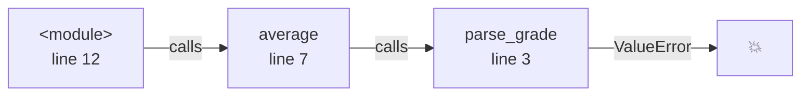
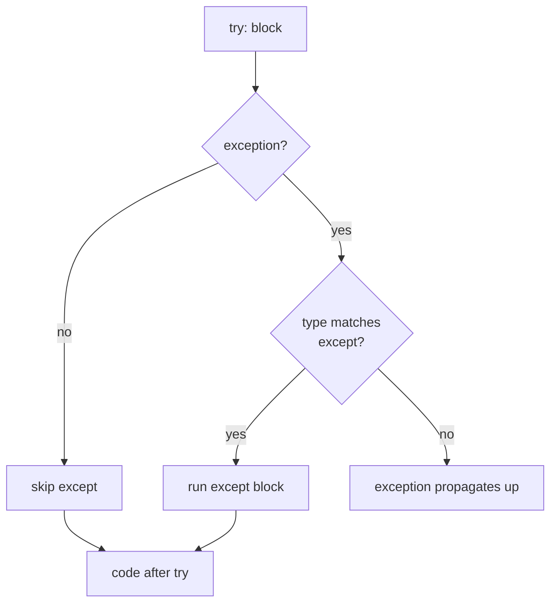
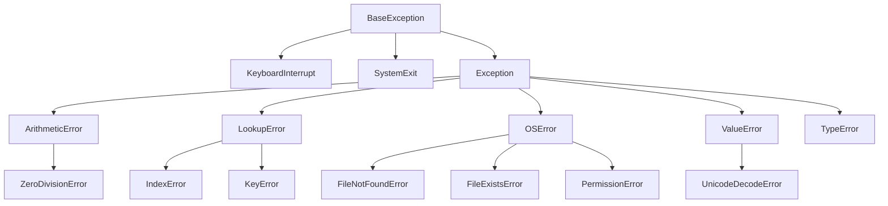
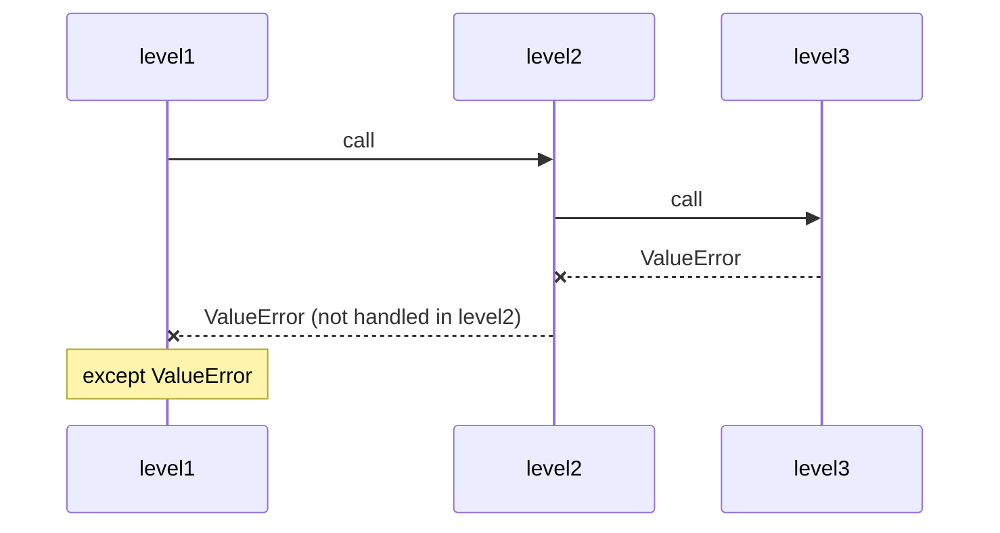

# 23. (Л) Обробка винятків (Exceptions)

## Зміст лекції

1. Коли програма ламається
2. Синтаксична помилка і виняток
3. Як читати traceback
4. Найчастіші вбудовані винятки
5. Конструкція `try` / `except`
6. Кілька гілок `except`
7. Обʼєкт винятку: `as e`
8. Ієрархія винятків
9. Гілка `else`
10. Гілка `finally`
11. Як виняток «проходить» крізь функції
12. Два стилі: LBYL та EAFP
13. Піднімаємо виняток самі: `raise`
14. Повторне піднімання і ланцюжки: `raise ... from`
15. Власні винятки
16. `assert` — перевірка припущень
17. Винятки та файли
18. Код завершення програми і `sys.exit()`
19. Повторне введення до коректного значення
20. Приклад: стійке завантаження журналу оцінок
21. Типові помилки

## Коли програма ламається

Досі ми писали програми так, ніби все завжди йде за планом: користувач вводить число, файл існує, у словнику є потрібний ключ. Реальність інша:

- користувач замість `18` вводить `вісімнадцять` або просто натискає Enter;
- файл, який «точно був», видалили або перейменували;
- у рядку `Kovalenko: 73,,81` зайва кома, і `int("")` не може перетворити порожній рядок на число;
- мережа зникла посеред завантаження.

У минулій лекції від таких ситуацій ми захищалися перевірками `if`: `path.exists()`, `len(sys.argv) > 1`, `if not line: continue`. Цей підхід працює, але не завжди: усі випадки наперед не передбачиш, а деякі перевірки взагалі неможливо зробити заздалегідь. Python пропонує інший механізм — **винятки** (exceptions).

**Виняток** — це обʼєкт, який Python створює в момент, коли операцію неможливо виконати. Виняток перериває звичайне виконання програми і «летить» вгору, доки його хтось не **перехопить**. Якщо ніхто не перехопив — програма завершується і друкує повідомлення про помилку.

## Синтаксична помилка і виняток

Помилки в Python бувають двох принципово різних видів.

**Синтаксична помилка** (`SyntaxError`) — код написано не за правилами мови. Python знаходить її ще **до запуску**, під час читання файлу, тому не виконується жоден рядок — навіть ті, що стоять вище за помилку.

```python
# Program: a syntax error stops the program before it starts
print("start")
if True
    print("inside")
```

```text
  File "main.py", line 3
    if True
           ^
SyntaxError: expected ':'
```

Зверніть увагу: `start` не надруковано. Програма не почала працювати.

**Виняток** (помилка часу виконання, runtime error) — код написано правильно, але конкретна операція з конкретними даними неможлива. Виконання доходить до проблемного рядка і лише тоді зупиняється.

```python
# Program: an exception happens while the program is running
print("start")
total = 100
count = 0
print("average:", total / count)
print("finish")
```

```text
start
Traceback (most recent call last):
  File "main.py", line 5, in <module>
    print("average:", total / count)
                      ~~~~~~^~~~~~~
ZeroDivisionError: division by zero
```

`start` надруковано, `finish` — ні. Синтаксичну помилку ми виправляємо в коді, і обробляти її не можна. Винятки ж можна і потрібно **обробляти**, і саме про це лекція.

## Як читати traceback

Повідомлення про неперехоплений виняток називається **traceback** (зворотне трасування). Початківці часто лякаються його розміру, хоча все необхідне в ньому зазвичай видно з двох-трьох рядків.

```python
# Program: a traceback through several functions
def parse_grade(text):
    return int(text)


def average(grades_text):
    grades = [parse_grade(part) for part in grades_text.split(",")]
    return sum(grades) / len(grades)


print(average("90,85,77"))
print(average("90,eighty,77"))
```

```text
84.0
Traceback (most recent call last):
  File "main.py", line 12, in <module>
    print(average("90,eighty,77"))
          ~~~~~~~^^^^^^^^^^^^^^^^
  File "main.py", line 7, in average
    grades = [parse_grade(part) for part in grades_text.split(",")]
              ~~~~~~~~~~~^^^^^^
  File "main.py", line 3, in parse_grade
    return int(text)
ValueError: invalid literal for int() with base 10: 'eighty'
```

Як це читати:

1. **Починайте з останнього рядка.** `ValueError` — тип винятку, після двокрапки — пояснення: `int()` не зміг перетворити рядок `'eighty'` на число.
2. **Рядком вище — місце, де виняток виник:** файл `main.py`, рядок 3, функція `parse_grade`, і сам рядок коду.
3. **Ще вище — хто цю функцію викликав.** Traceback — це ланцюжок викликів від зовнішнього (`<module>` — код верхнього рівня файлу) до внутрішнього, де все зламалося. Звідси заголовок `most recent call last`: найсвіжіший виклик — останній.
4. Символи `~~~^^^` підкреслюють конкретний вираз у рядку, який спричинив проблему.



!!! tip "Помилка не завжди там, де виняток"
    Traceback показує, **де** виняток виник, але не завжди, **чому**. Тут `int()` поводиться абсолютно правильно — проблема в даних, які передали на рівень вище. Пройдіться ланцюжком викликів угору, щоб знайти, звідки прийшло погане значення.

## Найчастіші вбудовані винятки

Кожен виняток має **тип** — його назва закінчується на `Error` і одразу підказує, що сталося.

| Виняток | Коли виникає | Приклад |
|---|---|---|
| `ValueError` | тип правильний, а значення — ні | `int("abc")` |
| `TypeError` | операція не підтримує такий тип | `"5" + 5`, `len(42)` |
| `ZeroDivisionError` | ділення на нуль | `10 / 0`, `10 % 0` |
| `IndexError` | індекс поза межами послідовності | `[1, 2][5]` |
| `KeyError` | ключа немає у словнику | `{"a": 1}["b"]` |
| `NameError` | імʼя (змінна, функція) не визначене | `print(totl)` |
| `AttributeError` | в обʼєкта немає такого атрибута чи методу | `[1, 2].push(3)` |
| `FileNotFoundError` | файлу за шляхом немає | `open("nothing.txt")` |
| `FileExistsError` | файл уже існує | `open("a.txt", "x")` для наявного файлу |
| `PermissionError` | немає прав на операцію | запис у `/etc/passwd` |
| `IsADirectoryError` | очікували файл, а це каталог | `open(".")` |
| `UnicodeDecodeError` | байти не декодуються в обраному кодуванні | читання не-UTF-8 файлу як UTF-8 |
| `RecursionError` | занадто глибока рекурсія | функція без базового випадку |
| `KeyboardInterrupt` | користувач натиснув Ctrl+C | під час `input()` або довгого циклу |

Подивимося на кілька з них у дії. Щоб програма не зупинилася на першому ж винятку, скористаємося конструкцією `try` / `except`, яку детально розберемо в наступному розділі.

```python
# Program: typical built-in exceptions
grades = [90, 85, 77]
student = {"name": "Ivan", "group": "PZ-11"}

try:
    int("ninety")
except ValueError as e:
    print("ValueError:", e)

try:
    "grade: " + 90
except TypeError as e:
    print("TypeError:", e)

try:
    grades[3]
except IndexError as e:
    print("IndexError:", e)

try:
    student["age"]
except KeyError as e:
    print("KeyError:", e)

try:
    grades.push(100)
except AttributeError as e:
    print("AttributeError:", e)

try:
    print(totl)
except NameError as e:
    print("NameError:", e)
```

```text
ValueError: invalid literal for int() with base 10: 'ninety'
TypeError: can only concatenate str (not "int") to str
IndexError: list index out of range
KeyError: 'age'
AttributeError: 'list' object has no attribute 'push'
NameError: name 'totl' is not defined
```

!!! info "`NameError` і `AttributeError` — це помилки в коді"
    `ValueError`, `FileNotFoundError`, `KeyError` зазвичай спричинені **даними**: користувач ввів не те, файл зник, у словнику немає ключа. Їх має сенс обробляти. А `NameError` чи `AttributeError` найчастіше означають **опечатку в коді**. Їх не перехоплюють — їх виправляють.

## Конструкція `try` / `except`

Щоб перехопити виняток, код, який може зламатися, поміщають у блок `try`, а реакцію на помилку — у блок `except`:

```text
try:
    <risky code>          # код, який може підняти виняток
except ExceptionType:
    <handler>             # що робити, якщо виняток стався
```

```python
# Program: catching a ValueError
text = "eighteen"

try:
    age = int(text)
    print("parsed:", age)
except ValueError:
    print("not a number:", text)

print("program continues")
```

```text
not a number: eighteen
program continues
```

Як це виконується:

1. Python виконує блок `try` рядок за рядком.
2. Якщо жодного винятку не сталося — блок `except` **пропускається** повністю.
3. Якщо в якомусь рядку виник виняток — решта блоку `try` **не виконується** (тому `parsed:` не надруковано). Python шукає гілку `except` з відповідним типом.
4. Якщо тип збігся — виконується тіло `except`, і програма **продовжує роботу** після всієї конструкції.
5. Якщо тип не збігся — виняток летить далі, так ніби `try` не було.



Пункт 5 важливий: `except ValueError` ловить **тільки** `ValueError`. Інші винятки проходять крізь нього.

```python
# Program: except catches only the listed type
values = ["42", "7"]

try:
    number = int(values[5])
except ValueError:
    print("not a number")
```

```text
Traceback (most recent call last):
  File "main.py", line 5, in <module>
    number = int(values[5])
                 ~~~~~~^^^
IndexError: list index out of range
```

Тепер перехоплення у циклі — типовий випадок, коли одне погане значення не повинно зупиняти обробку всіх інших:

```python
# Program: skip bad values, keep processing the rest
raw = ["95", "88", "absent", "100", "", "73"]

grades = []
for item in raw:
    try:
        grades.append(int(item))
    except ValueError:
        print(f"skipped: {item!r}")

print("grades:", grades)
print("average:", round(sum(grades) / len(grades), 2))
```

```text
skipped: 'absent'
skipped: ''
grades: [95, 88, 100, 73]
average: 89.0
```

## Кілька гілок `except`

Один блок `try` може підняти винятки різних типів, і на кожен можна реагувати по-своєму. Гілки `except` перевіряються **згори донизу**, виконується **перша** відповідна.

```python
# Program: different reactions to different errors
def safe_divide(a, b):
    try:
        result = float(a) / float(b)
    except ValueError:
        return "error: not a number"
    except ZeroDivisionError:
        return "error: division by zero"
    return f"{result:.2f}"


print(safe_divide("10", "4"))
print(safe_divide("10", "zero"))
print(safe_divide("10", "0"))
```

```text
2.50
error: not a number
error: division by zero
```

Якщо реакція на кілька типів однакова, їх перелічують **кортежем** в одній гілці:

```python
# Program: one handler for several exception types
data = {"grades": [90, 85]}


def get_grade(key, index):
    try:
        return data[key][index]
    except (KeyError, IndexError):
        return None


print(get_grade("grades", 1))
print(get_grade("grades", 10))
print(get_grade("scores", 0))
```

```text
85
None
None
```

## Обʼєкт винятку: `as e`

Виняток — це звичайний обʼєкт Python. Конструкція `except ТипВинятку as e` привʼязує його до змінної `e`, і з нього можна дістати корисну інформацію:

- `str(e)` (або просто `print(e)`) — текст повідомлення;
- `type(e).__name__` — назва типу винятку;
- `e.args` — кортеж аргументів, з якими виняток створили.

```python
# Program: inspecting the exception object
try:
    int("12abc")
except ValueError as e:
    print("message:", e)
    print("type:   ", type(e).__name__)
    print("args:   ", e.args)
```

```text
message: invalid literal for int() with base 10: '12abc'
type:    ValueError
args:    ("invalid literal for int() with base 10: '12abc'",)
```

Деякі винятки мають додаткові атрибути. Наприклад, у винятків файлової системи є `filename` і `strerror`:

```python
# Program: extra attributes of OSError
try:
    open("missing_file.txt", encoding="utf-8")
except FileNotFoundError as e:
    print("file:  ", e.filename)
    print("reason:", e.strerror)
    print("errno: ", e.errno)
```

```text
file:   missing_file.txt
reason: No such file or directory
errno:  2
```

!!! warning "`e` існує лише всередині `except`"
    Після виходу з блоку `except` Python **видаляє** змінну `e`, щоб не тримати в памʼяті обʼєкт винятку разом з усім його traceback. Якщо повідомлення знадобиться пізніше, збережіть його в іншу змінну: `error_text = str(e)`.

## Ієрархія винятків

Типи винятків утворюють **дерево**: загальніші винятки стоять угорі, конкретніші — нижче. Ось фрагмент цього дерева:



Правило: `except X` перехоплює виняток типу `X` **і всіх його нащадків**. Тож `except LookupError` спіймає і `IndexError`, і `KeyError`, а `except OSError` — будь-яку проблему з файлами.

```python
# Program: a parent type catches its children
def lookup(container, key):
    try:
        return container[key]
    except LookupError as e:
        return f"{type(e).__name__} caught as LookupError"


print(lookup([10, 20], 5))
print(lookup({"a": 1}, "b"))
print(lookup({"a": 1}, "a"))
```

```text
IndexError caught as LookupError
KeyError caught as LookupError
1
```

Перевірити спорідненість типів можна функцією `issubclass()`:

```python
# Program: checking the exception hierarchy
print(issubclass(FileNotFoundError, OSError))
print(issubclass(KeyError, LookupError))
print(issubclass(ValueError, LookupError))
print(issubclass(ZeroDivisionError, Exception))
```

```text
True
True
False
True
```

З ієрархії випливає важливе правило про порядок гілок: **спочатку конкретні винятки, потім загальні**. Інакше загальна гілка перехопить усе, і конкретна ніколи не виконається.

```python
# Program: wrong and right order of except branches
def read_config_wrong(path):
    try:
        with open(path, encoding="utf-8") as f:
            return f.read()
    except OSError:
        return "some OS problem"
    except FileNotFoundError:          # ніколи не виконається
        return "file not found"


def read_config_right(path):
    try:
        with open(path, encoding="utf-8") as f:
            return f.read()
    except FileNotFoundError:
        return "file not found"
    except OSError:
        return "some OS problem"


print(read_config_wrong("no_such_config.txt"))
print(read_config_right("no_such_config.txt"))
```

```text
some OS problem
file not found
```

### `Exception` і `BaseException`

На вершині дерева — `BaseException`. Від нього походять `Exception` (усі «звичайні» помилки програми) і кілька спеціальних винятків, які помилками не є:

- `KeyboardInterrupt` — користувач натиснув Ctrl+C, щоб зупинити програму;
- `SystemExit` — програма викликала `sys.exit()`.

Саме тому `except Exception` не заважає зупинити програму через Ctrl+C, а «голий» `except:` без типу — заважає: він ловить узагалі все, зокрема й `KeyboardInterrupt` та `SystemExit`.

Подивимося, чим це загрожує:

```python
# Program: a bare except hides a typo
def parse_grades(texts):
    grades = []
    for text in texts:
        try:
            grades.append(int(txt))    # опечатка: txt замість text
        except:                        # голий except ловить і NameError
            pass
    return grades


print(parse_grades(["90", "85", "abc"]))
```

```text
[]
```

Програма не впала, але повернула порожній список: `NameError` через опечатку «проковтнуто» так само, як очікуваний `ValueError`. З `except ValueError:` ми одразу побачили б traceback з `NameError: name 'txt' is not defined`.

!!! danger "Не пишіть голий `except:`"
    Голий `except:` ховає будь-яку помилку, навіть опечатку, і ще й не дає зупинити програму через Ctrl+C. Завжди вказуйте конкретний тип винятку. Якщо справді треба перехопити будь-яку помилку програми (наприклад, щоб записати її в журнал) — пишіть `except Exception as e` і обовʼязково виводьте або записуйте `e`.

## Гілка `else`

Після всіх `except` можна додати гілку `else`. Вона виконується, **лише якщо в `try` не виникло жодного винятку**.

```python
# Program: else runs only when there was no exception
def parse_age(text):
    try:
        age = int(text)
    except ValueError:
        print(f"{text!r}: not a number")
    else:
        print(f"{text!r}: ok, next year you will be {age + 1}")


parse_age("19")
parse_age("nineteen")
```

```text
'19': ok, next year you will be 20
'nineteen': not a number
```

Навіщо `else`, якщо той самий `print` можна поставити в кінець `try`? Щоб **не перехоплювати зайвого**. Блок `try` має містити лише ті рядки, від яких ми очікуємо виняток. Якщо в «успішному» коді теж станеться `ValueError`, але з іншої причини, — в `else` він не буде помилково прийнятий за «не число», а покаже справжню проблему.

```python
# Program: a too wide try hides a different bug
def report(text, divider):
    try:
        value = int(text)
        print("share:", value / int(divider))
    except ValueError:
        print("input is not a number")


report("100", "4")
report("100", "four")      # проблема в divider, а повідомлення про text
```

```text
share: 25.0
input is not a number
```

Правильно — тримати в `try` мінімум коду й обробляти кожне джерело помилки окремо.

## Гілка `finally`

Гілка `finally` виконується **завжди**: після успішного `try`, після обробленого винятку, після необробленого винятку і навіть після `return` усередині `try`. Її використовують для «прибирання»: закрити зʼєднання, видалити тимчасовий файл, вивести підсумкове повідомлення.

```python
# Program: finally runs in every case
def divide(a, b):
    try:
        print(f"  dividing {a} by {b}")
        return a / b
    except ZeroDivisionError:
        print("  cannot divide by zero")
        return None
    finally:
        print("  finally: done")


print("result:", divide(10, 4))
print("result:", divide(10, 0))
```

```text
  dividing 10 by 4
  finally: done
result: 2.5
  dividing 10 by 0
  cannot divide by zero
  finally: done
result: None
```

Зверніть увагу: `return a / b` уже «вирішив» повернути `2.5`, але спочатку виконався `finally`, і лише потім функція повернула значення.

Якщо виняток не перехоплено, `finally` однаково виконується — а потім виняток летить далі:

```python
# Program: finally runs even when the exception is not handled
try:
    print("opening connection")
    int("oops")
finally:
    print("closing connection")

print("never printed")
```

```text
opening connection
closing connection
Traceback (most recent call last):
  File "main.py", line 4, in <module>
    int("oops")
    ~~~^^^^^^^^
ValueError: invalid literal for int() with base 10: 'oops'
```

!!! info "`with` — це вбудований `finally`"
    Згадайте, як у минулій лекції `with open(...)` «гарантовано закривав файл навіть після помилки». Всередині `with` працює саме такий механізм: при виході з блоку — хоч нормальному, хоч через виняток — викликається код закриття. Для файлів використовуйте `with`, а `finally` — для решти випадків, де потрібне прибирання.

### Повна форма

Усі чотири гілки разом, у суворо такому порядку:

```text
try:
    <risky code>          # код, який може зламатися
except TypeA:
    <handler A>           # реакція на TypeA
except (TypeB, TypeC) as e:
    <handler B or C>      # реакція на TypeB або TypeC
else:
    <on success>          # виконується, якщо винятку не було
finally:
    <cleanup>             # виконується завжди
```

Обовʼязкові лише `try` і хоча б одна з гілок `except` або `finally`. `else` без `except` писати не можна.

```python
# Program: all four branches together
def load_number(text):
    print(f"--- {text!r}")
    try:
        number = int(text)
    except ValueError as e:
        print("except:", e)
    else:
        print("else:   parsed", number)
    finally:
        print("finally")


load_number("42")
load_number("forty two")
```

```text
--- '42'
else:   parsed 42
finally
--- 'forty two'
except: invalid literal for int() with base 10: 'forty two'
finally
```

## Як виняток «проходить» крізь функції

Виняток не обовʼязково обробляти там, де він виник. Якщо у функції немає відповідного `except`, виняток **виходить** з неї і потрапляє у місце виклику, звідти — у наступне, і так далі аж до верхнього рівня програми. Цей процес називають **розкручуванням стеку** (stack unwinding).

```python
# Program: an exception travels up through the call chain
def level3():
    print("    level3: start")
    int("x")
    print("    level3: end")


def level2():
    print("  level2: start")
    level3()
    print("  level2: end")


def level1():
    print("level1: start")
    try:
        level2()
    except ValueError as e:
        print("level1: caught ->", e)
    print("level1: end")


level1()
```

```text
level1: start
  level2: start
    level3: start
level1: caught -> invalid literal for int() with base 10: 'x'
level1: end
```

Рядки `level3: end` і `level2: end` не надруковано: виняток перервав обидві функції, і виконання продовжилося лише там, де його перехопили.



Це дає змогу розділити обовʼязки:

- **низькорівнева** функція (розбір рядка, читання файлу) лише **повідомляє** про проблему — вона не знає, що з нею робити;
- **високорівнева** функція (головне меню, `main`) **вирішує**, як реагувати: показати повідомлення, пропустити запис, спробувати ще раз.

Тому не варто в кожній функції загортати все в `try`. Обробляйте виняток там, де **є достатньо контексту**, щоб прийняти рішення.

## Два стилі: LBYL та EAFP

Є два підходи до потенційно небезпечних операцій.

**LBYL** — *Look Before You Leap*, «подивись, перш ніж стрибати». Спочатку перевіряємо всі умови, потім виконуємо дію.

**EAFP** — *Easier to Ask for Forgiveness than Permission*, «легше попросити вибачення, ніж дозволу». Одразу виконуємо дію, а якщо не вийшло — обробляємо виняток.

```python
# Program: LBYL versus EAFP
from pathlib import Path

prices = {"apple": 25, "bread": 32}


# LBYL: перевіряємо наперед
def price_lbyl(item):
    if item in prices:
        return prices[item]
    return 0


# EAFP: пробуємо, а потім обробляємо невдачу
def price_eafp(item):
    try:
        return prices[item]
    except KeyError:
        return 0


print(price_lbyl("bread"), price_lbyl("milk"))
print(price_eafp("bread"), price_eafp("milk"))


# Для файлів EAFP надійніший
def read_lbyl(path):
    if path.is_file():
        return path.read_text(encoding="utf-8")   # файл міг зникнути між рядками
    return ""


def read_eafp(path):
    try:
        return path.read_text(encoding="utf-8")
    except FileNotFoundError:
        return ""


print(repr(read_lbyl(Path("absent.txt"))), repr(read_eafp(Path("absent.txt"))))
```

```text
32 0
32 0
'' ''
```

Коли що обирати:

| Ситуація | Кращий стиль | Чому |
|---|---|---|
| Проста перевірка, яка повністю описує умову (`x != 0`, `key in d`, `len(items) > 0`) | LBYL | читається природно, виняток не потрібен |
| Перевірити наперед складно (чи є рядок коректним числом, датою, JSON) | EAFP | функція розбору сама знає правила — простіше спробувати |
| Стан може змінитися між перевіркою і дією (файли, мережа) | EAFP | перевірка `exists()` не гарантує, що файл буде на місці через мить |
| Помилка — звичайна частина потоку (у половини рядків немає ключа) | LBYL або `dict.get()` | винятки для рідкісних подій, а не для звичайної логіки |

Перевірка «чи рядок — ціле число» — класичний приклад на користь EAFP. Метод `isdigit()` здається підходящим, але помиляється в обидва боки:

```python
# Program: isdigit() is not a reliable number check
for text in ["42", "-5", " 7 ", "²"]:
    try:
        parsed = int(text)
    except ValueError:
        parsed = "ValueError"
    print(f"{text!r:6} isdigit={text.isdigit()!s:6} int() -> {parsed}")
```

```text
'42'   isdigit=True   int() -> 42
'-5'   isdigit=False  int() -> -5
' 7 '  isdigit=False  int() -> 7
'²'    isdigit=True   int() -> ValueError
```

`isdigit()` відкидає коректні `-5` і `" 7 "` і водночас пропускає символ `²`, на якому `int()` падає. Тож найнадійніший спосіб дізнатися, чи рядок перетворюється на число, — спробувати перетворити.

## Піднімаємо виняток самі: `raise`

Досі винятки піднімав Python. Але і наша функція може повідомити про проблему за допомогою інструкції `raise`:

```text
raise ExceptionType("message")
```

Навіщо це потрібно? Уявіть функцію, яка встановлює оцінку. Значення `150` — коректне `int`, Python тут нічого не помітить. Але для нашої задачі воно неприпустиме. Можна повернути `None` чи `-1`, але тоді кожен виклик мусить про це памʼятати й перевіряти результат. Виняток ігнорувати не вийде: або його обробили, або програма зупинилася з чітким повідомленням.

```python
# Program: raising an exception for invalid input
def validate_grade(grade: int) -> int:
    if not isinstance(grade, int):
        raise TypeError(f"grade must be int, got {type(grade).__name__}")
    if not 0 <= grade <= 100:
        raise ValueError(f"grade must be in 0..100, got {grade}")
    return grade


for value in [95, 150, -3, "90"]:
    try:
        print("accepted:", validate_grade(value))
    except (TypeError, ValueError) as e:
        print(f"rejected: {type(e).__name__}: {e}")
```

```text
accepted: 95
rejected: ValueError: grade must be in 0..100, got 150
rejected: ValueError: grade must be in 0..100, got -3
rejected: TypeError: grade must be int, got str
```

Як обрати тип винятку для `raise`:

- **`ValueError`** — значення правильного типу, але неприйнятне (оцінка 150, порожнє імʼя, дата в майбутньому);
- **`TypeError`** — переданий обʼєкт узагалі не того типу;
- **`KeyError`**, **`IndexError`** — не знайдено елемент за ключем чи індексом;
- **`FileNotFoundError`** — потрібного файлу немає;
- **власний тип** — коли жоден стандартний не описує проблему точно (див. нижче).

!!! tip "Добре повідомлення про помилку"
    Повідомлення у винятку читатиме людина, яка шукає причину збою. Воно має відповідати на питання «що саме не так і з яким значенням»: `grade must be in 0..100, got 150` набагато корисніше, ніж `bad grade` чи `error`.

## Повторне піднімання і ланцюжки: `raise ... from`

Іноді виняток треба перехопити, щось зробити (наприклад, записати в журнал) і **пропустити далі**, бо на цьому рівні вирішити проблему неможливо. Для цього в блоці `except` пишуть `raise` без аргументів — він повторно піднімає той самий виняток:

```python
# Program: log the problem and re-raise the same exception
def to_int(text):
    try:
        return int(text)
    except ValueError:
        print(f"log: failed to convert {text!r}")
        raise


try:
    to_int("3.5")
except ValueError as e:
    print("main:", e)
```

```text
log: failed to convert '3.5'
main: invalid literal for int() with base 10: '3.5'
```

Інший випадок — **перетворити** низькорівневий виняток на зрозуміліший. Наприклад, функція завантаження налаштувань отримує `KeyError: 'port'`, але користувачу корисніше побачити, що саме не так із конфігурацією. Для цього використовують `raise НовийВиняток(...) from e`: новий виняток зберігає посилання на початковий, і traceback покаже обидва.

```python
# Program: exception chaining with raise ... from
def read_port(settings):
    try:
        return int(settings["port"])
    except KeyError as e:
        raise ValueError("config: required field 'port' is missing") from e


read_port({"host": "localhost"})
```

```text
Traceback (most recent call last):
  File "main.py", line 4, in read_port
    return int(settings["port"])
               ~~~~~~~~^^^^^^^^
KeyError: 'port'

The above exception was the direct cause of the following exception:

Traceback (most recent call last):
  File "main.py", line 9, in <module>
    read_port({"host": "localhost"})
    ~~~~~~~~~^^^^^^^^^^^^^^^^^^^^^^^
  File "main.py", line 6, in read_port
    raise ValueError("config: required field 'port' is missing") from e
ValueError: config: required field 'port' is missing
```

Traceback складається з двох частин: спершу початкова причина (`KeyError`), потім фраза `The above exception was the direct cause of the following exception` і новий виняток. Так не втрачається жодна інформація.

!!! info "Виняток усередині `except` без `from`"
    Якщо в блоці `except` виникне **інший** виняток (наприклад, через помилку в коді обробника), Python теж покаже обидва, але з фразою `During handling of the above exception, another exception occurred`. Це підказка: зламався сам обробник, а не лише основний код.

## Власні винятки

Стандартних типів вистачає не завжди. Коли програма має власні «правила гри» — формат файлу журналу, бізнес-обмеження, — зручно завести **власний тип винятку**. Тоді його можна перехоплювати окремо від усіх інших і не сплутати з випадковим `ValueError` з глибини бібліотеки.

Власний виняток створюється одним рядком — оголошенням **класу**, що походить від `Exception`:

```python
# Program: a custom exception type
class GradeFormatError(Exception):
    """Raised when a line of the grades file is malformed."""


def parse_line(line: str) -> tuple[str, int]:
    name, sep, grade_text = line.partition(":")
    if not sep:
        raise GradeFormatError(f"missing ':' in {line!r}")
    try:
        grade = int(grade_text)
    except ValueError as e:
        raise GradeFormatError(f"bad grade in {line!r}") from e
    return name.strip(), grade


for line in ["Bondar: 90", "Kovalenko 85", "Marchenko: ninety"]:
    try:
        print(parse_line(line))
    except GradeFormatError as e:
        print("format error:", e)
```

```text
('Bondar', 90)
format error: missing ':' in 'Kovalenko 85'
format error: bad grade in 'Marchenko: ninety'
```

Класи детально розглядатимемо в наступних семестрах. Поки що достатньо шаблону:

```text
class SomethingError(Exception):
    """Describe when this exception is raised."""
```

- Назву закінчуйте на `Error` — так роблять усі вбудовані винятки.
- У дужках — **батьківський** тип. `Exception` підходить майже завжди; якщо помилка за змістом — різновид неправильного значення, можна успадкувати від `ValueError`, і тоді її спіймає і `except ValueError`.
- Рядок документації замість `pass` — тіло класу, яке пояснює, коли виняток виникає.

## `assert` — перевірка припущень

Інструкція `assert` перевіряє умову і, якщо вона хибна, піднімає `AssertionError`:

```text
assert condition, "message"
```

```python
# Program: assert checks the programmer's assumptions
def average(grades: list[int]) -> float:
    assert len(grades) > 0, "average() of an empty list"
    return sum(grades) / len(grades)


print(average([90, 80]))
print(average([]))
```

```text
85.0
Traceback (most recent call last):
  File "main.py", line 8, in <module>
    print(average([]))
          ~~~~~~~^^^^
  File "main.py", line 3, in average
    assert len(grades) > 0, "average() of an empty list"
           ^^^^^^^^^^^^^^^
AssertionError: average() of an empty list
```

`assert` схожий на `if ...: raise`, але має інше призначення. Він перевіряє **припущення програміста** — умови, які при правильному коді не можуть порушитися ніколи. Якщо `assert` спрацював — у програмі баг.

!!! danger "`assert` — не для перевірки вхідних даних"
    Python, запущений з ключем `-O` (`python3 -O main.py`), **повністю пропускає** всі `assert`. Тому перевірку того, що ввів користувач або що прочитано з файлу, завжди робіть через `if` і `raise ValueError(...)`. `assert` лишайте для внутрішніх перевірок і тестів.

## Винятки та файли

Робота з файлами — головне джерело винятків у реальних програмах: файл може бути відсутній, недоступний, бути каталогом або мати не те кодування. Всі ці винятки — нащадки `OSError` (крім `UnicodeDecodeError`, який походить від `ValueError`).

```python
# Program: handling file errors
from pathlib import Path

Path("latin1_demo.txt").write_bytes("Café".encode("latin-1"))
Path("demo_dir").mkdir(exist_ok=True)


def read_file(path: str) -> str:
    try:
        with open(path, encoding="utf-8") as f:
            return f.read()
    except FileNotFoundError:
        return f"error: {path} not found"
    except IsADirectoryError:
        return f"error: {path} is a directory"
    except PermissionError:
        return f"error: no permission to read {path}"
    except UnicodeDecodeError:
        return f"error: {path} is not a UTF-8 text file"


for name in ["nothing.txt", "demo_dir", "latin1_demo.txt"]:
    print(read_file(name))
```

```text
error: nothing.txt not found
error: demo_dir is a directory
error: latin1_demo.txt is not a UTF-8 text file
```

У минулій лекції ми уникали перезапису файлу через перевірку `exists()`. Тепер можна зробити це надійніше — режимом `"x"` і перехопленням `FileExistsError`. Між перевіркою та відкриттям файл не «зʼявиться» непомітно: операційна система перевіряє і створює файл однією дією.

```python
# Program: create a file only once, the EAFP way
from pathlib import Path

path = Path("created_once.txt")
path.unlink(missing_ok=True)

for attempt in [1, 2]:
    try:
        with open(path, "x", encoding="utf-8") as f:
            f.write("created on the first attempt\n")
        print(f"attempt {attempt}: file created")
    except FileExistsError:
        print(f"attempt {attempt}: file already exists, not overwritten")
```

```text
attempt 1: file created
attempt 2: file already exists, not overwritten
```

## Код завершення програми і `sys.exit()`

Кожна програма, завершуючись, повідомляє операційній системі **код завершення** (exit code): `0` — успіх, будь-яке інше число — збій. Код останньої команди в терміналі показує змінна `$?`.

Коли виняток не перехоплено, Python друкує traceback і завершується з кодом `1`. Для кінцевого користувача traceback — це «страшний» текст, який нічого йому не каже. Тому в утилітах командного рядка прийнято перехоплювати очікувані помилки на верхньому рівні, друкувати коротке повідомлення в **потік помилок** `sys.stderr` і завершуватися через `sys.exit(1)`.

```python
# Program: word counter with friendly error messages (word_count.py)
import sys
from pathlib import Path


def count_words(path: Path) -> int:
    with open(path, encoding="utf-8") as f:
        return sum(len(line.split()) for line in f)


def main() -> int:
    if len(sys.argv) != 2:
        print(f"usage: python3 {Path(sys.argv[0]).name} <file>", file=sys.stderr)
        return 2
    path = Path(sys.argv[1])
    try:
        words = count_words(path)
    except FileNotFoundError:
        print(f"error: file not found: {path}", file=sys.stderr)
        return 1
    except IsADirectoryError:
        print(f"error: {path} is a directory", file=sys.stderr)
        return 1
    except UnicodeDecodeError:
        print(f"error: {path} is not a UTF-8 text file", file=sys.stderr)
        return 1
    print(f"{path.name}: {words} words")
    return 0


sys.exit(main())
```

```text
$ python3 word_count.py word_count.py
word_count.py: 92 words
$ echo $?
0

$ python3 word_count.py nothing.txt
error: file not found: nothing.txt
$ echo $?
1

$ python3 word_count.py
usage: python3 word_count.py <file>
$ echo $?
2
```

Що тут варто помітити:

- `main()` **повертає** код завершення, а `sys.exit(main())` передає його системі. Так логіка програми не розкидана по викликах `sys.exit()` у різних місцях.
- Повідомлення про помилки йдуть у `sys.stderr`, а корисний результат — у `sys.stdout`. Якщо перенаправити вивід у файл (`> result.txt`), помилки все одно зʼявляться на екрані.
- Код `2` за традицією означає неправильне використання команди (не ті аргументи).
- `sys.exit()` сам по собі піднімає виняток `SystemExit`. Саме тому він не походить від `Exception`: `except Exception` його не перехопить і не завадить програмі завершитися.

## Повторне введення до коректного значення

Класичний приклад з `input()`: питати користувача, доки він не введе коректне значення. Логіку перевірки варто винести в окрему функцію — тоді її легко протестувати без клавіатури.

```python
# Program: ask again until the value is valid
def parse_grade(text: str) -> int:
    """Convert text to a grade 0..100 or raise ValueError."""
    grade = int(text)
    if not 0 <= grade <= 100:
        raise ValueError(f"grade must be in 0..100, got {grade}")
    return grade


def ask_grade(prompt: str) -> int:
    while True:
        text = input(prompt)
        try:
            return parse_grade(text)
        except ValueError as e:
            print("  invalid:", e)


grade = ask_grade("Enter grade: ")
print("saved:", grade)
```

```text
Enter grade: ninety
  invalid: invalid literal for int() with base 10: 'ninety'
Enter grade: 150
  invalid: grade must be in 0..100, got 150
Enter grade: 90
saved: 90
```

Зверніть увагу: `parse_grade` піднімає один і той самий `ValueError` і коли текст не число (це робить `int()`), і коли число поза межами (це робимо ми через `raise`). Тому `ask_grade` потрібна лише одна гілка `except`.

Якщо під час `input()` натиснути Ctrl+C, виникне `KeyboardInterrupt`; якщо Ctrl+D (кінець вводу) — `EOFError`. Щоб програма завершувалася акуратно, без traceback, їх перехоплюють на верхньому рівні:

```python
# Program: leave quietly on Ctrl+C or Ctrl+D
import sys


def ask_grade(prompt: str) -> int:
    while True:
        text = input(prompt)
        try:
            grade = int(text)
        except ValueError:
            print("  invalid: not a number")
            continue
        if 0 <= grade <= 100:
            return grade
        print("  invalid: grade must be in 0..100")


try:
    grade = ask_grade("Enter grade: ")
except (KeyboardInterrupt, EOFError):
    print("\ncancelled")
    sys.exit(1)

print("saved:", grade)
```

```text
Enter grade: ^C
cancelled
```

## Приклад: стійке завантаження журналу оцінок

Повернімося до журналу оцінок з минулої лекції. Реальний файл рідко буває ідеальним: в ньому бувають рядки без двокрапки, текст замість оцінок, оцінки поза межами. Програма не повинна падати на першому ж поганому рядку — вона має завантажити все, що можна, і докладно повідомити про решту.

```python
# Program: tolerant loader for a grades journal
from pathlib import Path


class JournalFormatError(Exception):
    """Raised when a line of the journal cannot be parsed."""


def parse_grade(text: str) -> int:
    try:
        grade = int(text)
    except ValueError:
        raise JournalFormatError(f"not a number: {text!r}") from None
    if not 0 <= grade <= 100:
        raise JournalFormatError(f"out of range: {grade}")
    return grade


def parse_line(line: str) -> tuple[str, list[int]]:
    name, sep, grades_text = line.partition(":")
    if not sep:
        raise JournalFormatError("missing ':'")
    name = name.strip()
    if not name:
        raise JournalFormatError("empty student name")
    grades = [parse_grade(part.strip()) for part in grades_text.split(",")]
    return name, grades


def load_journal(path: Path) -> tuple[dict[str, list[int]], list[str]]:
    """Return (journal, errors). Bad lines are reported, not fatal."""
    journal: dict[str, list[int]] = {}
    errors: list[str] = []
    with open(path, encoding="utf-8") as f:
        for number, raw in enumerate(f, start=1):
            line = raw.strip()
            if not line or line.startswith("#"):
                continue
            try:
                name, grades = parse_line(line)
            except JournalFormatError as e:
                errors.append(f"line {number}: {e}")
                continue
            journal.setdefault(name, []).extend(grades)
    return journal, errors


def main() -> None:
    path = Path(__file__).resolve().parent / "journal_demo.txt"
    path.write_text(
        "# student: grades\n"
        "Shevchenko: 95, 88, 100\n"
        "Kovalenko 73, 81\n"
        "Bondar: 60, 67, seventy\n"
        "\n"
        "Marchenko: 85, 120\n"
        ": 90\n"
        "Kovalenko: 94\n",
        encoding="utf-8",
    )

    try:
        journal, errors = load_journal(path)
    except FileNotFoundError:
        print(f"journal not found: {path}")
        return

    for name, grades in journal.items():
        print(f"{name:<12} {grades}  avg={sum(grades) / len(grades):.2f}")

    if errors:
        print(f"\nskipped {len(errors)} bad line(s):")
        for error in errors:
            print("  " + error)


main()
```

```text
Shevchenko   [95, 88, 100]  avg=94.33
Kovalenko    [94]  avg=94.00

skipped 4 bad line(s):
  line 3: missing ':'
  line 4: not a number: 'seventy'
  line 6: out of range: 120
  line 7: empty student name
```

Що варто помітити:

- **Низькорівневі** функції `parse_grade` і `parse_line` нічого не друкують і не вирішують — вони лише піднімають `JournalFormatError` з чітким поясненням.
- **Рішення** приймає `load_journal`: поганий рядок записується у список помилок, обробка продовжується з наступного. Номер рядка додається саме тут, бо лише тут він відомий.
- `raise ... from None` приховує початковий `ValueError` з traceback: наше повідомлення `not a number: 'seventy'` уже містить усю потрібну інформацію.
- Власний тип `JournalFormatError` відокремлює «очікувані» помилки формату від справжніх багів: якби в коді була опечатка і виник `NameError`, вона не потрапила б у список «поганих рядків», а зупинила б програму з traceback — як і має бути.
- `FileNotFoundError` обробляється на найвищому рівні, у `main`, бо лише там відомо, що робити, якщо файлу немає.

## Типові помилки

| Помилка | Чому погано | Як правильно |
|---|---|---|
| `except:` без типу | ловить усе, включно з Ctrl+C, `SystemExit` і опечатками в коді | вказувати конкретний тип: `except ValueError:` |
| `except Exception: pass` | помилка зникає безслідно, програма мовчки робить не те | обробити або хоча б вивести `e`; якщо не знаєте, що робити, — не перехоплюйте |
| Увесь код функції в одному `try` | перехоплюються помилки, яких не очікували, і отримують не те пояснення | у `try` — лише рядки, які можуть підняти очікуваний виняток; решта — в `else` або після |
| Загальний виняток перед конкретним (`except OSError` перед `except FileNotFoundError`) | конкретна гілка ніколи не виконається | від вузького до широкого |
| `except ValueError, TypeError:` | синтаксична помилка в Python 3 | кортеж: `except (ValueError, TypeError):` |
| `raise ValueError` без повідомлення | незрозуміло, що саме не так | `raise ValueError(f"grade must be in 0..100, got {grade}")` |
| `raise "error"` | піднімати можна лише винятки, а не рядки (`TypeError`) | `raise ValueError("error")` |
| Повернення «спецзначень» (`-1`, `None`) замість винятку | виклик може забути перевірку, і `-1` піде в обчислення | `raise`, а обробку залишити тому, хто знає, що робити |
| `assert` для перевірки введення | з ключем `-O` перевірка зникає | `if ...: raise ValueError(...)` |
| Використання `e` після блоку `except` | `NameError`: змінна видаляється при виході | зберегти `message = str(e)` всередині `except` |
| `return` усередині `finally` | «проковтує» будь-який виняток і перекриває `return` з `try` | у `finally` — лише прибирання, без `return` |
| Перехоплення `NameError`, `AttributeError`, `TypeError` від власних опечаток | маскується баг у коді | такі винятки виправляють, а не обробляють |

Останній пункт про `finally` варто побачити, бо він неочевидний:

```python
# Program: return in finally swallows the exception
def broken():
    try:
        return int("oops")
    finally:
        return -1        # погано: ValueError зникає безслідно


print(broken())
```

```text
-1
```

Функція мала впасти з `ValueError`, але `return` у `finally` мовчки замінив виняток на `-1`. Починаючи з Python 3.14, інтерпретатор виводить про таку конструкцію попередження `SyntaxWarning`, але код однаково виконується.

## Підсумок

- **Синтаксична помилка** виявляється до запуску і виправляється в коді. **Виняток** виникає під час виконання, коли операцію з конкретними даними неможливо виконати.
- **Traceback** читають знизу вгору: тип і повідомлення винятку, місце, де він виник, і ланцюжок викликів, що до нього привів.
- `try` / `except` перехоплює виняток: решта `try` пропускається, виконується перша відповідна гілка `except`, програма продовжує роботу після конструкції.
- Кілька типів — кілька гілок або кортеж: `except (KeyError, IndexError):`. Обʼєкт винятку — через `as e`.
- Винятки утворюють **ієрархію**; `except X` ловить `X` і всіх нащадків. Гілки пишуть від конкретних до загальних. `except Exception` — найширше допустиме перехоплення, голий `except:` — ні.
- `else` виконується, якщо винятку не було; `finally` — завжди. У `try` тримають мінімум коду.
- Неперехоплений виняток **піднімається** крізь виклики функцій; обробляти його варто там, де достатньо контексту для рішення.
- **EAFP** («спробуй і оброби») надійніший за **LBYL** («перевір спочатку»), коли умову важко перевірити або стан може змінитися (файли, розбір чисел).
- `raise ValueError("...")` — повідомити про неприйнятне значення; `raise` без аргументів — пропустити виняток далі; `raise New(...) from e` — перетворити виняток, зберігши причину.
- Власний виняток: `class MyError(Exception):` з рядком документації.
- `assert` — лише для перевірки припущень програміста, не вхідних даних.
- В утилітах командного рядка очікувані помилки перехоплюють на верхньому рівні, пишуть коротке повідомлення в `sys.stderr` і завершуються ненульовим кодом через `sys.exit()`.

## Корисні посилання

- [Помилки та винятки — підручник Python](https://docs.python.org/3/tutorial/errors.html)
- [Вбудовані винятки та їх ієрархія](https://docs.python.org/3/library/exceptions.html#exception-hierarchy)
- [Інструкція `try` — довідник мови](https://docs.python.org/3/reference/compound_stmts.html#the-try-statement)
- [Інструкція `raise` — довідник мови](https://docs.python.org/3/reference/simple_stmts.html#the-raise-statement)
- [Інструкція `assert` — довідник мови](https://docs.python.org/3/reference/simple_stmts.html#the-assert-statement)
- [EAFP і LBYL — глосарій Python](https://docs.python.org/3/glossary.html#term-EAFP)

## Домашнє завдання

Мета — навчитися читати traceback, обирати правильний тип винятку, піднімати власні винятки і будувати програми, які не падають на поганих даних, але й не ховають справжніх помилок. Усі дані — **ваші власні**, латиницею. Кожне завдання — окрема програма.

1. Напишіть пʼять коротких фрагментів коду, кожен з яких піднімає інший виняток: `ValueError`, `TypeError`, `KeyError`, `IndexError`, `ZeroDivisionError` — з вашими даними (імʼя, група, оцінки). Запустіть кожен без обробки, збережіть traceback і для кожного одним реченням поясніть, що означає останній рядок і на якому рядку вашого коду виникла проблема.

2. Напишіть програму з трьох функцій, які викликають одна одну (`main` → `load` → `parse`), причому `parse` піднімає `ValueError`. Запустіть її без обробки й поясніть кожен блок traceback. Потім додайте перехоплення **спочатку** в `load`, **потім** замість цього в `main` — і покажіть, які рядки `print` виконуються в кожному варіанті.

3. Напишіть функцію `safe_average(values: list[str]) -> float | None`, яка перетворює рядки на числа, пропускає некоректні (з повідомленням, яке саме значення пропущено) і повертає середнє. Якщо коректних значень немає — повертає `None`. Перевірте її на списку з ваших оцінок, де є щонайменше три «погані» значення різного вигляду (`""`, текст, `"8.5.1"`).

4. Напишіть функцію `validate_student(name: str, age: int, group: str) -> None`, яка піднімає `TypeError`, якщо аргумент не того типу, і `ValueError` з інформативним повідомленням, якщо: імʼя порожнє або містить цифри; вік поза межами 15..100; група не відповідає шаблону `XX-NN` (дві великі латинські літери, дефіс, дві цифри). Перевірте її на своїх даних і щонайменше на шести некоректних наборах, виводячи тип і текст кожного винятку.

5. Напишіть програму, яка питає в користувача через `input()` два числа і операцію (`+`, `-`, `*`, `/`) і виводить результат. Некоректне число, невідома операція і ділення на нуль мають давати зрозуміле повідомлення і повторне запитування саме того значення, яке введено неправильно. Ctrl+C має завершувати програму повідомленням `cancelled` без traceback.

6. Напишіть функцію `read_numbers(path: Path) -> list[float]`, яка читає числа з файлу (по одному в рядку). Обробіть окремо: відсутній файл, шлях до каталогу, файл не в UTF-8, некоректні рядки (їх треба пропустити, запамʼятавши номер рядка). Підготуйте чотири тестові випадки й покажіть вивід для кожного.

7. Створіть власний виняток `ExpenseFormatError` і програму, яка читає файл `expenses.txt` з вашими реальними витратами у форматі `date;category;amount;description` (щонайменше 12 рядків, з них 3–4 навмисно зіпсовані різними способами). Програма має завантажити всі коректні записи, вивести суми по категоріях і окремим списком — номер кожного поганого рядка з причиною.

8. Візьміть програму з будь-якого домашнього завдання минулої лекції, яка працює з файлом, і перепишіть її в стилі утиліти командного рядка: шлях до файлу — з `sys.argv`, функція `main()` повертає код завершення, всі очікувані помилки дають коротке повідомлення в `sys.stderr` без traceback. Покажіть запуски з кодами `0`, `1` і `2` та вивід `echo $?` після кожного.

9. Напишіть функцію `divide_all(numbers: list[float], divider: float) -> list[float]` у двох варіантах — LBYL і EAFP. Потім напишіть функцію `get_nested(data: dict, path: list[str])`, яка дістає значення з вкладених словників (наприклад, `["student", "address", "city"]`) і піднімає `KeyError` з повним шляхом у повідомленні, якщо якогось ключа немає (використайте `raise ... from`). Покажіть traceback з ланцюжком винятків і поясніть обидві його частини.

10. Знайдіть у своєму коді з попередніх лабораторних щонайменше три місця, де програма може впасти на некоректних даних. Для кожного опишіть: який виняток виникне і за яких даних, чи варто його обробляти в цьому місці чи вище (і чому), та як виглядає виправлений код.
