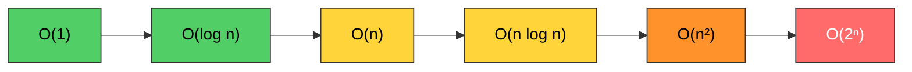
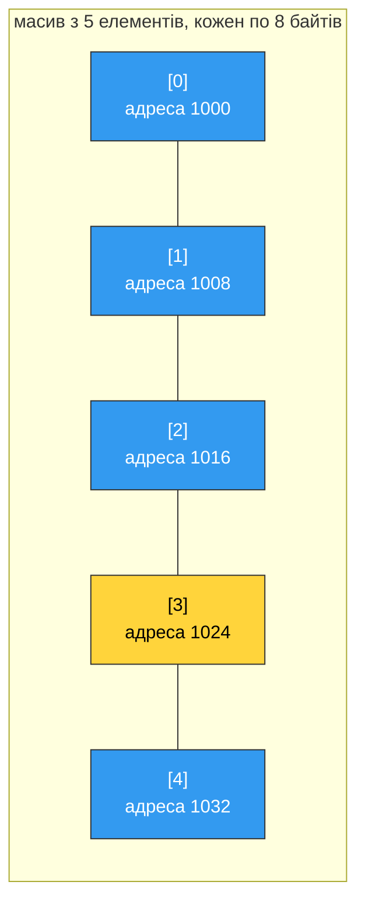
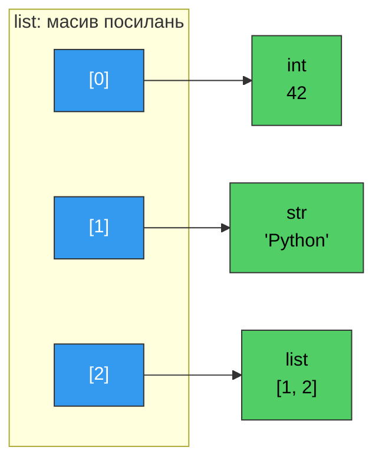
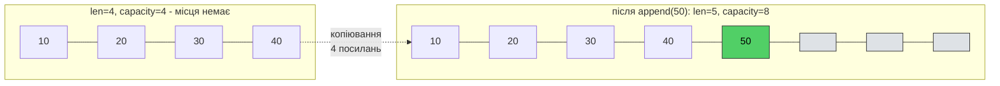
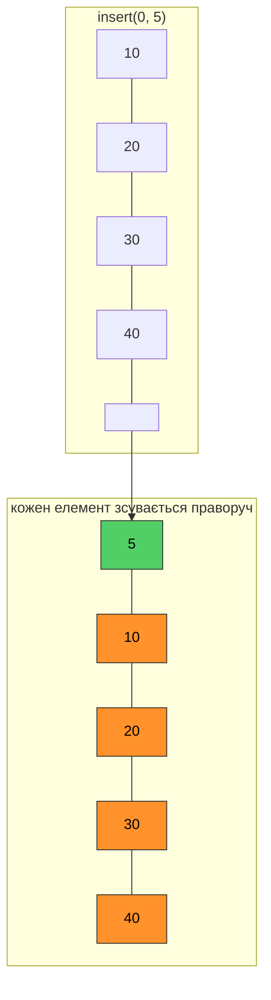
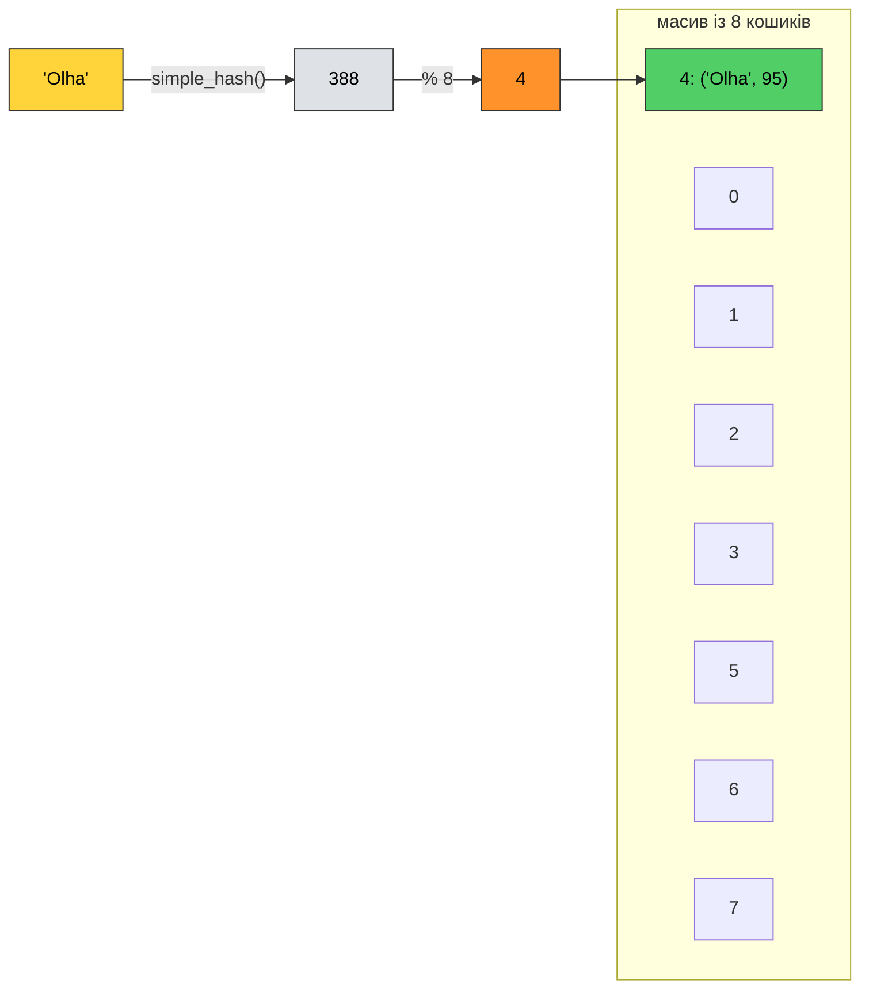
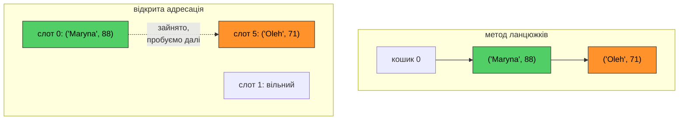
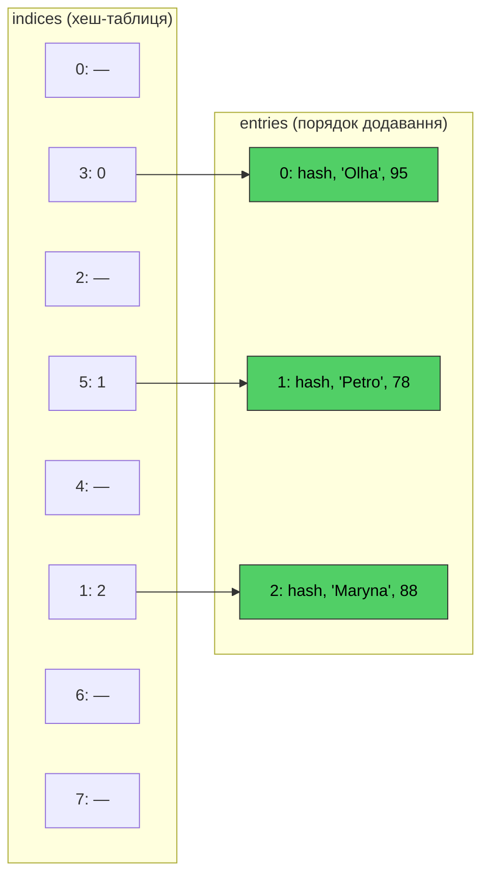

# 25. (Л) Внутрішня організація структур даних. Алгоритмічна складність

## Зміст лекції

1. Навіщо зазирати всередину
2. Як виміряти час виконання
3. Алгоритмічна складність: рахуємо кроки, а не секунди
4. Нотація «O велике»
5. Основні класи складності
6. Найкращий, найгірший і середній випадок
7. Складність за памʼяттю
8. Памʼять компʼютера і масив
9. Список — динамічний масив посилань
10. Як список росте: ємність і амортизована складність
11. Чому `append` швидкий, а `insert(0, x)` — повільний
12. Кортеж — масив фіксованого розміру
13. Хеш-таблиця: ідея
14. Навчальна хеш-таблиця своїми руками
15. Колізії
16. Заповненість і розширення таблиці
17. Як влаштований `dict` у CPython
18. Хеш і рівність: вимоги до ключів
19. Множина — хеш-таблиця без значень
20. Складність операцій зі списком, словником і множиною
21. Приховані цикли
22. Як обрати структуру даних
23. Приклад: хто не здав домашнє завдання
24. Типові помилки

## Навіщо зазирати всередину

На попередніх лекціях ми кілька разів відкладали питання «чому»:

- чому `append` додає елемент швидко, а `insert(0, x)` — повільно (лекція 14);
- чому кортеж займає менше памʼяті, ніж список (лекція 14);
- чому словник знаходить ключ «миттєво», хоч би скільки в ньому було пар (лекція 16);
- чому `x in set` швидший за `x in list` (лекція 16);
- чому ключ словника мусить бути незмінюваним (лекції 16 і 20).

Усі відповіді випливають з того, **як** ці структури розміщені в памʼяті. Почнімо з експерименту: одне й те саме питання «чи є число в колекції» поставимо списку і множині з мільйоном елементів.

```python
# Program: the same question, two very different speeds
import time

n = 1_000_000
numbers_list = list(range(n))
numbers_set = set(numbers_list)
wanted = n - 1

start = time.perf_counter()
for _ in range(100):
    found = wanted in numbers_list
list_time = time.perf_counter() - start

start = time.perf_counter()
for _ in range(100):
    found = wanted in numbers_set
set_time = time.perf_counter() - start

print(f"list: {list_time:.4f} s")
print(f"set:  {set_time:.6f} s")
print(f"set is ~{list_time / set_time:.0f} times faster")
```

```text
list: 0.5038 s
set:  0.000011 s
set is ~46693 times faster
```

Результат той самий (`True`), а різниця — у десятки тисяч разів. І вона не стала б меншою на швидшому компʼютері: на мільярді елементів список програв би ще більше, а множина працювала б так само швидко. Справа не в залізі, а в **алгоритмі**, який стоїть за операцією `in`.

!!! note "Числа у ваших запусках будуть іншими"
    Тут і далі час виміряно на звичайному ноутбуці з Python 3.13. На вашому компʼютері абсолютні значення відрізнятимуться, але **співвідношення** — у скільки разів одне повільніше за інше і як час зростає зі збільшенням даних — буде схожим. Саме співвідношення нас і цікавить.

## Як виміряти час виконання

### `time.perf_counter()`

Найпростіший спосіб — запамʼятати момент перед виконанням коду і після. Для цього є `time.perf_counter()`: годинник із найвищою доступною точністю, призначений саме для вимірювання проміжків.

```python
# Program: measuring a block of code with perf_counter
import time

start = time.perf_counter()
total = 0
for i in range(1_000_000):
    total += i
elapsed = time.perf_counter() - start

print(f"total={total}")
print(f"elapsed: {elapsed:.4f} s")
```

```text
total=499999500000
elapsed: 0.0412 s
```

Значення `perf_counter()` саме по собі нічого не означає (це не поточний час доби) — має сенс лише **різниця** двох значень.

### Модуль `timeit`

Один запуск може бути неточним: на час впливають інші програми, кеш процесора, збирач сміття. Модуль `timeit` виконує фрагмент коду багато разів і повертає сумарний час.

```python
# Program: timeit runs a snippet many times
import timeit

list_time = timeit.timeit("[1, 2, 3, 4, 5]", number=1_000_000)
tuple_time = timeit.timeit("(1, 2, 3, 4, 5)", number=1_000_000)
print(f"list:  {list_time:.3f} s")
print(f"tuple: {tuple_time:.3f} s")
```

```text
list:  0.023 s
tuple: 0.007 s
```

Мільйон створень списку з пʼяти чисел — 23 мс, мільйон кортежів — 7 мс. Чому кортеж швидший, зʼясуємо далі в лекції.

`timeit` зручно запускати й прямо з терміналу — він сам підбере кількість повторів:

```bash
python3 -m timeit "sum(range(1000))"
```

```text
50000 loops, best of 5: 6.12 usec per loop
```

!!! warning "Не вимірюйте на маленьких даних"
    На десяти елементах будь-який алгоритм працює за мікросекунди, і різниці не видно. Щоб побачити, як поводиться код, вимірюйте на **кількох** розмірах даних, які відрізняються в рази: 1 000, 10 000, 100 000.

## Алгоритмічна складність: рахуємо кроки, а не секунди

Секунди — ненадійна міра: вони залежать від процесора, версії Python, навантаження системи. Тому програмісти оцінюють не час, а **кількість елементарних кроків** (порівнянь, присвоєнь, звернень до памʼяті) залежно від **розміру вхідних даних** `n`.

Порахуймо кроки у двох функціях:

```python
# Program: counting basic operations
def total(numbers):
    operations = 0
    result = 0
    for value in numbers:
        result += value
        operations += 1
    return result, operations


def count_equal_pairs(numbers):
    operations = 0
    pairs = 0
    for i in range(len(numbers)):
        for j in range(len(numbers)):
            operations += 1
            if i != j and numbers[i] == numbers[j]:
                pairs += 1
    return pairs, operations


for n in (10, 100, 1_000):
    numbers = list(range(n))
    _, ops_total = total(numbers)
    _, ops_pairs = count_equal_pairs(numbers)
    print(f"n={n:>5}  total: {ops_total:>5} ops  pairs: {ops_pairs:>7} ops")
```

```text
n=   10  total:    10 ops  pairs:     100 ops
n=  100  total:   100 ops  pairs:   10000 ops
n= 1000  total:  1000 ops  pairs: 1000000 ops
```

`total` робить рівно `n` кроків: даних у 10 разів більше — роботи в 10 разів більше. `count_equal_pairs` має вкладений цикл і робить `n × n` кроків: даних у 10 разів більше — роботи у **100** разів більше.

**Алгоритмічна складність** (computational complexity) — це відповідь на питання: *як зростає кількість роботи, коли зростає обсяг даних?* Не «скільки секунд», а «як швидко росте».

## Нотація «O велике»

Складність записують у нотації **O велике** (Big O): `O(n)`, `O(n²)`, `O(1)`. Читається «о від ен», «о від ен квадрат». Запис `O(f(n))` означає: *для великих `n` кількість кроків зростає не швидше, ніж `f(n)`, з точністю до сталого множника*.

Звідси три правила спрощення.

**1. Сталі множники відкидаються.** Цикл, що робить три дії на кожен елемент, виконує `3n` кроків — це `O(n)`. Нас цікавить характер зростання, а не точна кількість.

**2. Молодші доданки відкидаються.** `n² + 5n + 100` для великих `n` визначається доданком `n²`: при `n = 1 000 000` внесок `5n` — це менше тисячної відсотка. Отже, `O(n²)`.

**3. Послідовні частини складаються, вкладені — множаться.** Два цикли один за одним — `O(n) + O(n) = O(n)`. Цикл усередині циклу — `O(n) × O(n) = O(n²)`.

```python
# Program: estimating complexity by the structure of code
def describe(numbers):
    n = len(numbers)                  # O(1)

    smallest = numbers[0]             # O(1)
    for value in numbers:             # O(n)
        if value < smallest:
            smallest = value

    above = 0
    for value in numbers:             # O(n)
        if value > smallest:
            above += 1

    pairs = 0
    for a in numbers:                 # O(n) ...
        for b in numbers:             # ... × O(n) = O(n²)
            if a + b == 0:
                pairs += 1

    return n, smallest, above, pairs  # разом: O(1) + O(n) + O(n) + O(n²) = O(n²)


print(describe([3, -1, 4, 1, -3, 5]))
```

```text
(6, -3, 5, 4)
```

Складність функції визначає її **найповільніша** частина. Тут це вкладені цикли, тож уся функція — `O(n²)`, хоча два інші цикли теж виконують роботу.

## Основні класи складності

| Позначення | Назва | Приклад у Python | Даних ×10 → роботи |
|---|---|---|---|
| `O(1)` | стала | `lst[i]`, `lst.append(x)`, `d[key]`, `x in s` | так само |
| `O(log n)` | логарифмічна | двійковий пошук у відсортованому списку | + кілька кроків |
| `O(n)` | лінійна | `x in lst`, `sum(lst)`, `max(lst)`, один цикл | ×10 |
| `O(n log n)` | лінійно-логарифмічна | `sorted(lst)`, `lst.sort()` | трохи більше ніж ×10 |
| `O(n²)` | квадратична | два вкладені цикли по тих самих даних | ×100 |
| `O(2ⁿ)` | експоненційна | перебір усіх підмножин | неможливо дочекатися |

Наскільки сильно відрізняються ці класи, видно з таблиці кількості кроків:

```python
# Program: growth of common complexity classes
import math

print(f"{'n':>7} {'log n':>6} {'n log n':>10} {'n^2':>16}")
for n in (10, 100, 1_000, 10_000, 100_000, 1_000_000):
    print(f"{n:>7} {math.log2(n):>6.0f} {n * math.log2(n):>10.0f} {n * n:>16}")
```

```text
      n  log n    n log n              n^2
     10      3         33              100
    100      7        664            10000
   1000     10       9966          1000000
  10000     13     132877        100000000
 100000     17    1660964      10000000000
1000000     20   19931569    1000000000000
```

Якщо один крок триває одну наносекунду, то для мільйона елементів алгоритм `O(n)` відпрацює за мілісекунду, `O(n log n)` — за 20 мілісекунд, а `O(n²)` — за **17 хвилин**.



### `O(log n)`: двійковий пошук

Логарифмічна складність виникає, коли кожен крок **відкидає половину** даних. Класичний приклад — гра «вгадай число від 1 до 100»: спитавши «більше за 50?», ви одразу відкидаєте половину варіантів. Сім питань вистачить для будь-якого числа, бо `2⁷ = 128 ≥ 100`.

У **відсортованому** списку так само можна шукати елемент: подивитися на середину, і якщо шукане більше — продовжити в правій половині, якщо менше — у лівій.

```python
# Program: linear search versus binary search, counting steps
def linear_search(items, target):
    steps = 0
    for index, value in enumerate(items):
        steps += 1
        if value == target:
            return index, steps
    return -1, steps


def binary_search(items, target):
    low = 0
    high = len(items) - 1
    steps = 0
    while low <= high:
        steps += 1
        middle = (low + high) // 2
        if items[middle] == target:
            return middle, steps
        if items[middle] < target:
            low = middle + 1
        else:
            high = middle - 1
    return -1, steps


for n in (100, 10_000, 1_000_000):
    numbers = list(range(0, 2 * n, 2))      # відсортований список парних чисел
    target = numbers[-1]
    _, linear_steps = linear_search(numbers, target)
    _, binary_steps = binary_search(numbers, target)
    print(f"n={n:>9}  linear: {linear_steps:>9} steps  binary: {binary_steps:>2} steps")
```

```text
n=      100  linear:       100 steps  binary:  7 steps
n=    10000  linear:     10000 steps  binary: 14 steps
n=  1000000  linear:   1000000 steps  binary: 20 steps
```

Мільйон елементів — двадцять кроків. Мільярд — тридцять. Ціна такої швидкості: список мусить бути **відсортованим**, а сортування коштує `O(n log n)`. Тому двійковий пошук вигідний, коли сортуємо один раз, а шукаємо багато разів. У стандартній бібліотеці він уже реалізований — модуль `bisect`.

## Найкращий, найгірший і середній випадок

Час роботи часто залежить не лише від кількості даних, а й від **самих даних**. Лінійний пошук знайде перший елемент списку за один крок, а останній — за `n` кроків.

- **Найкращий випадок** — найсприятливіші дані. Для лінійного пошуку — `O(1)`. Майже нічого не каже про алгоритм.
- **Найгірший випадок** — найнесприятливіші дані. Для лінійного пошуку — `O(n)` (елемент останній або відсутній). Це **гарантія**: повільніше не буде.
- **Середній випадок** — очікуваний час на «типових» даних. Для лінійного пошуку — приблизно `n / 2` кроків, тобто теж `O(n)`.

Якщо не сказано інакше, під складністю мають на увазі **найгірший** випадок. Важливий виняток — словники та множини: їх `O(1)` — це **середній** випадок, а в найгіршому (про нього — у розділі про колізії) операції стають `O(n)`.

## Складність за памʼяттю

Крім часу, алгоритм витрачає **памʼять**. Її оцінюють так само: як зростає додатковий обсяг памʼяті залежно від `n`.

```python
# Program: the same task with O(1) and O(n) extra memory
def has_negative(numbers):
    for value in numbers:          # лише одна змінна, хоч би яким був список
        if value < 0:
            return True
    return False


def negatives(numbers):
    return [value for value in numbers if value < 0]   # новий список до n елементів


data = [5, -2, 8, -7, 3]
print(has_negative(data))
print(negatives(data))
```

```text
True
[-2, -7]
```

`has_negative` використовує `O(1)` додаткової памʼяті, `negatives` — `O(n)`. Часто памʼять і час «обмінюються»: щоб пришвидшити пошук, будують множину — і платять за неї памʼяттю. Наприкінці лекції саме так і зробимо.

## Памʼять компʼютера і масив

Тепер перейдемо від алгоритмів до структур даних. Оперативну памʼять можна уявити як дуже довгий ряд пронумерованих комірок по одному байту. Номер комірки — це її **адреса**. Процесор може прочитати будь-яку комірку за адресою за той самий час, незалежно від того, де вона: на початку памʼяті чи в кінці.

**Масив** (array) — найпростіша структура даних: елементи **однакового розміру** лежать у памʼяті **поспіль**, один за одним. Якщо масив починається з адреси `start`, а кожен елемент займає 8 байтів, то адреса елемента з індексом `i`:

```text
address(i) = start + i * 8
```



Щоб дістати елемент `[3]`, не треба проходити через `[0]`, `[1]`, `[2]` — досить одного множення й одного додавання: `1000 + 3 × 8 = 1024`. Тому **доступ за індексом у масиві — `O(1)`**, і саме тому індекси починаються з нуля: індекс — це зсув від початку.

Ціна такого розміщення: масив займає **неперервний** шматок памʼяті фіксованого розміру. Щоб додати елемент, а місце після масиву вже зайняте, доводиться виділяти новий, більший шматок і копіювати туди всі елементи.

## Список — динамічний масив посилань

Список Python ззовні не схожий на масив: він росте, і в ньому можуть лежати значення різних типів і розмірів — число, рядок на тисячу символів, інший список. Як це узгоджується з «елементами однакового розміру»?

Відповідь ми вже знаємо з лекції 20: змінна в Python — це імʼя, яке **посилається** на обʼєкт. Список так само зберігає не самі обʼєкти, а **посилання** на них. Кожне посилання — це адреса обʼєкта в памʼяті, і на 64-бітній системі всі вони мають однаковий розмір — 8 байтів.



Переконатися в цьому можна функцією `sys.getsizeof()`, яка повертає розмір обʼєкта в байтах. Для списку вона рахує лише сам масив посилань, без обʼєктів, на які вони вказують.

```python
# Program: a list stores references, not the objects themselves
import sys

short_words = ["a", "b", "c"]
long_words = ["a" * 1000, "b" * 1000, "c" * 1000]

print(sys.getsizeof(short_words), sys.getsizeof(long_words))
print(sys.getsizeof(short_words[0]), sys.getsizeof(long_words[0]))
```

```text
88 88
42 1041
```

Рядки в другому списку у 25 разів більші, а самі списки — однакові: три посилання по 8 байтів плюс службовий заголовок.

!!! info "Конкретні байти залежать від реалізації"
    Числа з `sys.getsizeof()` у цій лекції отримано в CPython 3.13 на 64-бітній системі. В іншій версії вони можуть трохи відрізнятися. Принципи — масив посилань, запас місця, стрибкоподібне зростання — однакові для всіх сучасних версій.

## Як список росте: ємність і амортизована складність

Якби список при кожному `append` виділяв новий шматок памʼяті рівно на один елемент більший і копіював туди всі посилання, то додавання `n` елементів коштувало б `1 + 2 + 3 + … + n ≈ n²/2` копіювань. Це `O(n²)` — неприйнятно.

Тому список виділяє памʼять **із запасом**. У нього є дві характеристики:

- **довжина** (size) — скільки елементів у ньому зараз, це повертає `len()`;
- **ємність** (capacity) — на скільки елементів виділено памʼяті.

Поки довжина менша за ємність, `append` просто записує посилання у вільну комірку — `O(1)`. Коли місце закінчилося, список виділяє новий, **значно більший** блок, копіює туди все і продовжує. Побачимо це наживо:

```python
# Program: list size in memory grows in jumps
import sys

items = []
previous = sys.getsizeof(items)
print(f"len=0  size={previous} bytes")

for i in range(1, 33):
    items.append(i)
    size = sys.getsizeof(items)
    if size != previous:
        capacity = (size - sys.getsizeof([])) // 8
        print(f"len={i:<2} size={size} bytes  capacity={capacity}")
        previous = size
```

```text
len=0  size=56 bytes
len=1  size=88 bytes  capacity=4
len=5  size=120 bytes  capacity=8
len=9  size=184 bytes  capacity=16
len=17 size=248 bytes  capacity=24
len=25 size=312 bytes  capacity=32
```

Порожній список займає 56 байтів — це заголовок без жодної комірки. Після першого `append` памʼять виділяється одразу на 4 елементи. Наступні три `append` нічого не перевиділяють. На пʼятому місце закінчилося — ємність стала 8, і так далі. Зі 32 викликів `append` лише пʼять призвели до перевиділення.



### Амортизована складність

Окремий `append`, що спричинив перевиділення, коштує `O(n)` — треба скопіювати всі посилання. Але такі `append` трапляються рідко, і що довший список, то рідше. Порахуймо загальну роботу на моделі, де ємність щоразу **подвоюється**:

```python
# Program: model of a dynamic array that doubles its capacity
def simulate_appends(n):
    capacity = 1
    size = 0
    copies = 0
    for _ in range(n):
        if size == capacity:
            copies += size        # переносимо всі наявні елементи в новий блок
            capacity *= 2
        size += 1
    return capacity, copies


for n in (10, 100, 1_000, 1_000_000):
    capacity, copies = simulate_appends(n)
    print(f"n={n:>9}  capacity={capacity:>9}  copies={copies:>9}  "
          f"copies per append={copies / n:.2f}")
```

```text
n=       10  capacity=       16  copies=       15  copies per append=1.50
n=      100  capacity=      128  copies=      127  copies per append=1.27
n=     1000  capacity=     1024  copies=     1023  copies per append=1.02
n=  1000000  capacity=  1048576  copies=  1048575  copies per append=1.05
```

Хоч би скільки елементів ми додавали, на один `append` у середньому припадає **приблизно одне** копіювання. Причина — сума `1 + 2 + 4 + … + n/2 + n` менша за `2n`. Така складність називається **амортизованою** `O(1)`: окрема операція може бути дорогою, але в довгій послідовності операцій її вартість «розмазується» і в середньому стала.

!!! info "CPython росте не вдвічі"
    У моделі ємність подвоюється, щоб було простіше рахувати. Справжній список Python збільшує ємність приблизно на 1/8 від поточної плюс невеликий запас (видно з виводу вище: 16 → 24 → 32). Так менше памʼяті пропадає марно, а копіювань трохи більше. Головне те, що ємність зростає **пропорційно** до розміру — тоді амортизована складність `append` залишається `O(1)`.

**Висновок:** динамічний масив = звичайний масив + запас місця + перевиділення з копіюванням, коли запас вичерпано. Доступ за індексом — `O(1)` (як у масиві), додавання в кінець — амортизовано `O(1)`.

## Чому `append` швидкий, а `insert(0, x)` — повільний

Елементи масиву лежать поспіль, без «дірок». Щоб вставити елемент на початок, треба спочатку **зсунути всі** наявні елементи на одну позицію праворуч. Для списку довжини `n` це `n` переміщень — `O(n)`. З вилученням так само: після `pop(0)` усі елементи зсуваються ліворуч, щоб закрити дірку.



Заповнимо список двома способами і подвоюватимемо кількість елементів:

```python
# Program: append to the end versus insert at the beginning
import time


def fill_append(n):
    items = []
    for i in range(n):
        items.append(i)


def fill_insert_front(n):
    items = []
    for i in range(n):
        items.insert(0, i)


for n in (10_000, 20_000, 40_000, 80_000):
    start = time.perf_counter()
    fill_append(n)
    t_append = time.perf_counter() - start

    start = time.perf_counter()
    fill_insert_front(n)
    t_insert = time.perf_counter() - start

    print(f"n={n:>6}  append: {t_append:.4f} s  insert(0): {t_insert:.4f} s")
```

```text
n= 10000  append: 0.0003 s  insert(0): 0.0078 s
n= 20000  append: 0.0005 s  insert(0): 0.0303 s
n= 40000  append: 0.0008 s  insert(0): 0.1254 s
n= 80000  append: 0.0019 s  insert(0): 0.5009 s
```

Подивіться, **як** зростає час. Даних удвічі більше — `append` працює приблизно вдвічі довше: `n` операцій по `O(1)`, разом `O(n)`. А `insert(0)` — **вчетверо** довше: `n` операцій по `O(n)`, разом `O(n²)`. Саме за таким характером зростання складність і впізнають на практиці.

### Черга: `collections.deque`

Якщо елементи справді потрібно додавати й забирати з обох кінців — наприклад, у черзі «перший прийшов — перший пішов» — список не підходить. Для цього в стандартній бібліотеці є `collections.deque` (двобічна черга), у якої операції з обома кінцями — `O(1)`.

```python
# Program: a queue on a list versus collections.deque
import time
from collections import deque

n = 100_000

queue = list(range(n))
start = time.perf_counter()
while queue:
    queue.pop(0)
print(f"list.pop(0):     {time.perf_counter() - start:.4f} s")

queue = deque(range(n))
start = time.perf_counter()
while queue:
    queue.popleft()
print(f"deque.popleft(): {time.perf_counter() - start:.4f} s")
```

```text
list.pop(0):     0.4781 s
deque.popleft(): 0.0031 s
```

Ціна `deque` — повільніший доступ за індексом у середині (`O(n)`): він улаштований не як суцільний масив, а як ланцюжок невеликих блоків.

## Кортеж — масив фіксованого розміру

Кортеж незмінюваний, тож йому не потрібен запас місця: розмір відомий у момент створення і більше не зміниться. Тому кортеж — це звичайний масив посилань рівно потрібної довжини, розміщений **в одному блоці** разом із заголовком.

```python
# Program: list versus tuple in memory
import sys

grades_list = [90, 85, 77, 64, 100]
grades_tuple = (90, 85, 77, 64, 100)
print(sys.getsizeof(grades_list), sys.getsizeof(grades_tuple))

grown = []
for grade in grades_tuple:
    grown.append(grade)
print(sys.getsizeof(grown))
```

```text
104 80
120
```

Кортеж із пʼяти елементів: 40 байтів заголовка + 5 × 8 = 80. Список: більший заголовок, окремий масив посилань і запас. Список, що виріс через `append`, займає ще більше — у ньому вже 8 комірок під 5 елементів.

Звідси й обіцяні на лекції 14 переваги кортежа:

- **менше памʼяті** — немає запасу і окремого масиву;
- **швидше створення** — один блок памʼяті замість двох; а кортеж із самих констант, як `(1, 2, 3, 4, 5)`, Python створює ще під час компіляції і далі лише повторно використовує — звідси різниця, яку ми бачили в `timeit`;
- **хешованість** — незмінюваний кортеж можна використати як ключ словника (чому це важливо — далі).

## Хеш-таблиця: ідея

Масив дає доступ за `O(1)`, але лише за **цілим індексом** `0, 1, 2, …`. А ми хочемо так само швидко знаходити значення за ключем `"Olha"`. Ідея хеш-таблиці: **перетворити ключ на індекс**.

1. Беремо масив фіксованого розміру — його комірки називають **кошиками** (buckets) або слотами.
2. Обчислюємо з ключа ціле число — **хеш** — за допомогою **хеш-функції**.
3. Беремо остачу від ділення хешу на розмір масиву: `index = hash(key) % size`. Це завжди коректний індекс від `0` до `size - 1`.
4. Кладемо пару «ключ — значення» в комірку з цим індексом.

Щоб знайти значення, повторюємо кроки 2–3 для ключа і дивимося в ту саму комірку. Жодного перебору — обчислення хешу і звернення за індексом, тобто `O(1)`.



На схемі використано навчальну функцію `simple_hash` (суму кодів символів), яку ми напишемо в наступному розділі; справжня `hash()` дає інші числа, але принцип той самий.

Хороша хеш-функція має три властивості:

- **детермінованість** — той самий ключ завжди дає той самий хеш (інакше ми не знайдемо те, що поклали);
- **швидкість** — обчислення не повинне бути дорогим;
- **рівномірність** — різні ключі мають розкидатися по кошиках якомога рівномірніше.

## Навчальна хеш-таблиця своїми руками

Побудуймо найпростішу хеш-таблицю зі списків. Хеш-функція — сума кодів символів рядка (функція `ord()` повертає код символу). Кожен кошик — список пар `[key, value]`.

```python
# Program: a tiny hash table built from a list of buckets
def simple_hash(key):
    # навчальна хеш-функція: сума кодів символів
    return sum(ord(char) for char in key)


def make_table(size):
    return [[] for _ in range(size)]


def put(table, key, value):
    bucket = table[simple_hash(key) % len(table)]
    for pair in bucket:
        if pair[0] == key:
            pair[1] = value          # ключ уже є - оновлюємо значення
            return
    bucket.append([key, value])


def get(table, key):
    bucket = table[simple_hash(key) % len(table)]
    for pair in bucket:
        if pair[0] == key:
            return pair[1]
    raise KeyError(key)


grades = make_table(8)
put(grades, "Olha", 95)
put(grades, "Petro", 78)
put(grades, "Maryna", 88)
put(grades, "Ivan", 64)
put(grades, "Oleh", 71)
put(grades, "Olha", 97)

for index, bucket in enumerate(grades):
    print(index, bucket)

print("Maryna ->", get(grades, "Maryna"))
print("Olha ->", get(grades, "Olha"))
print("Oleh ->", get(grades, "Oleh"))
```

```text
0 [['Maryna', 88], ['Oleh', 71]]
1 []
2 [['Petro', 78]]
3 []
4 [['Olha', 97]]
5 []
6 [['Ivan', 64]]
7 []
Maryna -> 88
Olha -> 97
Oleh -> 71
```

Простежимо обчислення:

| Ключ | `simple_hash` | `% 8` |
|---|---|---|
| `"Olha"` | 388 | 4 |
| `"Petro"` | 522 | 2 |
| `"Maryna"` | 616 | 0 |
| `"Ivan"` | 398 | 6 |
| `"Oleh"` | 392 | 0 |

Зверніть увагу на дві речі:

- Повторний `put(grades, "Olha", 97)` не створив другу пару, а **оновив** наявну — так само поводиться `d["Olha"] = 97` у справжньому словнику.
- `"Maryna"` і `"Oleh"` потрапили в **один** кошик 0. Це колізія.

## Колізії

**Колізія** (collision) — ситуація, коли два різні ключі дають один індекс. Уникнути колізій неможливо: ключів може бути безліч, а кошиків — скінченна кількість. Тому хеш-таблиця мусить уміти їх обробляти. Є два основні підходи.

**Метод ланцюжків** (separate chaining) — як у нашій навчальній таблиці: кошик зберігає список усіх пар, що туди потрапили. Пошук = обчислити індекс + перебрати короткий список у кошику.

**Відкрита адресація** (open addressing) — так працюють `dict` і `set` у CPython. Кожна комірка зберігає не більше однієї пари. Якщо потрібна комірка зайнята іншим ключем, таблиця за певним правилом **пробує наступну** комірку, потім ще одну — доки не знайде вільну (під час вставки) або потрібний ключ (під час пошуку).



### Найгірший випадок

Поки колізій мало, кожен пошук — кілька кроків, тобто `O(1)`. Але уявіть хеш-функцію, яка для **будь-якого** ключа повертає `0`. Тоді всі пари опиняться в одному кошику, і пошук перетвориться на перебір списку — `O(n)`. Хеш-таблиця виродиться в повільний список.

Саме тому `O(1)` для словника — це **середній** випадок за умови хорошої хеш-функції. Вбудована `hash()` у Python розкидає ключі добре, тож на практиці найгірший випадок майже не трапляється.

!!! info "Чому хеш рядка змінюється між запусками"
    Запустіть двічі:

    ```python
    # Program: hash values of strings change between runs
    print(hash("Olha"))
    print(hash("Olha") == hash("Olha"))
    print(hash(42), hash(3.0), hash(True))
    ```

    ```text
    -6304767741279525156
    True
    42 3 1
    ```

    ```text
    6261827416944749388
    True
    42 3 1
    ```

    Хеш рядка в межах одного запуску сталий, а між запусками — різний. Це захист: якби хеші були передбачуваними, зловмисник міг би надіслати вебсерверу тисячі ключів, що навмисно потрапляють в один кошик, і кожен запит оброблявся б за `O(n)` замість `O(1)` (атака типу «відмова в обслуговуванні»). Тому **не зберігайте** результат `hash()` рядка у файл і не покладайтеся на нього між запусками. Хеші чисел не змінюються: для невеликих цілих `hash(n) == n`.

## Заповненість і розширення таблиці

Що більше пар у таблиці, то частіше колізії. Відношення кількості пар до кількості комірок називають **коефіцієнтом заповнення** (load factor). Щоб пошук залишався швидким, таблиця не чекає, доки заповниться вщент: CPython розширює словник, коли зайнято приблизно **дві третини** комірок.

Розширення схоже на перевиділення в списку: виділяється більший масив, і **кожна** пара переноситься в нього заново — з новим індексом, бо змінився розмір у `hash(key) % size`. Це `O(n)`, але, як і для списку, трапляється рідко, тож вставка залишається амортизовано `O(1)`.

```python
# Program: a dictionary grows in jumps too
import sys

grades = {}
previous = sys.getsizeof(grades)
for i in range(1, 50):
    grades[f"student{i}"] = i
    size = sys.getsizeof(grades)
    if size != previous:
        print(f"len={i:<2} size={size} bytes")
        previous = size
```

```text
len=1  size=184 bytes
len=6  size=272 bytes
len=11 size=464 bytes
len=22 size=832 bytes
len=43 size=1584 bytes
```

Перша таблиця має 8 комірок, і на дві третини її можна заповнити пʼятьма парами. Шоста пара спричинила розширення до 16 комірок (≈10 пар), одинадцята — до 32 (≈21 пара), і так далі.

Звідси видно, що словник **платить памʼяттю за швидкість**: частина комірок завжди порожня. Словник із тими самими даними займає помітно більше памʼяті, ніж список пар.

## Як влаштований `dict` у CPython

Наша навчальна таблиця розкладає пари по кошиках у порядку хешів, тож перебір видав би їх «упереміш». А справжній словник, як ми бачили на лекції 16, зберігає **порядок додавання**. Як?

Починаючи з Python 3.6, словник складається з **двох** масивів:

- **масив записів** (entries) — щільний, пари `(hash, key, value)` дописуються в кінець у порядку додавання, як у список;
- **масив індексів** (indices) — власне хеш-таблиця: у комірці `hash % size` лежить не сама пара, а лише **номер** запису в масиві записів.



Пошук: `hash(key) % 8` → комірка в `indices` → номер запису → порівняння ключа в `entries` → значення. Перебір словника — просто прохід по `entries` від початку до кінця, тому порядок збігається з порядком додавання. Бонус: порожні комірки масиву індексів займають 1 байт замість 24 (три посилання), тож таблиця вийшла ще й компактнішою.

Хеш кожного ключа зберігається в записі, щоб не обчислювати його повторно під час розширення таблиці і щоб швидко відкидати «чужі» ключі: якщо збережені хеші не рівні, ключі точно різні, і дорожче порівняння `==` можна не виконувати.

## Хеш і рівність: вимоги до ключів

Тепер зрозуміло, звідки беруться вимоги до ключів словника та елементів множини.

**1. Рівні обʼєкти мусять мати рівні хеші.** Якщо `a == b`, то обовʼязково `hash(a) == hash(b)` — інакше рівні ключі потраплять у різні комірки, і словник не знайде пару за «таким самим» ключем. Цікавий наслідок:

```python
# Program: equal keys must have equal hashes
print(1 == 1.0 == True)
print(hash(1), hash(1.0), hash(True))

table = {1: "int", 1.0: "float", True: "bool"}
print(table)
print({1, 1.0, True})
```

```text
True
1 1 1
{1: 'bool'}
{1}
```

Для словника `1`, `1.0` і `True` — **один і той самий** ключ: вони рівні й мають однаковий хеш. Ключ залишився від першого присвоєння (`1`), а значення — від останнього (`"bool"`).

Зворотне не обовʼязкове: різні обʼєкти **можуть** мати однаковий хеш — це звичайна колізія, яку таблиця обробить порівнянням через `==`.

**2. Хеш ключа не може змінюватися.** Хеш обчислюється один раз — у момент вставки — і визначає, де лежить пара. Якби ключ можна було змінити після вставки, його новий хеш вказував би на іншу комірку, і пару вже не вдалося б знайти: вона лежала б «не на своєму місці». Тому `list`, `dict` і `set` — **нехешовані** (`hash([1, 2])` дає `TypeError: unhashable type: 'list'`), а `int`, `float`, `str`, `tuple` із хешованих елементів і `frozenset` — хешовані. Це саме те правило, яке ми сформулювали на лекціях 16 і 20, тепер — з поясненням механізму.

## Множина — хеш-таблиця без значень

Множина (`set`) влаштована так само, як словник, лише в кожній комірці замість пари «ключ — значення» зберігається один елемент (і його хеш). Звідси всі її властивості:

- `x in s`, `s.add(x)`, `s.discard(x)` — у середньому `O(1)`: обчислили хеш, заглянули в комірку;
- елементи унікальні: перед вставкою таблиця перевіряє, чи немає вже рівного елемента;
- елементи мусять бути хешованими;
- порядок елементів **не гарантується**: на відміну від словника, множина не має окремого масиву записів у порядку додавання, тож перебір іде в порядку комірок таблиці.

Операції над двома множинами теж спираються на хешування. Наприклад, `a & b` перебирає меншу множину і для кожного її елемента перевіряє `in` у більшій — `O(min(len(a), len(b)))`.

## Складність операцій зі списком, словником і множиною

### Список (`list`)

| Операція | Складність | Чому |
|---|---|---|
| `lst[i]`, `lst[i] = x` | `O(1)` | обчислення адреси |
| `len(lst)` | `O(1)` | довжина зберігається в заголовку |
| `lst.append(x)` | `O(1)` амортизовано | запис у вільну комірку, рідкісне перевиділення |
| `lst.pop()` | `O(1)` | вилучення з кінця, зсувати нічого |
| `lst.pop(0)`, `lst.insert(0, x)` | `O(n)` | зсув усіх елементів |
| `lst.pop(i)`, `lst.insert(i, x)`, `del lst[i]` | `O(n)` | зсув елементів праворуч від `i` |
| `x in lst`, `lst.index(x)`, `lst.count(x)`, `lst.remove(x)` | `O(n)` | лінійний пошук |
| `min(lst)`, `max(lst)`, `sum(lst)` | `O(n)` | треба переглянути кожен елемент |
| `lst[a:b]` | `O(b - a)` | зріз копіює елементи в новий список |
| `lst.copy()`, `list(lst)` | `O(n)` | копіювання всіх посилань |
| `lst.extend(other)`, `lst + other` | `O(k)` / `O(n + k)` | копіювання `k` нових елементів (і старих — для `+`) |
| `lst.sort()`, `sorted(lst)` | `O(n log n)` | алгоритм Timsort |
| `lst.reverse()` | `O(n)` | обмін елементів місцями |

### Словник (`dict`)

| Операція | Середній випадок | Найгірший випадок |
|---|---|---|
| `d[key]`, `d.get(key)` | `O(1)` | `O(n)` |
| `d[key] = value` | `O(1)` амортизовано | `O(n)` |
| `key in d` | `O(1)` | `O(n)` |
| `del d[key]`, `d.pop(key)` | `O(1)` | `O(n)` |
| `len(d)` | `O(1)` | `O(1)` |
| перебір, `d.keys()`, `d.values()`, `d.items()` | `O(n)` | `O(n)` |
| `d.copy()` | `O(n)` | `O(n)` |
| `value in d.values()` | `O(n)` | `O(n)` |

Зверніть увагу на останній рядок: швидко словник шукає лише за **ключем**. Пошук за значенням — звичайний перебір.

### Множина (`set`)

| Операція | Середній випадок |
|---|---|
| `x in s`, `s.add(x)`, `s.remove(x)`, `s.discard(x)` | `O(1)` |
| `set(lst)` | `O(n)` |
| `a | b` (обʼєднання) | `O(len(a) + len(b))` |
| `a & b` (перетин) | `O(min(len(a), len(b)))` |
| `a - b` (різниця) | `O(len(a))` |

### Кортеж і рядок

Кортеж — це незмінюваний масив, тому для нього діють ті самі оцінки, що й для операцій читання зі списком: індекс — `O(1)`, `in` — `O(n)`, зріз — `O(k)`. Рядок теж зберігається як масив символів: `s[i]` — `O(1)`, а `sub in s`, `s.find()`, `s.replace()`, `s.split()` — `O(n)`.

## Приховані цикли

Найчастіше квадратична складність зʼявляється не тоді, коли програміст пише два вкладені `for`, а коли всередині **одного** циклу стоїть операція, яка сама є циклом. У коді її не видно, але вона є.

```python
# Program: hidden loops inside a single for loop
def unique_slow(items):
    result = []
    for item in items:
        if item not in result:     # прихований цикл по result: O(n)
            result.append(item)
    return result                  # разом: O(n²)


def unique_fast(items):
    seen = set()
    result = []
    for item in items:
        if item not in seen:       # O(1) у середньому
            seen.add(item)
            result.append(item)
    return result                  # разом: O(n)


cities = ["Kyiv", "Lviv", "Kyiv", "Odesa", "Lviv", "Dnipro", "Kyiv"]
print(unique_slow(cities))
print(unique_fast(cities))
```

```text
['Kyiv', 'Lviv', 'Odesa', 'Dnipro']
['Kyiv', 'Lviv', 'Odesa', 'Dnipro']
```

Обидві функції повертають унікальні елементи зі збереженням порядку. Перша на мільйоні елементів працюватиме хвилини, друга — частку секунди.

Операції, на які варто звертати увагу всередині циклу:

| Всередині циклу | Складність кроку | Чим замінити |
|---|---|---|
| `x in some_list` | `O(n)` | `x in some_set` або `x in some_dict` |
| `some_list.index(x)`, `some_list.count(x)` | `O(n)` | словник «значення → індекс / кількість», побудований заздалегідь |
| `some_list.remove(x)` | `O(n)` | будувати новий список без зайвих елементів |
| `some_list.insert(0, x)`, `some_list.pop(0)` | `O(n)` | `append` + розворот у кінці або `collections.deque` |
| `some_list[1:]` (зріз) | `O(n)` | працювати з індексами, не копіюючи |
| `max(some_list)`, `sum(some_list)` | `O(n)` | обчислити один раз до циклу |
| `text += piece` | може бути `O(n)` | зібрати частини у список і склеїти `"".join(parts)` |

!!! tip "Склеювання рядків"
    Рядок незмінюваний, тож `text += piece` у загальному випадку створює **новий** рядок і копіює в нього весь старий текст. У циклі це може дати `O(n²)`. CPython уміє оптимізувати деякі такі випадки, але покладатися на це не варто. Надійний спосіб — збирати частини у список і в кінці склеїти: `"".join(parts)` обчислює загальну довжину і копіює кожен символ рівно один раз — `O(n)`.

## Як обрати структуру даних

| Що потрібно робити найчастіше | Структура | Чому |
|---|---|---|
| Зберігати впорядковану послідовність, звертатися за номером, додавати в кінець | `list` | індекс `O(1)`, `append` `O(1)` |
| Фіксований запис, ключ словника, менше памʼяті | `tuple` | незмінюваний, компактний, хешований |
| Шукати значення за ключем | `dict` | пошук за ключем `O(1)` |
| Перевіряти «чи є такий елемент», прибирати дублікати | `set` | `in` за `O(1)` |
| Додавати й забирати з обох кінців (черга) | `collections.deque` | обидва кінці `O(1)` |
| Багато разів шукати у великих незмінних даних, потрібен порядок | відсортований `list` + `bisect` | пошук `O(log n)` |

Головне питання, яке варто ставити собі: **яку операцію програма виконуватиме найчастіше**? Структуру обирають під неї.

!!! warning "Швидкий алгоритм не завжди потрібен"
    Для списку з десяти елементів `x in lst` абсолютно нормальний вибір: будувати множину заради одного пошуку довше, ніж просто перебрати десять значень. Складність важлива тоді, коли даних багато або операція повторюється в циклі. Спочатку пишіть зрозумілий код, а оптимізуйте, коли вимір показав, що він повільний.

## Приклад: хто не здав домашнє завдання

Є список зареєстрованих студентів і список тих, хто здав роботу. Потрібно знайти тих, хто не здав. Порівняємо «очевидне» рішення і рішення з множиною на кількох розмірах даних.

```python
# Program: who has not submitted the homework
import time


def missing_slow(registered, submitted):
    result = []
    for student in registered:
        if student not in submitted:        # прихований цикл по списку
            result.append(student)
    return result


def missing_fast(registered, submitted):
    submitted_set = set(submitted)          # один прохід: O(m)
    result = []
    for student in registered:
        if student not in submitted_set:    # O(1) у середньому
            result.append(student)
    return result


for n in (5_000, 10_000, 20_000):
    registered = [f"st{i:06d}" for i in range(n)]
    submitted = [f"st{i:06d}" for i in range(n) if i % 10 != 0]

    start = time.perf_counter()
    slow = missing_slow(registered, submitted)
    t_slow = time.perf_counter() - start

    start = time.perf_counter()
    fast = missing_fast(registered, submitted)
    t_fast = time.perf_counter() - start

    print(f"n={n:>6}  missing={len(fast):>5}  slow: {t_slow:.3f} s  "
          f"fast: {t_fast:.4f} s  same: {slow == fast}")
```

```text
n=  5000  missing=  500  slow: 0.079 s  fast: 0.0004 s  same: True
n= 10000  missing= 1000  slow: 0.327 s  fast: 0.0010 s  same: True
n= 20000  missing= 2000  slow: 1.279 s  fast: 0.0018 s  same: True
```

Аналіз:

- `missing_slow`: цикл по `n` зареєстрованих, у кожному кроці — `not in` по списку з `m` елементів. Разом `O(n × m)`, тобто квадратична. Даних удвічі більше — час учетверо більший (0.079 → 0.327 → 1.279).
- `missing_fast`: побудова множини — `O(m)`, цикл — `n` кроків по `O(1)`. Разом `O(n + m)`, лінійна. Даних удвічі більше — час приблизно вдвічі більший.

Для університету з 20 000 студентів повільна версія вже думає понад секунду, а швидка — дві мілісекунди. Для 200 000 записів повільна працюватиме близько двох хвилин. Ціна прискорення — `O(m)` додаткової памʼяті під множину.

Якщо порядок результату не важливий, задачу розвʼязує одна операція над множинами: `set(registered) - set(submitted)` — теж `O(n + m)`.

## Типові помилки

| Помилка | Чим погано | Як правильно |
|---|---|---|
| `if x in big_list:` усередині циклу | прихована квадратична складність | заздалегідь побудувати `set` або `dict` |
| Черга на списку з `pop(0)` / `insert(0, x)` | кожна операція `O(n)` | `collections.deque` з `popleft()` / `appendleft()` |
| Пошук за значенням у словнику: `value in d.values()` у циклі | `O(n)` на кожен пошук | побудувати зворотний словник «значення → ключ» |
| `text += piece` у великому циклі | може копіювати весь текст на кожному кроці | `parts.append(piece)`, потім `"".join(parts)` |
| Обчислення `max(lst)` або `len(set(lst))` в умові циклу | однакова `O(n)` робота повторюється на кожній ітерації | обчислити один раз до циклу |
| Висновки про швидкість за одним запуском на маленьких даних | на малих `n` різниці не видно, випадкові коливання більші за різницю | вимірювати на кількох розмірах, що відрізняються в рази; `timeit` |
| `sorted(lst)` перед кожним пошуком | `O(n log n)` замість `O(n)` для одного пошуку | сортувати один раз, шукати багато разів, або взяти `set` |
| Зберігати `hash("text")` у файл | хеш рядка інший у кожному запуску | зберігати сам рядок |
| Оптимізація коду, який і так працює миттєво | код ускладнюється без користі | спершу виміряти, потім оптимізувати вузьке місце |
| Вважати `O(1)` словника гарантією | це середній випадок; при колізіях — `O(n)` | для власних хешованих типів хеш-функція має розкидати значення рівномірно |

## Підсумок

- **Алгоритмічна складність** описує, як зростає кількість роботи зі зростанням обсягу даних `n`. Записується в нотації **O велике**; сталі множники й молодші доданки відкидаються; вкладені цикли множаться, послідовні — складаються.
- Основні класи від кращого до гіршого: `O(1)`, `O(log n)`, `O(n)`, `O(n log n)`, `O(n²)`, `O(2ⁿ)`. Квадратичну складність легко впізнати: даних удвічі більше — часу вчетверо більше.
- Розрізняють **найкращий**, **найгірший** і **середній** випадки. Без уточнень мають на увазі найгірший. Окремо оцінюють **складність за памʼяттю**.
- Час вимірюють `time.perf_counter()` (різниця двох значень) або модулем `timeit` (багато повторів). Вимірюють на кількох розмірах даних.
- **Масив** — елементи однакового розміру поспіль у памʼяті; доступ за індексом — `O(1)`, бо адресу можна обчислити.
- **Список** — динамічний масив **посилань** із запасом місця (ємність ≥ довжина). `append` і `pop()` — амортизовано `O(1)`; вставка й вилучення на початку або в середині — `O(n)` через зсув; `in` — `O(n)`.
- **Кортеж** — масив посилань фіксованого розміру без запасу: менше памʼяті, швидше створення, хешованість.
- **Хеш-таблиця** перетворює ключ на індекс: `hash(key) % size`. Пошук, вставка, вилучення — у середньому `O(1)`. **Колізії** неминучі й обробляються ланцюжками або відкритою адресацією (CPython). Коли таблиця заповнюється на ~2/3, вона розширюється.
- `dict` у CPython — масив індексів (хеш-таблиця) + щільний масив записів, тому зберігає порядок додавання. `set` — хеш-таблиця лише з ключами.
- Ключ мусить бути **хешованим**: рівні обʼєкти мають рівні хеші, а хеш не змінюється протягом життя обʼєкта. Тому ключами можуть бути лише незмінювані обʼєкти.
- Найпоширеніше джерело повільного коду — **приховані цикли**: `in`, `index`, `remove`, `insert(0)`, зрізи всередині циклу. Структуру даних обирають під операцію, яку програма виконує найчастіше.

## Корисні посилання

- [Складність операцій над вбудованими типами — Python Wiki](https://wiki.python.org/moin/TimeComplexity)
- [Модуль `timeit` — документація](https://docs.python.org/3/library/timeit.html)
- [Функція `time.perf_counter()` — документація](https://docs.python.org/3/library/time.html#time.perf_counter)
- [Функція `sys.getsizeof()` — документація](https://docs.python.org/3/library/sys.html#sys.getsizeof)
- [`collections.deque` — документація](https://docs.python.org/3/library/collections.html#collections.deque)
- [Модуль `bisect` — двійковий пошук](https://docs.python.org/3/library/bisect.html)
- [Функція `hash()` і поняття hashable — глосарій Python](https://docs.python.org/3/glossary.html#term-hashable)
- [Чому словник реалізовано як хеш-таблицю — Design FAQ](https://docs.python.org/3/faq/design.html#how-are-dictionaries-implemented-in-cpython)

## Домашнє завдання

Мета — навчитися оцінювати складність коду, вимірювати час виконання і пояснювати поведінку списків, словників і множин через їх внутрішню будову. Усі дані — **ваші власні**, латиницею. Кожне завдання — окрема програма. У звіті до кожного вимірювання вкажіть модель процесора і версію Python (`python3 --version`).

1. Для кожної з пʼяти функцій нижче визначте складність у нотації O велике і **одним реченням** поясніть чому. Потім підтвердьте свою оцінку: для кожної функції виміряйте час на `n`, `2n` і `4n`, де `n` — ваш рік народження × 10, і покажіть, у скільки разів зростає час.

    ```python
    def f1(items):
        return items[len(items) // 2]


    def f2(items):
        return sum(items) / len(items)


    def f3(items):
        result = 0
        for a in items:
            for b in items:
                result += a * b
        return result


    def f4(items):
        return sorted(items)[0]


    def f5(items):
        n = len(items)
        steps = 0
        while n > 1:
            n //= 2
            steps += 1
        return steps


    for f in (f1, f2, f3, f4, f5):
        print(f.__name__, f(list(range(1000))))
    ```

2. Повторіть експеримент із `sys.getsizeof()` для списку, додаючи елементи через `append` до довжини, що дорівнює кількості днів, які ви прожили (порахуйте через `datetime.date`). Виведіть лише ті кроки, на яких змінюється розмір, і кількість перевиділень загалом. Порівняйте з розміром кортежу з тими самими елементами і поясніть різницю.

3. Змініть модель `simulate_appends` так, щоб коефіцієнт зростання ємності був параметром: `2`, `1.5`, `1.125`, а також варіант «ємність + 10» (зростання на сталу величину). Для `n` = номер вашої залікової книжки (або дата народження у форматі `DDMMYYYY`, якщо номера немає) виведіть кількість копіювань на один `append` для кожного варіанта. Поясніть, чому варіант «+10» дає квадратичну складність, а всі множники — амортизовано `O(1)`.

4. Розширте навчальну хеш-таблицю з лекції: додайте функції `contains(table, key)` і `remove(table, key)`, а також лічильник пар. Коли кількість пар перевищує 2/3 кількості кошиків, таблиця має розширюватися вдвічі з перенесенням усіх пар. Заповніть її іменами та прізвищами щонайменше 15 своїх одногрупників і друзів (латиницею) з їхнім роком народження як значенням. Виведіть вміст кошиків до і після кожного розширення та найдовший ланцюжок.

5. Продемонструйте найгірший випадок хеш-таблиці: замініть `simple_hash` у своїй таблиці з завдання 4 на функцію, що завжди повертає `len(key)`. Додайте 5 000 згенерованих ключів вигляду `f"{your_surname}{i:04d}"` і виміряйте час пошуку всіх ключів для обох хеш-функцій. Поясніть результат.

6. Знайдіть **чотири** різні пари рядків, для яких `simple_hash` із лекції дає однакове значення, причому в кожній парі хоча б один рядок — ваше імʼя, прізвище або назва вашого міста латиницею. Поясніть, чому хеш-функція «сума кодів символів» погана, і запропонуйте спосіб її покращити (підказка: позиція символу має впливати на результат). Порівняйте кількість колізій двох функцій на 1 000 згенерованих ключів.

7. Створіть список із `n = 50_000` випадкових цілих чисел (`random.seed(...)` — ваш день і місяць народження як число `DDMM`) і виконайте `1 000` пошуків випадкових чисел у: списку (`in`), множині (`in`), відсортованому списку (`bisect.bisect_left`). Виміряйте час кожного способу, **включно** з часом побудови множини і сортування. Визначте, з якої кількості пошуків множина починає окуповуватися порівняно зі списком.

8. Напишіть програму, яка читає текстовий файл (щонайменше 5 000 слів — наприклад, текст улюбленої книжки англійською з Project Gutenberg) і рахує, скільки разів зустрічається кожне слово. Реалізуйте три версії: (а) список унікальних слів і `list.count()` для кожного, (б) `dict`, (в) `collections.Counter`. Оцініть складність кожної, виміряйте час і виведіть 10 найчастіших слів. Першим рядком виводу має бути ваше імʼя та група.

9. Знайдіть у своїх програмах із попередніх лабораторних щонайменше **три** місця з прихованими циклами (`in` по списку, `remove`, `index`, `insert(0)`, зріз чи `+=` для рядка всередині циклу). Для кожного: наведіть фрагмент, оцініть складність до і після виправлення, покажіть виправлений код і виміряйте різницю на збільшених даних.

10. Задача на вибір структури. Ви ведете журнал власних витрат: для кожної витрати — дата, категорія, сума. Програма має швидко відповідати на три запити: (а) загальна сума за конкретну дату; (б) список усіх витрат у категорії; (в) чи була хоч одна витрата більша за задану суму. Спроєктуйте структуру даних (можна комбінувати `list`, `dict`, `set`), реалізуйте її на щонайменше 30 своїх реальних витратах і для кожного запиту вкажіть складність. Поясніть, чому ви не обрали «просто список кортежів».
