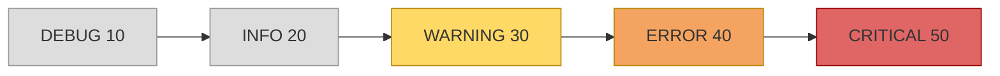

# 26. (Л) Логування у Python. Модуль `logging`

## Зміст лекції

1. Навіщо логування, якщо є `print()`
2. Перший лог
3. Рівні повідомлень
4. Поріг рівня: що потрапляє в лог
5. Базова конфігурація: `logging.basicConfig()`
6. Формат повідомлення
7. Передача даних у повідомлення
8. Іменовані логери: `getLogger(__name__)`
9. Запис у файл
10. Кілька обробників: консоль і файл одночасно
11. Ротація лог-файлів
12. Конфігурація словником: `dictConfig`
13. Рівень логування з командного рядка
14. Типові помилки

## Навіщо логування, якщо є `print()`

Досі, щоб зрозуміти, що відбувається в програмі, ми додавали `print()`: вивести значення змінної, позначити, що функція викликалася, повідомити про пропущений рядок файлу. Для програми на 30 рядків цього достатньо. Але щойно програма росте, `print()` починає заважати:

- **Його не можна вимкнути.** Налагоджувальні `print("DEBUG: x =", x)` доводиться видаляти руками перед здачею, а потім додавати знову, коли зʼявляється новий баг.
- **Усі повідомлення рівноцінні.** Рядок `loaded 120 records` і рядок `database is unavailable` виглядають однаково — серед сотні рядків важливе губиться.
- **Немає контексту.** Невідомо, *коли* сталася подія, *в якому* файлі та функції, *яка* частина програми її повідомила.
- **Усе йде в одне місце.** Діагностика змішується з корисним виводом програми, а зберегти її у файл для подальшого аналізу незручно.
- **Після завершення програми нічого не лишається.** Якщо сервер упав уночі, `print()` у вікні терміналу ніхто не бачив.

**Логування** (logging) — це запис подій, що відбуваються під час роботи програми, у вигляді структурованих повідомлень з **рівнем важливості**, **часом** і **джерелом**. Записи можна фільтрувати за важливістю, вмикати і вимикати без зміни коду, спрямовувати на екран, у файл чи кілька місць одразу.

У Python для цього є стандартний модуль `logging` — встановлювати нічого не треба.

| | `print()` | `logging` |
|---|---|---|
| Призначення | вивід результату для користувача | діагностика для розробника та адміністратора |
| Рівень важливості | немає | `DEBUG`, `INFO`, `WARNING`, `ERROR`, `CRITICAL` |
| Вимкнути частину повідомлень | лише видаливши код | змінивши один рівень у конфігурації |
| Час, файл, рядок, функція | вручну | автоматично, через формат |
| Куди пише | `stdout` | `stderr`, файл, кілька місць одночасно |

!!! info "`print()` не зникає"
    Логування не замінює `print()` повністю. `print()` — для **результату**, заради якого програму запустили (таблиця оцінок, відповідь на запит). Логи — для **розповіді про те, як програма працювала**.

## Перший лог

```python
# Program: the very first log messages
import logging

logging.warning("disk space is low")
logging.error("cannot open config file")
logging.info("this message is not shown")
```

```text
WARNING:root:disk space is low
ERROR:root:cannot open config file
```

Що тут видно:

- Кожне повідомлення має формат `LEVEL:logger_name:message`. `root` — імʼя **кореневого логера**, до якого звертаються функції `logging.warning()`, `logging.error()` тощо.
- Повідомлення рівня `INFO` **не зʼявилося**. За замовчуванням `logging` показує лише повідомлення рівня `WARNING` і вище — щоб не засмічувати вивід.
- Повідомлення надруковано в потік **`stderr`**, а не `stdout`, куди пише `print()`.

## Рівні повідомлень

Кожне повідомлення має **рівень** — наскільки воно важливе. У модулі `logging` є пʼять стандартних рівнів, кожному відповідає число і функція:

| Рівень | Число | Функція | Коли використовувати |
|---|---|---|---|
| `DEBUG` | 10 | `logging.debug()` | детальна інформація для налагодження: значення змінних, проміжні результати, вхід у функцію |
| `INFO` | 20 | `logging.info()` | підтвердження, що все йде за планом: програма стартувала, файл завантажено, оброблено N записів |
| `WARNING` | 30 | `logging.warning()` | сталося щось несподіване або скоро може статися проблема, але програма працює далі: пропущено поганий рядок, мало місця на диску |
| `ERROR` | 40 | `logging.error()` | через серйозну проблему програма не змогла виконати якусь дію: не вдалося зберегти файл, запит завершився помилкою |
| `CRITICAL` | 50 | `logging.critical()` | дуже серйозна помилка, після якої програма, найімовірніше, не зможе продовжувати роботу |

```python
# Program: all five levels and their numeric values
import logging

logging.basicConfig(level=logging.DEBUG)

logging.debug("grades list: [90, 85, 77]")
logging.info("journal loaded: 3 students")
logging.warning("line 4 skipped: not a number")
logging.error("cannot save report.txt")
logging.critical("journal file is corrupted, stopping")

print(logging.DEBUG, logging.INFO, logging.WARNING, logging.ERROR, logging.CRITICAL)
```

```text
DEBUG:root:grades list: [90, 85, 77]
INFO:root:journal loaded: 3 students
WARNING:root:line 4 skipped: not a number
ERROR:root:cannot save report.txt
CRITICAL:root:journal file is corrupted, stopping
10 20 30 40 50
```

Рядок `logging.basicConfig(level=logging.DEBUG)` знизив поріг до `DEBUG`, тому тепер видно всі пʼять повідомлень. Як працює `basicConfig`, розберемо трохи далі.

!!! tip "Як обрати рівень"
    Поставте собі запитання: «Хто і коли має це побачити?»

    - Лише я, коли шукаю баг → `DEBUG`.
    - Адміністратор, який хоче знати, що програма робить → `INFO`.
    - Варто звернути увагу, але все працює → `WARNING`.
    - Щось не вдалося, потрібне втручання → `ERROR`.
    - Програма далі працювати не може → `CRITICAL`.

    Найчастіша помилка початківців — писати все в `INFO` або все в `ERROR`. Тоді рівні втрачають сенс.

## Поріг рівня: що потрапляє в лог

Рівні — це числа, тому їх можна порівнювати. Логер має **поріг** (level): повідомлення, рівень якого **менший** за поріг, відкидається; рівний або більший — записується.



На схемі поріг `WARNING` (за замовчуванням): сірі рівні відкидаються, кольорові записуються.

| Поріг | Що видно |
|---|---|
| `DEBUG` | усе |
| `INFO` | `INFO`, `WARNING`, `ERROR`, `CRITICAL` |
| `WARNING` (за замовчуванням) | `WARNING`, `ERROR`, `CRITICAL` |
| `ERROR` | `ERROR`, `CRITICAL` |
| `CRITICAL` | лише `CRITICAL` |

Саме в цьому головна перевага над `print()`: повідомлення `DEBUG` можна **залишити в коді назавжди**. Під час розробки поріг ставлять `DEBUG` і бачать усе, у робочій версії — `INFO` або `WARNING`, і налагоджувальні повідомлення просто не виводяться. Код при цьому не змінюється.

```python
# Program: the same code with different thresholds
import logging


def average(grades):
    logging.debug("average() called with %s", grades)
    result = sum(grades) / len(grades)
    logging.debug("average() result: %s", result)
    return result


logging.basicConfig(level=logging.INFO)

logging.info("start")
print("avg:", average([90, 85, 77]))
logging.info("finish")
```

```text
INFO:root:start
avg: 84.0
INFO:root:finish
```

Змініть `level=logging.INFO` на `level=logging.DEBUG` — і без жодних інших змін зʼявляться два налагоджувальні рядки:

```text
INFO:root:start
DEBUG:root:average() called with [90, 85, 77]
DEBUG:root:average() result: 84.0
avg: 84.0
INFO:root:finish
```

## Базова конфігурація: `logging.basicConfig()`

`logging.basicConfig()` — найпростіший спосіб налаштувати логування для невеликої програми. Він налаштовує **кореневий логер**: встановлює поріг, формат і місце, куди писати.

Найуживаніші параметри:

| Параметр | Що задає | Приклад |
|---|---|---|
| `level` | поріг кореневого логера | `level=logging.DEBUG` |
| `format` | шаблон рядка повідомлення | `format="%(levelname)s %(message)s"` |
| `datefmt` | формат дати й часу для `%(asctime)s` | `datefmt="%Y-%m-%d %H:%M:%S"` |
| `filename` | писати у файл замість `stderr` | `filename="app.log"` |
| `filemode` | режим відкриття файлу (`"a"` за замовчуванням, `"w"` — перезаписати) | `filemode="w"` |
| `encoding` | кодування лог-файлу | `encoding="utf-8"` |
| `handlers` | список готових обробників (розберемо далі) | `handlers=[...]` |
| `force` | перезаписати попередню конфігурацію | `force=True` |

Рівень можна задавати константою або рядком — `level=logging.DEBUG` і `level="DEBUG"` рівнозначні.

### `basicConfig` спрацьовує лише один раз

Важлива пастка: `basicConfig()` **нічого не робить**, якщо кореневий логер уже налаштований. А налаштовується він автоматично, щойно ви викликали будь-яку з функцій `logging.debug()`, `logging.info()`, `logging.warning()`… до `basicConfig()`.

```python
# Program: basicConfig after the first log call is ignored
import logging

logging.warning("first message")          # implicit basicConfig() happens here
logging.basicConfig(level=logging.DEBUG)  # ignored: root logger already configured
logging.debug("you will not see this")
```

```text
WARNING:root:first message
```

Правило: **викликайте `basicConfig()` один раз, на самому початку програми**, до будь-яких повідомлень. Якщо конфігурацію справді треба замінити (наприклад, у інтерактивному інтерпретаторі), передайте `force=True`.

## Формат повідомлення

Формат за замовчуванням `LEVEL:name:message` надто бідний: у ньому немає навіть часу. Формат задається рядком з **атрибутами запису** у вигляді `%(name)s`:

```python
# Program: a more informative log format
import logging

logging.basicConfig(
    level=logging.DEBUG,
    format="%(asctime)s %(levelname)-8s %(message)s",
    datefmt="%Y-%m-%d %H:%M:%S",
)

logging.info("journal loaded")
logging.warning("line 4 skipped")
logging.error("cannot save report")
```

```text
2026-10-06 14:03:27 INFO     journal loaded
2026-10-06 14:03:27 WARNING  line 4 skipped
2026-10-06 14:03:27 ERROR    cannot save report
```

`%(levelname)-8s` — ширина 8 символів з вирівнюванням ліворуч, як у f-рядку `{level:<8}`. Завдяки цьому повідомлення стоять рівною колонкою.

Найкорисніші атрибути:

| Атрибут | Що підставляється | Приклад |
|---|---|---|
| `%(asctime)s` | дата й час створення запису | `2026-10-06 14:03:27,512` |
| `%(levelname)s` | назва рівня | `WARNING` |
| `%(levelno)d` | числове значення рівня | `30` |
| `%(name)s` | імʼя логера | `root`, `journal` |
| `%(message)s` | саме повідомлення | `line 4 skipped` |
| `%(filename)s` | імʼя файлу з кодом | `main.py` |
| `%(funcName)s` | імʼя функції, звідки логували | `load_journal` |
| `%(lineno)d` | номер рядка | `42` |
| `%(module)s` | імʼя модуля (файл без `.py`) | `main` |
| `%(process)d`, `%(thread)d` | ідентифікатори процесу і потоку | `48213` |

Повний перелік — у [документації](https://docs.python.org/3/library/logging.html#logrecord-attributes).

```python
# Program: where did this message come from?
import logging

logging.basicConfig(
    level=logging.DEBUG,
    format="%(levelname)s [%(filename)s:%(lineno)d %(funcName)s] %(message)s",
)


def parse_grade(text):
    logging.debug("parsing %r", text)
    return int(text)


parse_grade("90")
```

```text
DEBUG [main.py:11 parse_grade] parsing '90'
```

!!! tip "`datefmt` — ті самі коди, що й у `strftime`"
    `%Y` — рік, `%m` — місяць, `%d` — день, `%H` — години, `%M` — хвилини, `%S` — секунди. Без `datefmt` час виводиться у форматі `2026-10-06 14:03:27,512` — з мілісекундами після коми.

## Передача даних у повідомлення

Майже завжди в повідомлення треба підставити значення змінних. Зробити це можна двома способами:

```python
# Program: two ways to put data into a log message
import logging

logging.basicConfig(level=logging.INFO)

name = "Shevchenko"
grade = 95

logging.info(f"student {name} got {grade}")         # f-string
logging.info("student %s got %d", name, grade)      # lazy %-formatting
```

```text
INFO:root:student Shevchenko got 95
INFO:root:student Shevchenko got 95
```

Результат однаковий, але **рекомендований другий спосіб** — шаблон із `%s` і аргументи окремо. Причина: f-рядок обчислюється **завжди**, ще до виклику `logging.info()`, навіть якщо повідомлення буде відкинуте порогом. А з `%s` форматування відбувається **лише тоді, коли запис справді виводиться**.

```python
# Program: f-string is evaluated even when the message is dropped
import logging


class Expensive:
    def __repr__(self):
        print("  (expensive repr computed)")
        return "<Expensive>"


logging.basicConfig(level=logging.INFO)
obj = Expensive()

print("f-string:")
logging.debug(f"value: {obj!r}")

print("lazy:")
logging.debug("value: %r", obj)
```

```text
f-string:
  (expensive repr computed)
lazy:
```

Повідомлення `DEBUG` в обох випадках не виведено, але у варіанті з f-рядком обчислення відбулося даремно. У циклі на мільйон ітерацій різниця відчутна. Крім того, інструменти аналізу логів можуть групувати повідомлення за шаблоном `"student %s got %d"` — з f-рядками кожне повідомлення унікальне.

Плейсхолдери ті самі, що й у старому `%`-форматуванні рядків:

| Плейсхолдер | Що робить |
|---|---|
| `%s` | `str(value)` — підходить для будь-якого значення |
| `%r` | `repr(value)` — рядки в лапках, видно пробіли і порожні рядки |
| `%d` | ціле число |
| `%.2f` | дробове число з двома знаками після коми |
| `%%` | сам символ `%` |

!!! warning "Аргументи — окремо, не через `%`"
    `logging.info("got %d", grade)` — правильно.
    `logging.info("got %d" % grade)` — працює, але форматування знову відбувається завжди. Кількість `%s` у шаблоні має збігатися з кількістю аргументів, інакше замість повідомлення ви отримаєте `--- Logging error ---` з traceback у `stderr`.

## Іменовані логери: `getLogger(__name__)`

Функції `logging.info()`, `logging.warning()` пишуть у **кореневий** логер. Для маленького скрипта це нормально, але в програмі з кількох модулів хочеться знати, *яка частина* повідомила подію. Для цього створюють **іменовані логери**:

```python
# Program: a named logger instead of the root one
import logging

logging.basicConfig(
    level=logging.DEBUG,
    format="%(levelname)-8s %(name)s: %(message)s",
)

log = logging.getLogger("journal")

log.info("loading journal")
log.debug("3 lines read")
log.warning("line 2 skipped")
```

```text
INFO     journal: loading journal
DEBUG    journal: 3 lines read
WARNING  journal: line 2 skipped
```

`logging.getLogger("journal")` повертає логер з іменем `journal`. Повторний виклик з тим самим іменем повертає **той самий обʼєкт** — логер не треба передавати між функціями, його можна отримати за іменем у будь-якому місці програми.

У кожному модулі (файлі) прийнято створювати логер так:

```python
logger = logging.getLogger(__name__)
```

`__name__` — це імʼя поточного модуля: для файлу `grades.py`, імпортованого з іншого файлу, це `"grades"`; для файлу, який запустили напряму, — `"__main__"`. Отже, в лозі одразу видно, з якого файлу прийшло повідомлення, без жодних зусиль.

## Запис у файл

Повідомлення в терміналі зникають, щойно ви закрили вікно. Щоб зберегти їх, достатньо передати `basicConfig` імʼя файлу:

```python
# Program: write log records to a file
import logging
from pathlib import Path

log_path = Path(__file__).resolve().parent / "app.log"

logging.basicConfig(
    filename=log_path,
    encoding="utf-8",
    level=logging.DEBUG,
    format="%(asctime)s %(levelname)-8s %(message)s",
    datefmt="%Y-%m-%d %H:%M:%S",
)

logging.info("program started")
logging.debug("reading grades")
logging.warning("line 4 skipped: not a number")
logging.info("program finished")

print("log written to", log_path.name)
print(log_path.read_text(encoding="utf-8"), end="")
```

```text
log written to app.log
2026-10-06 14:10:02 INFO     program started
2026-10-06 14:10:02 DEBUG    reading grades
2026-10-06 14:10:02 WARNING  line 4 skipped: not a number
2026-10-06 14:10:02 INFO     program finished
```

Тепер у терміналі логів немає — вони у файлі `app.log`. Що варто знати:

- За замовчуванням файл відкривається в режимі **дописування** (`filemode="a"`): кожен запуск додає записи в кінець, нічого не стираючи. Саме так зазвичай і треба — історія попередніх запусків зберігається. Для навчальних експериментів зручно `filemode="w"` — файл очищується при кожному запуску.
- Завжди вказуйте **`encoding="utf-8"`**, як і для звичайних файлів (лекція 21).
- Шлях `Path(__file__).resolve().parent / "app.log"` кладе лог поруч зі скриптом незалежно від того, з якого каталогу програму запустили.

Під час роботи програми лог-файл зручно спостерігати в окремому терміналі командою `tail`:

```bash
tail -f app.log
```

Ключ `-f` (follow) змушує `tail` чекати нових рядків і показувати їх одразу, як вони дописуються. Зупинити — Ctrl+C.

!!! tip "Додайте `*.log` у `.gitignore`"
    Лог-файли — результат роботи програми, а не її код. Їм не місце в репозиторії: вони постійно змінюються і можуть містити дані користувачів.

## Кілька обробників: консоль і файл одночасно

За те, **куди** потрапляє запис, відповідає **обробник** (handler): `StreamHandler` пише в потік (термінал), `FileHandler` — у файл. Логер може мати кілька обробників, і в кожного — **власний поріг** і **власний форматувальник** (`Formatter`), який перетворює запис на рядок тексту. `basicConfig()` просто створює один такий обробник за нас.

Типова потреба: на екрані бачити лише важливе (`INFO` і вище), а у файл писати все до `DEBUG` — на випадок, якщо доведеться розбиратися в проблемі. Зберемо таку конфігурацію вручну:

```python
# Program: console shows INFO+, file keeps everything
import logging
from pathlib import Path

log_path = Path(__file__).resolve().parent / "debug.log"

logger = logging.getLogger("journal")
logger.setLevel(logging.DEBUG)  # the logger lets everything through

console = logging.StreamHandler()
console.setLevel(logging.INFO)
console.setFormatter(logging.Formatter("%(levelname)s: %(message)s"))

file_handler = logging.FileHandler(log_path, mode="w", encoding="utf-8")
file_handler.setLevel(logging.DEBUG)
file_handler.setFormatter(
    logging.Formatter(
        "%(asctime)s %(levelname)-8s %(funcName)s:%(lineno)d %(message)s",
        datefmt="%H:%M:%S",
    )
)

logger.addHandler(console)
logger.addHandler(file_handler)


def load():
    logger.debug("opening file")
    logger.info("journal loaded: %d students", 3)
    logger.warning("line %d skipped", 4)


load()

print("---- debug.log ----")
print(log_path.read_text(encoding="utf-8"), end="")
```

```text
INFO: journal loaded: 3 students
WARNING: line 4 skipped
---- debug.log ----
14:12:45 DEBUG    load:28 opening file
14:12:45 INFO     load:29 journal loaded: 3 students
14:12:45 WARNING  load:30 line 4 skipped
```

Розберемо:

- `logger.setLevel(logging.DEBUG)` — поріг **логера** має бути не вищим за найнижчий поріг його обробників. Якщо залишити логер на `WARNING`, файловий обробник ніколи не отримає повідомлення `DEBUG`, хоч би який поріг у нього був.
- `StreamHandler()` без аргументів пише в `sys.stderr`. Можна передати інший потік: `StreamHandler(sys.stdout)`.
- `FileHandler(path, mode="w", encoding="utf-8")` — аналог `open()`: режим `"a"` за замовчуванням, `"w"` — перезапис.
- У кожного обробника **свій формат**: на екрані коротко, у файлі — з часом, функцією і номером рядка.

Те саме можна зробити й через `basicConfig`, передавши готові обробники:

```python
# Program: basicConfig with explicit handlers
import logging
import sys
from pathlib import Path

log_path = Path(__file__).resolve().parent / "app.log"

console = logging.StreamHandler(sys.stderr)
console.setLevel(logging.INFO)

file_handler = logging.FileHandler(log_path, encoding="utf-8")
file_handler.setLevel(logging.DEBUG)

logging.basicConfig(
    level=logging.DEBUG,
    format="%(asctime)s %(levelname)-8s %(name)s: %(message)s",
    datefmt="%Y-%m-%d %H:%M:%S",
    handlers=[console, file_handler],
)

logger = logging.getLogger(__name__)
logger.debug("goes to file only")
logger.info("goes to console and file")
```

```text
2026-10-06 14:14:03 INFO     __main__: goes to console and file
```

Коли в `basicConfig` передано `handlers`, параметр `format` застосовується до **всіх** обробників, у яких формат ще не задано.

!!! warning "Повторне додавання обробника"
    Кожен виклик `logger.addHandler(...)` додає **ще один** обробник. Якщо код налаштування виконується двічі (наприклад, функція `setup_logging()` викликається у двох місцях), кожне повідомлення зʼявиться двічі. Налаштовуйте логування **рівно один раз**, на старті програми.

## Ротація лог-файлів

Програма, що працює місяцями (сервер, бот), з часом створить лог-файл на гігабайти. Відкривати його незручно, а диск не безрозмірний. Рішення — **ротація**: коли файл досягає певного розміру або минає певний час, він перейменовується на архівний, а запис починається в новий порожній файл. Найстаріші архіви видаляються.

Відповідні обробники лежать у підмодулі `logging.handlers`.

### За розміром: `RotatingFileHandler`

```python
# Program: rotate the log when it grows beyond a limit
import logging
from logging.handlers import RotatingFileHandler
from pathlib import Path

log_dir = Path(__file__).resolve().parent / "logs"
log_dir.mkdir(exist_ok=True)

handler = RotatingFileHandler(
    log_dir / "app.log",
    maxBytes=200,      # tiny limit to see rotation; use ~1-10 MB in real life
    backupCount=3,     # keep app.log.1 .. app.log.3
    encoding="utf-8",
)
logging.basicConfig(
    level=logging.INFO,
    format="%(levelname)s %(message)s",
    handlers=[handler],
)

for number in range(1, 41):
    logging.info("processing record %02d", number)


for path in sorted(log_dir.iterdir()):
    print(f"{path.name:<10} {path.stat().st_size:>4} bytes")
```

```text
app.log     130 bytes
app.log.1   182 bytes
app.log.2   182 bytes
app.log.3   182 bytes
```

Як це працює:

- Поки `app.log` менший за `maxBytes`, записи дописуються в нього.
- Коли черговий запис перевищив би ліміт: `app.log.2` → `app.log.3`, `app.log.1` → `app.log.2`, `app.log` → `app.log.1`, і створюється новий порожній `app.log`.
- Файлів більше ніж `backupCount` не буває: найстаріший (`app.log.3`) при наступній ротації видаляється.
- Найсвіжіші записи — завжди в `app.log`, найстаріші — у файлі з найбільшим номером.

Отже, на диску ніколи не буде більше ніж приблизно `maxBytes × (backupCount + 1)` байт логів.

### За часом: `TimedRotatingFileHandler`

```python
# Program: start a new log file every midnight
import logging
from logging.handlers import TimedRotatingFileHandler
from pathlib import Path

handler = TimedRotatingFileHandler(
    Path(__file__).resolve().parent / "server.log",
    when="midnight",   # also: "S", "M", "H", "D", "W0".."W6"
    backupCount=7,     # keep one week of daily logs
    encoding="utf-8",
)
logging.basicConfig(
    level=logging.INFO,
    format="%(asctime)s %(levelname)s %(message)s",
    handlers=[handler],
)

logging.info("server started")
```

Після опівночі поточний `server.log` перейменовується на `server.log.2026-10-06`, і запис продовжується в новий `server.log`. Зберігаються логи за останні 7 днів.

!!! info "`logrotate` у Linux"
    На серверах ротацію часто виконує не сама програма, а системна утиліта `logrotate`, яка за розкладом обробляє логи всіх сервісів. Тоді програма пише у звичайний `FileHandler`. Обидва підходи нормальні; головне — щоб ротація була хоч якась.

## Конфігурація словником: `dictConfig`

Коли обробників і логерів кілька, код налаштування з `addHandler`, `setLevel`, `setFormatter` стає довгим і заплутаним. Ту саму конфігурацію можна описати **словником** і передати у `logging.config.dictConfig()`. Структура словника повторює архітектуру: окремо форматувальники, обробники й логери, які посилаються одне на одного за іменами.

```python
# Program: the whole logging setup as one dictionary
import logging
import logging.config
from pathlib import Path

LOG_PATH = Path(__file__).resolve().parent / "app.log"

LOGGING = {
    "version": 1,
    "disable_existing_loggers": False,
    "formatters": {
        "short": {"format": "%(levelname)s: %(message)s"},
        "detailed": {
            "format": "%(asctime)s %(levelname)-8s %(name)s:%(lineno)d %(message)s",
            "datefmt": "%Y-%m-%d %H:%M:%S",
        },
    },
    "handlers": {
        "console": {
            "class": "logging.StreamHandler",
            "level": "INFO",
            "formatter": "short",
        },
        "file": {
            "class": "logging.handlers.RotatingFileHandler",
            "level": "DEBUG",
            "formatter": "detailed",
            "filename": str(LOG_PATH),
            "maxBytes": 1_000_000,
            "backupCount": 5,
            "encoding": "utf-8",
        },
    },
    "root": {
        "level": "DEBUG",
        "handlers": ["console", "file"],
    },
}

logging.config.dictConfig(LOGGING)

log = logging.getLogger("app")

log.debug("config loaded")      # file only
log.info("app started")         # console + file
log.warning("slow request")     # console + file
```

```text
INFO: app started
WARNING: slow request
```

Що означають ключі:

- `"version": 1` — обовʼязковий ключ, інших версій поки немає.
- `"disable_existing_loggers": False` — не вимикати логери, створені до виклику `dictConfig` (наприклад, логери імпортованих модулів). Значення за замовчуванням `True` — часте джерело загадки «чому логи з мого модуля зникли».
- `"formatters"`, `"handlers"` — іменовані форматувальники та обробники. Обробник посилається на форматувальник за іменем (`"formatter": "short"`), а `"class"` — повне імʼя класу рядком.
- `"root"` — налаштування кореневого логера: поріг і список обробників за іменами.

Перевага такого підходу в тому, що конфігурація — це **дані**, а не код. Її легко прочитати цілком, а пізніше — винести в окремий файл (JSON, YAML, TOML) і змінювати без правки програми.

## Рівень логування з командного рядка

Логування цінне тим, що рівень можна змінити **без зміни коду**. Найпростіше — передавати його аргументом командного рядка або через змінну оточення:

```python
# Program: choose the log level at launch time
import logging
import os
import sys

DEFAULT_LEVEL = "WARNING"

level_name = os.environ.get("LOG_LEVEL", DEFAULT_LEVEL)
if "--debug" in sys.argv:
    level_name = "DEBUG"
elif "--verbose" in sys.argv:
    level_name = "INFO"


logging.basicConfig(
    level=level_name.upper(),
    format="%(levelname)-8s %(message)s",
)
logger = logging.getLogger(__name__)

logger.debug("argv: %s", sys.argv)
logger.info("starting with level %s", level_name)
logger.warning("this is always visible")
```

```bash
python3 main.py
```

```text
WARNING  this is always visible
```

```bash
python3 main.py --verbose
```

```text
INFO     starting with level INFO
WARNING  this is always visible
```

```bash
LOG_LEVEL=debug python3 main.py
```

```text
DEBUG    argv: ['main.py']
INFO     starting with level debug
WARNING  this is always visible
```

Конструкція `LOG_LEVEL=debug python3 main.py` у Linux встановлює змінну оточення лише для однієї команди. `os.environ.get("LOG_LEVEL", DEFAULT_LEVEL)` читає її значення або повертає значення за замовчуванням, якщо змінну не задано. `.upper()` дозволяє писати рівень будь-яким регістром. Якщо рівень невідомий (`LOG_LEVEL=loud`), `basicConfig` підніме `ValueError: Unknown level: 'LOUD'`.

## Типові помилки

| Помилка | Чому погано | Як правильно |
|---|---|---|
| `logging.info(...)` нічого не виводить | поріг за замовчуванням — `WARNING` | `logging.basicConfig(level=logging.INFO)` на початку програми |
| `basicConfig()` після першого `logging.info()` | конфігурацію вже створено автоматично, виклик ігнорується | `basicConfig()` — першим, до будь-яких повідомлень; або `force=True` |
| Обробник `DEBUG` на логері з порогом `WARNING` | логер відкидає запис раніше, ніж той дійде до обробника | поріг логера ≤ найнижчого порогу обробників |
| Кожне повідомлення виводиться двічі | обробник додано двічі (налаштування виконалося повторно) | налаштовувати логування рівно один раз, на старті |
| `logging.info(f"x={x}")` у гарячому циклі | f-рядок обчислюється навіть для відкинутих повідомлень | `logging.info("x=%s", x)` |
| Кількість `%s` не збігається з аргументами | замість повідомлення — `--- Logging error ---` | перевірити шаблон і аргументи |
| Усі повідомлення одного рівня | неможливо відфільтрувати важливе | обирати рівень за таблицею з цієї лекції |
| Лог-файл без `encoding="utf-8"` | кодування залежить від системи | завжди вказувати `encoding` |
| Лог-файл росте без обмежень | заповнює диск | `RotatingFileHandler` / `TimedRotatingFileHandler` або `logrotate` |
| Паролі, токени, номери карток у лозі | лог-файли читає більше людей, ніж код; вони копіюються і зберігаються роками | ніколи не логувати секрети; за потреби маскувати: `card=****1234` |
| Лог-файли в git | постійні зміни, витік даних | `*.log` у `.gitignore` |

## Підсумок

- **Логування** — запис подій роботи програми з рівнем, часом і джерелом. `print()` — для результату, `logging` — для діагностики.
- Пʼять рівнів: `DEBUG` (10) < `INFO` (20) < `WARNING` (30) < `ERROR` (40) < `CRITICAL` (50). Повідомлення нижче **порогу** відкидаються; поріг за замовчуванням — `WARNING`.
- `logging.basicConfig(level=..., format=..., datefmt=..., filename=..., encoding=...)` налаштовує кореневий логер. Викликається **один раз, на початку**.
- Формат задається атрибутами `%(asctime)s`, `%(levelname)s`, `%(name)s`, `%(message)s`, `%(funcName)s`, `%(lineno)d` тощо.
- Дані в повідомлення передають окремими аргументами: `logger.info("got %d", grade)` — форматування відбувається лише для записів, що виводяться.
- У кожному модулі — `logger = logging.getLogger(__name__)`: в лозі видно, з якого файлу прийшло повідомлення.
- Запис у файл: `basicConfig(filename=...)` або `FileHandler`. Режим `"a"` за замовчуванням дописує в кінець.
- **Обробник** вирішує, куди писати, і має власний поріг та формат. Кілька обробників дозволяють, наприклад, `INFO` на екран і `DEBUG` у файл.
- `RotatingFileHandler` (за розміром) і `TimedRotatingFileHandler` (за часом) обмежують розмір логів на диску.
- `logging.config.dictConfig()` описує всю конфігурацію словником.
- Рівень логування вибирають під час запуску (аргумент, змінна оточення), а не змінюючи код.

## Корисні посилання

- [Logging HOWTO — офіційний посібник](https://docs.python.org/3/howto/logging.html)
- [Модуль `logging` — довідник](https://docs.python.org/3/library/logging.html)
- [Атрибути `LogRecord` для формату](https://docs.python.org/3/library/logging.html#logrecord-attributes)
- [`logging.handlers` — обробники, включно з ротацією](https://docs.python.org/3/library/logging.handlers.html)
- [`logging.config` — `dictConfig` і схема словника](https://docs.python.org/3/library/logging.config.html)
- [Logging Cookbook — готові рецепти](https://docs.python.org/3/howto/logging-cookbook.html)

## Домашнє завдання

Мета — навчитися обирати рівень повідомлень, налаштовувати формат і місце запису логів. Усі дані — **ваші власні**, латиницею. Кожне завдання — окрема програма.

1. Напишіть програму, яка виводить пʼять повідомлень різних рівнів про ваш навчальний день (наприклад, `DEBUG` — скільки хвилин ви йшли до університету, `INFO` — яку пару відвідали, `WARNING` — що забули зошит, …). Запустіть її з порогами `DEBUG`, `INFO`, `WARNING`, `ERROR`, `CRITICAL` і для кожного запуску покажіть вивід. Поясніть, чому для кожної події обрано саме такий рівень.

2. Налаштуйте формат так, щоб кожен рядок мав вигляд `2026-10-06 14:03:27 | WARNING  | main.py:12 | check_age | age is suspicious: 150`. Напишіть функцію `check_student(name: str, age: int, group: str)`, яка логує `DEBUG` при вході з усіма аргументами, `WARNING` для підозрілих значень (вік поза межами 15..100, група не за шаблоном `XX-NN`) та `INFO`, якщо все гаразд. Перевірте на своїх даних і щонайменше на трьох некоректних наборах.

3. Візьміть функцію `safe_average` з домашнього завдання лекції 23 і замініть усі `print()` про пропущені значення на `logger.warning(...)` з ледачим форматуванням (`%r`). Сам результат обчислення залишіть через `print()`. Покажіть вивід з порогом `WARNING` і з порогом `ERROR` та поясніть різницю.

4. Напишіть програму, яка записує у файл `diary.log` три повідомлення `INFO` про ваші справи за день (латиницею). Запустіть її тричі з `filemode="a"`, покажіть вміст файлу, потім тричі з `filemode="w"` — і знову покажіть вміст. Поясніть, коли доречний кожен режим.

5. Налаштуйте два обробники вручну (без `basicConfig`): на екран — `WARNING` і вище у короткому форматі, у файл `study.log` — усе від `DEBUG` у детальному форматі з часом і функцією. Напишіть програму, яка читає файл із вашим розкладом на тиждень (щонайменше 10 рядків формату `day;time;subject;room`, 2–3 рядки навмисно зіпсовані) і логує кожен крок. Покажіть вивід на екрані і вміст `study.log`.

6. Напишіть функцію `setup_logging()`, яка додає до кореневого логера обробник консолі. Навмисно викличте її двічі й покажіть, що кожне повідомлення зʼявляється двічі. Виправте програму так, щоб налаштування виконувалося рівно один раз, і покажіть вивід після виправлення.

7. Напишіть програму-«генератор подій», яка в циклі пише 500 повідомлень `INFO` із вашим прізвищем і номером ітерації у файл через `RotatingFileHandler` з `maxBytes=2000` і `backupCount=4`. Виведіть перелік файлів у каталозі логів з їхніми розмірами. Поясніть, у якому файлі знаходиться перше збережене повідомлення і чому повідомлень з номерами 1, 2, 3 вже немає.

8. Перепишіть конфігурацію із завдання 5 у вигляді словника для `logging.config.dictConfig`. Додайте можливість обирати рівень консолі ключем `--debug` і змінною оточення `LOG_LEVEL`. Покажіть запуски `python3 main.py`, `python3 main.py --debug` та `LOG_LEVEL=error python3 main.py`.

9. Візьміть утиліту командного рядка із завдання 8 лекції 23 і додайте до неї логування: `INFO` на старті й у кінці (скільки оброблено записів), `WARNING` на кожен пропущений рядок, `ERROR` для очікуваних помилок (файл не знайдено тощо). Лог також має зберігатися у файл поруч зі скриптом. Покажіть, що коди завершення (`echo $?`) не змінилися.

10. Знайдіть у своєму коді з попередніх лабораторних щонайменше пʼять місць, де ви використовували `print()` для діагностики. Для кожного вкажіть: чи це діагностика, чи результат; якщо діагностика — який рівень логування доречний і чому. Покажіть виправлений код.
